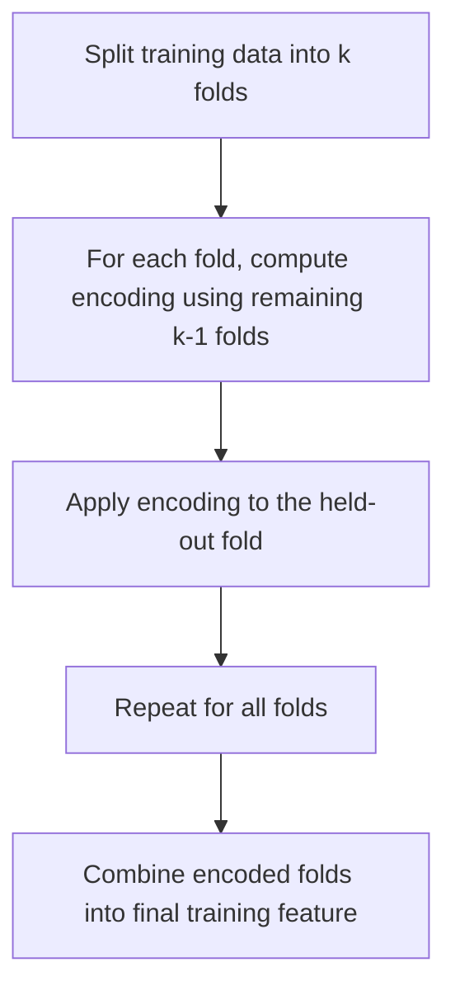

## Target and Mean Encoding

### Overview

Target encoding (also called mean encoding) replaces a categorical value with a statistic derived from the target variable for that category, most commonly the mean of the target within each category group. This is especially useful for high-cardinality categorical features where one-hot encoding would produce an unmanageable number of columns.

### Basic Mechanics

For a classification or regression target $y$ and a categorical feature $x$, each category is replaced by the mean of $y$ for all rows sharing that category value.

$$
\text{encoded}(c) = \frac{1}{n_c}\sum_{i: x_i = c} y_i
$$

where $n_c$ is the number of observations belonging to category $c$.

**Example (binary classification):**

| city | target (y) |
|---|---|
| Lagos | 1 |
| Lagos | 0 |
| Tokyo | 1 |
| Tokyo | 1 |
| Paris | 0 |

Mean encoding produces:

| city | encoded |
|---|---|
| Lagos | 0.5 |
| Tokyo | 1.0 |
| Paris | 0.0 |

### Why Target Encoding Is Useful

- **Dimensionality:** Unlike one-hot encoding, target encoding produces a single numeric column regardless of how many unique categories exist, making it well-suited for high-cardinality features such as `zip_code` or `user_id`.
- **Signal density:** The encoded value directly reflects the relationship between the category and the outcome, which can carry more predictive information per column than a sparse one-hot representation, particularly for tree-based models that benefit from information-dense single-column splits.

### The Core Risk: Target Leakage

Target encoding uses the target variable itself to construct a feature, which creates a direct risk of **target leakage** — information from the target leaking into the feature in a way that does not generalize to unseen data.

If the encoding is computed using the full training set and then applied back onto that same training set without any safeguard, each row's encoded value is influenced by its own target value. This can cause the model to learn an overly optimistic relationship that does not hold on validation or test data, resulting in inflated training performance and poor generalization.

This is a well-documented risk associated with target encoding, not a hypothetical or uncertain concern.

### Mitigation Strategies

#### K-Fold Target Encoding (Out-of-Fold Encoding)

The dataset is split into $k$ folds. For each fold, the encoding is computed using only the other $k-1$ folds, then applied to the held-out fold. This ensures no row's own target value directly contributes to its own encoded value.

This is a standard, widely used technique in practice for reducing target leakage in target encoding, commonly implemented in libraries such as `category_encoders`.

#### Smoothing (Bayesian Averaging)

Categories with very few observations can produce unstable or extreme encoded values (e.g., a category appearing only once with target = 1 gets encoded as exactly 1.0, which may not generalize). Smoothing blends the category-specific mean with the overall (global) target mean, weighted by category frequency:

$$
\text{encoded}(c) = \frac{n_c \cdot \bar{y}_c + m \cdot \bar{y}_{\text{global}}}{n_c + m}
$$

where $m$ is a smoothing parameter controlling how much weight is given to the global mean, $\bar{y}_c$ is the category's mean target value, and $\bar{y}_{\text{global}}$ is the overall target mean across all categories.

This formula is a standard Bayesian smoothing approach documented in encoding literature and implemented in libraries such as `category_encoders`' `TargetEncoder`.

- [Inference] Higher values of $m$ shift low-frequency categories' encoded values closer to the global mean, which is a direct mathematical consequence of the formula's structure rather than an empirically tested claim about any specific dataset.

#### Adding Noise

Some implementations add small random noise to encoded values during training to further reduce overfitting risk from target leakage.

- [Unverified] The effectiveness of noise addition in improving generalization depends on the noise magnitude, dataset size, and model type, and I do not have a reliable basis to state a general performance impact without testing on specific data.

### Target Encoding for Regression vs. Classification

- **Regression:** The category is typically replaced with the mean of the continuous target variable for that category.
- **Binary classification:** The category is typically replaced with the proportion of positive class instances (equivalent to the mean when the target is encoded as 0/1).
- **Multiclass classification:** [Inference] Target encoding becomes more complex, often requiring one encoded column per class (essentially one-vs-rest mean encoding), since a single mean value cannot represent membership across multiple distinct classes simultaneously. This is a reasoned structural extension of the binary case, not a claim about a single universally adopted implementation standard.

### Model Compatibility

- **Tree-based models (Random Forests, Gradient Boosting):** Target encoding is commonly used with tree-based models, particularly for high-cardinality features, since it provides a dense, information-rich single-column representation that trees can split on effectively.
- **Linear models:** [Inference] Target encoding can work with linear models, but the risk of leakage-driven overfitting may be more directly reflected in coefficient instability, since linear models assume a direct, consistent relationship between the encoded value and the outcome. I cannot verify this effect's magnitude without testing on a specific dataset.
- **Neural networks:** Target encoding can be used as an input feature, though embeddings are also commonly used as an alternative for high-cardinality categorical features in neural network architectures.

### Comparison to Other Encoding Methods

| Method | Output Columns | Handles High Cardinality | Leakage Risk |
|---|---|---|---|
| One-hot encoding | $k$ or $k-1$ | Poorly | None |
| Label/Ordinal encoding | 1 | Yes | None |
| Target/Mean encoding | 1 | Yes | Yes, requires mitigation |
| Frequency encoding | 1 | Yes | None |

### Common Pitfalls

- Computing target encoding on the full dataset (including validation/test data) before splitting, which causes direct data leakage across the entire pipeline, not just within the training set.
- Not using k-fold or leave-one-out encoding strategies, leading to inflated training performance that does not generalize to unseen data.
- Applying target encoding to very low-frequency categories without smoothing, producing unstable, extreme encoded values based on very few observations.
- Using target encoding for multiclass problems without adapting the method (e.g., naively applying binary-style mean encoding to a multiclass target).

### Key Points

- Target encoding replaces categories with a statistic derived from the target variable, most commonly the mean.
- Target leakage is a well-documented and significant risk specific to this encoding method, arising because the target variable itself is used to construct the feature.
- K-fold (out-of-fold) encoding and smoothing are standard, documented mitigation techniques used to reduce leakage and stabilize low-frequency category encodings.
- [Inference] Tree-based models are commonly paired with target encoding due to its dense, single-column representation, though the degree of benefit depends on the specific dataset and cannot be generalized as a fixed, universal outcome.
- I cannot verify the exact performance impact of any specific mitigation strategy (e.g., noise addition, particular smoothing parameter values) without direct testing on a given dataset.

**Related Topics**
- K-fold cross-validation strategies for encoding pipelines
- Frequency and count encoding as leakage-free alternatives
- Weight of Evidence (WOE) encoding for binary classification
- The `category_encoders` library and its encoding implementations
- Detecting and diagnosing target leakage in ML pipelines

