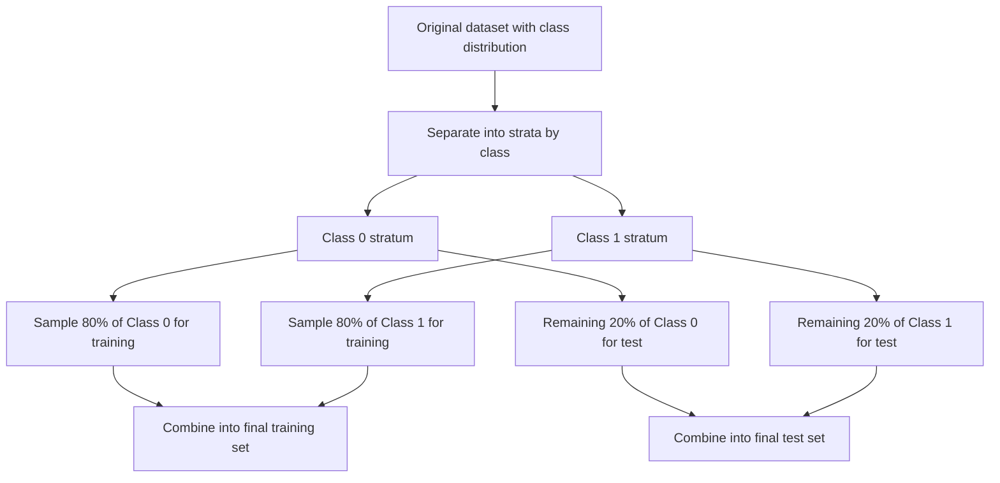

## Stratified Sampling for Train/Test Splits

### Overview

Stratified sampling ensures that when a dataset is split into training and test (or validation) sets, the proportion of each class in the target variable is preserved across all resulting subsets. This is particularly important for imbalanced classification problems, where a purely random split risks producing splits with meaningfully different class distributions than the original dataset, especially when the minority class has very few observations.

### The Problem with Naive Random Splitting

A standard random train/test split selects rows uniformly at random, without any regard to class membership. For a large, balanced dataset, this rarely causes issues, since random sampling variance tends to average out. Under class imbalance, however, the small number of minority class instances makes this variance far more consequential.

**Example:** Consider a dataset with 150 total minority class ("fraud") instances out of 10,000 rows. A random 80/20 train/test split, applied without stratification, could by chance allocate a disproportionate share of the 150 minority instances to either the training or test set.

$$
\text{Expected fraud count in test set} = 150 \times 0.2 = 30
$$

While 30 is the expected value under simple random sampling, the actual realized count in any given random split can deviate from this expectation, potentially leaving very few minority class examples in the test set (making evaluation metrics unstable) or in the training set (making it harder for the model to learn minority class patterns at all).

- [Inference] The smaller the absolute number of minority class instances, the larger the relative impact of random sampling variance on the resulting split's class balance. This follows from general statistical sampling principles regarding proportional representation in small subgroups, rather than a specific benchmarked measurement for this exact dataset.

### Stratified Sampling: Core Mechanics

Stratified sampling divides the dataset into strata (groups) based on the target class, then samples independently within each stratum at the same proportion, ensuring the overall class distribution is preserved in each resulting subset.



This process ensures that if the original dataset is 98.5% class 0 and 1.5% class 1, both the resulting training and test sets will also be approximately 98.5%/1.5%, rather than an arbitrary ratio determined by chance.

### Implementation

```python
from sklearn.model_selection import train_test_split

X_train, X_test, y_train, y_test = train_test_split(
    X, y, test_size=0.2, stratify=y, random_state=42
)
```

Passing `stratify=y` to scikit-learn's `train_test_split` is documented behavior that performs the stratified split described above, using the class labels in `y` to determine strata.

For cross-validation, `StratifiedKFold` provides the equivalent functionality across multiple folds:

```python
from sklearn.model_selection import StratifiedKFold

skf = StratifiedKFold(n_splits=5, shuffle=True, random_state=42)
for train_idx, val_idx in skf.split(X, y):
    X_train, X_val = X.iloc[train_idx], X.iloc[val_idx]
    y_train, y_val = y.iloc[train_idx], y.iloc[val_idx]
```

`StratifiedKFold` is documented to preserve the percentage of samples for each class in every fold, unlike standard `KFold`, which does not consider class labels when creating folds.

### Why Stratification Matters More Under Imbalance

- **Evaluation stability:** [Inference] A test set with too few minority class examples (due to unlucky random sampling) produces evaluation metrics like precision and recall that are based on a very small sample size for that class, making those metrics more volatile and less reliable as an estimate of true generalization performance. This is a reasoned consequence of small-sample statistical variance, not a benchmarked measurement of the exact instability for any specific dataset.
- **Training signal preservation:** If a random split happens to allocate an unusually small share of minority class examples to the training set, the model has even less data than expected to learn minority class patterns from, compounding the challenge already posed by class imbalance itself.
- **Consistency across repeated experiments:** Stratification reduces variability between different random splits or cross-validation folds, since each fold is guaranteed to reflect the same overall class proportion, making performance comparisons across folds or experiments more directly comparable.

### Stratification in Multiclass Settings

Stratified sampling extends naturally to multiclass problems, preserving the proportion of each individual class (not just a single minority/majority split) across training and test sets.

- [Inference] This becomes increasingly important as the number of classes grows and individual class frequencies become smaller, since more classes sharing a fixed total dataset size generally means smaller per-class sample sizes, and therefore greater relative risk from unstratified random sampling variance for any individual class. This is a reasoned extension of the same small-sample variance principle applied to more than two classes, not a benchmarked finding for a specific multiclass dataset.

### Stratification Beyond the Target Variable

While stratification is most commonly discussed in relation to the target class variable, the same underlying technique can be applied to preserve the distribution of an important categorical feature as well, particularly when that feature is known to interact meaningfully with model performance.

- [Unverified] Whether stratifying by a feature (rather than only the target) provides a meaningful practical benefit depends heavily on the specific dataset and the relationship between that feature and the outcome, and I do not have a general rule for when this additional stratification is worth the added complexity without testing on the specific data in question.

### Interaction with Resampling Techniques

Stratified sampling and resampling techniques (oversampling, undersampling, SMOTE) serve different purposes and are typically used together, not as alternatives to one another:

- **Stratified sampling** ensures the train/test split itself reflects the true, original class distribution, so that test set evaluation remains representative of real-world class proportions.
- **Resampling** (as discussed in prior topics) is applied afterward, only to the training set, to address the imbalance for training purposes, while leaving the test set's original (stratified) distribution untouched for evaluation.

```python
X_train, X_test, y_train, y_test = train_test_split(
    X, y, test_size=0.2, stratify=y, random_state=42
)

from imblearn.over_sampling import SMOTE
smote = SMOTE(random_state=42)
X_train_resampled, y_train_resampled = smote.fit_resample(X_train, y_train)
```

This pattern — stratified splitting first, followed by resampling applied only to the resulting training set — combines both techniques for their respective, distinct purposes.

### Common Pitfalls

- Using a standard random split (without `stratify`) on an imbalanced dataset, risking an unrepresentative class distribution in either the training or test set.
- Using standard `KFold` instead of `StratifiedKFold` for cross-validation on imbalanced classification problems, allowing class proportions to vary unpredictably across folds.
- Applying resampling techniques before splitting into train and test sets, which can undermine the purpose of stratification by altering the class distribution before the split occurs (also a data leakage concern, as discussed in the resampling topics).
- Assuming stratification alone resolves class imbalance — stratification only ensures consistent *representation* of the original imbalance across splits; it does not change the imbalance itself or improve the model's ability to learn minority class patterns.

### Key Points

- Stratified sampling preserves the original class distribution across train/test splits or cross-validation folds, which is especially important when class imbalance makes random sampling variance more consequential.
- scikit-learn's `stratify` parameter in `train_test_split` and its `StratifiedKFold` class are documented, standard tools for implementing this technique.
- [Inference] Evaluation metrics computed on a non-stratified, unluckily-sampled test set can be more volatile and less representative of true generalization performance, based on general small-sample statistical variance principles rather than a benchmarked measurement for a specific dataset.
- Stratification and resampling address different concerns and are commonly used together: stratification preserves representative evaluation, while resampling (applied only to the training set afterward) addresses the imbalance for training purposes.
- Stratification does not itself resolve class imbalance; it only ensures that the imbalance already present in the data is consistently reflected across splits rather than distorted by random sampling variance.

I cannot verify the exact magnitude of evaluation instability avoided by stratification for any specific dataset without direct empirical comparison between stratified and non-stratified splits on that same data.

**Related Topics**
- Random oversampling, undersampling, and SMOTE applied after stratified splitting
- StratifiedKFold and StratifiedShuffleSplit for cross-validation on imbalanced data
- Evaluation metric considerations for imbalanced classification
- Group-based splitting (e.g., GroupKFold) when data has non-independent groupings
- Time-based splitting considerations when stratification conflicts with temporal ordering