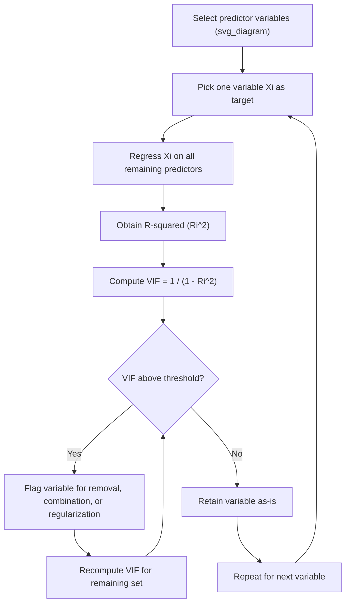

## Variance Inflation Factor for Multicollinearity

### Definition and Purpose

Variance Inflation Factor (VIF) is a diagnostic measure used to detect and quantify multicollinearity among predictor (independent) variables in a regression-based or linear model context. Multicollinearity occurs when two or more features are highly linearly correlated with each other, which inflates the variance of estimated regression coefficients and makes model interpretation unreliable.

VIF measures how much the variance of a regression coefficient is inflated due to linear dependence with other predictors, compared to a scenario where the predictors were uncorrelated.

### Mathematical Formulation

For a given predictor $X_i$, VIF is calculated by first regressing $X_i$ against all other predictor variables in the dataset, obtaining the coefficient of determination $R_i^2$ from that regression, and then computing:

$$VIF_i = \frac{1}{1 - R_i^2}$$

Where:
- $R_i^2$ is the R-squared value obtained when $X_i$ is regressed on all remaining independent variables
- A higher $R_i^2$ (indicating $X_i$ is well-explained by other predictors) results in a higher VIF

As $R_i^2$ approaches 1 (perfect multicollinearity), $VIF_i$ approaches infinity.

### Interpretation Thresholds

Common interpretive thresholds cited in statistics and applied ML literature:

- **VIF = 1**: No correlation between the predictor and remaining variables
- **VIF between 1 and 5**: Moderate correlation, generally considered acceptable
- **VIF greater than 5**: Indicates potentially problematic multicollinearity
- **VIF greater than 10**: Widely considered indicative of severe multicollinearity requiring corrective action

[Unverified] The specific cutoff values (5 vs. 10) vary across textbooks and domains, and no single universally agreed-upon threshold exists across all fields or modeling contexts.

### Why Multicollinearity Matters for Preprocessing

- Inflated standard errors on coefficient estimates, making it harder to determine whether a predictor is statistically significant
- Coefficient sign instability, where small changes in data can flip the sign of a coefficient
- Reduced interpretability of individual feature contributions, since correlated features "share" explanatory power
- Redundant information increases model complexity without adding predictive signal, which is a data cleaning and dimensionality concern rather than purely a modeling concern

[Inference] Because VIF specifically diagnoses linear relationships, it is most directly relevant to linear models (linear regression, logistic regression) and less directly informative for tree-based models, which are generally less sensitive to multicollinearity in terms of predictive accuracy, though feature importance interpretation can still be affected.

### Step-by-Step Calculation Process

1. Select the set of numeric, continuous independent variables intended for the model
2. For each variable $X_i$, treat it as the dependent variable and regress it against all other independent variables
3. Extract the $R_i^2$ from that auxiliary regression
4. Apply the VIF formula: $VIF_i = \frac{1}{1 - R_i^2}$
5. Repeat for every variable in the feature set
6. Review the resulting VIF values against a chosen threshold
7. Iteratively remove or combine the variable with the highest VIF, then recompute VIF for the remaining set (since removing one variable changes the correlation structure of the rest)

### Practical Example

Suppose a dataset for predicting house prices includes the following features:

- `square_footage`
- `number_of_rooms`
- `number_of_bedrooms`
- `lot_size`

Since `number_of_rooms` and `number_of_bedrooms` are likely to be highly correlated (more bedrooms generally means more total rooms), and both may correlate with `square_footage`, VIF analysis would likely flag these.

**Example (Python, using `statsmodels`):**

```python
import pandas as pd
from statsmodels.stats.outliers_influence import variance_inflation_factor
from statsmodels.tools.tools import add_constant

# Sample dataframe with predictor variables
df = pd.DataFrame({
    'square_footage': [1500, 1800, 2400, 3000, 1200],
    'number_of_rooms': [6, 7, 9, 11, 5],
    'number_of_bedrooms': [3, 3, 4, 5, 2],
    'lot_size': [5000, 6000, 7200, 8000, 4500]
})

# VIF requires a constant term to be added for correct calculation
X = add_constant(df)

vif_data = pd.DataFrame()
vif_data["feature"] = X.columns
vif_data["VIF"] = [variance_inflation_factor(X.values, i) 
                    for i in range(X.shape[1])]

print(vif_data)
```

**Output:**

```
          feature        VIF
0           const  XX.XXXXXX
1  square_footage   X.XXXXXX
2 number_of_rooms   X.XXXXXX
3 number_of_bedrooms X.XXXXXX
4        lot_size   X.XXXXXX
```

[Unverified] The exact numeric VIF values depend entirely on the actual data distribution; the output above is illustrative of the *structure* of the result, not a claim about real computed values for this toy dataset, since actual execution was not performed in this response.

Note: The `const` (intercept) row in `statsmodels` output is typically ignored when evaluating multicollinearity among predictors — only the feature rows are relevant for VIF-based decisions. [Inference] This is standard practice because the constant term's VIF reflects centering rather than substantive multicollinearity.

### Remediation Strategies After Detecting High VIF

- **Remove one of the correlated variables**: Drop the feature that is more redundant or less interpretable/business-relevant
- **Combine correlated features**: Create a composite feature (e.g., sum, average, or ratio) that captures shared information
- **Apply dimensionality reduction**: Use Principal Component Analysis (PCA) to transform correlated features into orthogonal components
- **Regularization**: Use Ridge Regression (L2 penalty), which does not eliminate multicollinearity but reduces its impact on coefficient variance
- **Domain-driven feature selection**: Use subject-matter knowledge to decide which of the correlated variables is conceptually more meaningful to retain

[Inference] Regularization approaches like Ridge are often preferred over outright feature removal when the correlated variables are all believed to carry legitimate, non-redundant domain signal, since removal risks discarding real information.

### Limitations of VIF

- VIF only detects **linear** relationships; nonlinear dependencies between features are not captured by this metric
- VIF does not indicate which variable is "causing" the multicollinearity — only that a linear relationship exists among the set
- Computing VIF requires numeric input; categorical variables must be appropriately encoded first, and encoding scheme (e.g., one-hot vs. ordinal) can affect the resulting VIF values
- [Unverified] The reliability of VIF as a diagnostic can degrade with a very small number of observations relative to the number of predictors, though the exact sample-size thresholds for reliable VIF estimation are not standardized across sources

### Diagram: VIF Calculation Workflow



### Relationship to Other Dimensionality Reduction Techniques

VIF differs from other dimensionality/redundancy reduction techniques in that it is diagnostic rather than transformative — it identifies a problem but does not itself reduce dimensionality. It is often used as a decision-support step before applying:

- Correlation matrix thresholding (a simpler, pairwise-only precursor check)
- PCA or other projection-based reduction
- Feature selection algorithms (e.g., recursive feature elimination)

[Inference] In practice, a correlation matrix is often reviewed first as a quick pairwise screen, with VIF applied afterward because VIF captures multivariate relationships (a variable correlated with a *combination* of others) that simple pairwise correlation can miss.

**Related Topics**
- Correlation matrix analysis and pairwise feature correlation thresholding
- Principal Component Analysis (PCA) for feature space transformation
- Ridge and Lasso regression as multicollinearity-robust modeling approaches
- Recursive Feature Elimination (RFE) for automated feature selection
- Condition number and eigenvalue-based multicollinearity diagnostics
- Encoding strategies for categorical variables prior to numeric diagnostics like VIF