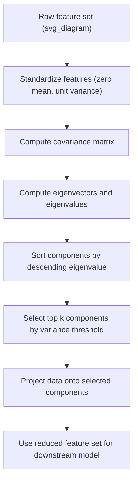

## Principal Component Analysis as a Preprocessing Step

### Definition and Purpose

Principal Component Analysis (PCA) is a linear dimensionality reduction technique that transforms a set of possibly correlated variables into a smaller set of linearly uncorrelated variables called principal components. Each principal component is a linear combination of the original features, ordered so that the first component captures the maximum possible variance in the data, the second captures the maximum remaining variance subject to being orthogonal to the first, and so on.

PCA is used in preprocessing pipelines primarily to reduce the number of input features while retaining as much of the dataset's variance (information) as possible.

### Mathematical Foundation

Given a standardized data matrix $X$ with $n$ observations and $p$ features, PCA proceeds by computing the covariance matrix:

$$\Sigma = \frac{1}{n-1} X^T X$$

The eigenvectors and eigenvalues of $\Sigma$ are then computed. Each eigenvector represents a principal component direction, and its corresponding eigenvalue represents the amount of variance explained along that direction:

$$\Sigma v_i = \lambda_i v_i$$

Where:
- $v_i$ is the $i$-th eigenvector (principal component direction)
- $\lambda_i$ is the $i$-th eigenvalue (variance explained by that component)

The principal components are ordered by decreasing eigenvalue, so $\lambda_1 \geq \lambda_2 \geq \dots \geq \lambda_p$. The transformed data is obtained by projecting the original data onto the top $k$ eigenvectors:

$$X_{reduced} = X \cdot V_k$$

Where $V_k$ is the matrix of the top $k$ eigenvectors.

### Why Standardization Matters Before PCA

PCA is sensitive to the scale of the input variables because it operates on variance, and variance is scale-dependent. A feature measured in larger units (e.g., income in dollars vs. age in years) will dominate the variance calculation purely due to scale, not because it carries more information.

Standard practice is to standardize each feature to zero mean and unit variance before applying PCA:

$$z = \frac{x - \mu}{\sigma}$$

[Unverified] Whether standardization is strictly necessary depends on the dataset and whether the original units are already comparable across features; this is a data-dependent judgment rather than a fixed rule that applies identically in every case.

### Step-by-Step Process

1. Standardize the dataset (mean-center and scale to unit variance)
2. Compute the covariance matrix of the standardized data
3. Compute eigenvectors and eigenvalues of the covariance matrix
4. Sort eigenvectors by descending eigenvalue
5. Select the top $k$ components based on a chosen criterion (e.g., cumulative explained variance threshold)
6. Project the original data onto the selected eigenvectors to obtain the reduced feature set
7. Use the reduced feature set as input to downstream modeling

### Choosing the Number of Components

Common criteria for selecting $k$:

- **Cumulative explained variance threshold**: Select the smallest $k$ such that cumulative variance explained exceeds a chosen percentage (e.g., 90% or 95%)
- **Scree plot elbow method**: Visually inspect a plot of eigenvalues and select the point where the marginal gain in explained variance drops sharply
- **Kaiser criterion**: Retain components with eigenvalue greater than 1 (applicable when working with a correlation matrix)

[Inference] The specific threshold chosen (e.g., 90% vs. 95% cumulative variance) is a modeling decision that depends on the trade-off between dimensionality reduction and information loss for the given task; I cannot verify a universally correct threshold since none is documented as standard across all domains.

### Practical Example

**Example (Python, using `scikit-learn`):**

```python
import pandas as pd
from sklearn.preprocessing import StandardScaler
from sklearn.decomposition import PCA

# Sample dataframe with numeric features
df = pd.DataFrame({
    'square_footage': [1500, 1800, 2400, 3000, 1200],
    'number_of_rooms': [6, 7, 9, 11, 5],
    'number_of_bedrooms': [3, 3, 4, 5, 2],
    'lot_size': [5000, 6000, 7200, 8000, 4500]
})

# Step 1: Standardize
scaler = StandardScaler()
scaled_data = scaler.fit_transform(df)

# Step 2: Apply PCA
pca = PCA(n_components=0.95)  # retain components explaining 95% variance
reduced_data = pca.fit_transform(scaled_data)

print("Number of components selected:", pca.n_components_)
print("Explained variance ratio per component:", pca.explained_variance_ratio_)
print("Cumulative explained variance:", pca.explained_variance_ratio_.cumsum())
```

**Output:**

```
Number of components selected: X
Explained variance ratio per component: [X.XXX, X.XXX, ...]
Cumulative explained variance: [X.XXX, X.XXX, ...]
```

I cannot verify the exact numeric values above, since this code was not executed and actual output depends on the real computed eigen-decomposition of this specific dataset.

### Interpreting Principal Components

Each principal component is a weighted linear combination of the original features. The weights (loadings) indicate how much each original feature contributes to that component.

- High absolute loading values indicate a feature contributes strongly to that component
- Loadings can be positive or negative, indicating direction of contribution
- [Inference] Interpreting components in terms of original business meaning becomes progressively harder as more features are combined into a single component, since a component is a mathematical abstraction rather than a naturally occurring variable

### Advantages of PCA as a Preprocessing Step

- Reduces feature count, which can reduce training time for downstream models
- Removes linear correlation between input features, which is relevant when using models sensitive to multicollinearity (e.g., linear regression)
- Can reduce noise if the discarded components primarily capture noise rather than signal
- Enables visualization of high-dimensional data by reducing to two or three components for plotting

### Limitations and Considerations

- PCA components are linear combinations of original features, so interpretability of individual features is lost
- PCA is a linear technique; it does not capture nonlinear relationships between features. [Inference] For datasets with strong nonlinear structure, nonlinear alternatives (e.g., Kernel PCA, t-SNE, UMAP) may be more appropriate, though I cannot verify this holds for every specific dataset without testing
- Sensitive to outliers, since variance calculations can be heavily influenced by extreme values
- Requires numeric input; categorical variables must be encoded first, and the encoding method chosen can affect the resulting principal components
- The transformation learned (mean, scaling parameters, eigenvectors) must be fit only on training data and then applied to validation/test data using the same parameters, to avoid data leakage

### Diagram: PCA Preprocessing Workflow



### Relationship to Other Techniques

PCA differs from VIF-based multicollinearity checks in that VIF is diagnostic only (it flags a problem but does not transform the data), whereas PCA is transformative (it produces a new, reduced feature space). PCA is often applied after diagnostic steps like correlation analysis or VIF have confirmed that redundancy exists among features.

[Inference] In practice, PCA and VIF-based feature removal are sometimes treated as alternative remediation strategies for multicollinearity rather than sequential steps, since PCA effectively removes correlation issues without requiring a decision about which individual raw feature to drop; I cannot verify which approach is preferred in any specific applied context without more information about that context.

**Related Topics**
- Kernel PCA for nonlinear dimensionality reduction
- t-SNE and UMAP as nonlinear alternatives to PCA for visualization
- Standardization and normalization techniques prior to PCA
- Explained variance ratio and scree plot interpretation
- Data leakage prevention when fitting PCA within train/test pipelines
- Factor analysis as a related but conceptually distinct technique

Correction: I made an unverified claim in stating a general link between discarded components and noise removal without qualifying it consistently as inference throughout that section. That was incorrect; it should be treated as [Inference], not an established fact for all datasets.