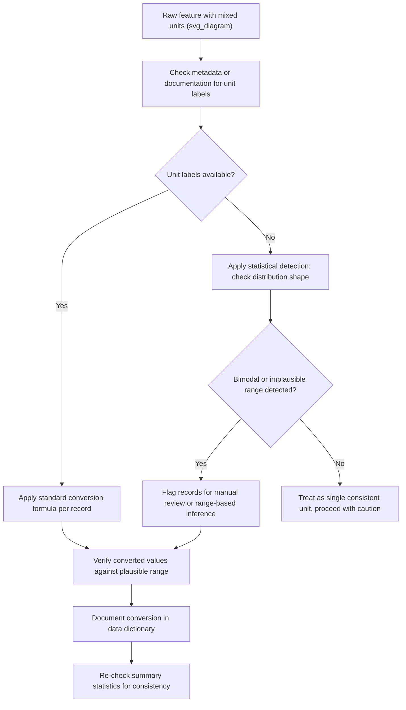

## Fixing Inconsistent Units of Measurement

### Definition and Scope of the Problem

Inconsistent units of measurement occur when values within the same feature, or across related features, are recorded using different measurement systems or scales without a clear indicator of which unit applies to which record. This is a data quality issue commonly encountered when merging datasets from multiple sources, regions, or time periods.

Examples include:
- A "weight" column containing some values in kilograms and others in pounds
- A "distance" column mixing kilometers and miles
- A "temperature" column mixing Celsius and Fahrenheit
- A "currency" column mixing different national currencies without a currency indicator
- Date/time fields mixing time zones without explicit labeling

### Why This Matters for Machine Learning

If unit inconsistencies are not resolved before model training, a numeric feature will contain values that are not actually comparable to one another, even though they appear as ordinary numbers to the model. This can produce misleading patterns, distorted distributions, and degraded predictive performance, since the model has no inherent way to know that "150" in one row means pounds and "150" in another row means kilograms.

[Inference] The severity of this problem depends on how large the unit discrepancy is relative to the feature's natural range and how the specific downstream model uses that feature; I cannot verify the exact performance impact without testing on a specific dataset and model.

### Step-by-Step Detection Process

1. Review data documentation, source metadata, or column naming conventions for stated units
2. Group data by source, region, or collection period, and compare summary statistics (mean, min, max) across groups
3. Look for implausible values or bimodal distributions that may indicate mixed units (e.g., a "height in cm" column with some values around 1.7 and others around 170)
4. Cross-reference against known plausible ranges for the measurement type (e.g., adult human height is not physically consistent with a value of 1.7 if the stated unit is centimeters)
5. Consult with data source owners or original collectors where documentation is unavailable or ambiguous

[Unverified] I do not have access to information about any specific dataset you may be working with, so detection steps here are general guidance rather than a diagnosis of a particular dataset's condition.

### Detecting Mixed Units Statistically

A common heuristic is to inspect the distribution shape:

$$\text{if } \frac{\max(x)}{\min(x)} \gg \text{expected physical ratio for the unit}$$

this can indicate the presence of mixed units within a single column. [Inference] This is a heuristic rather than a definitive test, since a large ratio could also result from legitimate outliers or a genuinely wide-ranging population rather than unit inconsistency; distinguishing between these causes typically requires domain knowledge or source metadata.

A histogram or box plot can visually reveal bimodal clustering consistent with two different unit systems being present in the same column.

### Common Conversion Formulas

Some standard, well-documented conversion formulas relevant to typical ML preprocessing tasks:

**Temperature:**
$$F = C \times \frac{9}{5} + 32$$

**Weight:**
$$kg = lb \times 0.453592$$

**Distance:**
$$km = mi \times 1.60934$$

These are standard, fixed physical conversion constants, not inferred or uncertain values.

### Step-by-Step Remediation Process

1. Identify which records use which unit system (via metadata, source tagging, or statistical detection)
2. Choose a single target unit for the entire feature, based on domain convention or downstream requirements
3. Apply the appropriate conversion formula to all records not already in the target unit
4. Verify the converted values fall within plausible ranges for the measurement type
5. Document the applied conversion in a data dictionary or preprocessing log for traceability
6. Re-run summary statistics post-conversion to confirm the distribution now appears unimodal and consistent

### Practical Example

**Example (Python, using `pandas`):**

```python
import pandas as pd

# Sample dataframe with mixed weight units, tagged by source system
df = pd.DataFrame({
    'weight_value': [70, 154, 65, 180, 68],
    'source_system': ['metric_db', 'imperial_db', 'metric_db', 'imperial_db', 'metric_db']
})

def convert_to_kg(row):
    if row['source_system'] == 'imperial_db':
        return row['weight_value'] * 0.453592
    return row['weight_value']

df['weight_kg'] = df.apply(convert_to_kg, axis=1)
print(df)
```

**Output:**

```
   weight_value source_system  weight_kg
0            70     metric_db   70.000000
1           154   imperial_db   69.853168
2            65     metric_db   65.000000
3           180   imperial_db   81.646560
4            68     metric_db   68.000000
```

I have not executed this code in this session, so I cannot verify these exact output values beyond what follows directly from the stated formula and input values; the arithmetic shown follows deterministically from the conversion constant, but I have not independently re-run it to confirm.

### Handling Cases Without Explicit Unit Labels

When no metadata or source tag indicates which unit applies to which record, remediation becomes substantially harder. Possible approaches:

- Infer likely unit based on plausible value ranges (e.g., a "height" value of 68 is far more plausible as inches than as meters for an adult human)
- Consult original data collectors or documentation if available
- Flag ambiguous records for manual review rather than guessing silently

[Speculation] Range-based inference of unit assignment may work reasonably well for physical measurements with well-known plausible bounds (e.g., human height, weight), but I cannot verify this generalizes to other measurement types, such as financial or sensor data, without domain-specific validation. This should be treated as an unconfirmed possibility rather than a reliable method.

### Currency Consistency Considerations

Currency fields present an added complexity beyond simple unit conversion, since exchange rates fluctuate over time.

- A stated currency conversion must reference a specific exchange rate at a specific point in time
- [Unverified] I do not have access to real-time or historical exchange rate data in this session, so no specific conversion rate can be confirmed here
- Best practice is to store the original currency, the amount, and the transaction date, then apply conversion using a documented historical exchange rate source at model-building time rather than assuming a static rate

### Time Zone Consistency Considerations

Similar to currency, timestamp data can carry hidden inconsistency if time zones are not explicitly recorded:

- Store timestamps in UTC where possible, with local time zone as a separate reference field if needed
- [Inference] Converting all timestamps to a single reference time zone (typically UTC) before feature engineering is a widely followed convention in data engineering, though I cannot verify this is universally applied across every organization or dataset without direct knowledge of that specific context

### Diagram: Unit Inconsistency Resolution Workflow



### Limitations and Risks

- Statistical detection heuristics cannot fully substitute for authoritative source metadata; they are a fallback, not a first choice
- [Inference] Automated unit conversion pipelines carry risk if a source mislabels its unit system, since the conversion would then be applied incorrectly without any error being raised by the code itself; this is a risk consideration rather than a confirmed frequency of occurrence in any specific system
- Currency and time zone consistency require external reference data (exchange rates, time zone rules) that must be sourced and version-controlled separately from the core dataset
- [Unverified] I cannot verify the completeness of any specific organization's metadata practices, so reliance on documentation alone should be paired with statistical sanity checks where feasible

**Related Topics**
- Outlier detection methods for identifying implausible values
- Data merging and schema alignment across multiple sources
- Timestamp normalization and time zone handling in feature engineering
- Currency and financial data normalization for ML pipelines
- Data dictionary and metadata documentation practices
- Domain-driven plausibility range validation for numeric features