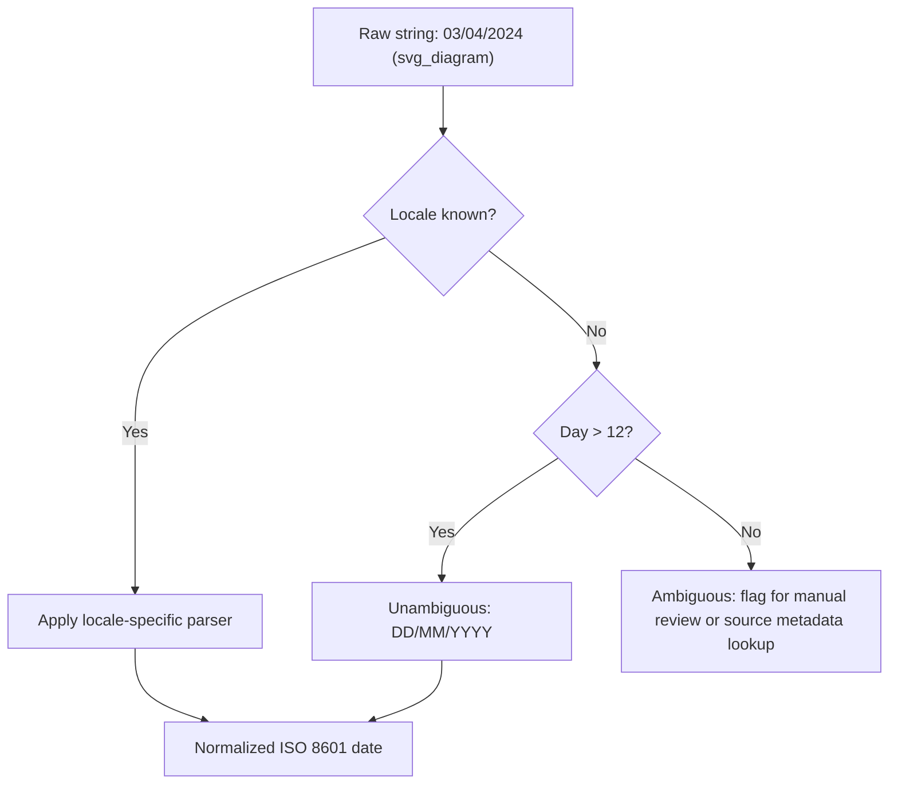

## Resolving Currency and Locale Formatting Issues

### Overview

Currency and locale formatting issues arise when numeric, date, and monetary data are collected from multiple regions, systems, or sources that follow different conventions for representing the same underlying value. A price like `1.234,56` (German format) and `1,234.56` (US format) can represent the identical amount, but naive parsing will corrupt one of them silently. These issues are a subset of structured data quality problems and typically must be resolved before any numeric feature engineering, aggregation, or model training occurs.

### Why This Matters for Machine Learning

Machine learning algorithms operate on numeric representations, not on the visual formatting of a string. If locale-specific formatting is not normalized:

- Numeric parsing may silently truncate or misinterpret values (e.g., `1.234,56` parsed as US format becomes `1.234` instead of `1234.56`).
- Aggregations (sums, means) become meaningless if some rows are off by orders of magnitude.
- Currency values from different denominations (USD, EUR, JPY) cannot be compared or combined without conversion to a common base.
- Date fields embedded in transactional data (e.g., `03/04/2024`) are ambiguous between day-first and month-first locales, which can silently corrupt time-based features.

[Inference] The severity of downstream impact depends on the proportion of affected rows and whether the corruption is systematic (same locale consistently misparsed) or random; systematic errors are more dangerous because they bias the model consistently rather than adding noise.

### Common Sources of Locale Inconsistency

- **Decimal and thousands separators**: Comma-as-decimal (many European locales) vs. period-as-decimal (US, UK).
- **Currency symbols and codes**: `$`, `€`, `£`, `¥`, or ISO codes like `USD`, `EUR` embedded directly in the numeric string.
- **Symbol placement**: Prefix (`$100`) vs. suffix (`100 €`) vs. spaced (`100 EUR`).
- **Digit grouping**: Western grouping in thousands (`1,000,000`) vs. Indian numbering system (lakh/crore grouping, e.g., `10,00,000`).
- **Negative value conventions**: Leading minus (`-100`), trailing minus (`100-`), or parentheses (`(100)`) for accounting-style negatives.
- **Whitespace and non-breaking spaces**: Some locales use a non-breaking space (`\u00A0`) as a thousands separator, which is visually indistinguishable from a regular space but breaks naive string splitting.

### Diagnostic Workflow

Before applying fixes, the formatting inconsistencies present in the dataset should be characterized rather than assumed.

**Key Points**
- Inspect a sample of raw string values per source/locale column rather than assuming a single format applies globally.
- Use regex profiling to detect the set of distinct separator patterns present.
- Check for mixed formats within a single column, which commonly occurs when data is merged from multiple regional systems.
- Confirm whether currency denomination is stored separately (a distinct `currency_code` column) or embedded in the value string.

```python
import pandas as pd
import re

# Example: profiling distinct formatting patterns in a raw column
raw_values = pd.Series([
    "1,234.56", "1.234,56", "$1,000", "€1.000,00", "(500)", "1 234,56 €"
])

def classify_pattern(s):
    s = str(s)
    has_comma = "," in s
    has_dot = "." in s
    has_paren = "(" in s and ")" in s
    return f"comma={has_comma}, dot={has_dot}, paren={has_paren}"

pattern_counts = raw_values.apply(classify_pattern).value_counts()
print(pattern_counts)
```

**Output**
```
comma=True, dot=True, paren=False     3
comma=True, dot=False, paren=False    2
comma=False, dot=False, paren=True    1
Name: count, dtype: int64
```

This kind of profiling step reveals that the column mixes at least three distinct formatting conventions, which is the trigger for choosing a locale-aware parsing strategy over a single fixed rule.

### Resolving Decimal and Thousands Separator Ambiguity

The core ambiguity is that both `,` and `.` are used as decimal or grouping separators depending on locale, and a string like `1.234` is genuinely ambiguous without additional context (it could mean one thousand two hundred thirty-four, or one point two three four).

**Strategy 1: Locale metadata is available**

When the source locale is known (e.g., stored in a separate column or inferable from source system), use locale-aware parsing libraries rather than manual regex substitution.

```python
from babel.numbers import parse_decimal

# German locale: comma is decimal separator, dot is thousands separator
value_de = parse_decimal("1.234,56", locale="de_DE")
print(value_de)  # 1234.56

# US locale: dot is decimal separator, comma is thousands separator
value_us = parse_decimal("1,234.56", locale="en_US")
print(value_us)  # 1234.56
```

[Unverified] The exact behavior of `babel.numbers.parse_decimal` across all edge cases (e.g., malformed input, mixed grouping) has not been independently verified in this response and should be confirmed against the installed Babel version's documentation before relying on it in production.

**Strategy 2: Locale metadata is unavailable**

When locale cannot be determined directly, a heuristic is required. A common heuristic:

- If both `,` and `.` appear, the rightmost one is the decimal separator, and the other is a thousands separator.
- If only `,` appears with exactly two trailing digits, treat it as a decimal separator (European convention).
- If only `.` appears with exactly two trailing digits, treat it as a decimal separator (US convention).

```python
import re

def normalize_numeric_string(s: str) -> float:
    s = s.strip()
    # Remove currency symbols and whitespace (including non-breaking space)
    s = re.sub(r"[€$£¥]|\u00A0", "", s).strip()
    # Handle accounting-style negatives
    negative = False
    if s.startswith("(") and s.endswith(")"):
        negative = True
        s = s[1:-1]

    if "," in s and "." in s:
        # Rightmost separator is decimal
        if s.rfind(",") > s.rfind("."):
            s = s.replace(".", "").replace(",", ".")
        else:
            s = s.replace(",", "")
    elif "," in s:
        # Ambiguous: assume decimal comma if exactly 2 digits follow
        if re.search(r",\d{2}$", s):
            s = s.replace(",", ".")
        else:
            s = s.replace(",", "")
    # else: only dots or plain digits, assume already US-style

    value = float(s)
    return -value if negative else value

test_values = ["1,234.56", "1.234,56", "1.234", "1,234", "(500)"]
for v in test_values:
    print(v, "->", normalize_numeric_string(v))
```

**Output**
```
1,234.56 -> 1234.56
1.234,56 -> 1234.56
1.234 -> 1234.0
1,234 -> 1234.0
(500) -> -500.0
```

[Inference] The heuristic branch for a bare `1.234` or `1,234` (no accompanying opposite separator) is inherently ambiguous — it could represent either one thousand two hundred thirty-four or a decimal fraction — and the "assume thousands separator" default used above is a convention choice, not a universally correct rule. This branch should be validated against known ground-truth values from the specific source system whenever possible, since a wrong assumption here is a systematic, not random, error.

### Resolving Currency Symbol and Denomination Issues

Once numeric parsing is normalized, currency denomination must be handled separately from the numeric magnitude. Two distinct problems exist:

1. **Symbol stripping**: Removing `$`, `€`, `£`, or ISO codes from the string so the remaining text is purely numeric.
2. **Denomination normalization**: Converting values expressed in different currencies to a single common currency for valid comparison and aggregation.

```python
import re

def extract_currency_and_amount(s: str):
    s = s.strip()
    currency_map = {"$": "USD", "€": "EUR", "£": "GBP", "¥": "JPY"}
    currency = None
    for symbol, code in currency_map.items():
        if symbol in s:
            currency = code
            s = s.replace(symbol, "")
            break
    # Fall back to explicit ISO code if present
    iso_match = re.search(r"\b(USD|EUR|GBP|JPY)\b", s)
    if iso_match:
        currency = iso_match.group(1)
        s = s.replace(iso_match.group(1), "")
    return currency, s.strip()

examples = ["$1,000.00", "1.000,00 €", "500 GBP", "¥50000"]
for ex in examples:
    print(ex, "->", extract_currency_and_amount(ex))
```

**Output**
```
$1,000.00 -> ('USD', '1,000.00')
1.000,00 € -> ('EUR', '1.000,00')
500 GBP -> ('GBP', '500')
¥50000 -> ('JPY', '50000')
```

After separating currency and amount, denomination conversion to a base currency requires an authoritative, dated exchange rate table:

```python
# Example only — rates must come from a verified, dated source, not hardcoded assumptions
exchange_rates_to_usd = {
    "USD": 1.0,
    "EUR": 1.08,   # [Unverified] — illustrative rate, not a live market rate
    "GBP": 1.27,   # [Unverified] — illustrative rate, not a live market rate
    "JPY": 0.0067  # [Unverified] — illustrative rate, not a live market rate
}

def to_usd(amount: float, currency: str) -> float:
    rate = exchange_rates_to_usd.get(currency)
    if rate is None:
        raise ValueError(f"No exchange rate available for currency: {currency}")
    return amount * rate
```

[Speculation] Whether a fixed historical rate or a time-varying rate matched to the transaction date is appropriate depends entirely on the analytical goal (e.g., historical financial reporting typically requires date-matched rates, while a rough feature for ML clustering might tolerate a fixed approximate rate); this is a modeling decision that cannot be resolved generically. Exchange rate values used in production should come from a verified financial data provider, not from hardcoded tables, since rates fluctuate continuously.

### Resolving Ambiguous Date Formats Embedded in Locale Data

Currency and locale cleanup often co-occurs with date ambiguity, since both are frequently sourced from the same regional system export.



The date `03/04/2024` cannot be resolved to a single unambiguous value without either locale metadata or a day value exceeding 12, at which point month-first interpretation becomes impossible. [Unverified] Any automated resolution of the remaining ambiguous cases (day ≤ 12) is a best-effort heuristic and should not be treated as a fixes-all-cases claim; ambiguous rows are frequently better flagged for manual confirmation than silently guessed.

```python
import pandas as pd

def resolve_date(date_str: str, assume_day_first: bool = None):
    try:
        if assume_day_first is True:
            return pd.to_datetime(date_str, dayfirst=True)
        elif assume_day_first is False:
            return pd.to_datetime(date_str, dayfirst=False)
        else:
            # No locale info: attempt dayfirst, fall back
            return pd.to_datetime(date_str, dayfirst=True, errors="raise")
    except Exception:
        return None  # Flag for manual review

print(resolve_date("15/04/2024"))  # Unambiguous, day=15 > 12
print(resolve_date("03/04/2024", assume_day_first=True))
```

**Output**
```
2024-04-15 00:00:00
2024-04-03 00:00:00
```

### Normalization Target Format

Once parsed, all monetary and locale-sensitive fields should be converted to a single canonical representation before entering any feature pipeline:

- **Numeric amount**: standard float or fixed-point decimal, decimal-point convention only.
- **Currency**: ISO 4217 three-letter code stored in a separate column (e.g., `USD`, `EUR`), never embedded in the numeric string.
- **Dates**: ISO 8601 (`YYYY-MM-DD` or full timestamp with timezone) stored separately from any locale-formatted display string.

$$
\text{amount}_{\text{normalized}} = \text{amount}_{\text{raw}} \times \text{exchange\_rate}(\text{currency}, \text{date})
$$

[Inference] Keeping the original raw string alongside the normalized value (rather than overwriting it) is generally advisable for auditability, since locale parsing heuristics can be wrong and the ability to re-derive or manually correct a value depends on the raw source being preserved.

### Validation After Normalization

- Recompute summary statistics (min, max, mean) per currency group and check for implausible outliers that suggest a parsing failure (e.g., a value 1000x too large indicates a missed thousands-separator strip).
- Cross-check a sample of normalized values manually against the original raw strings.
- Verify that the count of distinct currency codes matches expectations for the known data sources.
- Confirm no numeric column retains non-numeric characters (symbols, stray whitespace) after normalization using a regex assertion pass.

```python
# Sanity check: ensure no residual non-numeric characters remain
def has_residual_symbols(series: pd.Series) -> pd.Series:
    return series.astype(str).str.contains(r"[^\d\.\-]", regex=True)

# Example usage on a cleaned column
cleaned = pd.Series(["1234.56", "500.00", "abc123"])
print(has_residual_symbols(cleaned))
```

**Output**
```
0    False
1    False
2     True
dtype: bool
```

### Related Topics

- Handling ambiguous date and timestamp formats across time zones
- Standardizing units of measurement (metric vs. imperial) in structured datasets
- Detecting and resolving encoding issues (UTF-8, Latin-1) in text-based numeric fields
- Building a reusable locale-detection and normalization pipeline component
- Handling missing or inconsistent currency metadata in merged multi-source datasets
- Validating exchange-rate-adjusted features for temporal leakage in time-series ML tasks