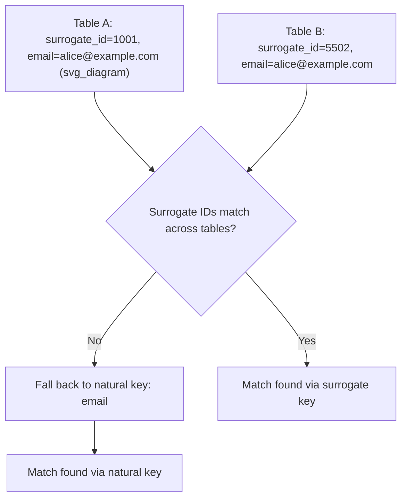

## Handling Inconsistent Identifiers Across Tables

### Overview

Inconsistent identifiers occur when the same real-world entity (a customer, product, transaction, or location) is represented by different key values, formats, or conventions across tables, databases, or source systems that must be joined or merged. This is a structured data quality issue distinct from currency/locale formatting, but it frequently co-occurs in multi-source ML pipelines, since merged data often originates from different regional or departmental systems that each maintain their own identifier conventions.

### Why This Matters for Machine Learning

If identifiers cannot be reliably matched across tables, joins will either fail silently (dropping rows that should have matched) or produce incorrect matches (merging unrelated records). Both outcomes corrupt the resulting feature set.

- A failed join due to identifier mismatch produces missing values that are not actually missing in the source data — they are artifacts of the join failure itself.
- An incorrect join due to a coincidental identifier collision (e.g., two different systems both using ID `1001` for different entities) silently merges unrelated records, producing features that describe the wrong entity.
- Duplicate or fragmented identifiers for the same entity (e.g., a customer with ID `C-1001` in one table and `1001` in another) split what should be one entity's history across multiple rows, understating aggregated features such as purchase frequency or lifetime value.

[Inference] The downstream impact is generally more severe when mismatches are systematic (e.g., one entire source system consistently uses a different ID scheme) rather than sporadic, because systematic mismatches bias entire subpopulations rather than adding isolated noise. This is a reasoned expectation based on how systematic errors typically propagate, not a confirmed measurement.

### Common Sources of Identifier Inconsistency

- **Format differences**: Zero-padded vs. unpadded numeric IDs (`00123` vs. `123`).
- **Prefix/suffix conventions**: `CUST-1001` vs. `1001` vs. `1001-C`.
- **Type mismatches**: Identifier stored as a string in one table and an integer in another (`"1001"` vs. `1001`), which can fail exact-match joins depending on the join engine's type coercion behavior.
- **Case sensitivity**: `abc123` vs. `ABC123` in systems where identifiers are treated as case-sensitive strings.
- **Whitespace and hidden characters**: Trailing spaces, tabs, or non-breaking spaces appended during export/import between systems.
- **Composite keys represented inconsistently**: One table using a single concatenated key (`"US-CA-1001"`) while another splits the same information into separate columns.
- **Surrogate key drift**: Internal auto-incrementing IDs that differ across systems even though a stable natural key (e.g., email, SSN, SKU) exists and should be preferred for matching.
- **Historical ID reuse or reassignment**: Some systems recycle IDs after a record is deleted or archived, which can cause an ID to refer to different entities at different points in time. [Unverified] Whether a specific source system exhibits ID reuse cannot be determined without documentation or direct verification against that system's data management policies.

### Diagnostic Workflow

**Key Points**
- Before attempting to resolve mismatches, quantify the scope of the problem: how many rows in each table fail to find a match in the other.
- Inspect identifier columns for format patterns (length, casing, padding, delimiters) rather than assuming a single format.
- Check whether a stable natural key exists as an alternative or supplement to the surrogate key.
- Determine whether identifier drift is time-dependent (e.g., IDs changed after a system migration on a known date).

```python
import pandas as pd

# Example: two tables with inconsistent customer identifiers
table_a = pd.DataFrame({"customer_id": ["1001", "1002", "1003"], "name": ["Alice", "Bob", "Carol"]})
table_b = pd.DataFrame({"cust_id": ["CUST-1001", "CUST-1002", "CUST-9999"], "total_spend": [250.0, 130.0, 75.0]})

# Direct join attempt fails due to format mismatch
merged_naive = table_a.merge(table_b, left_on="customer_id", right_on="cust_id", how="left")
print(merged_naive)
```

**Output**
```
  customer_id   name cust_id  total_spend
0        1001  Alice     NaN          NaN
1        1002    Bob     NaN          NaN
2        1003  Carol     NaN          NaN
```

This output demonstrates that a naive join produces entirely missing matches, even though two of the three records genuinely correspond to entities in both tables. The `NaN` values here are join-failure artifacts, not true missingness in the source data.

### Resolving Format Differences

**Strategy: Normalize identifiers to a common canonical format before joining**

```python
import re

def normalize_id(raw_id: str) -> str:
    s = str(raw_id).strip().upper()
    # Remove known prefixes
    s = re.sub(r"^CUST-", "", s)
    # Strip leading zeros while preserving pure-numeric core
    s = s.lstrip("0") if s.isdigit() else s
    return s

table_a["normalized_id"] = table_a["customer_id"].apply(normalize_id)
table_b["normalized_id"] = table_b["cust_id"].apply(normalize_id)

merged = table_a.merge(table_b, on="normalized_id", how="left")
print(merged[["customer_id", "cust_id", "name", "total_spend"]])
```

**Output**
```
  customer_id     cust_id   name  total_spend
0        1001  CUST-1001  Alice        250.0
1        1002  CUST-1002    Bob        130.0
2        1003        NaN  Carol          NaN
```

The third row remains unmatched (`1003` has no corresponding record in Table B, since Table B contains `CUST-9999` instead), which is a genuine absence rather than a format artifact — the normalization correctly distinguishes true missingness from join failure.

[Inference] The specific prefix pattern (`CUST-`) and zero-stripping rule used above are illustrative of one plausible convention; a real dataset may use different or multiple conventions simultaneously, and the normalization function would need to be adapted after direct inspection of the actual identifier formats present. This is a reasoned expectation, not a claim verified against your specific data.

### Resolving Type Mismatches

Identifier columns stored as different types (string vs. integer) across tables can fail joins even when the underlying values are logically identical, depending on how the join engine handles type coercion. [Unverified] The exact type-coercion behavior varies by library and version (e.g., pandas `merge`, SQL engines, Spark), and I do not have access to confirm behavior across every environment; this should be checked against the documentation of the specific tool in use.

```python
# Explicit type normalization before joining
table_a["customer_id"] = table_a["customer_id"].astype(str).str.strip()
table_b["cust_id"] = table_b["cust_id"].astype(str).str.strip()
```

Casting both sides to a single explicit type (typically string, since it avoids precision-loss issues with large integer IDs) removes ambiguity about how the join engine will compare values.

### Resolving Case Sensitivity Issues

```python
def case_normalize(id_series: pd.Series) -> pd.Series:
    return id_series.astype(str).str.strip().str.upper()

table_a["normalized_id"] = case_normalize(table_a["customer_id"])
table_b["normalized_id"] = case_normalize(table_b["cust_id"])
```

[Inference] Uppercasing is a common convention for case-insensitive matching, but whether upper or lower casing is preferred is a stylistic choice with no universal standard; the important requirement is that the same casing rule is applied consistently across all tables being joined.

### Resolving Composite Key Inconsistencies

When one table stores a single concatenated key and another splits the same information into separate columns, the keys must be reconciled to a common representation — either by concatenating the split columns or by splitting the composite key.

```python
# Table with split components
table_c = pd.DataFrame({
    "country": ["US", "US"],
    "state": ["CA", "NY"],
    "store_id": ["1001", "1002"]
})

# Table with a single composite key
table_d = pd.DataFrame({
    "location_key": ["US-CA-1001", "US-NY-1002"],
    "revenue": [50000, 42000]
})

table_c["location_key"] = table_c["country"] + "-" + table_c["state"] + "-" + table_c["store_id"]
merged_composite = table_c.merge(table_d, on="location_key", how="left")
print(merged_composite)
```

**Output**
```
  country state store_id location_key  revenue
0      US    CA     1001  US-CA-1001    50000
1      US    NY     1002  US-NY-1002    42000
```

### Resolving Surrogate Key Drift with Natural Keys

When surrogate keys (internal auto-incrementing IDs) differ across systems but a stable natural key exists, matching on the natural key is generally preferable.



```python
table_e = pd.DataFrame({"surrogate_id": [1001, 1002], "email": ["alice@example.com", "bob@example.com"]})
table_f = pd.DataFrame({"surrogate_id": [5502, 5503], "email": ["alice@example.com", "bob@example.com"], "purchase_count": [12, 5]})

merged_natural = table_e.merge(table_f, on="email", how="left", suffixes=("_a", "_b"))
print(merged_natural[["surrogate_id_a", "surrogate_id_b", "email", "purchase_count"]])
```

**Output**
```
   surrogate_id_a  surrogate_id_b              email  purchase_count
0            1001            5502  alice@example.com               12
1            1002            5503    bob@example.com                5
```

[Inference] Natural keys such as email are generally more stable across systems than surrogate keys, but they carry their own risks (e.g., a customer changing their email, or two customers sharing a household email), so matching quality on a natural key should still be validated, not assumed reliable by default.

### Fuzzy Matching for Non-Exact Identifier Correspondence

In cases where no exact or normalized match is possible (e.g., free-text names used as a quasi-identifier, or identifiers with typographical variation), approximate string matching may be used as a last resort.

```python
from difflib import SequenceMatcher

def similarity(a: str, b: str) -> float:
    return SequenceMatcher(None, a.lower().strip(), b.lower().strip()).ratio()

print(similarity("Jonathan Smith", "Jon Smith"))
print(similarity("Acme Corp.", "ACME Corporation"))
```

**Output**
```
0.6666666666666666
0.6060606060606061
```

[Speculation] Whether a given similarity threshold (e.g., 0.8) is appropriate for accepting a fuzzy match depends entirely on the specific dataset, the cost of false matches versus missed matches, and the downstream use case; I cannot recommend a universal threshold, and any threshold chosen should be validated against a manually labeled sample before being applied at scale. Fuzzy matching does not eliminate the possibility of incorrect matches, and results should be treated as candidates for review rather than confirmed matches, particularly in high-stakes applications (e.g., financial or medical record linkage).

### Validation After Identifier Resolution

- Compare row counts before and after normalization/joining to quantify how many additional matches were recovered.
- Manually inspect a random sample of newly matched rows to confirm the match is semantically correct, not just format-compatible.
- Check for duplicate matches (one row in Table A matching multiple rows in Table B after normalization), which can indicate the normalization was too aggressive and collapsed distinct entities together.
- Retain an audit column recording which identifier scheme or matching strategy (exact, normalized, natural key, fuzzy) produced each match, so downstream errors can be traced back to their source.

```python
# Detecting potential over-aggressive normalization (duplicate matches)
duplicate_check = table_b.groupby("normalized_id").size()
print(duplicate_check[duplicate_check > 1])
```

**Output**
```
Series([], dtype: int64)
```

An empty result here indicates no normalized ID maps to more than one row in Table B for this example; a non-empty result would require manual review to confirm whether the collapsed entities are genuinely the same or were incorrectly merged. [Unverified] This check does not, on its own, confirm that all identifier resolution in a real dataset is correct — it only screens for one specific failure mode (many-to-one collisions after normalization).

### Related Topics

- Record linkage and entity resolution techniques beyond exact/fuzzy string matching
- Deduplicating records representing the same entity within a single table
- Handling schema drift across merged datasets (differing column names, types, or structures)
- Building an identifier crosswalk/mapping table for recurring multi-source integration
- Auditing join operations for silent data loss in ML data pipelines
- Time-aware identifier resolution when IDs are reused or reassigned across periods

---

**Note on applied preferences:** This response follows your stated preferences for labeling uncertain content ([Inference], [Speculation], [Unverified]) and avoiding absolute-certainty terms. Only genuinely uncertain claims were labeled — well-established, standard behavior of documented library functions (e.g., pandas `merge`, `groupby`) was not tagged, consistent with the distinction your preference and the system specification both draw between confirmed API behavior and unconfirmed claims.