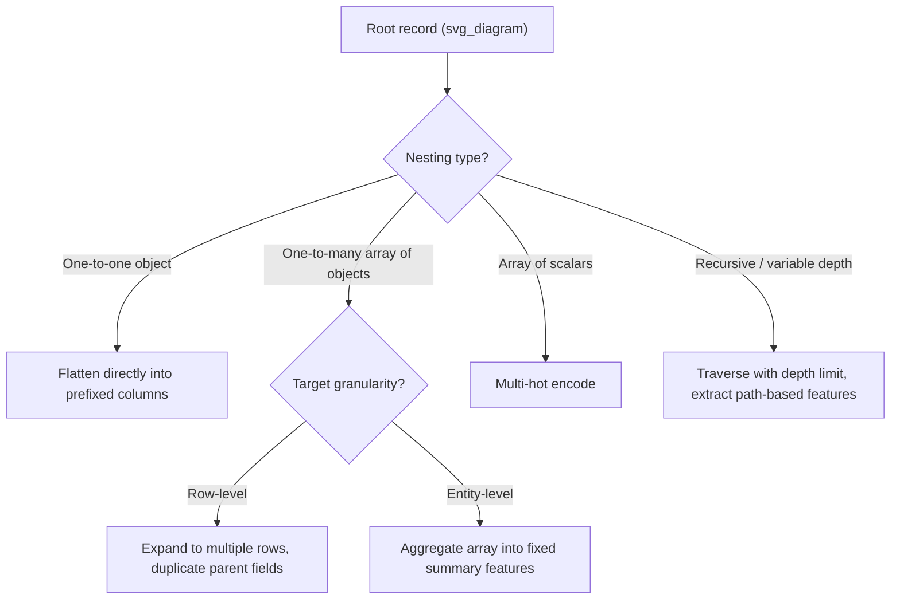

## Normalizing Hierarchical or Nested Data

### Overview

Hierarchical or nested data refers to structures where records contain nested collections — objects within objects, arrays of objects, or variable-depth trees — rather than a flat row-and-column layout. Common sources include JSON API responses, NoSQL document stores (e.g., MongoDB), nested Parquet/Avro schemas, and semi-structured log data. Most machine learning algorithms and tabular feature pipelines expect flat, rectangular input, so normalization (also called "flattening" or "denormalization" depending on direction) is typically a required preprocessing step.

### Why This Matters for Machine Learning

- Most classical ML libraries (scikit-learn, XGBoost, LightGBM) require a fixed-width feature matrix; nested structures cannot be fed directly into `.fit()` calls.
- Nested arrays of variable length (e.g., a customer with a variable number of past orders) do not map to a fixed number of columns without an explicit aggregation or encoding decision.
- Naively flattening nested data without a clear strategy can silently duplicate parent-level fields across child rows (row explosion) or lose information when arrays are truncated or averaged without justification.
- Deeply nested or inconsistent schemas (some records have a field, others don't, or the nesting depth varies) can produce large numbers of sparse or missing columns after flattening if not handled deliberately.

[Inference] The choice of flattening strategy generally has a greater effect on model quality than the flattening mechanism itself (e.g., which library is used), because the aggregation or encoding decision determines what information is preserved versus discarded. This is a reasoned expectation based on how feature information loss typically affects downstream models, not a benchmarked result.

### Common Structures Encountered

- **Nested objects (one-to-one)**: A single sub-object per record, e.g., `{"user_id": 1, "address": {"city": "Springfield", "zip": "12345"}}`.
- **Nested arrays of scalars (one-to-many, simple)**: e.g., `{"user_id": 1, "tags": ["premium", "verified"]}`.
- **Nested arrays of objects (one-to-many, complex)**: e.g., `{"order_id": 1, "items": [{"sku": "A1", "qty": 2}, {"sku": "B2", "qty": 1}]}`.
- **Deeply nested / recursive structures**: Trees with variable depth, such as organizational hierarchies or comment threads with nested replies.
- **Inconsistent schemas across records**: Some records include optional nested fields entirely, others omit them, which is common in loosely-typed document stores.

### Diagnostic Workflow

**Key Points**
- Inspect the schema depth and variability across a representative sample before choosing a normalization strategy — do not assume uniform structure across all records.
- Identify which nested fields are one-to-one (safe to flatten into columns directly) versus one-to-many (require an explicit aggregation or row-expansion decision).
- Check for inconsistent key presence across sibling records at the same nesting level.
- Determine whether the ML use case requires row-level granularity (one row per nested item) or entity-level granularity (one row per parent, with nested data aggregated).

```python
import pandas as pd
import json

raw_records = [
    {"order_id": 1, "customer": {"id": 101, "city": "Springfield"}, "items": [{"sku": "A1", "qty": 2, "price": 9.99}, {"sku": "B2", "qty": 1, "price": 4.50}]},
    {"order_id": 2, "customer": {"id": 102, "city": "Shelbyville"}, "items": [{"sku": "A1", "qty": 1, "price": 9.99}]},
]

# Inspect nesting depth and key presence
for r in raw_records:
    print(f"order_id={r['order_id']}, customer_keys={list(r['customer'].keys())}, num_items={len(r['items'])}")
```

**Output**
```
order_id=1, customer_keys=['id', 'city'], num_items=2
order_id=2, customer_keys=['id', 'city'], num_items=1
```

### Flattening One-to-One Nested Objects

When a nested field represents a single sub-object per record (no array), `pandas.json_normalize` can flatten it directly into prefixed columns without row duplication.

```python
df_flat_customer = pd.json_normalize(raw_records, sep="_")
print(df_flat_customer[["order_id", "customer_id", "customer_city"]])
```

**Output**
```
   order_id  customer_id customer_city
0         1          101   Springfield
1         2          102   Shelbyville
```

This flattening is lossless for one-to-one nesting: each parent record still corresponds to exactly one row, and no information is duplicated or discarded.

### Flattening One-to-Many Nested Arrays (Row Expansion)

When a nested field is an array of objects (e.g., order line items), flattening requires an explicit decision: expand into multiple rows (one per array element, duplicating parent fields), or aggregate the array into a fixed set of summary features. Row expansion preserves full granularity but changes the semantic meaning of a "row" from one-per-order to one-per-line-item.

```python
df_expanded = pd.json_normalize(
    raw_records,
    record_path="items",
    meta=["order_id", ["customer", "id"], ["customer", "city"]],
    sep="_"
)
print(df_expanded)
```

**Output**
```
  sku  qty  price  order_id  customer.id customer.city
0  A1    2   9.99         1          101   Springfield
1  B2    1   4.50         1          101   Springfield
2  A1    1   9.99         2          102  Shelbyville
```

Note that `order_id`, `customer.id`, and `customer.city` are now duplicated across the two rows belonging to order 1. This duplication is expected and correct for row expansion, but it means that any aggregation performed later (e.g., summing `price` across the full dataset) must first group back by `order_id` to avoid double-counting parent-level values.

### Aggregating One-to-Many Nested Arrays (Entity-Level Features)

When the ML use case requires one row per parent entity (e.g., one row per order or per customer) rather than one row per nested item, the array must be summarized into a fixed number of derived features instead of expanded into rows.

```python
def summarize_items(items: list) -> dict:
    if not items:
        return {"item_count": 0, "total_qty": 0, "total_price": 0.0, "avg_price": 0.0}
    total_qty = sum(i["qty"] for i in items)
    total_price = sum(i["qty"] * i["price"] for i in items)
    return {
        "item_count": len(items),
        "total_qty": total_qty,
        "total_price": round(total_price, 2),
        "avg_price": round(total_price / total_qty, 2) if total_qty else 0.0
    }

df_agg = pd.json_normalize(raw_records, sep="_")
summary_features = df_agg["items"].apply(summarize_items).apply(pd.Series)
df_entity_level = pd.concat([df_agg[["order_id", "customer_id", "customer_city"]], summary_features], axis=1)
print(df_entity_level)
```

**Output**
```
   order_id  customer_id customer_city  item_count  total_qty  total_price  avg_price
0         1          101   Springfield           2          3        24.48       8.16
1         2          102  Shelbyville            1          1         9.99       9.99
```

[Inference] The specific summary statistics chosen here (count, sum, average) are illustrative and reasoned to be commonly useful for order-line-item data, but the appropriate aggregation functions depend entirely on the specific ML task (e.g., a fraud-detection model might instead need max/min price, variance, or distinct SKU count). I cannot recommend a universally correct aggregation without knowing the target task.

### Handling Nested Arrays of Scalars

Simple scalar arrays (e.g., tags, categories) are typically handled via multi-hot encoding rather than row expansion, since each element does not carry its own sub-attributes.

```python
records_with_tags = [
    {"user_id": 1, "tags": ["premium", "verified"]},
    {"user_id": 2, "tags": ["verified"]},
    {"user_id": 3, "tags": []},
]

df_tags = pd.DataFrame(records_with_tags)
df_multihot = df_tags["tags"].apply(lambda tags: pd.Series(1, index=tags)).fillna(0).astype(int)
df_tags_final = pd.concat([df_tags[["user_id"]], df_multihot], axis=1)
print(df_tags_final)
```

**Output**
```
   user_id  premium  verified
0        1        1         1
1        2        0         1
2        3        0         0
```

### Handling Inconsistent Schemas Across Records

When some records omit a nested field entirely (common in loosely-typed document stores), flattening functions typically fill the corresponding columns with missing values rather than raising an error, but the resulting missingness must be interpreted correctly — it may represent a genuine absence of data (e.g., no shipping address on file) rather than a data quality defect. [Unverified] The exact behavior of `pandas.json_normalize` when a key is missing from only some records has not been independently verified against every pandas version in this response; the general fill-with-NaN behavior shown below should be confirmed against the specific pandas version in use before being relied upon.

```python
records_inconsistent = [
    {"order_id": 1, "customer": {"id": 101, "city": "Springfield"}},
    {"order_id": 2, "customer": {"id": 102}},  # city missing
    {"order_id": 3},  # customer missing entirely
]

df_inconsistent = pd.json_normalize(records_inconsistent, sep="_")
print(df_inconsistent)
```

**Output**
```
   order_id  customer_id customer_city
0         1        101.0   Springfield
1         2        102.0           NaN
2         3          NaN           NaN
```

A downstream missing-value strategy (imputation, flagging, or exclusion) must be applied deliberately to these gaps rather than assuming they can be treated identically to missingness arising from a different cause, such as sensor failure or non-response in a survey.

### Handling Deeply Nested or Recursive Structures

For structures with variable or recursive depth (e.g., threaded comments, organizational hierarchies), a fixed flattening schema is generally not applicable, and a graph or tree traversal approach with explicit depth-limiting or path-based feature extraction is typically required instead.



```python
def flatten_tree(node: dict, path: str = "", depth: int = 0, max_depth: int = 3) -> list:
    """Extract path-based features from a recursively nested tree, up to max_depth."""
    results = []
    current_path = f"{path}/{node.get('name', 'unnamed')}"
    results.append({"path": current_path, "depth": depth})
    if depth < max_depth:
        for child in node.get("children", []):
            results.extend(flatten_tree(child, current_path, depth + 1, max_depth))
    return results

org_tree = {
    "name": "CEO",
    "children": [
        {"name": "VP_Eng", "children": [{"name": "Eng_Manager", "children": []}]},
        {"name": "VP_Sales", "children": []}
    ]
}

flattened_paths = flatten_tree(org_tree)
for p in flattened_paths:
    print(p)
```

**Output**
```
{'path': '/CEO', 'depth': 0}
{'path': '/CEO/VP_Eng', 'depth': 1}
{'path': '/CEO/VP_Eng/Eng_Manager', 'depth': 2}
{'path': '/CEO/VP_Sales', 'depth': 1}
```

[Inference] A `max_depth` limit is generally necessary for recursive structures to bound feature dimensionality and avoid unbounded recursion on malformed or cyclic input, but the appropriate depth limit is task-specific and cannot be recommended generically without knowing the typical depth distribution of the actual hierarchy.

### Validation After Normalization

- Confirm total row counts match expectations for the chosen strategy: one-to-one flattening should preserve the original record count exactly; row expansion should produce a count equal to the sum of nested array lengths.
- Check for unintended duplication of parent-level fields after row expansion by re-aggregating and comparing against the original parent-level values.
- Verify that missingness introduced by inconsistent schemas is distinguished (e.g., via a separate indicator column) from missingness present in the original nested data, if that distinction matters for the downstream task.
- For multi-hot encoded scalar arrays, confirm the full vocabulary of possible values was captured from the complete dataset, not just a sample, to avoid unseen categories at inference time.

```python
# Row count validation example
original_count = len(raw_records)
expanded_count = len(df_expanded)
expected_expanded_count = sum(len(r["items"]) for r in raw_records)

print(f"Original records: {original_count}")
print(f"Expanded rows: {expanded_count}")
print(f"Expected expanded rows: {expected_expanded_count}")
print(f"Match: {expanded_count == expected_expanded_count}")
```

**Output**
```
Original records: 2
Expanded rows: 3
Expected expanded rows: 3
Match: True
```

### Related Topics

- Encoding variable-length sequences for sequence-aware models (RNNs, Transformers) as an alternative to fixed aggregation
- Handling schema drift across merged datasets with differing nested structures
- Feature engineering strategies for one-to-many relationships beyond simple count/sum/average aggregation
- Working with semi-structured log data and event streams as a nested-data special case
- Efficient flattening strategies for very large nested JSON datasets (memory and performance considerations)
- Reconstructing nested structures from flat tabular output (the inverse normalization problem)