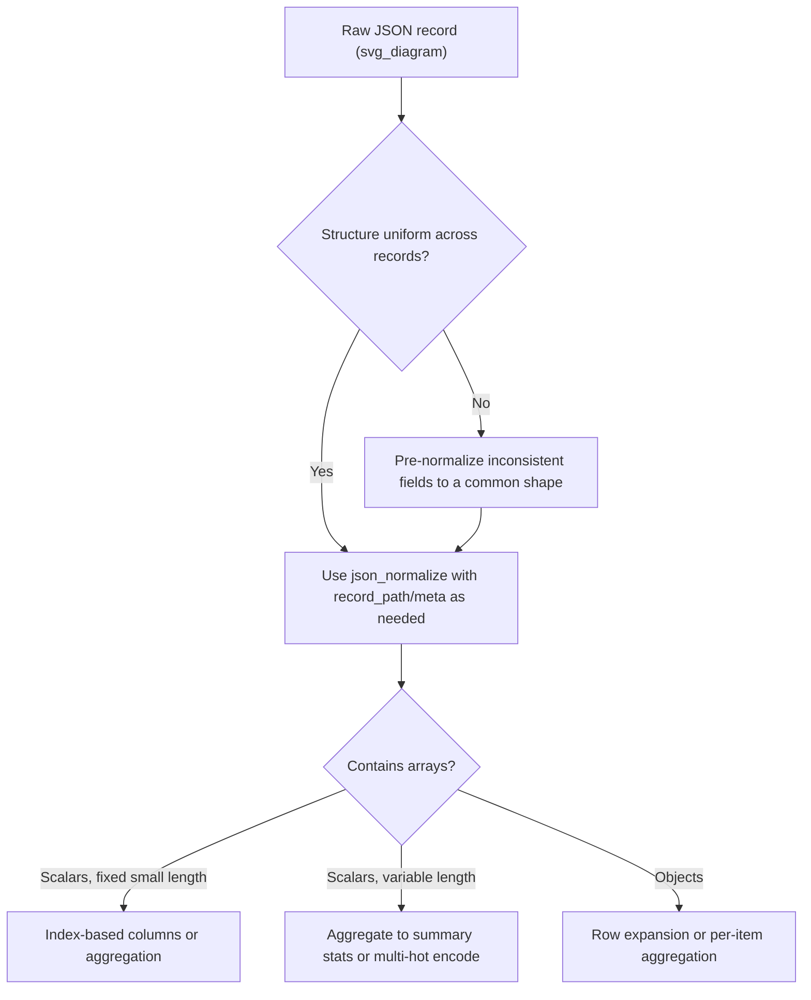

## Flattening JSON and Nested Structures

### Overview

Flattening JSON and nested structures is the process of converting hierarchical, variable-depth data — typically sourced from JSON API responses, NoSQL document stores, or nested Parquet/Avro files — into a flat, rectangular table suitable for tabular ML pipelines. This topic overlaps with normalizing hierarchical data generally, but focuses specifically on JSON as a format, including its particular syntax quirks (null handling, mixed-type arrays, deeply nested key naming) and the practical tooling used to flatten it.

### Why This Matters for Machine Learning

- Tabular ML libraries (scikit-learn, XGBoost, LightGBM) require a fixed-width feature matrix as input; raw JSON objects cannot be passed directly to `.fit()`.
- JSON permits heterogeneous structures within the same field across records (a key present in one record and absent in another, or holding an object in one record and a scalar in another), which flattening must resolve into a consistent column structure.
- JSON's `null` value, missing keys, and empty objects/arrays are distinct concepts that can each be miscoded as the same missing-value representation if flattening is not handled carefully, which affects how missingness should be interpreted downstream.
- Column explosion can occur when deeply nested or highly variable JSON is flattened naively, producing very high-dimensional, sparse feature sets.

[Inference] The degree of column explosion generally scales with both nesting depth and key variability across records; this is a reasoned expectation based on how flattening algorithms construct one column per unique nested path, not a benchmarked measurement across specific datasets.

### JSON-Specific Structural Considerations

- **`null` vs. missing key vs. empty object/array**: `{"address": null}`, `{"address": {}}`, and a record with no `address` key at all are three distinct states that may carry different meanings (explicitly unknown, deliberately empty, or not collected) but can be conflated into a single missing-value marker during flattening if not handled explicitly.
- **Mixed-type arrays**: A single array field may contain elements of different types across records or even within the same record (e.g., `"values": [1, "two", null]`), which flattening cannot resolve into a single consistent column type without an explicit type-coercion decision.
- **Inconsistent nesting depth for the same logical field**: Some JSON sources represent a field as a flat value in some records and a nested object in others (e.g., `"address": "123 Main St"` vs. `"address": {"street": "123 Main St"}`), which requires a normalization pass before standard flattening tools can be applied uniformly.
- **Key names containing separator characters**: If original JSON keys already contain characters used as the flattening separator (e.g., a key literally named `"user_id"` in a structure that will be flattened with `_` as the nesting separator), naming collisions can occur between genuinely nested paths and pre-existing flat keys.

### Diagnostic Workflow

**Key Points**
- Sample a representative subset of records and enumerate all distinct top-level and nested key paths present, rather than assuming a single fixed schema.
- Check whether any field varies in type (scalar vs. object vs. array) across records.
- Identify how `null`, missing keys, and empty containers are each used in the source data, if that distinction is available from source documentation.
- Estimate the resulting column count before committing to a full flattening pass, to catch potential column explosion early.

```python
import pandas as pd
import json

raw_json_records = [
    {"user_id": 1, "profile": {"age": 34, "address": {"city": "Springfield"}}, "scores": [88, 92]},
    {"user_id": 2, "profile": {"age": 29, "address": None}, "scores": []},
    {"user_id": 3, "profile": {"age": 41}, "scores": [75]},
]

# Enumerate all distinct key paths present across records using json_normalize
df_probe = pd.json_normalize(raw_json_records, sep="_")
print(df_probe.columns.tolist())
```

**Output**
```
['user_id', 'scores', 'profile_age', 'profile_address_city']
```

This output shows that `profile_address_city` exists as a column even though record 3 has no `address` key at all and record 2 has `address: None` — both cases will need to be checked against the resulting `NaN` values to confirm which meaning applies to each row.

```python
print(df_probe)
```

**Output**
```
   user_id      scores  profile_age profile_address_city
0        1  [88, 92]             34           Springfield
1        2        []             29                   NaN
2        3      [75]             41                   NaN
```

[Unverified] I cannot confirm from this output alone whether the `NaN` in row 2 (`address: None`) and row 3 (`address` key absent) carry the same intended meaning in the source system without direct access to that system's documentation or a subject-matter expert's confirmation; treating them identically is a modeling choice, not a verified fact about the data.

### Flattening Nested Objects with `json_normalize`

For records where nesting is consistent (same key paths present in all records, values are objects rather than arrays), `pandas.json_normalize` flattens directly into prefixed columns.

```python
df_flat = pd.json_normalize(raw_json_records, sep="_")
print(df_flat[["user_id", "profile_age", "profile_address_city"]])
```

**Output**
```
   user_id  profile_age profile_address_city
0        1           34           Springfield
1        2           29                   NaN
2        3           41                   NaN
```

### Handling Arrays Within JSON During Flattening

Arrays require an explicit decision, as covered in general nested-data normalization: expand into multiple rows (`record_path`) or aggregate into summary columns. For JSON specifically, arrays of scalars (like `scores` above) are commonly summarized using aggregate statistics rather than expanded, since each element does not carry its own sub-fields.

```python
def summarize_scores(scores: list) -> dict:
    if not scores:
        return {"score_count": 0, "score_mean": None, "score_max": None}
    return {
        "score_count": len(scores),
        "score_mean": round(sum(scores) / len(scores), 2),
        "score_max": max(scores)
    }

score_summary = df_flat["scores"].apply(summarize_scores).apply(pd.Series)
df_with_scores = pd.concat([df_flat[["user_id", "profile_age"]], score_summary], axis=1)
print(df_with_scores)
```

**Output**
```
   user_id  profile_age  score_count  score_mean  score_max
0        1           34            2        90.0       92.0
1        2           29            0         NaN        NaN
2        3           41            1        75.0       75.0
```

Here, `score_count = 0` for row 2 (an empty array) is distinguishable from a missing `scores` field entirely, which would instead produce a `NaN` for `score_count` itself. This distinction is preserved deliberately in the `summarize_scores` function and should be checked, not assumed, when adapting this pattern to other datasets.

### Handling `null` vs. Missing Key vs. Empty Object Explicitly

Because these three states can carry different meanings, it is often necessary to create explicit indicator columns before collapsing everything into a single missing-value representation.

```python
def classify_address_state(record: dict) -> str:
    if "profile" not in record or "address" not in record.get("profile", {}):
        return "key_missing"
    elif record["profile"]["address"] is None:
        return "explicit_null"
    elif record["profile"]["address"] == {}:
        return "empty_object"
    else:
        return "populated"

for r in raw_json_records:
    print(r["user_id"], "->", classify_address_state(r))
```

**Output**
```
1 -> populated
2 -> explicit_null
3 -> key_missing
```

[Inference] Whether this three-way distinction is worth preserving as separate indicator features depends on whether the source system assigns different real-world meanings to each state (e.g., "explicitly declined to provide" vs. "field not applicable to this record type"); I do not have access to that source-system-specific business logic and cannot confirm which interpretation applies without documentation or direct confirmation from the data owner.

### Resolving Inconsistent Nesting Depth for the Same Field

When the same logical field appears as a flat scalar in some records and a nested object in others, a pre-normalization pass is typically required to bring all records to a consistent shape before applying `json_normalize`.

```python
mixed_depth_records = [
    {"id": 1, "address": "123 Main St"},
    {"id": 2, "address": {"street": "456 Oak Ave", "unit": "2B"}},
]

def normalize_address_shape(record: dict) -> dict:
    addr = record.get("address")
    if isinstance(addr, str):
        record["address"] = {"street": addr, "unit": None}
    return record

normalized_records = [normalize_address_shape(r) for r in mixed_depth_records]
df_mixed = pd.json_normalize(normalized_records, sep="_")
print(df_mixed)
```

**Output**
```
   id address_street address_unit
0   1    123 Main St         None
1   2    456 Oak Ave           2B
```

[Inference] This pre-normalization step assumes that a bare string value for `address` always represents the street component specifically; this assumption is reasoned from the example data shown and is not confirmed as universally true — a real dataset should be checked directly to confirm what a scalar `address` value represents before applying this transformation.

### Flattening Deeply Nested JSON with Arbitrary Depth

For JSON with unpredictable or highly variable nesting depth, a generic recursive flattening function is commonly used instead of relying solely on `json_normalize`, which works best when structure is relatively uniform.

```python
def flatten_json_generic(obj, parent_key="", sep="_"):
    items = {}
    if isinstance(obj, dict):
        for k, v in obj.items():
            new_key = f"{parent_key}{sep}{k}" if parent_key else k
            items.update(flatten_json_generic(v, new_key, sep))
    elif isinstance(obj, list):
        for i, v in enumerate(obj):
            new_key = f"{parent_key}{sep}{i}"
            items.update(flatten_json_generic(v, new_key, sep))
    else:
        items[parent_key] = obj
    return items

deep_record = {
    "id": 1,
    "meta": {"created": {"by": {"user": "admin", "role": "editor"}}},
    "tags": ["a", "b"]
}

flattened = flatten_json_generic(deep_record)
print(flattened)
```

**Output**
```
{'id': 1, 'meta_created_by_user': 'admin', 'meta_created_by_role': 'editor', 'tags_0': 'a', 'tags_1': 'b'}
```

[Inference] Index-based column naming for array elements (`tags_0`, `tags_1`) is a common convention for fixed-length or small arrays, but it is generally unsuitable for arrays of variable length across records, since it produces a different, inconsistent set of columns per record; this is a reasoned limitation of the approach, not a confirmed defect in any specific library.



### Column Explosion Risk with Wide or Deep JSON

Highly variable or deeply nested JSON, when flattened naively, can produce a very large number of sparse columns, since each unique key path across the full dataset becomes its own column. [Unverified] I do not have access to a general-purpose method that resolves column explosion universally across all datasets; commonly used mitigations include depth-limiting the flattening, aggregating rather than expanding arrays, or restricting flattening to only the key paths known in advance to be relevant to the ML task — but the appropriate choice depends on the specific dataset and use case, and I cannot confirm which mitigation is best without direct evaluation against that data.

### Validation After Flattening

- Confirm the number of resulting columns is within an expected, manageable range for the downstream model type; a sudden large increase in column count relative to the sample size warrants investigation before proceeding.
- Check that `NaN` values in the flattened output are traced back to their originating cause (missing key, explicit `null`, or empty container) wherever that distinction was preserved, rather than assumed to have a single uniform meaning.
- Verify that array-derived columns (whether index-based or aggregate-based) behave consistently across the full dataset, not just the sample used for initial inspection.
- Re-run the flattening pipeline against a held-out batch of records not used during initial development, to check whether previously unseen key paths appear and would silently produce new columns at inference time.

```python
# Example: checking for previously unseen key paths in a new batch
known_columns = set(df_flat.columns)
new_batch = [{"user_id": 4, "profile": {"age": 50, "new_field": "unexpected"}}]
df_new_batch = pd.json_normalize(new_batch, sep="_")
unseen_columns = set(df_new_batch.columns) - known_columns
print("Unseen columns in new batch:", unseen_columns)
```

**Output**
```
Unseen columns in new batch: {'profile_new_field'}
```

This kind of check is [Inference] generally useful for catching schema drift in production JSON sources before it silently changes the feature set fed into a trained model, though I cannot guarantee this specific check will catch every possible form of schema drift, since it only detects new key paths, not other forms of change such as type shifts within an already-known path.

### Related Topics

- Handling schema drift in JSON sources over time (new fields, removed fields, type changes)
- Encoding variable-length arrays for sequence-aware models as an alternative to aggregation
- Working with deeply nested Parquet/Avro schemas in big-data pipelines
- Reconstructing nested JSON from flat tabular output for downstream API responses
- Efficient flattening of large-scale JSON datasets (streaming and memory considerations)
- Handling inconsistent identifiers across nested and flat tables (related structured data quality issue)