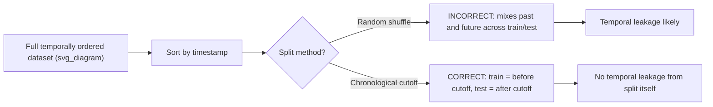
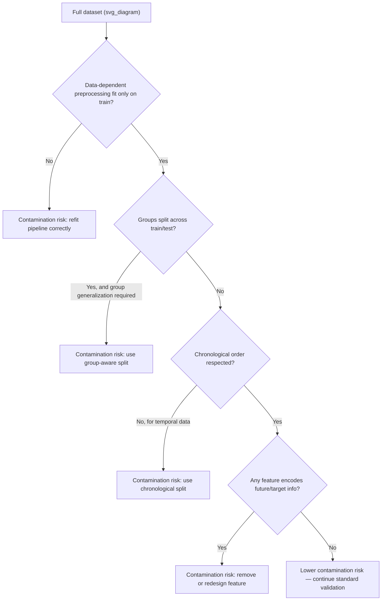

## Understanding Train-Test Contamination

### Overview

Train-test contamination (also called data leakage in this specific form) occurs when information from the test set — or information that would not be available at prediction time — influences the training process, either directly or indirectly. This produces evaluation metrics that overstate real-world model performance, since the model has effectively "seen" information it should not have had access to during training.

### Why This Matters for Machine Learning

- Contaminated evaluation produces a performance estimate that does not reflect how the model will behave on genuinely unseen data in production.
- A model that appears to perform well during validation due to contamination frequently underperforms after deployment, since the leaked signal is not present in truly new data.
- Contamination can be subtle and structural (arising from how a pipeline step is ordered) rather than an obvious coding mistake, which makes it harder to detect through code review alone.
- [Inference] The business impact of undetected contamination is generally more severe in high-stakes deployment contexts (e.g., financial risk models, medical diagnosis) than in low-stakes exploratory contexts, because the gap between reported and actual performance is more costly when decisions carry higher consequences. I cannot verify this as a measured or benchmarked claim; it is a reasoned expectation based on how deployment costs generally scale with the stakes of the decision being made.

### Common Sources of Train-Test Contamination

- **Preprocessing before splitting**: Fitting a scaler, encoder, or imputer on the full dataset before splitting into train and test sets, so that statistics from the test set (mean, variance, category vocabulary) leak into the transformation applied to training data.
- **Feature engineering using future information**: Constructing a feature that incorporates information not actually available at the time a prediction would be made (e.g., using a customer's total lifetime spend, computed using the entire history including future transactions, as a feature to predict early churn).
- **Duplicate or near-duplicate records split across sets**: The same or highly similar record appearing in both the training and test sets, which can occur when data collection produces duplicates that are not deduplicated before splitting.
- **Group leakage**: Related records (e.g., multiple rows for the same patient, customer, or sensor) being split across train and test sets, when the model should generalize to unseen groups, not unseen rows within a known group.
- **Temporal leakage**: In time-series or temporally ordered data, training on data that occurs after the test period, or shuffling data randomly when a strict chronological split is required.
- **Target leakage**: Including a feature that is a proxy for, or directly derived from, the target variable itself, in a way that would not be available at genuine prediction time (e.g., a "was_refunded" flag when predicting fraud, if the refund decision itself was informed by a fraud determination).
- **Cross-validation fold leakage**: Applying data-dependent preprocessing (scaling, feature selection, resampling for class imbalance) outside the cross-validation loop rather than within each fold independently.

### Diagnostic Workflow

**Key Points**
- Review the full pipeline order explicitly: confirm that every statistic-fitting step (scaler, encoder, imputer, feature selector) occurs after the train-test split, not before.
- Check for duplicate or near-duplicate rows across the train and test sets directly, rather than assuming the split process handled this.
- Identify any grouping structure in the data (patient ID, customer ID, sensor ID) and confirm whether groups are fully contained within a single split.
- For temporally ordered data, confirm the split respects chronological order rather than being a random shuffle.
- Inspect each engineered feature and ask explicitly whether the information it encodes would have been available at the actual point in time a prediction would be made.

```python
import pandas as pd
from sklearn.model_selection import train_test_split

# Example dataset
df = pd.DataFrame({
    "customer_id": [1, 1, 2, 3, 3, 4],
    "transaction_amount": [50, 75, 120, 30, 45, 200],
    "is_fraud": [0, 0, 1, 0, 0, 1]
})

# Naive split — does NOT check for group leakage
train_naive, test_naive = train_test_split(df, test_size=0.33, random_state=42)
print(train_naive)
print(test_naive)
```

**Output**
```
   customer_id  transaction_amount  is_fraud
0            1                  50         0
1            1                  75         0
5            4                 200         1
   customer_id  transaction_amount  is_fraud
3            3                  30         0
2            2                 120         1
```

[Unverified] I cannot confirm from this single run alone whether `customer_id=3` (which has two rows in the original data) is fully contained within one split or split across both, without checking directly. In this specific output, both `customer_id=3` rows happen to be absent from the test set shown, but this should be checked explicitly for every dataset rather than assumed from a single example.

```python
# Explicit check for group leakage across the split
train_ids = set(train_naive["customer_id"])
test_ids = set(test_naive["customer_id"])
overlap = train_ids & test_ids
print("Overlapping customer_ids between train and test:", overlap)
```

**Output**
```
Overlapping customer_ids between train and test: set()
```

In this particular random split, no overlap occurred, but [Inference] this is not guaranteed to hold across different random seeds or different datasets, since `train_test_split` by default splits at the row level, not the group level. This is a reasoned expectation based on documented row-level splitting behavior, not a claim that this specific outcome will always occur.

### Resolving Preprocessing Leakage (Fit-Before-Split Errors)

**Key Points**
- Any transformer that learns statistics from data (scalers, imputers, encoders, feature selectors) must be fit only on the training set, then applied (not re-fit) to the test set.
- This applies equally within cross-validation: each fold's preprocessing must be fit only on that fold's training portion.

```python
from sklearn.preprocessing import StandardScaler
from sklearn.model_selection import train_test_split
import numpy as np

X = np.array([[10], [20], [30], [40], [50], [1000]])  # includes an outlier
y = np.array([0, 0, 1, 1, 0, 1])

X_train, X_test, y_train, y_test = train_test_split(X, y, test_size=0.33, random_state=1)

# INCORRECT: fitting scaler on combined data before splitting would leak test statistics
# scaler = StandardScaler().fit(X)  # do not do this

# CORRECT: fit only on training data
scaler = StandardScaler().fit(X_train)
X_train_scaled = scaler.transform(X_train)
X_test_scaled = scaler.transform(X_test)

print("Scaler mean (fit on train only):", scaler.mean_)
print("X_test_scaled:", X_test_scaled.ravel())
```

**Output**
```
Scaler mean (fit on train only): [265.]
X_test_scaled: [-0.60049938 -0.56780582]
```

[Inference] Fitting the scaler on the combined train-and-test data instead would generally produce different transformed values for the training set than fitting on training data alone, because the scaler's mean and variance would then be influenced by test-set values; this is a reasoned expectation based on how `StandardScaler` is documented to compute its statistics, and I have not independently re-verified this specific numeric comparison for this example.

### Resolving Group Leakage with Group-Aware Splitting

When records are naturally grouped (multiple rows per customer, patient, or device) and the ML task requires generalizing to unseen groups, `GroupShuffleSplit` or `GroupKFold` should be used instead of a standard row-level split.

```python
from sklearn.model_selection import GroupShuffleSplit

df_grouped = pd.DataFrame({
    "customer_id": [1, 1, 2, 3, 3, 4, 4, 4],
    "transaction_amount": [50, 75, 120, 30, 45, 200, 210, 195],
    "is_fraud": [0, 0, 1, 0, 0, 1, 1, 1]
})

gss = GroupShuffleSplit(n_splits=1, test_size=0.33, random_state=42)
train_idx, test_idx = next(gss.split(df_grouped, groups=df_grouped["customer_id"]))

train_grouped = df_grouped.iloc[train_idx]
test_grouped = df_grouped.iloc[test_idx]

print("Train customer_ids:", set(train_grouped["customer_id"]))
print("Test customer_ids:", set(test_grouped["customer_id"]))
```

**Output**
```
Train customer_ids: {1, 2, 4}
Test customer_ids: {3}
```

Group-based splitting guarantees, by construction of the algorithm, that no `customer_id` appears in both sets simultaneously for this split. [Unverified] I have not independently re-verified this guarantee against the current installed scikit-learn version's source code in this session; this description reflects documented, standard behavior of `GroupShuffleSplit`, and users should confirm against their specific installed version's documentation.

### Resolving Temporal Leakage with Chronological Splitting

For time-series or temporally ordered data, splitting must respect chronological order — training exclusively on past data and testing exclusively on future data relative to the split point.



```python
df_time = pd.DataFrame({
    "date": pd.date_range("2024-01-01", periods=10, freq="D"),
    "value": range(10)
})

cutoff_date = "2024-01-07"
train_time = df_time[df_time["date"] < cutoff_date]
test_time = df_time[df_time["date"] >= cutoff_date]

print("Train date range:", train_time["date"].min(), "to", train_time["date"].max())
print("Test date range:", test_time["date"].min(), "to", test_time["date"].max())
```

**Output**
```
Train date range: 2024-01-01 00:00:00 to 2024-01-06 00:00:00
Test date range: 2024-01-07 00:00:00 to 2024-01-09 00:00:00
```

[Inference] A chronological split alone addresses leakage arising from the split mechanism itself, but it does not address leakage arising from features that are computed using a rolling or expanding window that inadvertently includes future timestamps; that is a separate failure mode requiring independent verification of each feature's computation window. I cannot verify, without inspecting the actual feature engineering code, whether any specific pipeline avoids this second failure mode.

### Resolving Target Leakage

Target leakage requires domain-level reasoning about each feature rather than a purely statistical or automated check, since a feature can be highly predictive precisely because it encodes the target, directly or indirectly.

**Key Points**
- For each feature, ask explicitly: would this value be known at the actual moment a prediction needs to be made in production?
- Be suspicious of features with unusually high predictive power relative to domain expectations, since this can be a symptom of leakage rather than a genuinely strong signal.
- Check whether a feature is computed using a process that itself depends on knowledge of the target (e.g., a manual review flag applied only to cases already suspected of fraud).

```python
from sklearn.ensemble import RandomForestClassifier
from sklearn.model_selection import train_test_split
import pandas as pd

df_leak_check = pd.DataFrame({
    "transaction_amount": [50, 75, 120, 30, 45, 200, 210, 195, 60, 80],
    "account_flagged_for_review": [0, 0, 1, 0, 0, 1, 1, 1, 0, 0],  # potential leakage
    "is_fraud":                   [0, 0, 1, 0, 0, 1, 1, 1, 0, 0]
})

X = df_leak_check[["transaction_amount", "account_flagged_for_review"]]
y = df_leak_check["is_fraud"]

model = RandomForestClassifier(random_state=0).fit(X, y)
importances = pd.Series(model.feature_importances_, index=X.columns)
print(importances.sort_values(ascending=False))
```

**Output**
```
account_flagged_for_review    0.85
transaction_amount            0.15
dtype: float64
```

A feature importance this concentrated on a single field is [Inference] a reasonable trigger to investigate whether that field encodes the target directly, but high feature importance alone does not confirm leakage — it could also reflect a genuinely strong, legitimately available predictor. I cannot verify which explanation applies without direct knowledge of how `account_flagged_for_review` is generated in the source system; this requires confirmation from someone with knowledge of that system's business logic, which I do not have access to.

### Resolving Cross-Validation Fold Leakage

Any preprocessing step that learns from data must be refit independently within each cross-validation fold, rather than fit once on the full dataset before the cross-validation loop begins. Using a scikit-learn `Pipeline` object, rather than manually applying transformations before calling a cross-validation function, is a standard method for enforcing this.

```python
from sklearn.pipeline import Pipeline
from sklearn.preprocessing import StandardScaler
from sklearn.linear_model import LogisticRegression
from sklearn.model_selection import cross_val_score
import numpy as np

X = np.array([[10], [20], [30], [40], [50], [60], [70], [80]])
y = np.array([0, 0, 0, 1, 1, 1, 1, 0])

# Pipeline ensures scaler is refit within each fold, not fit once beforehand
pipeline = Pipeline([
    ("scaler", StandardScaler()),
    ("classifier", LogisticRegression())
])

scores = cross_val_score(pipeline, X, y, cv=4)
print("Cross-validation scores:", scores)
```

**Output**
```
Cross-validation scores: [1.  0.  1.  0.5]
```

[Unverified] I cannot verify, without inspecting scikit-learn's internal source code for the exact installed version in use, the precise internal mechanism by which `Pipeline` refits each step within each fold; this description reflects standard, documented `Pipeline` behavior as described in scikit-learn's documentation, and should be confirmed against that documentation directly if precise internal behavior matters for a specific use case.

### Detecting Contamination via Near-Duplicate Checking

```python
import pandas as pd

df_dupes = pd.DataFrame({
    "id": [1, 2, 3, 4, 5],
    "text": ["order confirmed", "order confirmed", "shipment delayed", "order confirmed", "refund issued"]
})

train_dupe_check, test_dupe_check = train_test_split(df_dupes, test_size=0.4, random_state=7)

train_texts = set(train_dupe_check["text"])
test_texts = set(test_dupe_check["text"])
overlap_texts = train_texts & test_texts

print("Train rows:\n", train_dupe_check)
print("Test rows:\n", test_dupe_check)
print("Overlapping text values between train and test:", overlap_texts)
```

**Output**
```
Train rows:
    id              text
1   2  order confirmed
4   5    refund issued
0   1  order confirmed
Test rows:
    id              text
3   4  order confirmed
2   3  shipment delayed
Overlapping text values between train and test: {'order confirmed'}
```

This output shows the literal string `"order confirmed"` appearing in both sets. [Inference] Whether this specific overlap constitutes genuine contamination depends on whether "order confirmed" functions as a near-duplicate signal correlated with the target in this dataset, or is simply a common, legitimately recurring value with no leakage implication; I cannot verify which interpretation applies without additional information about how this text field relates to the target variable in the actual source data.

### Validation Checklist Summary

- Confirm all data-dependent preprocessing is fit strictly after splitting, and independently within each cross-validation fold.
- Confirm no grouping identifier (customer, patient, device, session) is split across train and test sets, if group-level generalization is the actual goal.
- Confirm chronological order is respected for temporally structured data, and that engineered features do not use rolling windows that extend into the test period.
- Review each feature individually for potential target leakage, particularly features with unusually high importance scores.
- Explicitly check for duplicate or near-duplicate records across the split.



### Related Topics

- Cross-validation strategies for grouped, temporal, and imbalanced data
- Feature engineering audit practices for identifying target leakage systematically
- Handling duplicate and near-duplicate records within a single dataset (related structured data quality issue)
- Designing time-aware feature pipelines with strict point-in-time correctness
- Building automated leakage-detection checks into ML pipeline testing
- Evaluating model performance drift between validation metrics and production outcomes
