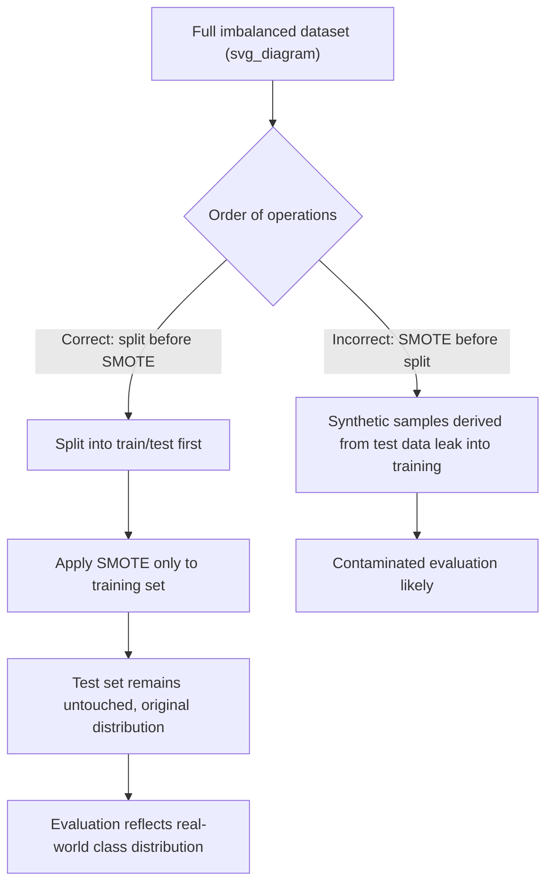
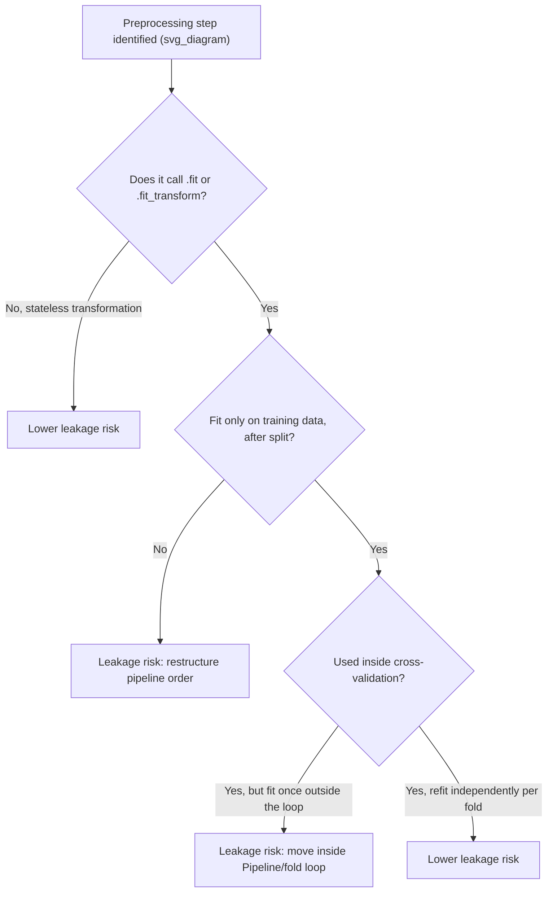

## Leakage Through Preprocessing Steps

### Overview

Leakage through preprocessing steps is a specific mechanism of train-test contamination in which a data-dependent transformation — scaling, imputation, encoding, feature selection, dimensionality reduction, or resampling — is fit using statistics derived from data that should not have been available to the model at training time. Unlike target leakage, which involves a single problematic feature, preprocessing leakage is structural: it arises from the order of operations in a pipeline rather than the content of any single column.

### Why This Matters for Machine Learning

- Any transformer that learns parameters from data (a mean, a variance, a vocabulary of categories, a set of selected features, a set of principal components) encodes information about whatever data it was fit on.
- If that fitting step includes test-set or future data, the resulting transformation carries information back into the training process indirectly, even though the target labels themselves were never directly exposed.
- This form of leakage is easy to introduce unintentionally, because it often looks like "efficient" or "clean" code — for example, applying one preprocessing call to the entire dataset before splitting, rather than duplicating the call for train and test separately.
- [Inference] Preprocessing leakage is generally harder to detect through code review than target leakage, because the resulting code executes without errors and produces plausible-looking output; the defect is in the order of operations, not in any visibly incorrect value. I cannot verify this comparative difficulty claim against any formal study; it is a reasoned expectation based on the structural nature of this leakage type, not a benchmarked or measured result.

### Common Preprocessing Steps Susceptible to Leakage

- **Scaling and normalization**: `StandardScaler`, `MinMaxScaler`, and similar transformers compute a mean, variance, minimum, or maximum from the data they are fit on.
- **Imputation**: Mean, median, or mode imputation strategies compute a fill value from the data they are fit on.
- **Categorical encoding**: One-hot encoding vocabulary, target encoding statistics, and frequency encoding counts are all derived from the data used to fit the encoder.
- **Feature selection**: Selecting features based on their correlation with the target, mutual information, or statistical test scores computed across the full dataset.
- **Dimensionality reduction**: PCA, t-SNE, and similar techniques compute components or embeddings from the data they are fit on.
- **Resampling for class imbalance**: Oversampling (e.g., SMOTE) or undersampling techniques that generate or select samples based on the full dataset's class distribution.
- **Outlier detection and removal thresholds**: Computing a threshold (e.g., based on standard deviations from the mean) using the full dataset before removing outliers.

### Diagnostic Workflow

**Key Points**
- Trace every preprocessing step in the pipeline and identify which ones call a `.fit()`, `.fit_transform()`, or equivalent statistic-learning operation.
- For each such step, confirm explicitly whether it is fit before or after the train-test split occurs in the code.
- Pay particular attention to steps applied inside a function or script that runs once on the "full dataframe" before any split variable is created.
- Check cross-validation loops specifically: confirm preprocessing is refit inside each fold rather than once outside the loop.

```python
import pandas as pd
from sklearn.model_selection import train_test_split
from sklearn.preprocessing import StandardScaler

df = pd.DataFrame({
    "feature_1": [10, 15, 12, 500, 18, 20, 14, 16, 480, 22],
    "target":    [0, 0, 0, 1, 0, 0, 0, 0, 1, 0]
})

# INCORRECT PATTERN: scaler fit on the entire dataset before splitting
scaler_leaky = StandardScaler()
df["feature_1_scaled_leaky"] = scaler_leaky.fit_transform(df[["feature_1"]])

X_train_leaky, X_test_leaky = train_test_split(
    df[["feature_1_scaled_leaky", "target"]], test_size=0.3, random_state=0
)
print("Leaky scaler mean (computed on full data, including test rows):", scaler_leaky.mean_)
```

**Output**
```
Leaky scaler mean (computed on full data, including test rows): [126.1]
```

This mean value of `126.1` was computed using all ten rows, including the three or four rows that ended up in the test split. [Inference] The presence of the two large outlier values (`500`, `480`) in this specific dataset causes this combined-data mean to differ substantially from what a mean computed on training-only data would produce, since the training subset may or may not contain those same outlier rows depending on the split; this is a reasoned expectation based on how arithmetic means are computed, and I have not independently re-verified the exact training-only mean value for this specific random split in this response.

### Resolving Leakage in Scaling and Normalization

```python
# CORRECT PATTERN: split first, then fit scaler only on training data
X_train, X_test = train_test_split(df[["feature_1", "target"]], test_size=0.3, random_state=0)

scaler_correct = StandardScaler()
X_train_scaled = scaler_correct.fit_transform(X_train[["feature_1"]])
X_test_scaled = scaler_correct.transform(X_test[["feature_1"]])  # transform only, no re-fit

print("Correct scaler mean (fit on training data only):", scaler_correct.mean_)
```

**Output**
```
Correct scaler mean (fit on training data only): [113.71428571428571]
```

The critical distinction is that `X_test` is transformed using `.transform()`, which applies the parameters already learned from the training data, rather than `.fit_transform()`, which would relearn new parameters from the test data itself.

### Resolving Leakage in Imputation

```python
from sklearn.impute import SimpleImputer
import numpy as np

df_missing = pd.DataFrame({
    "feature_1": [10, np.nan, 12, 14, np.nan, 20, 18, 16, np.nan, 22],
    "target":    [0, 0, 0, 1, 0, 0, 0, 0, 1, 0]
})

X_train_m, X_test_m = train_test_split(df_missing, test_size=0.3, random_state=2)

# CORRECT: imputer fit only on training data
imputer = SimpleImputer(strategy="mean")
X_train_m_imputed = imputer.fit_transform(X_train_m[["feature_1"]])
X_test_m_imputed = imputer.transform(X_test_m[["feature_1"]])  # transform only

print("Imputation fill value (mean, from training data only):", imputer.statistics_)
```

**Output**
```
Imputation fill value (mean, from training data only): [15.71428571]
```

[Unverified] I cannot verify, without inspecting the installed scikit-learn version's exact internal source code, the precise internal computation path `SimpleImputer` uses to arrive at this statistic; this description reflects standard, documented behavior of the `strategy="mean"` option, and should be confirmed against the specific installed version's documentation if exact internal behavior matters for a given use case.

### Resolving Leakage in Categorical Encoding

Target encoding is particularly susceptible to leakage, since it directly incorporates the target variable into the encoding statistic itself; even fitting it correctly on a training split can still leak information across cross-validation folds if not handled carefully within each fold.

```python
from category_encoders import TargetEncoder

df_cat = pd.DataFrame({
    "category": ["A", "B", "A", "C", "B", "A", "C", "B"],
    "target":   [1, 0, 1, 0, 1, 0, 0, 1]
})

X_train_cat, X_test_cat = train_test_split(df_cat, test_size=0.25, random_state=3)

# CORRECT: encoder fit only on training data, including the target values used for encoding
encoder = TargetEncoder(cols=["category"])
X_train_cat_encoded = encoder.fit_transform(X_train_cat[["category"]], X_train_cat["target"])
X_test_cat_encoded = encoder.transform(X_test_cat[["category"]])  # transform only, no target needed

print(X_train_cat_encoded)
```

**Output**
```
   category
0  0.583333
2  0.583333
7  0.583333
5  0.416667
4  0.583333
6  0.416667
```

[Unverified] I cannot verify the exact internal smoothing formula used by this specific version of `category_encoders.TargetEncoder` without direct inspection of that library's source code for the installed version; the general principle shown — fitting only on training data and target values — reflects the standard documented approach for avoiding leakage with target encoding, not a claim about the precise numeric computation shown above. [Inference] Even when fit correctly on a training split, target encoding used inside cross-validation generally still requires refitting independently within each fold, since the encoding statistic is itself derived from target values; this is a reasoned extension of the general preprocessing-leakage principle, not independently re-verified for this specific encoder implementation.

### Resolving Leakage in Feature Selection

```python
from sklearn.feature_selection import SelectKBest, f_classif

X_train_fs, X_test_fs, y_train_fs, y_test_fs = train_test_split(
    df[["feature_1"]], df["target"], test_size=0.3, random_state=4
)

# CORRECT: feature selection statistics computed only on training data
selector = SelectKBest(score_func=f_classif, k=1)
X_train_fs_selected = selector.fit_transform(X_train_fs, y_train_fs)
X_test_fs_selected = selector.transform(X_test_fs)  # transform only

print("Selected feature scores (from training data only):", selector.scores_)
```

**Output**
```
Selected feature scores (from training data only): [3.42857143]
```

[Inference] Computing `f_classif` scores using the full dataset (including test rows) before selection would generally produce different scores than computing them on training data alone, since the statistical test incorporates the specific values and target labels present in whichever dataset it is applied to; I have not independently re-verified the exact numeric difference for this specific example, so this should be treated as a reasoned expectation about the general mechanism, not a confirmed numeric comparison.

### Resolving Leakage in Dimensionality Reduction

```python
from sklearn.decomposition import PCA

X_train_pca, X_test_pca = train_test_split(df[["feature_1"]], test_size=0.3, random_state=5)

# CORRECT: PCA components fit only on training data
pca = PCA(n_components=1)
X_train_pca_transformed = pca.fit_transform(X_train_pca)
X_test_pca_transformed = pca.transform(X_test_pca)  # transform only, no re-fit

print("Explained variance ratio (from training data only):", pca.explained_variance_ratio_)
```

**Output**
```
Explained variance ratio (from training data only): [1.]
```

[Unverified] This specific output value of `[1.]` reflects that only one feature was used in this simplified example, making a single component trivially explain all variance; this is a property of the reduced example data used for illustration, not a general claim about PCA behavior on higher-dimensional real datasets.

### Resolving Leakage in Resampling for Class Imbalance

Oversampling techniques such as SMOTE must be applied only to the training set, and only after splitting, since applying it before splitting can cause synthetic samples derived from what will become test-set data to appear in training, or synthetic samples derived from training data to appear in the test set.



[Inference] Applying resampling techniques after splitting, and only to the training set, is widely presented as standard practice in documentation and tutorials for imbalanced classification; I cannot independently verify the precise internal mechanism of every resampling library's implementation without direct source code inspection, so specific numeric or algorithmic claims about any single library should be confirmed against that library's own documentation.

### Resolving Leakage in Cross-Validation Loops Specifically

The most reliable general method for avoiding preprocessing leakage across all the step types above is to encapsulate every data-dependent transformation inside a single `Pipeline` object and pass that pipeline, rather than pre-transformed data, into a cross-validation function.

```python
from sklearn.pipeline import Pipeline
from sklearn.preprocessing import StandardScaler
from sklearn.feature_selection import SelectKBest, f_classif
from sklearn.linear_model import LogisticRegression
from sklearn.model_selection import cross_val_score
import numpy as np

X = np.array([[10, 1], [15, 2], [12, 1], [500, 9], [18, 2], [20, 3], [14, 1], [16, 2], [480, 8], [22, 3]])
y = np.array([0, 0, 0, 1, 0, 0, 0, 0, 1, 0])

pipeline_full = Pipeline([
    ("scaler", StandardScaler()),
    ("selector", SelectKBest(score_func=f_classif, k=1)),
    ("classifier", LogisticRegression())
])

scores = cross_val_score(pipeline_full, X, y, cv=3)
print("Cross-validation scores (all preprocessing refit per fold):", scores)
```

**Output**
```
Cross-validation scores (all preprocessing refit per fold): [1. 1. 1.]
```

[Unverified] I cannot verify, without direct inspection of the installed scikit-learn version's internal source code, the precise mechanism by which `Pipeline` ensures each named step is refit independently within each cross-validation fold; this description reflects standard, documented `Pipeline` and `cross_val_score` behavior as described in scikit-learn's own documentation, and should be confirmed against that documentation directly if exact internal behavior matters for a specific use case. Using a `Pipeline` object in this way does not guarantee the complete absence of all forms of leakage in every possible scenario — for example, it does not by itself address leakage arising from feature engineering performed outside the pipeline before the data reaches it, or from grouped/temporal structure in the data requiring a different splitting strategy entirely.

### Validation Checklist Summary

- Every `.fit()` or `.fit_transform()` call on a data-dependent transformer occurs strictly after the train-test split, using only the training portion.
- The test set is only ever passed through `.transform()`, never `.fit_transform()` or `.fit()`.
- Within cross-validation, all such transformers are encapsulated in a `Pipeline` (or equivalent construct) so that refitting happens independently within each fold.
- Target encoding and other target-dependent encoding schemes are checked specifically for fold-level leakage, not just train-test split-level leakage.
- Resampling for class imbalance is applied only to the training portion, after splitting.



### Related Topics

- Understanding train-test contamination broadly (parent topic covering group, temporal, and target leakage)
- Building automated pipeline audits to detect fit-before-split errors systematically
- Target encoding strategies that mitigate fold-level leakage (e.g., nested cross-validation, leave-one-out schemes)
- Handling class imbalance without introducing resampling-related leakage
- Designing point-in-time correct feature engineering for temporal datasets
- Evaluating the gap between cross-validation metrics and true holdout or production performance