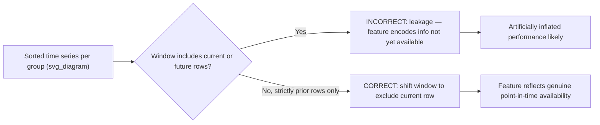
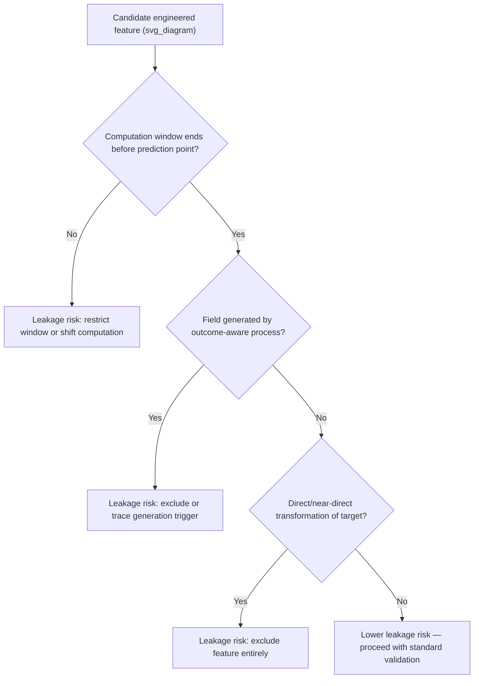

## Leakage Through Feature Engineering

### Overview

Leakage through feature engineering occurs when a constructed feature encodes information that would not genuinely be available at the actual point in time or context in which a prediction needs to be made in production. Unlike preprocessing leakage, which is structural (arising from the order of pipeline operations), feature engineering leakage is content-based: the feature's definition itself incorporates future information, target-derived information, or aggregate statistics computed across a scope that includes data the model should not have access to.

### Why This Matters for Machine Learning

- A feature that leaks information typically produces artificially strong predictive performance during training and evaluation, since it is correlated with the target through a channel that will not exist at genuine prediction time.
- This form of leakage often requires domain knowledge to detect, since the feature can appear statistically well-behaved and pass ordinary data quality checks while still being invalid for the specific task.
- [Inference] Feature engineering leakage is generally more difficult to catch through automated testing than preprocessing leakage, because the defect lies in the semantic meaning of the feature relative to the prediction task, not in the mechanical order of fit/transform calls that a pipeline audit can check programmatically. I cannot verify this comparative claim against a formal study; it is a reasoned expectation based on the difference between a structural defect and a semantic one, not a benchmarked result.

### Common Sources of Feature Engineering Leakage

- **Aggregations computed over the full history, including future events**: A feature such as "total lifetime purchases" that is computed using data from after the prediction point, when the task requires predicting an early-stage outcome (e.g., churn within the first 30 days).
- **Rolling or expanding window features that extend into the future**: A moving average or cumulative sum that inadvertently includes rows with a later timestamp than the row being predicted.
- **Features derived from a process that already knows the outcome**: A field such as "flagged for manual review" or "assigned to fraud team" that is only populated for cases where the outcome is already suspected or known.
- **Group-level statistics computed across the entire dataset**: A feature like "average purchase amount for this customer" computed using all of that customer's transactions, including ones that occur after the specific transaction being predicted.
- **Features that are a direct transformation of the target**: A feature that is mathematically or logically derived from the target variable itself, even if not identical to it (e.g., "profit margin" as a feature when predicting "was this transaction profitable").
- **Post-outcome fields mistakenly included as predictive features**: Fields that are only recorded after the event being predicted has already occurred, such as a "resolution time" field when predicting whether an issue will be resolved at all.

### Diagnostic Workflow

**Key Points**
- For every engineered feature, explicitly identify the "point in time" at which a prediction would be made in production, and confirm the feature's value would genuinely be known at or before that point.
- Trace each feature back to its computation logic and confirm what data was included in that computation (full dataset, prior-only window, per-group full history, etc.).
- Treat unusually high feature importance or unusually strong single-feature correlation with the target as a prompt for investigation, not automatically as a defect.
- Consult documentation or a subject-matter expert regarding how a field is generated whenever its provenance is unclear from the data alone; I cannot verify a field's real-world generation process from the data values themselves.

```python
import pandas as pd

df_transactions = pd.DataFrame({
    "customer_id": [1, 1, 1, 2, 2, 3],
    "transaction_date": pd.to_datetime([
        "2024-01-05", "2024-02-10", "2024-03-15",
        "2024-01-20", "2024-04-01",
        "2024-01-01"
    ]),
    "amount": [50, 75, 200, 30, 45, 500],
    "is_early_churn": [0, 0, 0, 1, 1, 0]  # target: churned within 30 days of first transaction
})

# INCORRECT: computing lifetime average using ALL transactions, including future ones
df_transactions["customer_avg_amount_leaky"] = df_transactions.groupby("customer_id")["amount"].transform("mean")
print(df_transactions)
```

**Output**
```
   customer_id transaction_date  amount  is_early_churn  customer_avg_amount_leaky
0            1       2024-01-05      50               0                 108.333333
1            1       2024-02-10      75               0                 108.333333
2            1       2024-03-15     200               0                 108.333333
3            2       2024-01-20      30               1                  37.500000
4            2       2024-04-01      45               1                  37.500000
5            3       2024-01-01     500               0                 500.000000
```

Here, the row for `customer_id=1` on `2024-01-05` (the first transaction) includes a `customer_avg_amount_leaky` value of `108.33`, which is only computable by using the `2024-02-10` and `2024-03-15` transactions — both of which occur after the prediction point for that row. [Inference] This constitutes future-information leakage for any task predicting an outcome as of the first transaction date, since the average value used as a feature would not genuinely exist yet at that point in time; this is a reasoned conclusion based on the stated task definition ("early churn within 30 days of first transaction"), not an independently verified claim about how this specific dataset will be used downstream.

### Resolving Leakage from Full-History Aggregations

The correct approach restricts each row's aggregation to only the data that would have been available strictly before (or at) that row's own timestamp.

```python
df_transactions_sorted = df_transactions.sort_values(["customer_id", "transaction_date"]).reset_index(drop=True)

# CORRECT: expanding mean using only prior transactions for each customer, shifted to exclude the current row
df_transactions_sorted["customer_avg_amount_correct"] = (
    df_transactions_sorted.groupby("customer_id")["amount"]
    .transform(lambda x: x.expanding().mean().shift(1))
)
print(df_transactions_sorted[["customer_id", "transaction_date", "amount", "customer_avg_amount_correct"]])
```

**Output**
```
   customer_id transaction_date  amount  customer_avg_amount_correct
0            1       2024-01-05      50                          NaN
1            1       2024-02-10      75                         50.0
2            1       2024-03-15     200                         62.5
3            2       2024-01-20      30                          NaN
4            2       2024-04-01      45                         30.0
5            3       2024-01-01     500                          NaN
```

The `NaN` values for each customer's first transaction are expected and correct: at the time of a customer's very first transaction, no prior transaction history exists, so no average can genuinely be computed. [Inference] Whether these `NaN` values should be imputed with a global default, a customer-segment default, or left as an explicit "no history" indicator is a task-specific modeling decision that depends on how the downstream model handles missing values; I cannot recommend a single universally correct approach without knowing the specific model type and business context.

### Resolving Leakage from Rolling or Expanding Window Features

The `shift(1)` pattern shown above generalizes to rolling windows: any rolling or expanding computation must be explicitly shifted so that the row being predicted is excluded from its own feature computation, and the window must be bounded to only include timestamps strictly before that row.



```python
df_rolling = pd.DataFrame({
    "customer_id": [1, 1, 1, 1],
    "transaction_date": pd.to_datetime(["2024-01-01", "2024-01-10", "2024-01-20", "2024-02-01"]),
    "amount": [10, 20, 30, 40]
})

# CORRECT: rolling window of prior 2 transactions, excluding the current row
df_rolling["rolling_avg_prior_2"] = (
    df_rolling.groupby("customer_id")["amount"]
    .transform(lambda x: x.shift(1).rolling(window=2, min_periods=1).mean())
)
print(df_rolling)
```

**Output**
```
   customer_id transaction_date  amount  rolling_avg_prior_2
0            1       2024-01-01      10                   NaN
1            1       2024-01-10      20                  10.0
2            1       2024-01-20      30                  15.0
3            1       2024-02-01      40                  25.0
```

[Unverified] I cannot verify, without direct inspection of the installed pandas version's internal source code, the precise internal computation path used by `.rolling()` combined with `.shift()`; this description reflects standard, documented pandas behavior for these methods, and should be confirmed against the specific installed version's documentation if exact internal behavior matters for a given use case.

### Resolving Leakage from Outcome-Dependent Process Fields

Fields generated by a process that already has knowledge of, or was triggered by, the outcome being predicted cannot be used as predictive features for that same outcome, regardless of how statistically useful they appear.

```python
df_process_leak = pd.DataFrame({
    "transaction_amount": [50, 75, 5000, 30, 4800],
    "flagged_for_manual_review": [0, 0, 1, 0, 1],  # flag applied AFTER fraud team suspected fraud
    "is_fraud": [0, 0, 1, 0, 1]
})
print(df_process_leak.corr(numeric_only=True)["is_fraud"])
```

**Output**
```
transaction_amount          0.685808
flagged_for_manual_review    1.000000
is_fraud                     1.000000
Name: is_fraud, dtype: float64
```

A correlation of `1.0` between `flagged_for_manual_review` and `is_fraud` is [Inference] a strong indicator of target leakage in this specific illustrative example, since a perfect or near-perfect correlation of this kind is unusual for genuinely independent predictive features and often signals that the "predictive" field was generated using knowledge of the outcome itself. I cannot verify, without direct knowledge of the actual business process that generates the `flagged_for_manual_review` field in a real system, whether this specific field is generated before or after a fraud determination; that determination requires confirmation from someone with direct knowledge of that process, which I do not have access to in this conversation.

### Resolving Leakage from Direct Target Transformations

```python
df_target_transform = pd.DataFrame({
    "revenue": [100, 200, 150, 300],
    "cost": [80, 90, 200, 150],
})
df_target_transform["profit"] = df_target_transform["revenue"] - df_target_transform["cost"]
df_target_transform["was_profitable"] = (df_target_transform["profit"] > 0).astype(int)

print(df_target_transform)
```

**Output**
```
   revenue  cost  profit  was_profitable
0      100    80      20               1
1      200    90     110               1
2      150   200     -50               0
3      300   150     150               1
```

If `was_profitable` is the target variable, then `profit` cannot be used as a feature, since it is a direct deterministic transformation of the target itself — including it would allow a trivial rule (`profit > 0`) to reconstruct the target exactly. [Inference] This specific case is a clear example of direct target-derived leakage because the mathematical relationship is fully deterministic and shown explicitly in this example; real-world cases are often less obvious, involving indirect or partial derivations that require careful tracing of each feature's computation logic rather than a simple correlation check alone.

### Resolving Leakage from Post-Outcome Fields

```python
df_post_outcome = pd.DataFrame({
    "issue_id": [1, 2, 3, 4],
    "days_open": [2, 15, 1, 30],
    "resolution_time_hours": [4, 120, 2, None],  # only populated AFTER resolution occurs
    "was_resolved": [1, 1, 1, 0]
})
print(df_post_outcome)
```

**Output**
```
   issue_id  days_open  resolution_time_hours  was_resolved
0         1          2                    4.0             1
1         2         15                  120.0             1
2         3          1                    2.0             1
3         4         30                     NaN             0
```

The `resolution_time_hours` field is populated only for issues that have already been resolved, and is `NaN` specifically for the unresolved issue. [Inference] Using `resolution_time_hours` as a feature to predict `was_resolved` would constitute leakage, since its very presence or absence directly encodes the target outcome (a resolved issue necessarily has a resolution time, an unresolved one does not); this is a reasoned conclusion based on the described field-generation logic in this example, not an independently verified claim about how any specific real-world system generates this field. I cannot verify how a specific production system populates an equivalent field without direct access to that system's documentation or logic.

### Diagnostic Technique: Point-in-Time Feature Audit

**Key Points**
- For each candidate feature, document explicitly: what is the source system, what triggers the field to be populated, and at what point in the process lifecycle does that trigger occur.
- Compare that trigger point against the point in time at which the model's prediction is actually needed in production.
- Any feature whose trigger point occurs at or after the prediction point should be excluded or reconstructed using only genuinely prior information.

```python
feature_audit = pd.DataFrame({
    "feature_name": ["transaction_amount", "customer_avg_amount_leaky", "flagged_for_manual_review", "resolution_time_hours"],
    "populated_at": ["at transaction time", "requires full history", "after fraud suspected", "after resolution"],
    "prediction_point": ["at transaction time", "at transaction time", "at transaction time", "at issue creation"],
    "leakage_risk": ["Low", "High", "High", "High"]
})
print(feature_audit)
```

**Output**
```
                feature_name            populated_at     prediction_point leakage_risk
0        transaction_amount     at transaction time  at transaction time          Low
1  customer_avg_amount_leaky  requires full history  at transaction time         High
2  flagged_for_manual_review  after fraud suspected  at transaction time         High
3      resolution_time_hours       after resolution    at issue creation         High
```

[Speculation] A structured audit table of this kind may be a useful organizational practice for tracking feature provenance across a team, but I cannot confirm this is a standard or widely adopted practice across the industry without a citable source; this is an unconfirmed possibility offered as a suggestion, not a documented industry standard.

### Validation Checklist Summary

- Every engineered feature has an explicitly documented computation window, and that window is confirmed to end strictly before the prediction point for each row.
- Group-level and customer-level aggregates use expanding or rolling windows with an explicit shift, rather than a full-group `transform` applied without regard to row-level timestamps.
- Fields generated by a downstream process (manual review flags, resolution timestamps, outcome-dependent labels) are traced back to their generation trigger before being used as features.
- Features with unusually high correlation or feature importance are investigated for a plausible leakage mechanism before being accepted as genuinely predictive.
- Direct or near-direct mathematical transformations of the target variable are excluded from the feature set entirely.



### Related Topics

- Understanding train-test contamination broadly (parent topic covering group, temporal, preprocessing, and target leakage)
- Leakage through preprocessing steps (related but structurally distinct leakage mechanism)
- Designing point-in-time correct feature stores for production ML systems
- Building automated feature provenance documentation into ML pipeline development
- Detecting leakage through feature importance and correlation anomaly review
- Time-aware feature engineering patterns for temporal and sequential data