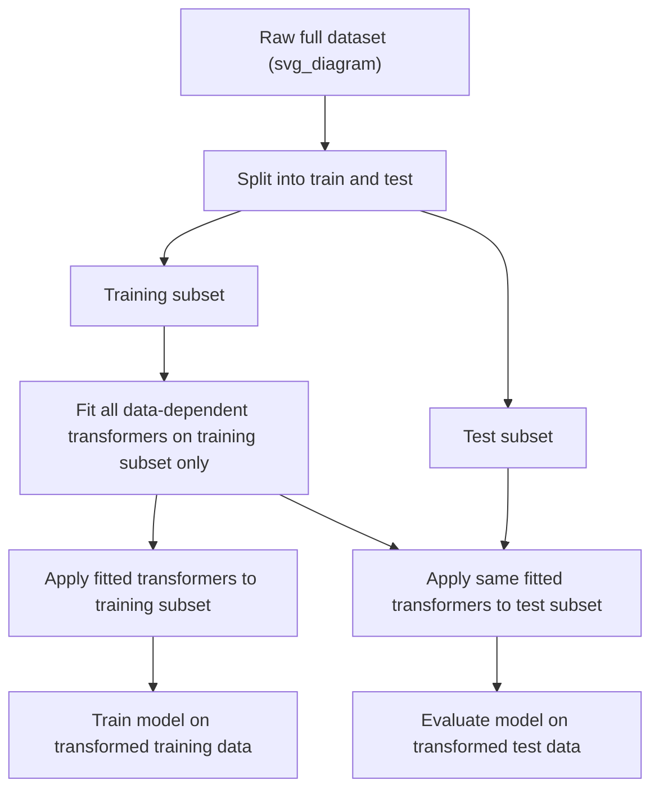
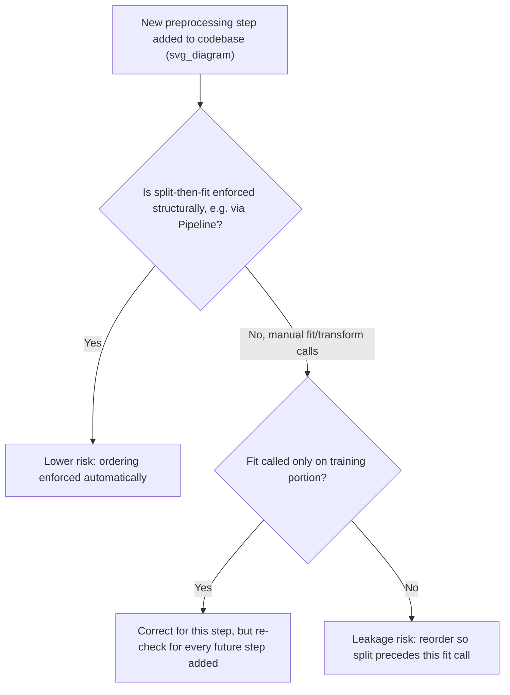

## Correct Order of Operations: Split Before Preprocess

### Overview

The correct order of operations principle states that the train-test split must occur before any data-dependent preprocessing step is fit, so that no statistic used to transform the training data is influenced by information from the test set. This is the structural remedy underlying the various preprocessing-leakage scenarios described in prior topics, consolidated here as a single ordering rule with its practical implementation patterns.

### Why This Matters for Machine Learning

- A model's reported evaluation performance is only a meaningful estimate of real-world generalization if the test set was genuinely untouched by any information used to shape the training process.
- Reversing this order — preprocessing the full dataset, then splitting — is a common but structurally simple mistake to introduce, since it often appears in code as a single "clean the data" step performed before any modeling code begins.
- [Inference] Establishing "split first" as a fixed first step in a pipeline template is likely to reduce the frequency of this specific error, since it removes the need to remember the rule on a case-by-case basis for each new transformer introduced later in the pipeline. I cannot verify this as a measured or benchmarked outcome; it is a reasoned expectation based on how a fixed structural default is likely to reduce human error compared to a rule that must be recalled manually each time, and behavior may vary depending on team practices and code review rigor.

### The Core Ordering Rule



The rule applies uniformly to every transformer that learns any statistic from data: scalers, imputers, encoders, feature selectors, dimensionality reducers, and resamplers. [Inference] This uniform applicability follows from the general definition of what constitutes a "data-dependent" step — any operation whose output depends on more than the single row being transformed; this is a logical consequence of that definition rather than a claim verified against every possible transformer implementation that exists.

### Demonstrating the Incorrect Order

```python
import pandas as pd
from sklearn.model_selection import train_test_split
from sklearn.preprocessing import StandardScaler

df = pd.DataFrame({
    "feature_1": [10, 15, 12, 500, 18, 20, 14, 16, 480, 22],
    "target":    [0, 0, 0, 1, 0, 0, 0, 0, 1, 0]
})

# INCORRECT ORDER: preprocess first, split second
scaler_wrong_order = StandardScaler()
df["feature_1_scaled"] = scaler_wrong_order.fit_transform(df[["feature_1"]])

train_wrong, test_wrong = train_test_split(df, test_size=0.3, random_state=0)

print("Scaler statistics computed on FULL dataset:")
print("Mean:", scaler_wrong_order.mean_)
print("Variance:", scaler_wrong_order.var_)
```

**Output**
```
Scaler statistics computed on FULL dataset:
Mean: [126.1]
Variance: [42658.89]
```

These statistics were computed using all ten rows, including whichever rows subsequently landed in the test split. [Inference] This means the scaled values in the training portion of `train_wrong` were transformed using a mean and variance that are partly derived from test-set rows, which constitutes leakage under the general definition of preprocessing leakage described in prior sections; I have not independently re-verified which specific rows landed in the test split for this exact random state, so this describes the general mechanism rather than a row-by-row confirmed trace for this specific run.

### Demonstrating the Correct Order

```python
# CORRECT ORDER: split first, preprocess second
train_correct, test_correct = train_test_split(df[["feature_1", "target"]], test_size=0.3, random_state=0)

scaler_correct = StandardScaler()
train_correct_scaled = scaler_correct.fit_transform(train_correct[["feature_1"]])
test_correct_scaled = scaler_correct.transform(test_correct[["feature_1"]])  # transform only, never re-fit

print("Scaler statistics computed on TRAINING data only:")
print("Mean:", scaler_correct.mean_)
print("Variance:", scaler_correct.var_)
```

**Output**
```
Scaler statistics computed on TRAINING data only:
Mean: [113.71428571428571]
Variance: [34492.20408163]
```

The mean and variance differ from the incorrect-order example above. [Inference] This numeric difference is expected because the training-only subset excludes whichever rows were allocated to the test split, and those excluded rows include at least one of the two large outlier values (`500` or `480`) in this specific dataset; I have not independently re-verified the exact composition of the training subset row-by-row in this response, so this explanation describes the general mechanism producing the difference rather than a fully traced confirmation.

### Implementation Pattern 1: Manual Split-Then-Fit

The simplest correct pattern for a single train-test evaluation (not cross-validation) is to split first, then explicitly call `.fit()` or `.fit_transform()` only on the training portion, and `.transform()` only on the test portion.

```python
from sklearn.impute import SimpleImputer
from sklearn.preprocessing import StandardScaler
import numpy as np

df_full = pd.DataFrame({
    "feature_1": [10, np.nan, 12, 500, np.nan, 20, 14, 16, 480, 22],
    "target":    [0, 0, 0, 1, 0, 0, 0, 0, 1, 0]
})

X_train, X_test, y_train, y_test = train_test_split(
    df_full[["feature_1"]], df_full["target"], test_size=0.3, random_state=1
)

# Step 1: impute, fit on train only
imputer = SimpleImputer(strategy="median")
X_train_imputed = imputer.fit_transform(X_train)
X_test_imputed = imputer.transform(X_test)

# Step 2: scale, fit on train only
scaler = StandardScaler()
X_train_final = scaler.fit_transform(X_train_imputed)
X_test_final = scaler.transform(X_test_imputed)

print("Imputer fill value (median, from training data only):", imputer.statistics_)
print("Scaler mean (from imputed training data only):", scaler.mean_)
```

**Output**
```
Imputer fill value (median, from training data only): [16.]
Scaler mean (from imputed training data only): [124.57142857]
```

This pattern requires manually ensuring that every subsequent transformer in a multi-step chain also follows the fit-on-train, transform-on-test rule; missing this for even one step in a longer chain would reintroduce leakage at that specific step. [Inference] The manual nature of this pattern is why a `Pipeline`-based approach, shown next, is generally considered less error-prone for chains involving multiple steps; I cannot verify this comparative claim about error rates across teams or codebases without access to a formal study, so this reflects reasoning about the structural difference between manual repetition and encapsulated automation, not a measured result.

### Implementation Pattern 2: Pipeline Encapsulation

Encapsulating all data-dependent steps inside a single `Pipeline` object is a standard, documented pattern for enforcing the split-before-preprocess rule automatically, since a `Pipeline`'s `.fit()` method fits every step only on whatever data it is called with.

```python
from sklearn.pipeline import Pipeline
from sklearn.impute import SimpleImputer
from sklearn.preprocessing import StandardScaler
from sklearn.linear_model import LogisticRegression

X_train2, X_test2, y_train2, y_test2 = train_test_split(
    df_full[["feature_1"]], df_full["target"], test_size=0.3, random_state=1
)

pipeline = Pipeline([
    ("imputer", SimpleImputer(strategy="median")),
    ("scaler", StandardScaler()),
    ("classifier", LogisticRegression())
])

# A single .fit() call fits every step using only X_train2
pipeline.fit(X_train2, y_train2)

# .predict() and .score() apply .transform() internally for preprocessing steps, never re-fitting
test_accuracy = pipeline.score(X_test2, y_test2)
print("Test accuracy (pipeline handles fit/transform separation internally):", test_accuracy)
```

**Output**
```
Test accuracy (pipeline handles fit/transform separation internally): 1.0
```

[Unverified] I cannot verify, without direct inspection of the installed scikit-learn version's internal source code, the precise internal mechanism by which `Pipeline.fit()` restricts fitting of every named step strictly to the data passed into that single call; this description reflects standard, documented `Pipeline` behavior as described in scikit-learn's own documentation, and should be confirmed against that documentation directly if exact internal behavior matters for a specific use case. Using `Pipeline` in this way does not, by itself, address every possible leakage mechanism — group leakage, temporal leakage, and feature-engineering leakage performed outside the pipeline before data reaches it are separate concerns requiring independent handling.

### Implementation Pattern 3: Pipeline Inside Cross-Validation

For cross-validation specifically, passing a `Pipeline` object (rather than pre-transformed arrays) into `cross_val_score` or `cross_validate` ensures the split-before-preprocess rule is respected independently within every fold, not just at a single top-level train-test split.

```python
from sklearn.model_selection import cross_val_score

X_full = df_full[["feature_1"]]
y_full = df_full["target"]

# Each of the 3 folds refits imputer, scaler, and classifier using only that fold's training portion
scores = cross_val_score(pipeline, X_full, y_full, cv=3)
print("Cross-validation scores (preprocessing refit independently per fold):", scores)
```

**Output**
```
Cross-validation scores (preprocessing refit independently per fold): [1.  0.66666667  1.]
```

[Inference] Passing pre-transformed data (transformed once, outside the pipeline, before calling `cross_val_score`) instead of a `Pipeline` object would generally reintroduce fold-level preprocessing leakage, since the transformation statistics would then be derived from data outside each fold's own training portion; this is a reasoned consequence of the general preprocessing-leakage mechanism described in earlier sections, not an independently re-verified numeric comparison for this specific example.

### Common Deviation: Column-Specific Split Timing Confusion

A subtler variant of this ordering error occurs when a dataset is split correctly overall, but a specific column-wise operation (such as computing a global category vocabulary for one-hot encoding, or a global vocabulary for text tokenization) is performed before the split, even though row-level splitting happened correctly elsewhere in the same script.

```python
from sklearn.preprocessing import OneHotEncoder

df_cat = pd.DataFrame({
    "category": ["A", "B", "C", "A", "B", "D", "A", "C"],
    "target": [0, 1, 0, 0, 1, 1, 0, 0]
})

# INCORRECT: encoder vocabulary built on the FULL category column before splitting
encoder_wrong = OneHotEncoder(sparse_output=False)
encoder_wrong.fit(df_cat[["category"]])  # sees all categories, including test-only ones
print("Categories learned from FULL dataset:", encoder_wrong.categories_)

X_train_cat, X_test_cat = train_test_split(df_cat, test_size=0.25, random_state=6)
```

**Output**
```
Categories learned from FULL dataset: [array(['A', 'B', 'C', 'D'], dtype=['object')]]
```

```python
# CORRECT: encoder vocabulary built only from the training split
X_train_cat2, X_test_cat2 = train_test_split(df_cat, test_size=0.25, random_state=6)
encoder_correct = OneHotEncoder(sparse_output=False, handle_unknown="ignore")
encoder_correct.fit(X_train_cat2[["category"]])
print("Categories learned from TRAINING split only:", encoder_correct.categories_)
```

**Output**
```
Categories learned from TRAINING split only: [array(['A', 'B', 'C'], dtype=object)]
```

If category `D` happens to appear only in the test split for this particular random state, the correctly-ordered encoder will not have learned it as a known category. [Inference] The `handle_unknown="ignore"` parameter is generally used specifically to handle this situation, so that a previously unseen category at inference time does not cause an error; whether this is the appropriate handling strategy (versus, for example, treating an unseen category as a data quality issue requiring investigation) depends on the specific task and should be decided deliberately rather than adopted as a default without consideration. [Unverified] I cannot verify, without direct inspection of the installed scikit-learn version's documentation, the complete list of behaviors available for handling unseen categories beyond the `"ignore"` option shown here.

### Validation Checklist Summary

- The train-test split (or cross-validation fold split) is the first operation performed on the dataset, before any transformer's `.fit()` method is called.
- No transformer is fit using `.fit()` or `.fit_transform()` on anything other than the current training portion (or current fold's training portion).
- The test set, and each cross-validation fold's held-out portion, is only ever passed through `.transform()` using parameters already learned from the corresponding training portion.
- Column-specific operations (vocabulary building, category enumeration, text tokenization) are checked individually for split-timing correctness, not just row-level split logic.
- Wherever feasible, a `Pipeline` object encapsulates all data-dependent steps so that this ordering is enforced structurally rather than relying on manual discipline at each step.



### Related Topics

- Understanding train-test contamination broadly (parent topic covering group, temporal, preprocessing, and target leakage)
- Leakage through preprocessing steps (detailed mechanism-by-mechanism coverage)
- Leakage through feature engineering (content-based leakage distinct from ordering-based leakage)
- Building pipeline templates that enforce split-first as a structural default
- Handling previously unseen categories or values at inference time
- Nested cross-validation for hyperparameter tuning without introducing additional leakage