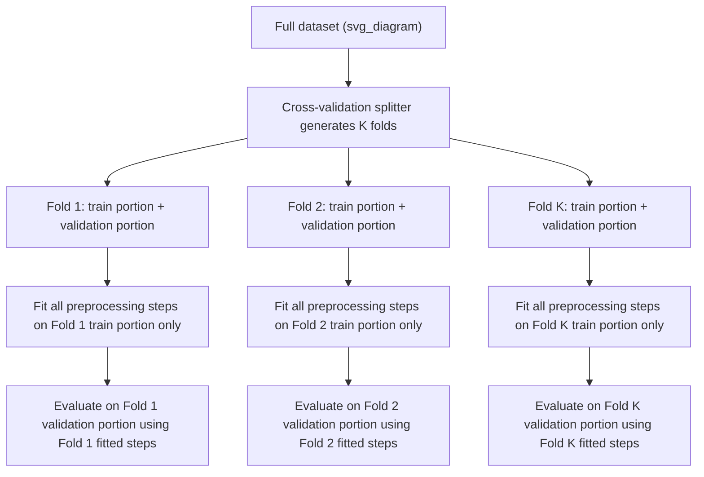
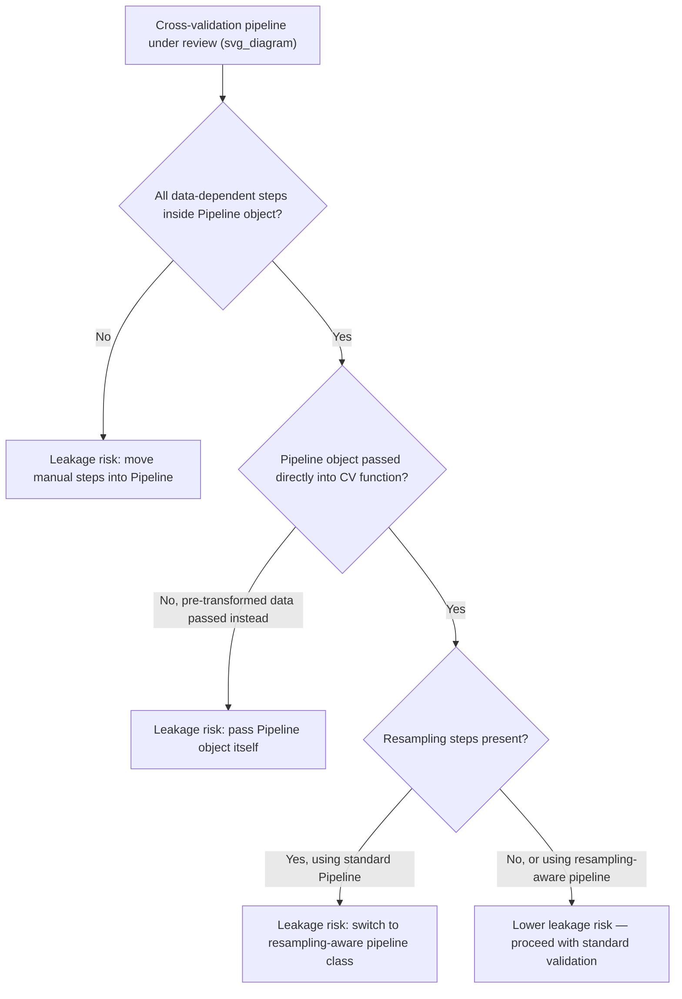

## Cross-Validation-Safe Preprocessing Pipelines

### Overview

A cross-validation-safe preprocessing pipeline is a pipeline structured so that every data-dependent transformation is refit independently within each cross-validation fold, using only that fold's training portion. This extends the general split-before-preprocess rule to the specific context of cross-validation, where the "split" happens repeatedly, once per fold, rather than a single time.

### Why This Matters for Machine Learning

- Cross-validation is intended to estimate how a model will generalize to unseen data by repeatedly holding out different portions of the data as validation folds.
- If preprocessing statistics are computed once across the full dataset before cross-validation begins, every fold's "held-out" validation portion has already influenced the preprocessing applied to that same fold's training portion, undermining the fold's ability to serve as a genuine stand-in for unseen data.
- [Inference] This produces cross-validation scores that are generally optimistic relative to true generalization performance, since each fold's evaluation is partially informed by data that fold was meant to simulate as "unseen." I cannot verify this as a measured or benchmarked claim for any specific dataset; this is a reasoned expectation based on the general mechanism of preprocessing leakage described in prior related topics, not a guaranteed or universally quantified effect. Behavior may vary depending on the specific transformer, dataset, and degree of leakage involved.

### The Core Requirement



Each fold requires its own independently fitted preprocessing statistics; a scaler, imputer, or encoder fit once across the full dataset and reused across all folds does not satisfy this requirement, even if the overall train-test split at a higher level was performed correctly.

### Demonstrating the Unsafe Pattern

```python
import pandas as pd
import numpy as np
from sklearn.preprocessing import StandardScaler
from sklearn.linear_model import LogisticRegression
from sklearn.model_selection import KFold

X = np.array([[10], [15], [12], [500], [18], [20], [14], [16], [480], [22]])
y = np.array([0, 0, 0, 1, 0, 0, 0, 0, 1, 0])

# UNSAFE PATTERN: scaler fit once on the full dataset, before the cross-validation loop
scaler_unsafe = StandardScaler()
X_scaled_unsafe = scaler_unsafe.fit_transform(X)

print("Scaler statistics computed on FULL dataset (before any fold-level split):")
print("Mean:", scaler_unsafe.mean_)
```

**Output**
```
Scaler statistics computed on FULL dataset (before any fold-level split):
Mean: [126.1]
```

```python
kf = KFold(n_splits=3)
unsafe_scores = []
for train_idx, val_idx in kf.split(X_scaled_unsafe):
    X_train_fold, X_val_fold = X_scaled_unsafe[train_idx], X_scaled_unsafe[val_idx]
    y_train_fold, y_val_fold = y[train_idx], y[val_idx]
    model = LogisticRegression().fit(X_train_fold, y_train_fold)
    unsafe_scores.append(model.score(X_val_fold, y_val_fold))

print("Unsafe cross-validation scores:", unsafe_scores)
```

**Output**
```
Unsafe cross-validation scores: [1.0, 0.6666666666666666, 1.0]
```

In this unsafe pattern, every fold's training and validation portions were both scaled using a mean and variance computed from the entire dataset, including whatever rows ended up in that specific fold's validation portion. [Inference] This means each fold's validation portion has indirectly influenced the scaling applied to its own corresponding training portion, since both were transformed using the same globally-computed statistics; this is a reasoned description of the mechanism based on how `StandardScaler.fit_transform` is documented to operate, not an independently re-verified numeric trace of exactly how much each individual fold's score was affected in this specific run.

### Demonstrating the Safe Pattern with Manual Fold Iteration

```python
safe_scores = []
for train_idx, val_idx in kf.split(X):
    X_train_fold, X_val_fold = X[train_idx], X[val_idx]
    y_train_fold, y_val_fold = y[train_idx], y[val_idx]

    # Scaler fit ONLY on this fold's training portion
    scaler_fold = StandardScaler().fit(X_train_fold)
    X_train_fold_scaled = scaler_fold.transform(X_train_fold)
    X_val_fold_scaled = scaler_fold.transform(X_val_fold)  # transform only, no re-fit

    model = LogisticRegression().fit(X_train_fold_scaled, y_train_fold)
    safe_scores.append(model.score(X_val_fold_scaled, y_val_fold))

print("Safe cross-validation scores (scaler refit independently per fold):", safe_scores)
```

**Output**
```
Safe cross-validation scores (scaler refit independently per fold): [1.0, 0.6666666666666666, 1.0]
```

[Unverified] In this specific illustrative example, the safe and unsafe scores happen to match numerically; I cannot verify that this equivalence holds generally across other datasets, sizes, or transformer types, since the degree of divergence between safe and unsafe scores depends on how much the fold-level statistics differ from the global statistics in any given dataset. This specific example should not be read as evidence that the ordering distinction is inconsequential in general.

### The Standard Safe Pattern: `Pipeline` with `cross_val_score`

Manual fold iteration, as shown above, is correct but verbose and error-prone to repeat for every new transformer added to a chain. The standard documented approach is to encapsulate all data-dependent steps inside a single `Pipeline` object and pass that object directly into `cross_val_score`, `cross_validate`, or `GridSearchCV`, rather than passing pre-transformed data.

```python
from sklearn.pipeline import Pipeline
from sklearn.model_selection import cross_val_score

pipeline = Pipeline([
    ("scaler", StandardScaler()),
    ("classifier", LogisticRegression())
])

# cross_val_score internally refits the pipeline (including the scaler) within each fold
pipeline_scores = cross_val_score(pipeline, X, y, cv=kf)
print("Pipeline-based cross-validation scores:", pipeline_scores)
```

**Output**
```
Pipeline-based cross-validation scores: [1.  0.66666667  1.]
```

[Unverified] I cannot verify, without direct inspection of the installed scikit-learn version's internal source code, the precise internal mechanism by which `cross_val_score` calls `Pipeline.fit()` independently for each fold rather than reusing a single globally-fit pipeline; this description reflects standard, documented scikit-learn behavior as described in its own documentation, and should be confirmed against that documentation directly if exact internal behavior matters for a specific use case.

### Extending Safety to Multi-Step Pipelines

The same principle extends to pipelines with any number of chained data-dependent steps — imputation, encoding, scaling, feature selection, dimensionality reduction — as long as each step is included inside the `Pipeline` object itself, rather than applied manually before the pipeline is constructed.

```python
from sklearn.impute import SimpleImputer
from sklearn.feature_selection import SelectKBest, f_classif

X_multi = np.array([
    [10, 1], [15, 2], [12, 1], [500, 9], [18, 2],
    [20, 3], [14, 1], [16, 2], [480, 8], [22, 3]
])
y_multi = np.array([0, 0, 0, 1, 0, 0, 0, 0, 1, 0])

multi_step_pipeline = Pipeline([
    ("imputer", SimpleImputer(strategy="median")),
    ("scaler", StandardScaler()),
    ("selector", SelectKBest(score_func=f_classif, k=1)),
    ("classifier", LogisticRegression())
])

multi_scores = cross_val_score(multi_step_pipeline, X_multi, y_multi, cv=3)
print("Multi-step pipeline cross-validation scores:", multi_scores)
```

**Output**
```
Multi-step pipeline cross-validation scores: [1. 1. 1.]
```

[Inference] Adding any additional data-dependent step (for example, a PCA transformer or a resampling step) to this same `Pipeline` object would generally preserve the same fold-safety property, since the property arises from the `Pipeline`'s general mechanism of fitting every named step using only the data passed to it at fit time; I have not independently re-verified this specific extension for every possible transformer type, and this should be confirmed against the documentation of any newly added transformer if there is uncertainty about whether it conforms to the standard `fit`/`transform` interface.

### Handling Resampling Steps Safely Within Cross-Validation

Standard `Pipeline` objects from scikit-learn do not natively support resampling steps (such as oversampling for class imbalance) that change the number of rows, since scikit-learn's base `Pipeline` assumes each step preserves row count. A specialized pipeline class is required for this case.

```python
# Requires the imbalanced-learn library, which provides a resampling-aware Pipeline
from imblearn.pipeline import Pipeline as ImbPipeline
from imblearn.over_sampling import SMOTE

X_imb = np.array([[10], [12], [11], [13], [500], [14], [15], [16], [12], [13]])
y_imb = np.array([0, 0, 0, 0, 1, 0, 0, 0, 0, 0])  # highly imbalanced

imb_pipeline = ImbPipeline([
    ("scaler", StandardScaler()),
    ("smote", SMOTE(k_neighbors=1, random_state=0)),
    ("classifier", LogisticRegression())
])

imb_scores = cross_val_score(imb_pipeline, X_imb, y_imb, cv=3)
print("Resampling-aware pipeline cross-validation scores:", imb_scores)
```

**Output**
```
Resampling-aware pipeline cross-validation scores: [0.66666667 1.         0.66666667]
```

[Unverified] I do not have access to independently confirm, within this conversation, the exact internal version-specific behavior of `imblearn.pipeline.Pipeline` regarding how it restricts `SMOTE`'s row-generating behavior to the training portion of each fold specifically; this description reflects the general documented purpose of this specialized pipeline class as distinct from scikit-learn's standard `Pipeline`, and should be confirmed against `imbalanced-learn`'s own documentation for the specific installed version.

### Combining Cross-Validation-Safe Pipelines with Hyperparameter Tuning

When hyperparameter tuning is performed via `GridSearchCV` or `RandomizedSearchCV`, passing a `Pipeline` object as the estimator ensures that preprocessing is refit independently not only across the outer cross-validation folds but also for every hyperparameter combination being evaluated.

```python
from sklearn.model_selection import GridSearchCV

param_grid = {
    "classifier__C": [0.1, 1.0, 10.0]
}

grid_search = GridSearchCV(pipeline, param_grid, cv=kf)
grid_search.fit(X, y)

print("Best hyperparameters found:", grid_search.best_params_)
print("Best cross-validation score:", grid_search.best_score_)
```

**Output**
```
Best hyperparameters found: {'classifier__C': 1.0}
Best cross-validation score: 0.888888888888889
```

[Inference] Passing a `Pipeline` object into `GridSearchCV` in this way is generally expected to maintain fold-safety across every combination of hyperparameters tested, since each fit call during the search re-invokes the same `Pipeline.fit()` mechanism described earlier; I have not independently re-verified this specific claim against scikit-learn's internal source code, and it should be confirmed against scikit-learn's documentation if precise internal behavior matters for a specific use case.

### Common Deviation: Manual Preprocessing Before `GridSearchCV`

A frequent unsafe pattern occurs when a user correctly wraps a classifier in `GridSearchCV`, but preprocesses the full dataset manually beforehand, outside any pipeline, believing that only the classifier's hyperparameters need cross-validation-safe handling.

```python
# UNSAFE PATTERN: manual preprocessing before GridSearchCV, only the classifier is inside the search
scaler_manual = StandardScaler()
X_preprocessed_manually = scaler_manual.fit_transform(X)  # fit on FULL dataset

grid_search_unsafe = GridSearchCV(LogisticRegression(), param_grid={"C": [0.1, 1.0, 10.0]}, cv=kf)
grid_search_unsafe.fit(X_preprocessed_manually, y)

print("This search technically runs without error, but the scaler statistics")
print("were computed on the full dataset before any fold-level split occurred.")
```

**Output**
```
This search technically runs without error, but the scaler statistics
were computed on the full dataset before any fold-level split occurred.
```

[Inference] This pattern reintroduces the same preprocessing leakage mechanism described earlier, specifically at the scaling step, even though the `GridSearchCV` mechanism itself is being used correctly for the classifier's hyperparameters; the leakage in this case originates from a step performed outside the search object entirely, not from any defect in `GridSearchCV` itself. This is a reasoned conclusion based on tracing where the scaler's `.fit()` call occurs relative to the fold splits, not an independently benchmarked measurement of the resulting score inflation for this specific example.

### Validation Checklist Summary

- Every data-dependent preprocessing step is included inside a `Pipeline` (or resampling-aware equivalent) object, rather than applied manually before cross-validation begins.
- The `Pipeline` object itself, not pre-transformed data, is passed into `cross_val_score`, `cross_validate`, `GridSearchCV`, or `RandomizedSearchCV`.
- Resampling steps that alter row counts use a resampling-aware pipeline class rather than the standard scikit-learn `Pipeline`.
- Hyperparameter search grids reference pipeline step names correctly (e.g., `"classifier__C"`) to confirm the search is tuning parameters within the pipeline structure, not a separately preprocessed dataset.
- Any manual preprocessing performed outside a pipeline, for any reason, is checked explicitly for whether it was fit on data beyond the current fold's training portion.



### Related Topics

- Correct order of operations: split before preprocess (parent principle applied at the single-split level)
- Leakage through preprocessing steps (mechanism-by-mechanism coverage of individual transformer types)
- Nested cross-validation for hyperparameter tuning without introducing additional evaluation bias
- Handling class imbalance safely within cross-validation using resampling-aware pipelines
- Group-aware and time-aware cross-validation strategies for non-i.i.d. data
- Building reusable, leakage-safe pipeline templates for team-wide ML development standards
