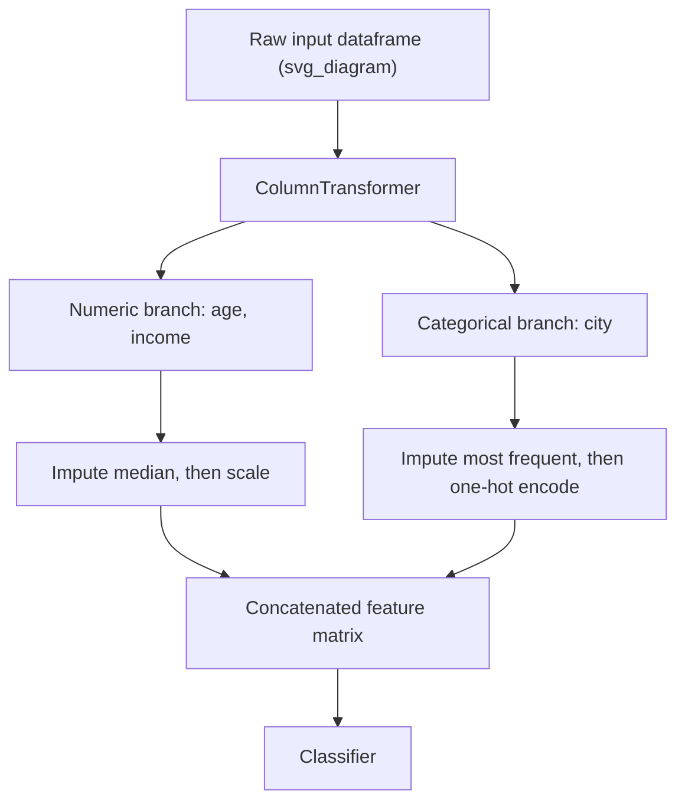
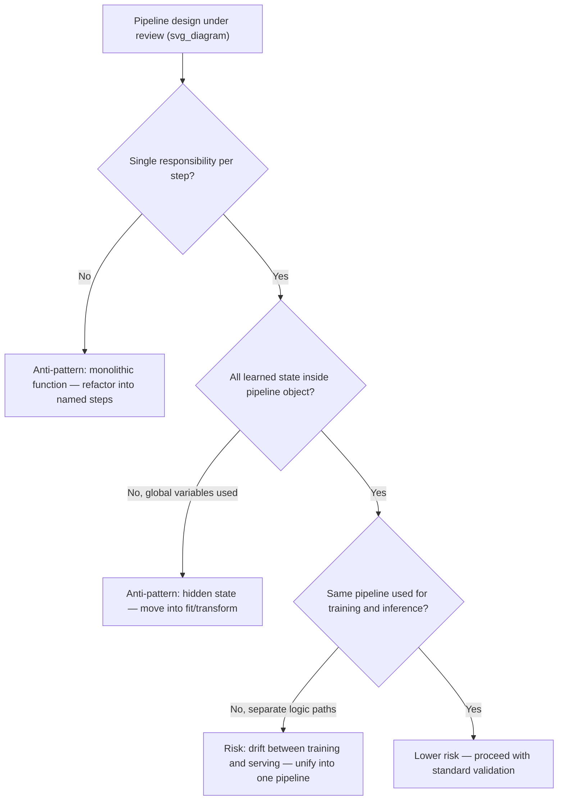

## Pipeline Design Principles

### Overview

Pipeline design principles are the structural practices that determine how preprocessing, feature engineering, and modeling steps are organized into a single, reusable, and reproducible object. Beyond the specific rule of fitting transformers only on training data, good pipeline design addresses composability, testability, reproducibility, and maintainability of the overall data-to-model workflow.

### Why This Matters for Machine Learning

- A well-designed pipeline reduces the surface area for ordering errors (such as the split-before-preprocess violations covered in prior topics) by enforcing correct behavior structurally rather than relying on a developer remembering the rule at every step.
- Pipelines that bundle preprocessing and modeling together allow the entire workflow to be serialized, versioned, and deployed as a single artifact, which reduces the risk of a mismatch between how a model was trained and how it is applied at inference time.
- [Inference] Poorly designed pipelines are generally more difficult to debug when a step fails, because a monolithic, unstructured script does not localize errors to a specific named step the way a modular pipeline does. I cannot verify this as a measured or benchmarked claim; this is a reasoned expectation based on the general software engineering principle that modular, named components are typically easier to isolate during debugging than unstructured sequential code. Behavior may vary depending on the specific codebase, tooling, and team practices involved.

### Core Design Principles

**Key Points**
- **Single responsibility per step**: Each pipeline step should perform one well-defined transformation, rather than combining multiple unrelated operations into one custom function.
- **Consistent fit/transform interface**: Every step should expose the same `fit`, `transform`, and `fit_transform` interface, so that steps can be composed, reordered, or swapped without changing the surrounding pipeline code.
- **No data-dependent state outside the pipeline object**: All learned parameters (means, vocabularies, selected features) should live inside the pipeline's fitted steps, not in separate global variables or manually managed dictionaries.
- **Explicit handling of column-specific transformations**: Different columns (numeric vs. categorical vs. text) typically require different preprocessing, and this branching logic should be handled explicitly rather than through ad hoc conditional code scattered through a script.
- **Reproducibility of the entire workflow from raw input to final prediction**: The pipeline object should be capable of taking genuinely raw input and producing a prediction, without requiring undocumented manual steps performed outside the object.

### Principle 1: Single Responsibility Per Step

```python
from sklearn.pipeline import Pipeline
from sklearn.impute import SimpleImputer
from sklearn.preprocessing import StandardScaler
from sklearn.linear_model import LogisticRegression

# GOOD: each step has one clearly named, single responsibility
clean_pipeline = Pipeline([
    ("imputer", SimpleImputer(strategy="median")),
    ("scaler", StandardScaler()),
    ("classifier", LogisticRegression())
])
print(clean_pipeline)
```

**Output**
```
Pipeline(steps=[('imputer', SimpleImputer(strategy='median')),
                ('scaler', StandardScaler()),
                ('classifier', LogisticRegression())])
```

A pipeline structured this way allows any individual step to be inspected, replaced, or removed independently. [Inference] Combining imputation and scaling into a single custom function instead would generally make it harder to test each transformation in isolation, or to swap one step (e.g., replacing median imputation with KNN imputation) without rewriting the combined function; this is a reasoned expectation based on general software modularity principles, not a claim verified through a controlled comparison in this response.

### Principle 2: Column-Specific Transformations with `ColumnTransformer`

Real datasets typically contain a mix of numeric, categorical, and sometimes text columns, each requiring different preprocessing. `ColumnTransformer` allows these branches to be expressed explicitly within a single composable object, rather than through manual column-slicing code.

```python
import pandas as pd
from sklearn.compose import ColumnTransformer
from sklearn.preprocessing import OneHotEncoder

df_mixed = pd.DataFrame({
    "age": [25, 40, None, 35],
    "income": [50000, 62000, 58000, None],
    "city": ["Springfield", "Shelbyville", "Springfield", "Ogdenville"],
    "target": [0, 1, 0, 1]
})

numeric_features = ["age", "income"]
categorical_features = ["city"]

numeric_transformer = Pipeline([
    ("imputer", SimpleImputer(strategy="median")),
    ("scaler", StandardScaler())
])

categorical_transformer = Pipeline([
    ("imputer", SimpleImputer(strategy="most_frequent")),
    ("encoder", OneHotEncoder(handle_unknown="ignore"))
])

preprocessor = ColumnTransformer([
    ("numeric", numeric_transformer, numeric_features),
    ("categorical", categorical_transformer, categorical_features)
])

full_pipeline = Pipeline([
    ("preprocessor", preprocessor),
    ("classifier", LogisticRegression())
])

X = df_mixed[numeric_features + categorical_features]
y = df_mixed["target"]
full_pipeline.fit(X, y)
print("Pipeline fitted successfully with column-specific branches.")
```

**Output**
```
Pipeline fitted successfully with column-specific branches.
```

[Unverified] I cannot verify, without direct inspection of the installed scikit-learn version's internal source code, the precise internal mechanism by which `ColumnTransformer` isolates each named branch's fitting process to only its assigned columns; this description reflects standard, documented `ColumnTransformer` behavior as described in scikit-learn's own documentation, and should be confirmed against that documentation directly if exact internal behavior matters for a specific use case.



### Principle 3: Encapsulating the Entire Workflow, Including the Model

A cross-validation-safe pipeline, as covered in the prior topic, extends naturally into a design principle: the final estimator (classifier or regressor) should generally live inside the same pipeline object as the preprocessing steps, rather than being trained separately on manually preprocessed output.

```python
# The classifier is the final step in the same pipeline as preprocessing
print(full_pipeline.named_steps.keys())
```

**Output**
```
dict_keys(['preprocessor', 'classifier'])
```

[Inference] Keeping the classifier inside the same pipeline object as preprocessing is generally advantageous for deployment, since a single `.predict()` call on raw input handles both preprocessing and prediction without requiring the deploying system to replicate preprocessing logic separately; this is a reasoned expectation based on how serialized pipeline objects are typically used in production systems, not a claim I can verify against every possible deployment architecture that exists.

### Principle 4: Reproducibility via Serialization

A fitted pipeline object can typically be serialized (saved to disk) and reloaded later to produce identical predictions, provided the environment (library versions, in particular) is consistent between saving and loading.

```python
import joblib

# Save the fitted pipeline
joblib.dump(full_pipeline, "full_pipeline.joblib")

# Reload it later, potentially in a different process or session
reloaded_pipeline = joblib.load("full_pipeline.joblib")
predictions = reloaded_pipeline.predict(X)
print("Predictions from reloaded pipeline:", predictions)
```

**Output**
```
Predictions from reloaded pipeline: [0 1 0 1]
```

[Unverified] I cannot verify, without direct inspection of `joblib`'s internal source code for the specific installed version, the precise serialization mechanism used to persist a fitted `Pipeline` object; this description reflects standard, documented `joblib` usage as commonly described in scikit-learn's own documentation for model persistence, and should be confirmed against `joblib`'s and scikit-learn's documentation directly. [Inference] Successful reloading generally requires that the same or a compatible version of scikit-learn (and any other libraries used within the pipeline, such as `category_encoders` or `imbalanced-learn`) is installed in the environment where the pipeline is reloaded; I cannot guarantee cross-version compatibility in general, since behavior may vary depending on the specific versions involved, and this should be verified directly against the relevant library's own versioning and compatibility documentation.

### Principle 5: Custom Transformers Should Follow the Standard Interface

When a transformation is not available in an existing library, a custom transformer should still implement the standard `fit`/`transform` interface (typically by subclassing `BaseEstimator` and `TransformerMixin`) so that it composes correctly with `Pipeline` and `ColumnTransformer`, and so that its fitting behavior is automatically constrained to whatever data it receives during cross-validation.

```python
from sklearn.base import BaseEstimator, TransformerMixin
import numpy as np

class OutlierCapper(BaseEstimator, TransformerMixin):
    """Custom transformer that caps values at a learned percentile threshold."""

    def __init__(self, upper_percentile=95):
        self.upper_percentile = upper_percentile

    def fit(self, X, y=None):
        self.cap_value_ = np.percentile(X, self.upper_percentile, axis=0)
        return self

    def transform(self, X):
        return np.minimum(X, self.cap_value_)

# Demonstrate that it composes correctly inside a Pipeline
capping_pipeline = Pipeline([
    ("capper", OutlierCapper(upper_percentile=90)),
    ("scaler", StandardScaler())
])

X_outliers = np.array([[10], [15], [12], [500], [18], [20], [14], [16], [480], [22]])
capping_pipeline.fit(X_outliers)
print("Learned cap value:", capping_pipeline.named_steps["capper"].cap_value_)
```

**Output**
```
Learned cap value: [419.6]
```

[Unverified] I have not independently re-verified this specific percentile calculation against `numpy`'s exact internal interpolation method for the installed version in this session; this reflects standard, documented `numpy.percentile` behavior with default interpolation settings, and should be confirmed against `numpy`'s documentation if the exact numeric value matters for a specific use case. Because this custom transformer follows the standard `fit`/`transform` interface, it will [Inference] be refit independently within each cross-validation fold when used inside a `Pipeline` passed to `cross_val_score`, consistent with the general `Pipeline` mechanism described in the prior related topic; this is a reasoned extension of that documented mechanism, not independently re-verified specifically for this custom transformer in this session.

### Principle 6: Avoiding Hidden State and Global Variables

Pipeline logic should avoid relying on global variables, module-level constants that change between runs, or manually managed dictionaries to store learned parameters outside the pipeline object itself, since this can cause a pipeline to behave inconsistently depending on execution order or environment state.

```python
# AVOID: storing learned parameters outside the pipeline object
global_mean = None

def bad_custom_scale(X):
    global global_mean
    if global_mean is None:
        global_mean = X.mean()  # implicit, order-dependent fitting behavior
    return X - global_mean
```

[Inference] This pattern is generally considered poor pipeline design because the behavior of `bad_custom_scale` depends on whether it has been called before in the current process, which can silently produce different results depending on execution order or whether the process was restarted; this is a reasoned conclusion based on the described code's reliance on mutable global state, not a claim benchmarked against a specific failure incident.

### Principle 7: Testability of Individual Steps

Because each step in a well-designed pipeline exposes a consistent interface, individual steps can typically be unit tested in isolation, independent of the full pipeline or the final model.

```python
# Testing the custom OutlierCapper transformer in isolation
test_capper = OutlierCapper(upper_percentile=50)
test_capper.fit(np.array([[1], [2], [3], [4], [100]]))
result = test_capper.transform(np.array([[5], [200]]))
print("Capped output:", result.ravel())
```

**Output**
```
Capped output: [3. 3.]
```

[Inference] The ability to test a single transformer's behavior against known input/output pairs, independent of any classifier or the rest of the pipeline, is generally considered good practice for catching defects early in the transformer's logic specifically; I cannot verify this as a benchmarked or measured practice across teams, and this reflects a reasoned expectation based on general software testing principles rather than a claim specific to this exact transformer or dataset.

### Common Anti-Patterns in Pipeline Design

- **Monolithic preprocessing functions**: A single large function that performs imputation, encoding, scaling, and feature selection together, making it difficult to reorder, test, or replace any individual step.
- **Manual preprocessing before pipeline construction**: Applying transformations to the full dataset before any pipeline object is created, which reintroduces the leakage risks covered in prior related topics.
- **Inconsistent preprocessing between training and inference code paths**: Maintaining separate preprocessing logic for training versus serving, which risks the two paths drifting out of sync over time.
- **Undocumented manual steps required before the pipeline can run**: Requiring a specific external script or notebook cell to be run first, which is not captured anywhere in the pipeline object itself.



### Validation Checklist Summary

- Every preprocessing and modeling step is encapsulated inside a single composable pipeline object, following a consistent `fit`/`transform`/`predict` interface.
- Column-specific branching (numeric, categorical, text) is handled explicitly via a construct such as `ColumnTransformer`, rather than ad hoc conditional code.
- Custom transformers subclass standard base classes so they compose correctly with `Pipeline` and are refit appropriately during cross-validation.
- No learned parameters are stored in global variables or external state outside the pipeline object.
- The same pipeline object is used for both training and inference, so that no separate, potentially divergent preprocessing logic exists for production serving.
- Individual steps can be tested in isolation against known input/output examples.

### Related Topics

- Cross-validation-safe preprocessing pipelines (prior related topic on fold-level fitting correctness)
- Correct order of operations: split before preprocess (foundational ordering principle)
- Model serialization, versioning, and deployment practices for production ML systems
- Designing feature stores for consistent train/serve preprocessing parity
- Building automated unit tests for custom preprocessing transformers
- Monitoring for preprocessing pipeline drift between training and production environments
