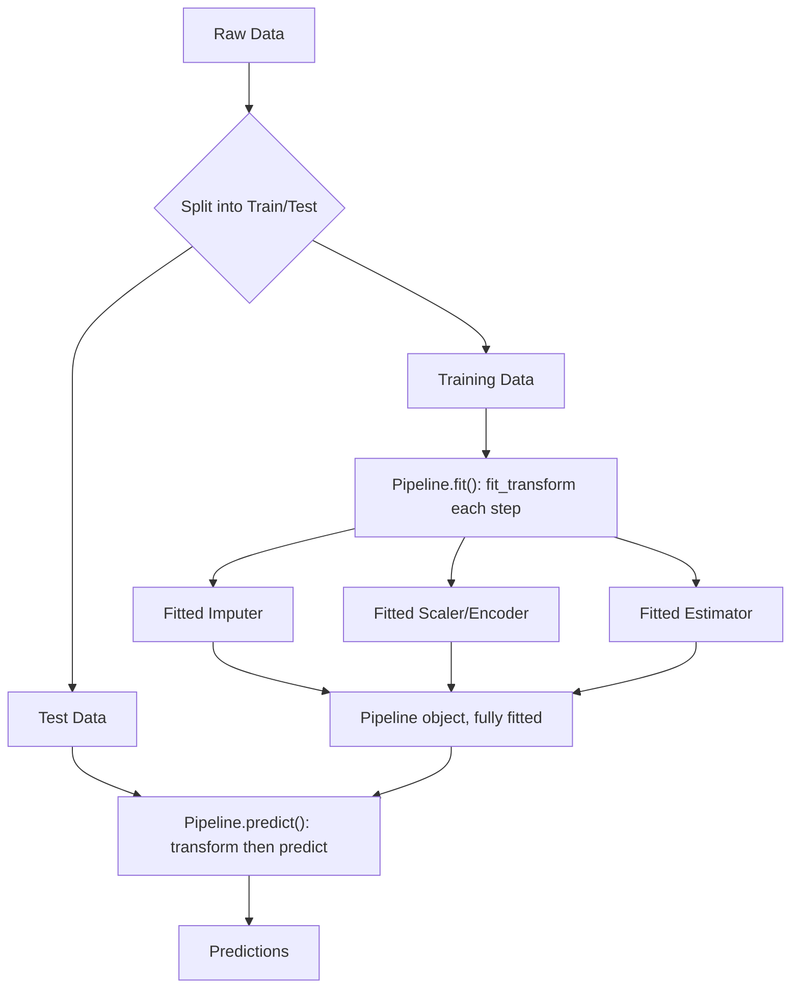

## Using Pipeline Objects in Common ML Libraries

### Purpose of Pipeline Abstractions

Pipeline objects bundle a sequence of data transformations and a final estimator into a single object with a unified interface (typically `fit`, `transform`, `predict`). This addresses several recurring problems in preprocessing workflows:

- **Data leakage prevention during cross-validation**: without a pipeline, it is easy to accidentally fit a scaler or imputer on the full dataset (including validation folds) before splitting, which leaks information from validation/test data into training statistics.
- **Reproducibility**: the exact sequence of transformations is stored as a single object, rather than as loose script steps that can drift out of order.
- **Simplified deployment**: one object can be serialized and loaded for inference, instead of tracking multiple fitted transformers separately.
- **Cleaner hyperparameter search**: pipeline steps can be tuned jointly (e.g., grid search over both an imputer strategy and a model's regularization strength) using a single parameter grid.

**Key Points**
- A pipeline enforces that `fit` is called only on training data, and `transform`/`predict` reuse those fitted parameters on new data.
- Pipelines compose transformers (objects with `fit`/`transform`) and, optionally, one final estimator (an object with `fit`/`predict`).
- Behavior details (exact method signatures, supported step types, error messages) are library- and version-specific. [Unverified] — verify against the installed library version's documentation before relying on specific argument names or defaults.

---

### scikit-learn: `Pipeline` and `ColumnTransformer`

scikit-learn's `sklearn.pipeline.Pipeline` is the most widely used implementation of this pattern.

```python
from sklearn.pipeline import Pipeline
from sklearn.impute import SimpleImputer
from sklearn.preprocessing import StandardScaler
from sklearn.linear_model import LogisticRegression

numeric_pipeline = Pipeline(steps=[
    ("imputer", SimpleImputer(strategy="median")),
    ("scaler", StandardScaler()),
    ("classifier", LogisticRegression())
])

numeric_pipeline.fit(X_train, y_train)
predictions = numeric_pipeline.predict(X_test)
```

Each step is a `(name, transformer)` tuple. Calling `.fit()` on the pipeline calls `.fit_transform()` sequentially on every step except the last, and `.fit()` on the last step. Calling `.predict()` calls `.transform()` on every step except the last, then `.predict()` on the last step.

**Handling mixed column types with `ColumnTransformer`**

Real-world tabular data usually mixes numeric and categorical columns that need different treatment. `sklearn.compose.ColumnTransformer` routes specific columns to specific transformers, and is itself often nested inside a `Pipeline`.

```python
from sklearn.compose import ColumnTransformer
from sklearn.preprocessing import OneHotEncoder

numeric_features = ["age", "income"]
categorical_features = ["occupation", "region"]

numeric_transformer = Pipeline(steps=[
    ("imputer", SimpleImputer(strategy="median")),
    ("scaler", StandardScaler())
])

categorical_transformer = Pipeline(steps=[
    ("imputer", SimpleImputer(strategy="most_frequent")),
    ("onehot", OneHotEncoder(handle_unknown="ignore"))
])

preprocessor = ColumnTransformer(transformers=[
    ("num", numeric_transformer, numeric_features),
    ("cat", categorical_transformer, categorical_features)
])

full_pipeline = Pipeline(steps=[
    ("preprocessing", preprocessor),
    ("classifier", LogisticRegression(max_iter=1000))
])
```

`handle_unknown="ignore"` in `OneHotEncoder` causes unseen categories at inference time to be encoded as all-zeros rather than raising an error. This is documented, standard behavior for that argument in scikit-learn.

**Using `Pipeline` inside cross-validation**

```python
from sklearn.model_selection import cross_val_score

scores = cross_val_score(full_pipeline, X_train, y_train, cv=5, scoring="accuracy")
```

Because the entire preprocessing-plus-model sequence is wrapped in one pipeline object, each cross-validation fold refits the imputer, scaler, and encoder independently on that fold's training portion. This is the mechanism scikit-learn's documentation describes for avoiding leakage in this context; whether it fully addresses leakage in a specific project still depends on how the pipeline is constructed and used. [Inference]

**Accessing intermediate steps**

```python
fitted_scaler = full_pipeline.named_steps["preprocessing"].named_transformers_["num"].named_steps["scaler"]
print(fitted_scaler.mean_)
```

Step access patterns (`named_steps`, `named_transformers_`) are part of scikit-learn's public API as of commonly used recent versions. Exact attribute names have changed across scikit-learn's history, so version-specific documentation should be checked if using an older or newer release. [Unverified]

---

### TensorFlow / Keras: `tf.data` and Preprocessing Layers

TensorFlow does not use a single unified "Pipeline" class in the scikit-learn sense. Instead, preprocessing is typically composed from two complementary mechanisms:

1. **`tf.data.Dataset` pipelines** for I/O, batching, shuffling, and on-the-fly transformation of data during training.
2. **Keras preprocessing layers** (e.g., `tf.keras.layers.Normalization`, `StringLookup`, `CategoryEncoding`) which can be embedded directly inside a model so that preprocessing logic travels with the saved model.

```python
import tensorflow as tf

normalizer = tf.keras.layers.Normalization(axis=-1)
normalizer.adapt(X_train_numeric)  # computes mean/variance from training data

model = tf.keras.Sequential([
    normalizer,
    tf.keras.layers.Dense(64, activation="relu"),
    tf.keras.layers.Dense(1)
])
```

`adapt()` computes the layer's internal statistics (mean and variance, for `Normalization`) from the provided data, analogous to `fit()` in scikit-learn. Embedding the preprocessing layer inside the model means the same computation graph is applied consistently at both training and inference time, including after the model is exported.

A `tf.data.Dataset` pipeline is often used alongside this for batching and mapping functions over records:

```python
dataset = tf.data.Dataset.from_tensor_slices((X_train, y_train))
dataset = dataset.shuffle(buffer_size=1000).batch(32).map(
    lambda x, y: (normalizer(x), y)
).prefetch(tf.data.AUTOTUNE)
```

**Key Points**
- `tf.data.Dataset` pipelines primarily manage data flow (batching, shuffling, prefetching) and can apply arbitrary transformation functions via `.map()`.
- Keras preprocessing layers primarily manage stateful transformations (normalization, vocabulary lookup) that need to be learned from data and reused at inference.
- Because these are two separate mechanisms rather than one pipeline object, keeping them synchronized (e.g., ensuring `.adapt()` is called only on training data) is the developer's responsibility rather than something enforced automatically. [Inference]

---

### PyTorch: `transforms.Compose` and `Dataset`/`DataLoader`

PyTorch, particularly `torchvision`, uses `transforms.Compose` to chain a sequence of transformation callables, most commonly for image data.

```python
from torchvision import transforms

transform_pipeline = transforms.Compose([
    transforms.Resize((224, 224)),
    transforms.ToTensor(),
    transforms.Normalize(mean=[0.485, 0.456, 0.406],
                          std=[0.229, 0.224, 0.225])
])
```

`transforms.Compose` differs structurally from scikit-learn's `Pipeline`: it does not implement `fit`/`transform` in the same stateful sense. Each transform in the list is applied in order via `__call__`, and any statistics used (such as the `mean`/`std` in `Normalize` above) must be supplied by the user rather than learned automatically from the dataset by the `Compose` object itself.

```python
from torch.utils.data import Dataset, DataLoader

class CustomImageDataset(Dataset):
    def __init__(self, image_paths, labels, transform=None):
        self.image_paths = image_paths
        self.labels = labels
        self.transform = transform

    def __len__(self):
        return len(self.image_paths)

    def __getitem__(self, idx):
        image = load_image(self.image_paths[idx])
        if self.transform:
            image = self.transform(image)
        return image, self.labels[idx]

dataset = CustomImageDataset(paths, labels, transform=transform_pipeline)
loader = DataLoader(dataset, batch_size=32, shuffle=True)
```

For tabular data preprocessing that requires learned statistics (e.g., mean/std normalization computed from a training set), PyTorch does not provide a built-in scikit-learn-style stateful pipeline object. A common approach is to compute statistics separately (often using NumPy or scikit-learn) and then pass them into a custom `transforms.Normalize`-style callable, or to use scikit-learn's `Pipeline` for the preprocessing stage and PyTorch only for the model itself. [Inference] — this reflects common practice patterns rather than a single documented "correct" approach, since PyTorch does not prescribe one.

---

### Comparing the Three Approaches

| Aspect | scikit-learn `Pipeline` | TensorFlow/Keras | PyTorch |
|---|---|---|---|
| Stateful fitting of preprocessing steps | Yes, via `.fit()` | Yes, via `.adapt()` on preprocessing layers | Not built-in; typically handled externally |
| Single object for full pipeline (preprocessing + model) | Yes | Partially (layers can be embedded in model) | No unified object; `Compose` handles only transforms |
| Primary use case | Tabular/general-purpose ML | Deep learning, especially with layers embedded in exported models | Deep learning, especially image/text pipelines via `Dataset`/`DataLoader` |
| Built-in cross-validation integration | Yes (`cross_val_score`, `GridSearchCV`) | Not built-in in the same form | Not built-in in the same form |

This comparison reflects the general design philosophy of each library as commonly documented. Specific capabilities may have expanded in recent releases; checking current version documentation is advisable before treating this table as exhaustive. [Unverified]

---

### Common Pitfalls

- **Fitting transformers before splitting data**: calling `.fit()` or `.fit_transform()` on the full dataset before a train/test split causes information from the test set to influence preprocessing statistics (e.g., scaler mean/variance), which is a form of data leakage.
- **Refitting on validation/test data at inference time**: calling `.fit_transform()` instead of `.transform()` on new data recomputes statistics from that new data rather than reusing training-derived statistics, which produces inconsistent transformations between training and inference.
- **Mismatched column order between training and inference data**: transformers that operate positionally (rather than by column name) can silently apply the wrong transformation to the wrong column if the input DataFrame's column order changes.
- **Not persisting the fitted pipeline object**: retraining preprocessing steps from scratch at inference time (rather than loading fitted parameters) can produce different results than what the model was trained on, particularly if the available data distribution has shifted.

---

### Pipeline Data Flow (svg_diagram)

<svg xmlns="http://www.w3.org/2000/svg" viewBox="0 0 820 300">
  <text x="410" y="24" font-size="16" font-weight="bold" text-anchor="middle" fill="#222">Pipeline Data Flow (svg_diagram)</text>

  <rect x="20" y="70" width="130" height="60" rx="6" fill="#e8f0fe" stroke="#4a6fa5" />
  <text x="85" y="95" font-size="12" text-anchor="middle" fill="#222">Raw Training</text>
  <text x="85" y="112" font-size="12" text-anchor="middle" fill="#222">Data (X_train)</text>

  <rect x="200" y="70" width="150" height="60" rx="6" fill="#fdf3d9" stroke="#b8912f" />
  <text x="275" y="95" font-size="12" text-anchor="middle" fill="#222">Imputer</text>
  <text x="275" y="112" font-size="11" text-anchor="middle" fill="#555">.fit_transform()</text>

  <rect x="400" y="70" width="150" height="60" rx="6" fill="#fdf3d9" stroke="#b8912f" />
  <text x="475" y="95" font-size="12" text-anchor="middle" fill="#222">Scaler / Encoder</text>
  <text x="475" y="112" font-size="11" text-anchor="middle" fill="#555">.fit_transform()</text>

  <rect x="600" y="70" width="180" height="60" rx="6" fill="#e6f4ea" stroke="#3d8b52" />
  <text x="690" y="95" font-size="12" text-anchor="middle" fill="#222">Estimator</text>
  <text x="690" y="112" font-size="11" text-anchor="middle" fill="#555">.fit()</text>

  <line x1="150" y1="100" x2="196" y2="100" stroke="#555" stroke-width="1.5" marker-end="url(#arrow)" />
  <line x1="350" y1="100" x2="396" y2="100" stroke="#555" stroke-width="1.5" marker-end="url(#arrow)" />
  <line x1="550" y1="100" x2="596" y2="100" stroke="#555" stroke-width="1.5" marker-end="url(#arrow)" />

  <rect x="20" y="200" width="130" height="60" rx="6" fill="#fde8e8" stroke="#a54a4a" />
  <text x="85" y="225" font-size="12" text-anchor="middle" fill="#222">New / Test</text>
  <text x="85" y="242" font-size="12" text-anchor="middle" fill="#222">Data (X_test)</text>

  <rect x="200" y="200" width="150" height="60" rx="6" fill="#fdf3d9" stroke="#b8912f" />
  <text x="275" y="225" font-size="12" text-anchor="middle" fill="#222">Imputer</text>
  <text x="275" y="242" font-size="11" text-anchor="middle" fill="#555">.transform() only</text>

  <rect x="400" y="200" width="150" height="60" rx="6" fill="#fdf3d9" stroke="#b8912f" />
  <text x="475" y="225" font-size="12" text-anchor="middle" fill="#222">Scaler / Encoder</text>
  <text x="475" y="242" font-size="11" text-anchor="middle" fill="#555">.transform() only</text>

  <rect x="600" y="200" width="180" height="60" rx="6" fill="#e6f4ea" stroke="#3d8b52" />
  <text x="690" y="225" font-size="12" text-anchor="middle" fill="#222">Estimator</text>
  <text x="690" y="242" font-size="11" text-anchor="middle" fill="#555">.predict()</text>

  <line x1="150" y1="230" x2="196" y2="230" stroke="#555" stroke-width="1.5" marker-end="url(#arrow)" />
  <line x1="350" y1="230" x2="396" y2="230" stroke="#555" stroke-width="1.5" marker-end="url(#arrow)" />
  <line x1="550" y1="230" x2="596" y2="230" stroke="#555" stroke-width="1.5" marker-end="url(#arrow)" />

  <line x1="275" y1="130" x2="275" y2="196" stroke="#999" stroke-width="1" stroke-dasharray="4,3" />
  <text x="285" y="165" font-size="10" fill="#777">reuses fitted params</text>
  <line x1="475" y1="130" x2="475" y2="196" stroke="#999" stroke-width="1" stroke-dasharray="4,3" />
</svg>

---

### Pipeline Construction and Fitting Sequence



---

### Related Topics

- Custom transformers in scikit-learn using `BaseEstimator` and `TransformerMixin`
- Persisting fitted pipelines with `joblib` or `pickle`, and associated version-compatibility risks
- Hyperparameter tuning across pipeline steps with `GridSearchCV` and `RandomizedSearchCV`
- Handling target leakage versus feature leakage in pipeline design
- Feature engineering pipelines for time-series data (where standard shuffling/cross-validation assumptions do not hold)
- Deploying scikit-learn pipelines behind an inference API
- Differences between `Pipeline` and `make_pipeline` in scikit-learn
- Preprocessing pipeline design for streaming or online learning contexts