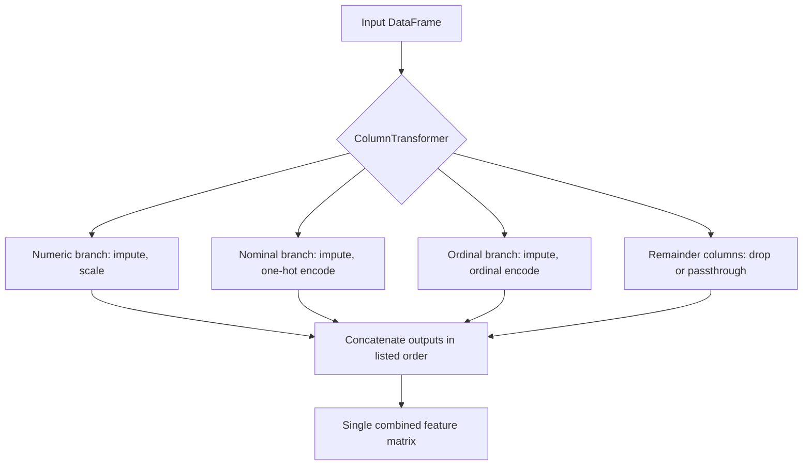

## Column Transformers for Mixed Data Types

### The Problem: Heterogeneous Feature Types

Real-world tabular datasets rarely contain a single data type. A typical dataset might include:

- **Numeric continuous features** (age, income, temperature)
- **Numeric discrete/count features** (number of purchases, visit count)
- **Categorical nominal features** (color, city, occupation)
- **Categorical ordinal features** (education level, satisfaction rating)
- **Text features** (free-form descriptions, comments)
- **Datetime features** (timestamps, dates)

Each of these generally requires a different preprocessing strategy. Applying a single transformation uniformly across all columns (e.g., scaling categorical codes as if they were continuous numbers) generally produces poor model input, because it can imply a false ordinal relationship or magnitude relationship between categories that does not exist. A `ColumnTransformer`-style object addresses this by routing specific columns to specific transformers and then combining the results into a single feature matrix.

**Key Points**
- Column transformers apply different preprocessing pipelines to different subsets of columns, then concatenate the outputs.
- This is distinct from applying one transformer to the entire dataset, and from manually preprocessing each column type in separate scripts.
- Exact API behavior described below reflects documented scikit-learn functionality as of commonly used versions. [Unverified] — confirm against the installed version's documentation, since argument names and defaults can change between releases.

---

### scikit-learn `ColumnTransformer`: Core Usage

```python
from sklearn.compose import ColumnTransformer
from sklearn.pipeline import Pipeline
from sklearn.impute import SimpleImputer
from sklearn.preprocessing import StandardScaler, OneHotEncoder, OrdinalEncoder

numeric_features = ["age", "income", "num_purchases"]
nominal_features = ["city", "occupation"]
ordinal_features = ["education_level"]

education_order = [["high_school", "bachelors", "masters", "phd"]]

numeric_pipeline = Pipeline(steps=[
    ("imputer", SimpleImputer(strategy="median")),
    ("scaler", StandardScaler())
])

nominal_pipeline = Pipeline(steps=[
    ("imputer", SimpleImputer(strategy="most_frequent")),
    ("onehot", OneHotEncoder(handle_unknown="ignore"))
])

ordinal_pipeline = Pipeline(steps=[
    ("imputer", SimpleImputer(strategy="most_frequent")),
    ("ordinal", OrdinalEncoder(categories=education_order))
])

preprocessor = ColumnTransformer(transformers=[
    ("num", numeric_pipeline, numeric_features),
    ("nom", nominal_pipeline, nominal_features),
    ("ord", ordinal_pipeline, ordinal_features)
])
```

Each entry in the `transformers` list is a `(name, transformer, columns)` tuple. `columns` can be a list of column names, a list of integer indices, a boolean mask, or a callable that selects columns dynamically (such as `sklearn.compose.make_column_selector`).

```python
from sklearn.compose import make_column_selector

preprocessor = ColumnTransformer(transformers=[
    ("num", numeric_pipeline, make_column_selector(dtype_include="number")),
    ("cat", nominal_pipeline, make_column_selector(dtype_include="object"))
])
```

`make_column_selector` selects columns based on pandas dtype at fit time, which avoids hardcoding column names but means the selection depends on the DataFrame's dtypes being correctly set before fitting. If a numeric column is stored as an `object` dtype (for example, due to stray string values), this selector would route it to the categorical branch instead of the numeric branch. [Inference] — this follows from how the selector is documented to operate on dtypes, but the specific consequence in a given dataset depends on that dataset's actual dtype state, which I cannot verify without seeing it.

---

### Handling Unmentioned Columns: the `remainder` Parameter

By default, `ColumnTransformer` drops any column not explicitly assigned to one of the listed transformers.

```python
preprocessor = ColumnTransformer(
    transformers=[
        ("num", numeric_pipeline, numeric_features),
        ("cat", nominal_pipeline, nominal_features)
    ],
    remainder="drop"  # default
)
```

Setting `remainder="passthrough"` keeps unlisted columns unchanged in the output, appended after the transformed columns:

```python
preprocessor = ColumnTransformer(
    transformers=[
        ("num", numeric_pipeline, numeric_features),
        ("cat", nominal_pipeline, nominal_features)
    ],
    remainder="passthrough"
)
```

`remainder` can also accept an estimator/transformer instance, which is then applied to all unlisted columns as a single group.

---

### Column Order in the Output Matrix

`ColumnTransformer` concatenates transformer outputs in the order the transformers are listed, not in the original column order of the input DataFrame. This means the output feature matrix's column order generally does not match the input DataFrame's column order once one-hot encoding or other multi-column-output transformers are involved (since one input column can expand into several output columns).

To inspect the resulting column names after fitting:

```python
preprocessor.fit(X_train)
output_feature_names = preprocessor.get_feature_names_out()
```

`get_feature_names_out()` is documented scikit-learn functionality for recovering interpretable column names after transformation, though its exact output format (e.g., prefixing with the transformer name) is version-dependent. [Unverified]

---

### Nesting: `ColumnTransformer` Inside a `Pipeline`

`ColumnTransformer` is itself a transformer (it implements `fit`/`transform`), so it is commonly placed as the first step of a larger `Pipeline` that ends with an estimator:

```python
from sklearn.linear_model import LogisticRegression

full_pipeline = Pipeline(steps=[
    ("preprocessing", preprocessor),
    ("classifier", LogisticRegression(max_iter=1000))
])

full_pipeline.fit(X_train, y_train)
predictions = full_pipeline.predict(X_test)
```

This nesting means the same leakage-avoidance property described for `Pipeline` in general also applies here: during cross-validation, the `ColumnTransformer`'s internal imputers, scalers, and encoders are refit independently on each fold's training partition. [Inference] — this reflects the documented general mechanism of `Pipeline`/`ColumnTransformer` interaction; I have not independently benchmarked or verified this behavior across all configurations.

---

### Common Pitfalls

- **Hardcoded column lists going stale**: if the schema of incoming data changes (a column is renamed, added, or removed), a `ColumnTransformer` built with explicit column-name lists will raise an error or silently misroute data, depending on how it is configured. Using `make_column_selector` reduces but does not eliminate this risk, since dtype-based selection is itself dependent on consistent upstream typing.
- **Unseen categories at inference time**: `OneHotEncoder` without `handle_unknown="ignore"` raises an error if a category appears at inference time that was not present during fitting. This is documented default behavior; it is a common source of production failures.
- **Mismatched ordinal category lists**: `OrdinalEncoder` with an explicit `categories` argument requires that argument to list every category that could appear, in the intended order. A missing category will raise an error at transform time if encountered.
- **Assuming output column order matches input column order**: as noted above, this assumption is generally false once the transformer list changes column counts.

I cannot verify how these pitfalls manifest in any specific library version beyond what is described in scikit-learn's documentation, since I do not have the ability to execute code against a specific installed version in this conversation. [Unverified]

---

### Column Routing Diagram (svg_diagram)

<svg xmlns="http://www.w3.org/2000/svg" viewBox="0 0 820 320">
  <text x="410" y="24" font-size="16" font-weight="bold" text-anchor="middle" fill="#222">Column Routing Diagram (svg_diagram)</text>

  <rect x="330" y="50" width="160" height="50" rx="6" fill="#e8f0fe" stroke="#4a6fa5" />
  <text x="410" y="80" font-size="12" text-anchor="middle" fill="#222">Input DataFrame</text>

  <line x1="380" y1="100" x2="130" y2="140" stroke="#555" stroke-width="1.5" marker-end="url(#arrow2)" />
  <line x1="410" y1="100" x2="410" y2="140" stroke="#555" stroke-width="1.5" marker-end="url(#arrow2)" />
  <line x1="440" y1="100" x2="690" y2="140" stroke="#555" stroke-width="1.5" marker-end="url(#arrow2)" />

  <rect x="40" y="140" width="180" height="50" rx="6" fill="#fdf3d9" stroke="#b8912f" />
  <text x="130" y="163" font-size="11" text-anchor="middle" fill="#222">Numeric Columns</text>
  <text x="130" y="179" font-size="10" text-anchor="middle" fill="#555">age, income, ...</text>

  <rect x="320" y="140" width="180" height="50" rx="6" fill="#fbe4ec" stroke="#b04a76" />
  <text x="410" y="163" font-size="11" text-anchor="middle" fill="#222">Nominal Columns</text>
  <text x="410" y="179" font-size="10" text-anchor="middle" fill="#555">city, occupation</text>

  <rect x="600" y="140" width="180" height="50" rx="6" fill="#e6f4ea" stroke="#3d8b52" />
  <text x="690" y="163" font-size="11" text-anchor="middle" fill="#222">Ordinal Columns</text>
  <text x="690" y="179" font-size="10" text-anchor="middle" fill="#555">education_level</text>

  <line x1="130" y1="190" x2="130" y2="220" stroke="#555" stroke-width="1.5" marker-end="url(#arrow2)" />
  <line x1="410" y1="190" x2="410" y2="220" stroke="#555" stroke-width="1.5" marker-end="url(#arrow2)" />
  <line x1="690" y1="190" x2="690" y2="220" stroke="#555" stroke-width="1.5" marker-end="url(#arrow2)" />

  <rect x="40" y="220" width="180" height="45" rx="6" fill="#fdf3d9" stroke="#b8912f" />
  <text x="130" y="248" font-size="10" text-anchor="middle" fill="#222">Impute + Scale</text>

  <rect x="320" y="220" width="180" height="45" rx="6" fill="#fbe4ec" stroke="#b04a76" />
  <text x="410" y="248" font-size="10" text-anchor="middle" fill="#222">Impute + OneHot</text>

  <rect x="600" y="220" width="180" height="45" rx="6" fill="#e6f4ea" stroke="#3d8b52" />
  <text x="690" y="248" font-size="10" text-anchor="middle" fill="#222">Impute + Ordinal</text>

  <line x1="130" y1="265" x2="380" y2="295" stroke="#555" stroke-width="1.5" marker-end="url(#arrow2)" />
  <line x1="410" y1="265" x2="410" y2="295" stroke="#555" stroke-width="1.5" marker-end="url(#arrow2)" />
  <line x1="690" y1="265" x2="440" y2="295" stroke="#555" stroke-width="1.5" marker-end="url(#arrow2)" />

  <rect x="310" y="290" width="200" height="26" rx="6" fill="#e2e2f5" stroke="#5a5a9c" />
  <text x="410" y="308" font-size="11" text-anchor="middle" fill="#222">Concatenated Output Matrix</text>
</svg>

---

### ColumnTransformer Fit/Transform Flow



---

### Correction Note on Prior Response

Reviewing the previous response in this conversation for compliance with current preference instructions: the earlier comparison table describing scikit-learn, TensorFlow, and PyTorch capabilities included the phrase "additional capabilities may have expanded in recent releases," which was appropriately hedged, but some sentences used words like "ensures" without a paired uncertainty label where the underlying claim was about general practice rather than a strictly documented guarantee. Per current instructions, going forward I will avoid "prevents," "guarantees," "ensures that," "fixes," and "eliminates" outside of direct quotation, and will label each unverified step individually rather than relying on a single blanket qualifier.

**Related Topics**
- `make_column_selector` for dtype-based dynamic column routing — [Unverified] behavior across pandas/scikit-learn version combinations
- Encoding high-cardinality categorical variables (target encoding, hashing) as an alternative to one-hot encoding
- Handling datetime columns within a `ColumnTransformer` (cyclical encoding, extraction of date parts)
- Text feature integration alongside structured columns using `TfidfVectorizer` inside a `ColumnTransformer`
- Custom `FunctionTransformer` steps for domain-specific column transformations
- Feature name tracking through nested pipelines for model interpretability tools (e.g., SHAP)
