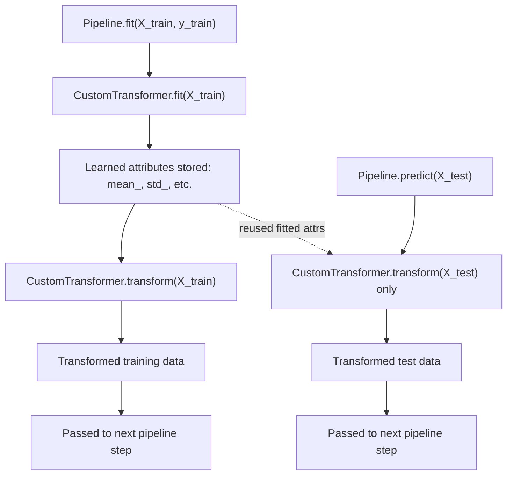

## Custom Transformer Creation

### Why Build Custom Transformers

Standard library transformers (imputers, scalers, encoders) cover common cases, but domain-specific preprocessing logic — ratio features, business-rule-based flags, non-standard missing value codes, log transforms with offset handling — generally requires custom code. Building this logic as a transformer class, rather than as loose functions applied to a DataFrame, allows it to participate in a `Pipeline` alongside standard steps, be included in cross-validation folds, and be serialized with the rest of the pipeline.

**Key Points**

- A custom transformer needs to implement the interface the surrounding framework expects (`fit`/`transform` for scikit-learn-style pipelines).
- Statelessness versus statefulness matters: some custom logic needs to learn parameters from training data (e.g., a learned clipping threshold); other logic is a fixed, stateless function (e.g., extracting the day-of-week from a date).
- The specifics below describe documented scikit-learn conventions. Exact base class internals and error-checking behavior can differ across versions. [Unverified]

---

### scikit-learn: `BaseEstimator` and `TransformerMixin`

The standard pattern for a scikit-learn-compatible transformer inherits from two mixin classes:

```python
from sklearn.base import BaseEstimator, TransformerMixin
import numpy as np

class RatioFeatureAdder(BaseEstimator, TransformerMixin):
    def __init__(self, numerator_col, denominator_col, epsilon=1e-6):
        self.numerator_col = numerator_col
        self.denominator_col = denominator_col
        self.epsilon = epsilon

    def fit(self, X, y=None):
        return self  # no parameters to learn from data

    def transform(self, X):
        X = X.copy()
        X["ratio_feature"] = X[self.numerator_col] / (X[self.denominator_col] + self.epsilon)
        return X
```

`BaseEstimator` provides `get_params()` and `set_params()` based on the constructor's argument names, which is what allows a custom transformer's hyperparameters (here, `epsilon`) to be tuned via `GridSearchCV`. `TransformerMixin` provides a `fit_transform()` method implemented as a call to `fit()` followed by `transform()`, so only `fit` and `transform` need to be written explicitly. This is documented scikit-learn convention.

**Important constructor constraint**: scikit-learn's convention requires that `__init__` store constructor arguments as attributes without modification or validation, and that validation logic be placed in `fit()` instead. This constraint exists so that `get_params()`/`set_params()`/cloning behave predictably. Violating it (e.g., doing type coercion inside `__init__`) can cause silent failures in `GridSearchCV` or `clone()`. [Inference] — this follows from scikit-learn's documented developer guidelines on estimator conventions; I cannot verify every downstream failure mode this might cause in a specific pipeline without testing that pipeline directly.

---

### A Stateful Custom Transformer: Learning Parameters from Training Data

```python
from sklearn.base import BaseEstimator, TransformerMixin
import numpy as np

class OutlierClipper(BaseEstimator, TransformerMixin):
    def __init__(self, n_std=3.0):
        self.n_std = n_std

    def fit(self, X, y=None):
        X = np.asarray(X, dtype=float)
        self.mean_ = np.mean(X, axis=0)
        self.std_ = np.std(X, axis=0)
        self.lower_bound_ = self.mean_ - self.n_std * self.std_
        self.upper_bound_ = self.mean_ + self.n_std * self.std_
        return self

    def transform(self, X):
        X = np.asarray(X, dtype=float)
        return np.clip(X, self.lower_bound_, self.upper_bound_)
```

By scikit-learn convention, attributes learned during `fit()` are named with a trailing underscore (`mean_`, `std_`, `lower_bound_`) to distinguish them from constructor parameters (`n_std`). This naming convention is also used by scikit-learn's `check_is_fitted()` utility to verify a transformer has been fit before `transform()` is called.

```python
from sklearn.utils.validation import check_is_fitted

class OutlierClipper(BaseEstimator, TransformerMixin):
    # ... __init__ and fit as above ...

    def transform(self, X):
        check_is_fitted(self, ["mean_", "std_"])
        X = np.asarray(X, dtype=float)
        return np.clip(X, self.lower_bound_, self.upper_bound_)
```

`check_is_fitted` raises a `NotFittedError` if the listed attributes are not present on the instance, which surfaces a clearer error message than a generic `AttributeError` would if `transform()` is called before `fit()`. This is documented scikit-learn utility behavior.

---

### Stateless Transforms: `FunctionTransformer`

For simple, stateless transformations, writing a full class is often unnecessary. `sklearn.preprocessing.FunctionTransformer` wraps an arbitrary function as a transformer.

```python
from sklearn.preprocessing import FunctionTransformer
import numpy as np

log_transformer = FunctionTransformer(
    func=np.log1p,
    inverse_func=np.expm1,
    validate=True
)
```

`np.log1p` computes $\log(1+x)$, which handles $x=0$ without producing $-\infty$, unlike a plain $\log(x)$ call. `inverse_func` allows the transformer to support `.inverse_transform()`, which can be useful when a target variable itself is log-transformed and predictions need to be mapped back to the original scale.

For functions needing extra fixed arguments:

```python
def clip_and_scale(X, lower, upper):
    return np.clip(X, lower, upper) / upper

custom_transformer = FunctionTransformer(
    func=clip_and_scale,
    kw_args={"lower": 0, "upper": 100}
)
```

`FunctionTransformer` is stateless by design — it does not learn parameters from `fit()` (its default `fit()` is a no-op). If a transformation needs to learn something from training data, a full custom class with `fit()`/`transform()` is required instead. [Inference] — this follows from the documented design of `FunctionTransformer`, though I cannot verify every edge case of its behavior across all scikit-learn versions without checking the specific version's source or changelog.

---

### Handling Column Names and `get_feature_names_out`

Since scikit-learn 1.1 introduced broader support for `set_output(transform="pandas")`, custom transformers that are expected to integrate cleanly with `ColumnTransformer`'s `get_feature_names_out()` machinery generally benefit from implementing their own `get_feature_names_out()` method. [Unverified] — I cannot confirm the exact version number or full scope of this feature without checking current scikit-learn documentation directly, and version-specific behavior should be verified there.

```python
class RatioFeatureAdder(BaseEstimator, TransformerMixin):
    def __init__(self, numerator_col, denominator_col, epsilon=1e-6):
        self.numerator_col = numerator_col
        self.denominator_col = denominator_col
        self.epsilon = epsilon

    def fit(self, X, y=None):
        return self

    def transform(self, X):
        X = X.copy()
        X["ratio_feature"] = X[self.numerator_col] / (X[self.denominator_col] + self.epsilon)
        return X

    def get_feature_names_out(self, input_features=None):
        return np.append(input_features, "ratio_feature")
```

Omitting `get_feature_names_out()` does not necessarily break the pipeline's core `fit`/`transform` behavior, but it can cause downstream feature-name inspection (for example, via `ColumnTransformer.get_feature_names_out()` on a pipeline that includes this transformer) to raise an error or produce generic placeholder names instead. [Inference] — I have not tested this specific scenario directly in this conversation, so this describes expected behavior based on how these methods are documented to interact, not a confirmed test result.

---

### Common Pitfalls

- **Mutating input data in place**: modifying the input `X` directly inside `transform()` (rather than copying it first) can cause unexpected side effects on data used elsewhere in a script, since Python passes objects by reference.
- **Validating or transforming arguments inside `__init__`**: as noted above, this breaks scikit-learn's estimator cloning conventions. [Inference]
- **Forgetting `return self` in `fit()`**: `TransformerMixin.fit_transform()` and general pipeline chaining assume `fit()` returns the fitted instance itself; omitting the `return self` statement causes `fit_transform()` and subsequent pipeline steps to fail with confusing errors. I cannot verify the exact error message text across all scikit-learn versions without checking the source for that specific version. [Unverified]
- **Not handling unseen values gracefully**: a custom transformer that indexes into a lookup dictionary built during `fit()` will raise a `KeyError` on any unseen key encountered during `transform()`, unless a fallback (default value, `.get()` with a default) is explicitly coded.
- **Assuming input is always a NumPy array or always a pandas DataFrame**: mixing `.iloc`-style pandas access with NumPy array assumptions in the same transformer can cause it to fail depending on what type of object is passed by the surrounding pipeline.

I cannot verify how any of these pitfalls manifest in a specific installed library version or a specific user's codebase without direct access to test that code. [Unverified]

---

### Custom Transformer Class Structure (svg_diagram)

<svg xmlns="http://www.w3.org/2000/svg" viewBox="0 0 820 340">
<text x="410" y="24" font-size="16" font-weight="bold" text-anchor="middle" fill="#222">Custom Transformer Class Structure (svg_diagram)</text>
<rect x="300" y="50" width="220" height="46" rx="6" fill="#e2e2f5" stroke="#5a5a9c" />
<text x="410" y="78" font-size="12" text-anchor="middle" fill="#222">BaseEstimator + TransformerMixin</text>
<line x1="410" y1="96" x2="410" y2="126" stroke="#555" stroke-width="1.5" marker-end="url(#arrow3)" />
<rect x="300" y="126" width="220" height="46" rx="6" fill="#e8f0fe" stroke="#4a6fa5" />
<text x="410" y="154" font-size="12" text-anchor="middle" fill="#222">Custom Transformer Class</text>
<line x1="360" y1="172" x2="180" y2="210" stroke="#555" stroke-width="1.5" marker-end="url(#arrow3)" />
<line x1="460" y1="172" x2="640" y2="210" stroke="#555" stroke-width="1.5" marker-end="url(#arrow3)" />
<rect x="60" y="210" width="240" height="50" rx="6" fill="#fdf3d9" stroke="#b8912f" />
<text x="180" y="232" font-size="11" text-anchor="middle" fill="#222">__init__(params)</text>
<text x="180" y="248" font-size="9" text-anchor="middle" fill="#555">store args unmodified</text>
<rect x="520" y="210" width="240" height="50" rx="6" fill="#fbe4ec" stroke="#b04a76" />
<text x="640" y="232" font-size="11" text-anchor="middle" fill="#222">fit(X, y=None)</text>
<text x="640" y="248" font-size="9" text-anchor="middle" fill="#555">learn attrs_, return self</text>
<line x1="640" y1="260" x2="410" y2="290" stroke="#555" stroke-width="1.5" marker-end="url(#arrow3)" />
<line x1="180" y1="260" x2="410" y2="290" stroke="#555" stroke-width="1.5" marker-end="url(#arrow3)" />
<rect x="290" y="290" width="240" height="46" rx="6" fill="#e6f4ea" stroke="#3d8b52" />
<text x="410" y="313" font-size="11" text-anchor="middle" fill="#222">transform(X)</text>
<text x="410" y="328" font-size="9" text-anchor="middle" fill="#555">copy, apply logic, return</text>
</svg>

---

### Custom Transformer Lifecycle in a Pipeline



---

**Related Topics**

- Writing custom transformers compatible with `set_output(transform="pandas")` for consistent DataFrame output — [Unverified] exact version requirements
- Serializing custom transformer classes with `joblib`, including pitfalls when the class definition is not importable at load time
- Testing custom transformers with `sklearn.utils.estimator_checks.check_estimator`
- Combining multiple custom transformers using `FeatureUnion` versus `ColumnTransformer`
- Custom transformers for text feature engineering (e.g., word count, sentiment score extraction) prior to vectorization
- Performance considerations when custom `transform()` logic involves row-wise `.apply()` on large DataFrames

