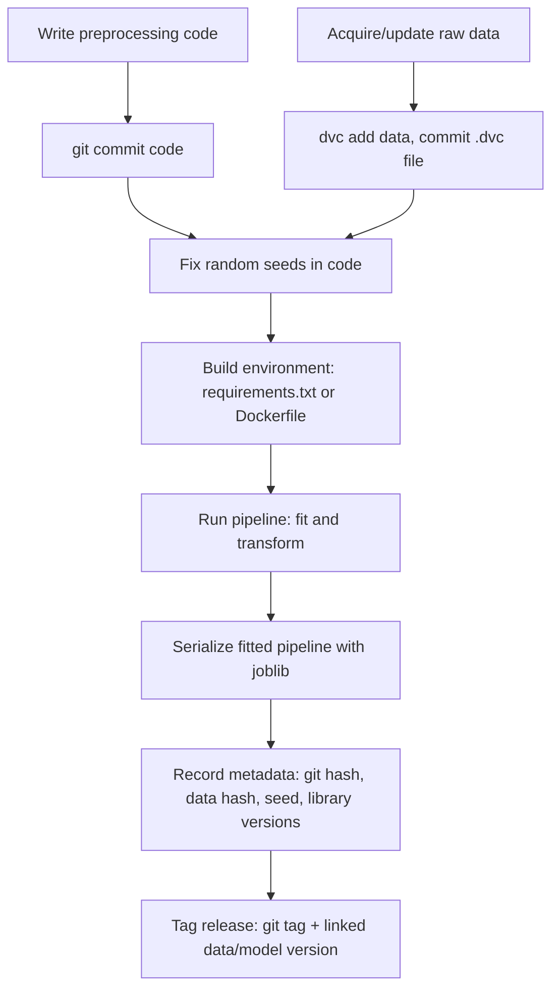

## Reproducibility and Version Control for Pipelines

### Why Reproducibility Is a Distinct Problem

A preprocessing pipeline can run correctly today and produce different results tomorrow even with identical code, because several inputs besides the code itself affect the outcome: the exact version of each library, the random seed used by any stochastic step, the state of external data sources, and the order in which operations execute on non-deterministic hardware (e.g., some GPU-accelerated operations). Reproducibility work aims to pin down each of these so that a pipeline run can be recreated — by the same person later, or by a collaborator — with matching results.

**Key Points**
- Reproducibility spans code, data, environment, and randomness — pinning only one of these is generally insufficient.
- "Version control" in this context includes both source code versioning (git) and artifact/data versioning (dataset and model versioning tools).
- Some claims below about specific tool behavior are well-documented library mechanics; others involve interactions between tools that I have not directly tested in this conversation and are labeled accordingly.

---

### Source Code Versioning with Git

Standard git usage applies to preprocessing code the same way it applies to any other code: commits, branches, and tags provide a history of how the pipeline's logic changed over time.

```bash
git init
git add preprocessing_pipeline.py
git commit -m "Add initial ColumnTransformer-based preprocessing pipeline"
git tag -a v1.0-preprocessing -m "Baseline preprocessing pipeline for model v1"
```

Tagging specific commits that correspond to a trained model or a paper's reported results is a common practice for tying a specific pipeline version to a specific outcome. This is standard git functionality; `git tag` creates a named, fixed reference to a specific commit.

A `requirements.txt` or `pyproject.toml`/lockfile pins the exact library versions used:

```bash
pip freeze > requirements.txt
```

`pip freeze` outputs the exact installed package versions in the current environment. This is documented `pip` behavior. Recreating the environment later with `pip install -r requirements.txt` reinstalls those exact versions, assuming they remain available on the package index. [Inference] — package availability on PyPI over long time horizons is not something I can verify for any specific package, since packages can occasionally be yanked or removed.

---

### Pinning Randomness

Many preprocessing and modeling steps involve randomness: train/test splitting, imputation strategies that break ties randomly, stochastic feature selection, and model training itself.

```python
import numpy as np
import random

SEED = 42
random.seed(SEED)
np.random.seed(SEED)

from sklearn.model_selection import train_test_split
X_train, X_test, y_train, y_test = train_test_split(X, y, test_size=0.2, random_state=SEED)
```

Passing an explicit `random_state` to scikit-learn functions and estimators that accept it is documented scikit-learn practice for making a specific run's random choices reproducible on the same machine, same library versions, and same input data. [Inference] — reproducibility of exact results across different hardware, operating systems, or library versions is not something scikit-learn's documentation guarantees, and I cannot verify this without testing a specific pair of environments directly.

For deep learning frameworks, seeding is more involved because GPU operations can be non-deterministic even with a fixed seed:

```python
import torch

torch.manual_seed(SEED)
torch.cuda.manual_seed_all(SEED)
torch.backends.cudnn.deterministic = True
torch.backends.cudnn.benchmark = False
```

Setting `torch.backends.cudnn.deterministic = True` is documented PyTorch functionality intended to make certain GPU operations produce consistent results across runs, generally at some computational performance cost. Whether this achieves full run-to-run reproducibility depends on the specific operations used, the PyTorch version, and the CUDA/cuDNN version — I cannot verify this holds for any particular combination without testing it directly. [Unverified]

---

### Data Versioning

Git is not well-suited to large binary datasets. Tools built for this purpose include DVC (Data Version Control), Git LFS, and cloud-native dataset versioning features in platforms like MLflow or Weights & Biases.

```bash
dvc init
dvc add data/raw_training_data.csv
git add data/raw_training_data.csv.dvc .gitignore
git commit -m "Track raw training data v1 with DVC"
```

DVC's documented approach stores a small metadata file (the `.dvc` file, containing a hash of the data) in git, while the actual data file is stored separately (locally or in remote storage like S3). This lets a specific git commit be associated with a specific version of a large dataset without storing the full dataset in git history. [Inference] — this describes DVC's documented design; I have not directly executed DVC commands in this conversation to confirm behavior against a specific installed version.

---

### Pipeline Artifact Versioning

Beyond code and raw data, the fitted pipeline object itself (with its learned parameters — imputation values, scaler means, encoder categories) is an artifact worth versioning, since retraining from scratch may not reproduce bit-identical fitted parameters if any upstream randomness or data ordering has changed.

```python
import joblib

joblib.dump(full_pipeline, "pipeline_v1.joblib")
```

`joblib.dump`/`joblib.load` is a commonly used, documented approach for serializing scikit-learn pipeline objects, including their fitted state. A known constraint: loading a serialized pipeline generally requires the same or a compatible version of scikit-learn (and any custom transformer class definitions) to be available in the loading environment, since the serialized object references those class definitions. [Inference] — the exact scope of "compatible version" is not something scikit-learn's documentation specifies precisely across all version pairs, and I cannot verify compatibility for any specific version pair without testing it.

Recording metadata alongside the artifact — library versions, git commit hash, data version hash, random seed — closes the loop between code, data, and output:

```python
import subprocess
import sklearn
import json

metadata = {
    "git_commit": subprocess.check_output(["git", "rev-parse", "HEAD"]).decode().strip(),
    "sklearn_version": sklearn.__version__,
    "random_seed": SEED,
    "data_version_hash": "dvc_hash_here"
}

with open("pipeline_v1_metadata.json", "w") as f:
    json.dump(metadata, f, indent=2)
```

---

### Environment Isolation

Library version pinning in a `requirements.txt` does not account for system-level dependencies (compiled libraries, OS-level packages, Python interpreter version itself). Containerization addresses this broader scope.

```dockerfile
FROM python:3.11-slim

COPY requirements.txt .
RUN pip install --no-cache-dir -r requirements.txt

COPY preprocessing_pipeline.py .
CMD ["python", "preprocessing_pipeline.py"]
```

A Docker image pins the OS base layer, system packages, Python version, and Python package versions together, which is documented Docker functionality for reproducible environments. Whether two runs of the same image produce identical preprocessing output still depends on the factors discussed above (randomness, non-deterministic operations) — containerization addresses the environment dimension specifically, not randomness or data drift. [Inference]

---

### Common Pitfalls

- **Pinning code but not data**: a pipeline's code can be perfectly version-controlled while the underlying data source (a database table, an API response) changes silently between runs, producing different results with no corresponding code change.
- **Assuming `random_state` alone guarantees identical results across machines**: as noted above, this generally holds within a fixed environment but is not something I can verify holds across differing hardware or library versions without direct testing. [Unverified]
- **Forgetting to version the fitted pipeline object itself**: retraining a pipeline from scratch at a later date, even with identical code and data, may not reproduce bit-identical results if any dependency introduced a behavior change between versions.
- **Untracked manual data cleaning steps**: ad hoc edits made directly in a spreadsheet or database before the pipeline runs are a common, easy-to-miss source of irreproducibility, since they leave no trace in the code or commit history.
- **Large files committed directly to git**: this bloats repository size and slows clone/fetch operations; this is a widely documented git limitation, not specific to any one tool.

---

### Reproducibility Components (svg_diagram)

<svg xmlns="http://www.w3.org/2000/svg" viewBox="0 0 820 300">
  <text x="410" y="24" font-size="16" font-weight="bold" text-anchor="middle" fill="#222">Reproducibility Components (svg_diagram)</text>

  <rect x="40" y="60" width="170" height="70" rx="6" fill="#e8f0fe" stroke="#4a6fa5" />
  <text x="125" y="88" font-size="12" text-anchor="middle" fill="#222">Code</text>
  <text x="125" y="106" font-size="10" text-anchor="middle" fill="#555">git commits, tags</text>

  <rect x="230" y="60" width="170" height="70" rx="6" fill="#fdf3d9" stroke="#b8912f" />
  <text x="315" y="88" font-size="12" text-anchor="middle" fill="#222">Data</text>
  <text x="315" y="106" font-size="10" text-anchor="middle" fill="#555">DVC, hashes</text>

  <rect x="420" y="60" width="170" height="70" rx="6" fill="#fbe4ec" stroke="#b04a76" />
  <text x="505" y="88" font-size="12" text-anchor="middle" fill="#222">Environment</text>
  <text x="505" y="106" font-size="10" text-anchor="middle" fill="#555">Docker, requirements.txt</text>

  <rect x="610" y="60" width="170" height="70" rx="6" fill="#e6f4ea" stroke="#3d8b52" />
  <text x="695" y="88" font-size="12" text-anchor="middle" fill="#222">Randomness</text>
  <text x="695" y="106" font-size="10" text-anchor="middle" fill="#555">seeds, random_state</text>

  <line x1="125" y1="130" x2="410" y2="200" stroke="#999" stroke-width="1.5" />
  <line x1="315" y1="130" x2="410" y2="200" stroke="#999" stroke-width="1.5" />
  <line x1="505" y1="130" x2="410" y2="200" stroke="#999" stroke-width="1.5" />
  <line x1="695" y1="130" x2="410" y2="200" stroke="#999" stroke-width="1.5" />

  <rect x="290" y="200" width="240" height="60" rx="6" fill="#e2e2f5" stroke="#5a5a9c" />
  <text x="410" y="225" font-size="12" text-anchor="middle" fill="#222">Reproducible Pipeline Run</text>
  <text x="410" y="243" font-size="10" text-anchor="middle" fill="#555">+ recorded metadata</text>
</svg>

---

### Versioning Workflow Across a Project Lifecycle



---

**Related Topics**
- MLflow or Weights & Biases for experiment tracking alongside pipeline versioning
- Reproducibility challenges specific to distributed/multi-GPU training
- Data drift detection as a complement to reproducibility (distinguishing "the pipeline changed" from "the world changed")
- Continuous integration (CI) pipelines that re-run preprocessing tests on every commit
- Model cards and datasheets as human-readable reproducibility documentation
- Semantic versioning conventions applied to preprocessing pipeline releases