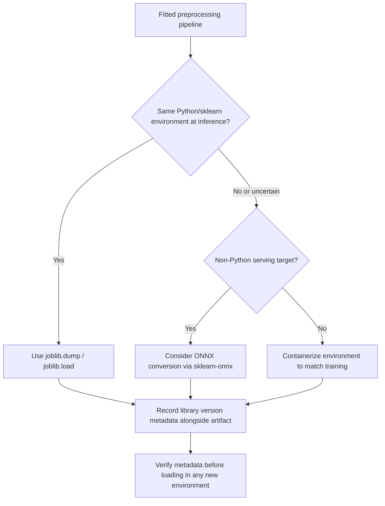

## Saving and Loading Fitted Preprocessing Objects

### Why Fitted State Needs to Be Persisted

A fitted preprocessing object (an imputer with learned median values, a scaler with learned mean/variance, an encoder with a learned category vocabulary) holds parameters derived from training data. Recomputing those parameters at inference time from whatever data happens to be available would generally produce different values than what the model was actually trained against, which defeats the purpose of a consistent train/inference contract. Saving the fitted object preserves those exact learned parameters for reuse.

**Key Points**
- Serialization saves both the object's structure (class, configuration) and its fitted state (learned attributes).
- Deserialization requires the loading environment to have compatible library versions and access to any custom class definitions used at save time.
- Some claims below about cross-version compatibility are inherently uncertain and are labeled as such; documented, version-independent behavior (e.g., what `pickle` fundamentally does) is stated directly.

---

### `pickle` and `joblib`: Core Mechanism

Python's built-in `pickle` module serializes arbitrary Python objects, including fitted scikit-learn transformers, to a byte stream that can be written to disk and later reconstructed.

```python
import pickle

with open("scaler.pkl", "wb") as f:
    pickle.dump(fitted_scaler, f)

with open("scaler.pkl", "rb") as f:
    loaded_scaler = pickle.load(f)
```

`joblib` is commonly recommended over raw `pickle` for scikit-learn objects specifically because scikit-learn estimators often contain large NumPy arrays as fitted attributes, and `joblib` is documented to handle serialization of such arrays more efficiently than the default `pickle` protocol.

```python
import joblib

joblib.dump(fitted_scaler, "scaler.joblib")
loaded_scaler = joblib.load("scaler.joblib")
```

Both `pickle.dump`/`pickle.load` and `joblib.dump`/`joblib.load` reconstruct an object with the same class and the same attribute values it had at save time. This is documented behavior of both libraries for standard Python objects and standard scikit-learn estimators.

---

### Saving an Entire Fitted Pipeline

The same mechanism applies to a full `Pipeline` or `ColumnTransformer`, not just a single transformer, since these are themselves ordinary Python objects containing nested fitted sub-objects.

```python
from sklearn.pipeline import Pipeline
import joblib

full_pipeline.fit(X_train, y_train)
joblib.dump(full_pipeline, "full_pipeline_v1.joblib")

loaded_pipeline = joblib.load("full_pipeline_v1.joblib")
predictions = loaded_pipeline.predict(X_new)
```

Loading the full pipeline and calling `.predict()` directly reuses every learned parameter across every step (imputation values, scaler statistics, encoder categories, and the trained model's coefficients), without recomputing any of them. This is the documented purpose of scikit-learn's `Pipeline` object combined with standard object serialization.

---

### Version Compatibility Constraints

[Inference] Loading a pickled or joblib-serialized scikit-learn object in an environment with a different scikit-learn version than the one used to save it can fail, produce a warning, or in some cases load successfully but behave differently, depending on what changed between the two versions' internal object representations. I cannot verify the specific behavior for any particular pair of scikit-learn versions without testing that exact pair directly.

scikit-learn's own documentation recommends recording the exact library version at save time and, ideally, retraining rather than relying on cross-version unpickling for anything beyond short-term compatibility. [Unverified] — I do not have the ability to fetch the current, exact wording of scikit-learn's documentation in this conversation to confirm this recommendation's precise current phrasing; this reflects generally understood practice around scikit-learn serialization rather than a direct quotation.

A minimal safeguard is recording environment metadata alongside the artifact:

```python
import sklearn
import json

metadata = {"sklearn_version": sklearn.__version__}
with open("full_pipeline_v1_metadata.json", "w") as f:
    json.dump(metadata, f)
```

This lets a future user check, before loading, whether their installed version matches the version used at save time.

---

### Custom Transformer Classes and Import Availability

If a pipeline includes a custom transformer class (as covered in the prior topic), the loading environment needs that exact class definition importable at the same module path used when the object was saved. `pickle` and `joblib` store a reference to the class's module and name, not the class's source code itself.

```python
# preprocessing_transformers.py
class RatioFeatureAdder(BaseEstimator, TransformerMixin):
    ...

# training_script.py
from preprocessing_transformers import RatioFeatureAdder
# ... build pipeline, fit, save ...

# inference_script.py
from preprocessing_transformers import RatioFeatureAdder  # required for successful load
loaded_pipeline = joblib.load("full_pipeline_v1.joblib")
```

[Inference] If `inference_script.py` does not have `preprocessing_transformers.py` available on its Python path, loading will generally fail with an import-related error, since the deserializer needs to locate the referenced class. I have not directly reproduced this failure in this conversation; this describes the general, documented mechanism by which `pickle`/`joblib` resolve class references, not a confirmed test result for a specific setup.

---

### Alternative Formats: ONNX and Format Portability

For deployment scenarios where the loading environment cannot be guaranteed to have the same Python/scikit-learn setup (e.g., serving from a non-Python service), converting a fitted pipeline to a portable format such as ONNX is a documented alternative approach, via the `sklearn-onnx` conversion tools.

```python
from skl2onnx import convert_sklearn
from skl2onnx.common.data_types import FloatTensorType

initial_type = [("input", FloatTensorType([None, X_train.shape[1]]))]
onnx_model = convert_sklearn(full_pipeline, initial_types=initial_type)

with open("pipeline.onnx", "wb") as f:
    f.write(onnx_model.SerializeToString())
```

[Unverified] I cannot confirm the current API surface, supported transformer coverage, or version requirements of `sklearn-onnx` without checking its current documentation directly, since library APIs of this kind are updated over time and I do not have live access to verify the present state in this conversation. Not every custom transformer type is necessarily supported by this conversion path; coverage depends on `sklearn-onnx`'s implementation at whatever version is in use.

---

### Common Pitfalls

- **Loading with a mismatched library version and assuming correctness**: a pipeline may load without raising an error yet produce different transform output than it did originally, if internal defaults changed between versions. [Inference]
- **Losing the custom transformer source file**: if the `.py` file defining a custom transformer class is deleted or not deployed alongside the serialized pipeline, loading will fail regardless of how the pipeline itself was saved.
- **Serializing a pipeline that has not been fit**: calling `joblib.dump()` on an unfitted pipeline saves an object without the learned attributes (e.g., no `mean_`, `std_`), so loading it later and calling `.transform()` will raise an error rather than silently doing nothing.
- **Treating pickle files as safe to load from untrusted sources**: `pickle.load()` (and by extension `joblib.load()`, which uses pickle internally for many object types) can execute arbitrary code embedded in a malicious file. This is documented, well-known behavior of Python's `pickle` module, not a hypothetical risk specific to any one library.
- **Not pinning the exact scikit-learn version in a deployment environment**: relying on "whatever version is currently installed" at inference time, if that differs from training time, reintroduces the version compatibility uncertainty described above.

---

### Save/Load Lifecycle (svg_diagram)

<svg xmlns="http://www.w3.org/2000/svg" viewBox="0 0 820 300">
  <text x="410" y="24" font-size="16" font-weight="bold" text-anchor="middle" fill="#222">Save/Load Lifecycle (svg_diagram)</text>

  <rect x="40" y="60" width="180" height="55" rx="6" fill="#e8f0fe" stroke="#4a6fa5" />
  <text x="130" y="92" font-size="12" text-anchor="middle" fill="#222">Fit Pipeline on</text>
  <text x="130" y="106" font-size="11" text-anchor="middle" fill="#555">Training Data</text>

  <line x1="220" y1="87" x2="270" y2="87" stroke="#555" stroke-width="1.5" marker-end="url(#arrow4)" />

  <rect x="270" y="60" width="180" height="55" rx="6" fill="#fdf3d9" stroke="#b8912f" />
  <text x="360" y="92" font-size="12" text-anchor="middle" fill="#222">joblib.dump()</text>
  <text x="360" y="106" font-size="10" text-anchor="middle" fill="#555">writes .joblib file</text>

  <line x1="450" y1="87" x2="500" y2="87" stroke="#555" stroke-width="1.5" marker-end="url(#arrow4)" />

  <rect x="500" y="60" width="180" height="55" rx="6" fill="#e2e2f5" stroke="#5a5a9c" />
  <text x="590" y="92" font-size="12" text-anchor="middle" fill="#222">Record Metadata</text>
  <text x="590" y="106" font-size="10" text-anchor="middle" fill="#555">sklearn_version, hash</text>

  <line x1="590" y1="115" x2="590" y2="150" stroke="#555" stroke-width="1.5" />
  <line x1="590" y1="150" x2="360" y2="150" stroke="#555" stroke-width="1.5" />
  <line x1="360" y1="150" x2="360" y2="180" stroke="#555" stroke-width="1.5" marker-end="url(#arrow4)" />

  <rect x="130" y="180" width="180" height="55" rx="6" fill="#fbe4ec" stroke="#b04a76" />
  <text x="220" y="205" font-size="11" text-anchor="middle" fill="#222">Check version match</text>
  <text x="220" y="222" font-size="10" text-anchor="middle" fill="#555">before loading</text>

  <line x1="310" y1="207" x2="360" y2="207" stroke="#555" stroke-width="1.5" marker-end="url(#arrow4)" />

  <rect x="360" y="180" width="180" height="55" rx="6" fill="#e6f4ea" stroke="#3d8b52" />
  <text x="450" y="205" font-size="11" text-anchor="middle" fill="#222">joblib.load()</text>
  <text x="450" y="222" font-size="10" text-anchor="middle" fill="#555">reconstruct fitted object</text>

  <line x1="450" y1="235" x2="450" y2="260" stroke="#555" stroke-width="1.5" marker-end="url(#arrow4)" />

  <rect x="330" y="260" width="240" height="35" rx="6" fill="#fdf3d9" stroke="#b8912f" />
  <text x="450" y="282" font-size="11" text-anchor="middle" fill="#222">.transform() / .predict() on new data</text>
</svg>

---

### Serialization Decision Flow



---

**Related Topics**
- Security implications of loading untrusted pickle/joblib files in production systems
- Model registries (MLflow Model Registry, SageMaker Model Registry) as structured alternatives to ad hoc file-based artifact storage
- Backward-compatible schema design for preprocessing pipelines that must support both old and new saved artifacts
- Testing strategies for verifying a loaded pipeline produces identical output to the pipeline at save time
- Cloud storage patterns for versioned artifact persistence (S3 with object versioning, GCS buckets)