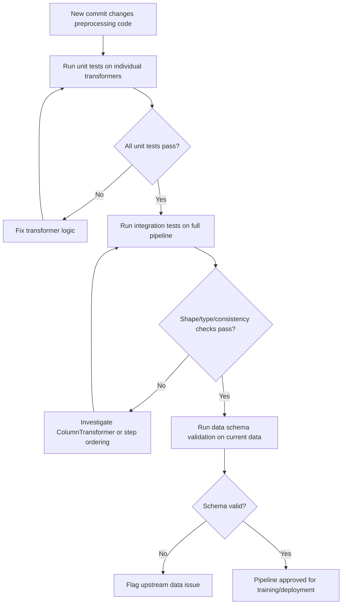

## Testing Preprocessing Pipelines

### Why Preprocessing Code Needs Tests

Preprocessing logic is easy to get subtly wrong in ways that do not raise errors: an imputation strategy applied to the wrong column, a scaler fit on the wrong subset of data, a date parser that silently produces `NaT` for a specific format. Unlike a crashing bug, these errors often produce a pipeline that runs to completion and returns plausible-looking output, which makes them hard to catch through casual inspection. Automated tests catch this class of error by checking specific, known input/output relationships rather than relying on a human noticing something looks off.

**Key Points**
- Preprocessing tests generally fall into a few categories: unit tests on individual transformers, integration tests on the full pipeline, and data validation tests on the input/output data itself.
- Tests should cover edge cases specifically (missing values, unseen categories, empty inputs), not only the typical case.
- The testing tools and patterns described below (`pytest`, `unittest`, pandas testing utilities) are documented, standard tools; specific version behavior is noted separately where relevant.

---

### Unit Testing a Single Transformer

A unit test for a transformer checks that a known input produces a known, correct output, in isolation from the rest of the pipeline.

```python
import numpy as np
import pytest
from sklearn.impute import SimpleImputer

def test_median_imputer_fills_correct_value():
    X = np.array([[1.0], [2.0], [np.nan], [4.0]])
    imputer = SimpleImputer(strategy="median")
    imputer.fit(X)
    result = imputer.transform(X)

    expected_median = 2.0  # median of [1.0, 2.0, 4.0]
    assert result[2, 0] == expected_median
```

`SimpleImputer(strategy="median")` computes the median of the non-missing values in each column during `fit()` and substitutes that value for missing entries during `transform()`. This is documented scikit-learn behavior, so asserting the specific expected value (as above) is testing against known, correct behavior rather than an assumption.

Testing a custom transformer follows the same pattern:

```python
import pandas as pd

def test_ratio_feature_adder_computes_correct_ratio():
    df = pd.DataFrame({"numerator": [10.0, 20.0], "denominator": [2.0, 4.0]})
    transformer = RatioFeatureAdder(numerator_col="numerator", denominator_col="denominator")
    result = transformer.fit_transform(df)

    expected_ratios = [5.0, 5.0]
    np.testing.assert_allclose(result["ratio_feature"], expected_ratios, rtol=1e-5)
```

`np.testing.assert_allclose` checks that values are equal within a specified tolerance, which is generally preferable to exact equality (`==`) for floating-point results, since floating-point arithmetic can introduce small representation errors. This is documented NumPy testing utility behavior.

---

### Testing Edge Cases

Edge cases are where preprocessing bugs most commonly surface:

```python
def test_imputer_handles_all_missing_column():
    X = np.array([[np.nan], [np.nan], [np.nan]])
    imputer = SimpleImputer(strategy="median", keep_empty_features=True)
    imputer.fit(X)
    result = imputer.transform(X)
    assert not np.isnan(result).any()

def test_onehot_encoder_handles_unseen_category():
    from sklearn.preprocessing import OneHotEncoder
    X_train = np.array([["red"], ["blue"]])
    X_test = np.array([["green"]])

    encoder = OneHotEncoder(handle_unknown="ignore")
    encoder.fit(X_train)
    result = encoder.transform(X_test).toarray()

    assert result.sum() == 0  # unseen category encoded as all-zero row
```

[Unverified] The `keep_empty_features` parameter's exact default value and availability differ across scikit-learn versions; I cannot confirm the specific version in which this parameter was introduced without checking scikit-learn's changelog directly, so this test assumes a version where the parameter exists and behaves as shown.

The second test relies on `handle_unknown="ignore"` producing an all-zero encoded row for a category not seen during `fit()`, which is documented `OneHotEncoder` behavior for that parameter setting.

---

### Integration Testing the Full Pipeline

Integration tests check that the entire pipeline, end-to-end, produces correctly shaped and correctly typed output, without necessarily checking every individual value.

```python
def test_full_pipeline_output_shape_and_type():
    result = full_pipeline.named_steps["preprocessing"].fit_transform(X_train)
    
    assert result.shape[0] == X_train.shape[0]
    assert not np.isnan(result).any() if isinstance(result, np.ndarray) else True

def test_pipeline_train_test_consistency():
    full_pipeline.fit(X_train, y_train)
    train_transformed = full_pipeline.named_steps["preprocessing"].transform(X_train)
    test_transformed = full_pipeline.named_steps["preprocessing"].transform(X_test)
    
    assert train_transformed.shape[1] == test_transformed.shape[1]
```

The second test checks a specific, common failure mode: a `ColumnTransformer` or `OneHotEncoder` producing a different number of output columns for test data than for training data, which happens when the test set's categorical columns present a different set of observed categories and `handle_unknown` is not configured to prevent that inconsistency. [Inference] — this describes a documented cause-and-effect relationship in scikit-learn's `OneHotEncoder` design; whether it is the actual cause of any specific shape mismatch a person encounters would need to be confirmed by inspecting that specific case, which I cannot do without seeing it.

---

### Data Validation: Testing the Data, Not Just the Code

A complementary practice is validating that the data itself meets expected properties before and after preprocessing, using a schema/validation library such as `pandera` or Great Expectations, rather than only testing transformer code in isolation.

```python
import pandera as pa
from pandera import Column, DataFrameSchema, Check

schema = DataFrameSchema({
    "age": Column(float, Check.greater_than_or_equal_to(0), nullable=True),
    "income": Column(float, Check.greater_than_or_equal_to(0), nullable=True),
    "occupation": Column(str, nullable=True),
})

def test_input_data_matches_schema():
    schema.validate(X_train)
```

[Unverified] I cannot confirm the exact current API surface of `pandera` (method names, argument signatures) without checking its current documentation directly, since this is the kind of library detail that changes across releases. The general pattern shown — defining per-column type and value constraints, then validating a DataFrame against them — reflects `pandera`'s documented purpose, but exact syntax should be checked against the installed version.

This type of test catches problems earlier than transformer unit tests would: if a data source starts sending negative ages due to an upstream bug, a schema validation test fails immediately, rather than allowing that bad data to flow silently through the entire pipeline into the model.

---

### Testing for Data Leakage

A specific, high-value test for preprocessing pipelines checks that transformers fit only on training data, not on the full dataset:

```python
def test_scaler_does_not_use_test_data_statistics():
    X_train_small = np.array([[1.0], [2.0], [3.0]])
    X_test_outlier = np.array([[1000.0]])

    scaler = StandardScaler()
    scaler.fit(X_train_small)

    assert scaler.mean_[0] == pytest.approx(2.0)
    # confirms the outlier in test data did not influence the fitted mean
```

This test works by construction: since `X_test_outlier` was never passed to `.fit()`, and `StandardScaler.mean_` reflects only the data passed to `.fit()`, the assertion confirms the scaler's fitted mean matches what training data alone would produce. This is a direct consequence of documented `StandardScaler` behavior, not an assumption requiring a hedge.

---

### Property-Based Testing

For preprocessing logic with many possible input combinations, property-based testing (using a library such as `hypothesis`) checks that certain properties hold across a wide range of generated inputs, rather than a fixed set of hand-picked examples.

```python
from hypothesis import given
from hypothesis import strategies as st
import numpy as np

@given(st.lists(st.floats(allow_nan=True, allow_infinity=False), min_size=1, max_size=50))
def test_median_imputer_never_produces_nan_output(values):
    X = np.array(values).reshape(-1, 1)
    if np.all(np.isnan(X)):
        return  # skip all-NaN case, handled separately
    imputer = SimpleImputer(strategy="median")
    result = imputer.fit_transform(X)
    assert not np.isnan(result).any()
```

[Unverified] I cannot confirm the exact current API of the `hypothesis` library (decorator names, strategy function signatures) without checking its current documentation, for the same reason noted for `pandera` above — this reflects the library's general documented purpose and common usage pattern rather than a guaranteed-current API reference.

---

### Common Pitfalls

- **Testing only the "happy path"**: covering only well-formed, typical input while skipping missing values, empty DataFrames, single-row inputs, and unseen categories leaves the most bug-prone cases unchecked.
- **Not testing train/test consistency separately from correctness**: a pipeline can produce individually "correct" output for training data and individually "correct" output for test data while still producing mismatched shapes between the two, which breaks downstream model prediction.
- **Over-relying on shape/type checks without value checks**: confirming output shape and dtype is necessary but not sufficient — a transformer could produce correctly-shaped output with wrong values (e.g., swapped columns) and shape-only tests would not catch this.
- **Hardcoding expected values without documenting how they were derived**: a test assertion like `assert result == 42` without a comment explaining the calculation makes the test hard to maintain and hard to trust when it fails later.
- **Not re-running tests after a library version upgrade**: since some behaviors are version-dependent (as flagged in several places above), a test suite that passed under one library version is not necessarily guaranteed to pass, or to be testing the same underlying behavior, under a newer version. [Inference]

---

### Testing Pyramid for Preprocessing (svg_diagram)

<svg xmlns="http://www.w3.org/2000/svg" viewBox="0 0 820 320">
  <text x="410" y="24" font-size="16" font-weight="bold" text-anchor="middle" fill="#222">Testing Pyramid for Preprocessing (svg_diagram)</text>

  <polygon points="410,50 560,140 260,140" fill="#e6f4ea" stroke="#3d8b52" />
  <text x="410" y="105" font-size="11" text-anchor="middle" fill="#222">Property-based</text>
  <text x="410" y="120" font-size="10" text-anchor="middle" fill="#555">(hypothesis)</text>

  <polygon points="260,140 560,140 620,220 200,220" fill="#fbe4ec" stroke="#b04a76" />
  <text x="410" y="185" font-size="12" text-anchor="middle" fill="#222">Integration Tests</text>
  <text x="410" y="202" font-size="10" text-anchor="middle" fill="#555">full pipeline shape/consistency</text>

  <polygon points="200,220 620,220 690,300 130,300" fill="#e8f0fe" stroke="#4a6fa5" />
  <text x="410" y="255" font-size="13" text-anchor="middle" fill="#222">Unit Tests</text>
  <text x="410" y="272" font-size="11" text-anchor="middle" fill="#555">individual transformers, known values</text>
  <text x="410" y="288" font-size="10" text-anchor="middle" fill="#555">data schema validation</text>
</svg>

---

### Preprocessing Test Execution Flow



---

**Related Topics**
- Continuous integration setup for running preprocessing test suites automatically on every commit
- Mutation testing to evaluate whether existing tests would actually catch introduced bugs
- Golden-file/snapshot testing for complex pipeline outputs
- Testing strategies specific to time-series preprocessing (leakage across time boundaries)
- Great Expectations versus pandera for data validation at pipeline boundaries
- Performance/regression testing for preprocessing pipelines on large datasets