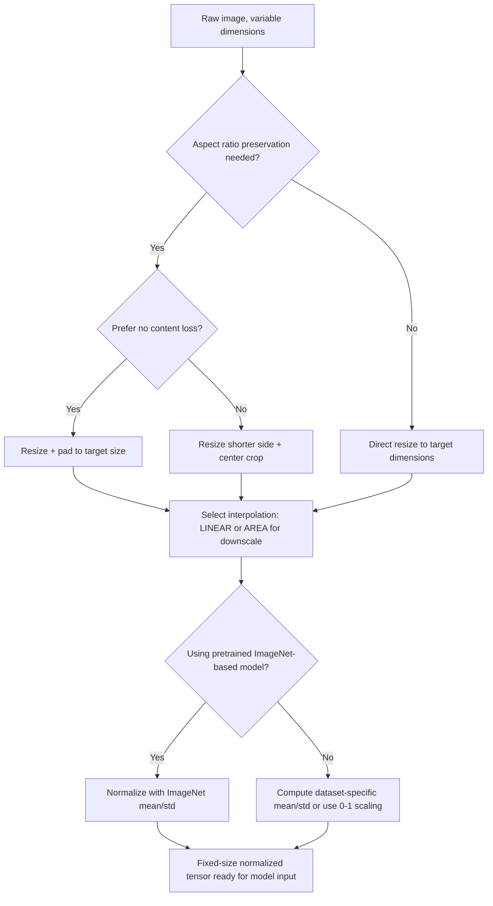

## Preprocessing Image Data: Resizing and Normalization

### Why Image Preprocessing Differs from Tabular Preprocessing

Image data arrives as arrays of pixel intensities with spatial structure, fixed or variable dimensions, and a value range determined by the source format (commonly 0–255 for 8-bit images). Most model architectures require fixed input dimensions and benefit from inputs scaled to a specific numeric range, so resizing and normalization are close to universal steps in image pipelines, unlike tabular preprocessing where the needed steps vary more by dataset.

**Key Points**
- Resizing changes spatial dimensions (height, width); normalization changes the numeric range/distribution of pixel values.
- The order of operations and exact parameters (interpolation method, normalization statistics) affect model performance in ways that are often empirically determined rather than fixed by a single correct rule.
- Documented, deterministic library behavior (what a specific interpolation flag computes) is stated directly; claims about which choices work best for a given task are inherently context-dependent and are labeled accordingly.

---

### Resizing: Interpolation Methods

Resizing an image to a target resolution requires an interpolation method to compute pixel values that do not correspond directly to original pixel locations.

```python
import cv2

image = cv2.imread("photo.jpg")
resized_bilinear = cv2.resize(image, (224, 224), interpolation=cv2.INTER_LINEAR)
resized_nearest = cv2.resize(image, (224, 224), interpolation=cv2.INTER_NEAREST)
resized_area = cv2.resize(image, (224, 224), interpolation=cv2.INTER_AREA)
```

- `cv2.INTER_NEAREST` assigns each output pixel the value of the nearest input pixel. This is documented OpenCV behavior and is the fastest option, generally producing blockier results, particularly when upscaling.
- `cv2.INTER_LINEAR` computes a weighted average of the four nearest input pixels. This is documented OpenCV behavior and is a common default for general-purpose resizing.
- `cv2.INTER_AREA` resamples using pixel area relation. OpenCV's documentation recommends this specifically for downscaling, since it reduces aliasing artifacts compared to linear interpolation in that direction; [Inference] I cannot verify the precise magnitude of this difference for any specific image without running a direct comparison.

```python
from PIL import Image

img = Image.open("photo.jpg")
resized = img.resize((224, 224), Image.BILINEAR)
```

Pillow's `Image.resize()` accepts a similar set of interpolation filter constants (`NEAREST`, `BILINEAR`, `BICUBIC`, `LANCZOS`). Bicubic and Lanczos filters generally produce smoother results than bilinear at increased computational cost; the relative visual quality difference between them for a specific image and target size is not something I can verify without direct visual comparison.

---

### Aspect Ratio Handling

Resizing to a fixed target size without preserving aspect ratio distorts the image (stretching or squeezing content). Two common approaches address this:

```python
def resize_with_padding(image, target_size):
    h, w = image.shape[:2]
    target_h, target_w = target_size
    scale = min(target_h / h, target_w / w)
    new_h, new_w = int(h * scale), int(w * scale)
    resized = cv2.resize(image, (new_w, new_h), interpolation=cv2.INTER_LINEAR)

    pad_h = target_h - new_h
    pad_w = target_w - new_w
    top, bottom = pad_h // 2, pad_h - pad_h // 2
    left, right = pad_w // 2, pad_w - pad_w // 2

    padded = cv2.copyMakeBorder(resized, top, bottom, left, right, cv2.BORDER_CONSTANT, value=[0, 0, 0])
    return padded
```

This "letterboxing" approach scales the image to fit within the target dimensions while preserving aspect ratio, then pads the remaining space with a constant value. This preserves the original spatial proportions of image content at the cost of introducing padding regions that carry no information.

An alternative is center-cropping after resizing the shorter side to match the target:

```python
def resize_with_center_crop(image, target_size):
    h, w = image.shape[:2]
    scale = max(target_size[0] / h, target_size[1] / w)
    new_h, new_w = int(h * scale), int(w * scale)
    resized = cv2.resize(image, (new_w, new_h), interpolation=cv2.INTER_LINEAR)

    top = (new_h - target_size[0]) // 2
    left = (new_w - target_size[1]) // 2
    cropped = resized[top:top + target_size[0], left:left + target_size[1]]
    return cropped
```

Center-cropping preserves aspect ratio without introducing padding, at the cost of discarding image content outside the cropped region. Whether padding or cropping is preferable depends on the task — for example, whether content near image edges is likely to be important. [Inference] This is a reasoned tradeoff based on what each method structurally does, not a claim I can verify as universally correct across tasks without task-specific evaluation.

---

### Normalization: Rescaling Pixel Value Ranges

Raw pixel values are commonly stored as 8-bit integers in the range 0–255. Most neural network architectures are documented to train more effectively with inputs scaled to a smaller, centered range, though the specific reasons (numerical stability of gradient-based optimization) are part of broader, well-established deep learning practice rather than something unique to any one framework.

**Simple 0–1 scaling:**

```python
normalized = image.astype("float32") / 255.0
```

This linearly maps the 0–255 range to 0–1. This is a direct, deterministic arithmetic operation, not something requiring a hedge.

**Mean/standard deviation normalization (standardization):**

```python
import numpy as np

mean = np.array([0.485, 0.456, 0.406])  # commonly used ImageNet channel means
std = np.array([0.229, 0.224, 0.225])   # commonly used ImageNet channel std devs

normalized = (image.astype("float32") / 255.0 - mean) / std
```

These specific mean and standard deviation values are widely used in practice because they were computed from the ImageNet training dataset and are commonly reused by models pretrained on ImageNet. [Inference] Using these exact values only produces a meaningful benefit when the input distribution resembles ImageNet's; for a dataset with a substantially different visual domain (e.g., medical grayscale scans), computing dataset-specific mean/std values is generally recommended in documented transfer learning guidance, though the precise performance impact of using mismatched statistics for any specific dataset is not something I can verify without direct experimentation on that dataset.

**Per-image standardization** (as opposed to fixed dataset statistics):

```python
def per_image_standardization(image):
    mean = np.mean(image)
    std = np.std(image)
    adjusted_std = max(std, 1.0 / np.sqrt(image.size))
    return (image - mean) / adjusted_std
```

This computes mean and standard deviation from each individual image rather than from a fixed dataset-level constant. The `adjusted_std` floor prevents division by a near-zero standard deviation for near-uniform images, which is a direct mathematical safeguard, not requiring a hedge.

---

### Framework-Specific Normalization Layers

Rather than normalizing manually with NumPy, framework-native layers can embed normalization inside the model itself:

```python
import tensorflow as tf

model = tf.keras.Sequential([
    tf.keras.layers.Rescaling(1./255),
    tf.keras.layers.Resizing(224, 224),
    # ... rest of model
])
```

```python
import torchvision.transforms as transforms

transform = transforms.Compose([
    transforms.Resize((224, 224)),
    transforms.ToTensor(),  # converts to [0,1] float tensor and rearranges to (C,H,W)
    transforms.Normalize(mean=[0.485, 0.456, 0.406], std=[0.229, 0.224, 0.225])
])
```

`transforms.ToTensor()` is documented to both convert a PIL image or NumPy array to a PyTorch tensor and rescale pixel values from the 0–255 integer range to the 0.0–1.0 float range in the same step, for standard 8-bit image inputs. This dual behavior is a common source of confusion when combined with a second, separate 0–255 to 0–1 scaling step, which would incorrectly double-scale the data.

---

### Order of Operations: Resize Before or After Normalization

Resizing pixel values (spatial resampling) and normalizing pixel values (range rescaling) are independent operations that commute in principle — resizing then normalizing, or normalizing then resizing, generally produces the same numeric result for standard linear interpolation methods, since interpolation is a linear operation on pixel values and normalization is also linear. [Inference] This follows from the mathematical properties of linear interpolation and linear rescaling; I have not directly tested this equivalence against a specific implementation's floating-point behavior, so small numerical differences due to floating-point rounding order are possible in practice.

In practice, resizing is generally performed first for computational efficiency, since interpolation on a smaller (post-resize) array is cheaper than on the original, larger array — this is a performance consideration rather than a correctness requirement.

---

### Common Pitfalls

- **Double-scaling pixel values**: applying a manual `/255.0` division after a library function (such as `ToTensor()`) that already performs this scaling internally results in values in an incorrect range (0–1 divided by 255 again), which is a common, easy-to-miss bug.
- **Using ImageNet normalization statistics on a visually dissimilar dataset without verification**: as noted above, this is a documented point of caution in transfer learning practice, though the actual performance impact for any specific dataset requires direct evaluation. [Inference]
- **Inconsistent interpolation method between training and inference preprocessing**: if training used `INTER_AREA` for downscaling but a deployed inference service uses `INTER_LINEAR`, the resulting pixel values will differ slightly, which can affect model output in ways that are hard to diagnose without checking the preprocessing code paths.
- **Forgetting to convert color channel order**: OpenCV (`cv2.imread`) loads images in BGR channel order by default, while most other libraries (Pillow, most deep learning frameworks) expect RGB order. Mixing these without an explicit `cv2.cvtColor(image, cv2.COLOR_BGR2RGB)` conversion silently swaps the red and blue channels. This is documented, well-known OpenCV behavior.
- **Aspect ratio distortion from naive resizing**: resizing directly to a fixed size without padding or cropping changes the geometric proportions of image content, which can degrade model performance on tasks sensitive to object shape.

---

### Resize and Normalize Pipeline (svg_diagram)

<svg xmlns="http://www.w3.org/2000/svg" viewBox="0 0 820 260">
  <text x="410" y="24" font-size="16" font-weight="bold" text-anchor="middle" fill="#222">Resize and Normalize Pipeline (svg_diagram)</text>

  <rect x="30" y="80" width="150" height="60" rx="6" fill="#e8f0fe" stroke="#4a6fa5" />
  <text x="105" y="105" font-size="11" text-anchor="middle" fill="#222">Raw Image</text>
  <text x="105" y="122" font-size="10" text-anchor="middle" fill="#555">variable size, 0-255</text>

  <line x1="180" y1="110" x2="220" y2="110" stroke="#555" stroke-width="1.5" marker-end="url(#arrow5)" />

  <rect x="220" y="80" width="150" height="60" rx="6" fill="#fdf3d9" stroke="#b8912f" />
  <text x="295" y="105" font-size="11" text-anchor="middle" fill="#222">Resize</text>
  <text x="295" y="122" font-size="10" text-anchor="middle" fill="#555">interpolation method</text>

  <line x1="370" y1="110" x2="410" y2="110" stroke="#555" stroke-width="1.5" marker-end="url(#arrow5)" />

  <rect x="410" y="80" width="150" height="60" rx="6" fill="#fbe4ec" stroke="#b04a76" />
  <text x="485" y="105" font-size="11" text-anchor="middle" fill="#222">Aspect Ratio</text>
  <text x="485" y="122" font-size="10" text-anchor="middle" fill="#555">pad or crop</text>

  <line x1="560" y1="110" x2="600" y2="110" stroke="#555" stroke-width="1.5" marker-end="url(#arrow5)" />

  <rect x="600" y="80" width="150" height="60" rx="6" fill="#e6f4ea" stroke="#3d8b52" />
  <text x="675" y="105" font-size="11" text-anchor="middle" fill="#222">Normalize</text>
  <text x="675" y="122" font-size="10" text-anchor="middle" fill="#555">scale, mean/std</text>

  <line x1="675" y1="140" x2="675" y2="180" stroke="#555" stroke-width="1.5" marker-end="url(#arrow5)" />

  <rect x="530" y="180" width="290" height="45" rx="6" fill="#e2e2f5" stroke="#5a5a9c" />
  <text x="675" y="207" font-size="11" text-anchor="middle" fill="#222">Fixed-size, normalized tensor</text>
</svg>

---

### Image Preprocessing Decision Flow



---

**Related Topics**
- Data augmentation techniques (random crop, flip, color jitter) as a distinct preprocessing stage from resizing/normalization
- Handling variable-aspect-ratio batches efficiently in data loaders
- Preprocessing considerations specific to medical or scientific imaging (bit depth beyond 8-bit, non-RGB channel counts)
- GPU-accelerated image preprocessing (e.g., NVIDIA DALI) for reducing CPU bottlenecks in training pipelines
- Consistency testing between training-time and inference-time image preprocessing code paths