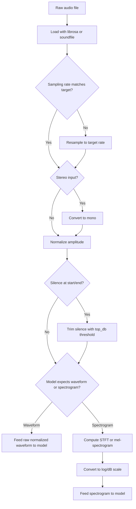

## Preprocessing Audio Data Basics

### Representing Audio as Data

Audio is a continuous physical signal (air pressure variation over time) that is digitized by sampling it at discrete time intervals. Understanding this representation is a prerequisite for any preprocessing step, since sampling rate and bit depth choices affect every downstream operation.

**Key Points**
- A digital audio signal is an array of amplitude values sampled at a fixed rate (the sampling rate, in Hz).
- The sampling rate determines the highest frequency that can be represented, per the Nyquist–Shannon sampling theorem.
- Preprocessing generally involves standardizing sampling rate, converting to a consistent channel count, and often transforming to a frequency-domain or time-frequency representation before feeding a model.

---

### Loading Audio Files

```python
import librosa

signal, sample_rate = librosa.load("audio_clip.wav", sr=None)
```

`librosa.load` reads an audio file and returns a NumPy array of amplitude values along with the sampling rate. Passing `sr=None` preserves the file's original sampling rate; passing a specific integer (e.g., `sr=16000`) resamples the audio to that rate during loading. This is documented `librosa` behavior for its `load` function.

```python
import soundfile as sf

signal, sample_rate = sf.read("audio_clip.wav")
```

`soundfile` is a commonly used alternative for reading audio, generally faster than `librosa.load` for simple reading without resampling, since it does not perform the additional resampling computation `librosa.load` can do. [Inference] I cannot verify the specific performance difference for any particular file or environment without benchmarking it directly.

---

### The Nyquist–Shannon Sampling Theorem

The sampling rate determines the maximum frequency that can be accurately represented in a digital signal: this maximum is exactly half the sampling rate, known as the Nyquist frequency. This is an established result in signal processing theory, not a library-specific behavior, so it is stated directly rather than hedged.

$$f_{Nyquist} = \frac{f_{sample}}{2}$$

For example, a sampling rate of 44,100 Hz (standard for CD-quality audio) can represent frequencies up to 22,050 Hz, which exceeds the upper range of typical human hearing (approximately 20,000 Hz). Speech processing tasks commonly use lower sampling rates, such as 16,000 Hz, since speech-relevant frequency content is generally concentrated well below that range's Nyquist limit. [Inference] The specific frequency range considered "speech-relevant" varies somewhat by source and application; this reflects commonly cited practice in speech processing rather than a single universal cutoff value I can point to a specific confirmed source for in this conversation.

---

### Resampling

```python
import librosa

resampled_signal = librosa.resample(signal, orig_sr=sample_rate, target_sr=16000)
```

Resampling changes the sampling rate of an already-loaded signal, which is necessary when combining audio from sources with different original sampling rates, or when a model architecture expects a specific fixed rate. `librosa.resample` performs this via interpolation-based resampling algorithms; the exact default algorithm and its behavior can differ across `librosa` versions. [Unverified] — I cannot confirm the specific current default resampling algorithm without checking the currently installed version's documentation directly.

**Common pitfall**: resampling to a lower rate than the original (downsampling) without appropriate low-pass filtering beforehand can introduce aliasing artifacts, where frequency content above the new Nyquist limit folds back into the audible range as distortion. Standard resampling library functions are generally documented to apply appropriate filtering internally as part of the resampling operation, but I cannot verify this holds for every specific library and configuration without checking that library's implementation directly. [Unverified]

---

### Channel Handling: Mono vs. Stereo

```python
import numpy as np

def to_mono(signal):
    if signal.ndim > 1:
        return np.mean(signal, axis=0)
    return signal
```

Stereo audio contains two channels (left, right); many models expect mono (single-channel) input. Averaging the two channels is a common, simple approach to mono conversion. This is a direct, deterministic arithmetic operation, not requiring a hedge on what it computes — though whether simple averaging is the *appropriate* choice for a given task (versus, for example, selecting one channel) depends on the audio's content and the task's requirements. [Inference]

`librosa.load` performs mono conversion by default (`mono=True`), so this behavior is often already applied when using that loading function unless explicitly disabled.

---

### Amplitude Normalization

```python
def normalize_amplitude(signal):
    max_val = np.max(np.abs(signal))
    if max_val > 0:
        return signal / max_val
    return signal
```

This scales the signal so its maximum absolute amplitude is 1.0, a form of peak normalization. This is a direct mathematical operation.

An alternative is RMS (root-mean-square) normalization, which normalizes based on average signal energy rather than peak value:

```python
def rms_normalize(signal, target_rms=0.1):
    current_rms = np.sqrt(np.mean(signal**2))
    if current_rms > 0:
        return signal * (target_rms / current_rms)
    return signal
```

Peak normalization and RMS normalization produce different results for signals with different dynamic ranges (the ratio between the loudest and quietest parts). Which is preferable depends on the downstream task; [Inference] I cannot state a universally correct choice without knowing the specific task's requirements.

---

### Silence Trimming

```python
trimmed_signal, index = librosa.effects.trim(signal, top_db=20)
```

`librosa.effects.trim` removes leading and trailing sections of a signal below a specified decibel threshold relative to the signal's peak. This is documented `librosa` functionality. The `top_db` parameter controls sensitivity: a lower value trims more aggressively (treating more of the signal as "silence"), a higher value trims less. Selecting an appropriate `top_db` value for a specific dataset generally requires listening to or visually inspecting trimmed output, since the correct threshold depends on the recording's noise floor. [Inference]

---

### Converting to Frequency-Domain Representations

Raw waveform amplitude arrays are one representation of audio; many models instead operate on time-frequency representations such as spectrograms or mel-spectrograms, which represent how frequency content changes over time.

```python
import librosa
import numpy as np

stft = librosa.stft(signal, n_fft=2048, hop_length=512)
magnitude_spectrogram = np.abs(stft)

mel_spectrogram = librosa.feature.melspectrogram(
    y=signal, sr=sample_rate, n_fft=2048, hop_length=512, n_mels=128
)
log_mel_spectrogram = librosa.power_to_db(mel_spectrogram, ref=np.max)
```

`librosa.stft` computes the Short-Time Fourier Transform, which represents the signal's frequency content within short overlapping time windows, producing a complex-valued matrix. Taking the absolute value produces the magnitude spectrogram. This is documented, standard signal-processing functionality, implemented consistently with the mathematical definition of the STFT.

`librosa.feature.melspectrogram` further maps the frequency axis onto the mel scale, which is a perceptually motivated frequency scale that approximates human pitch perception (approximately linear at low frequencies, logarithmic at higher frequencies). This mel-scale mapping is a well-established, documented signal-processing convention.

`librosa.power_to_db` converts the mel-spectrogram's power values to a logarithmic decibel scale, since raw power values span a wide numeric range that models generally train more effectively on when compressed logarithmically. [Inference] This reflects generally established deep learning audio processing practice; I cannot verify the exact magnitude of this training benefit for any specific model without direct experimentation.

---

### Common Pitfalls

- **Mismatched sampling rates across a dataset**: combining audio files with different original sampling rates without resampling them all to a common rate produces inconsistent time-per-sample relationships, which corrupts any downstream frequency-domain analysis if not corrected.
- **Aliasing from improper downsampling**: as noted above, downsampling without adequate filtering can introduce artifacts. [Unverified] whether a specific library call applies sufficient filtering by default without checking that library's specific implementation.
- **Clipping during normalization**: amplitude normalization that pushes values beyond the representable range (e.g., beyond [-1, 1] for floating-point audio) can introduce clipping distortion if not handled carefully, particularly when combining normalization with subsequent processing steps that might rescale the signal further.
- **Inconsistent STFT parameters between training and inference**: `n_fft` and `hop_length` values affect the exact shape and content of the resulting spectrogram; using different values at inference than at training time produces inputs the model was not trained to interpret correctly.
- **Ignoring the difference between power and amplitude spectrograms**: `librosa.feature.melspectrogram` returns power (magnitude squared) by default, which requires a different `ref` handling in `power_to_db` than a straight magnitude spectrogram would. Confusing these can produce a spectrogram compressed with an inappropriate reference scale. [Inference] — this describes a documented distinction in librosa's API design; I have not tested every specific parameter combination directly in this conversation.

---

### Audio Preprocessing Pipeline (svg_diagram)

<svg xmlns="http://www.w3.org/2000/svg" viewBox="0 0 820 280">
  <text x="410" y="24" font-size="16" font-weight="bold" text-anchor="middle" fill="#222">Audio Preprocessing Pipeline (svg_diagram)</text>

  <rect x="20" y="70" width="130" height="55" rx="6" fill="#e8f0fe" stroke="#4a6fa5" />
  <text x="85" y="95" font-size="10" text-anchor="middle" fill="#222">Raw Audio</text>
  <text x="85" y="110" font-size="9" text-anchor="middle" fill="#555">File (.wav/.mp3)</text>

  <line x1="150" y1="97" x2="185" y2="97" stroke="#555" stroke-width="1.5" marker-end="url(#arrow6)" />

  <rect x="185" y="70" width="130" height="55" rx="6" fill="#fdf3d9" stroke="#b8912f" />
  <text x="250" y="95" font-size="10" text-anchor="middle" fill="#222">Resample</text>
  <text x="250" y="110" font-size="9" text-anchor="middle" fill="#555">to target rate</text>

  <line x1="315" y1="97" x2="350" y2="97" stroke="#555" stroke-width="1.5" marker-end="url(#arrow6)" />

  <rect x="350" y="70" width="130" height="55" rx="6" fill="#fbe4ec" stroke="#b04a76" />
  <text x="415" y="95" font-size="10" text-anchor="middle" fill="#222">Mono Convert</text>
  <text x="415" y="110" font-size="9" text-anchor="middle" fill="#555">channel averaging</text>

  <line x1="480" y1="97" x2="515" y2="97" stroke="#555" stroke-width="1.5" marker-end="url(#arrow6)" />

  <rect x="515" y="70" width="130" height="55" rx="6" fill="#e6f4ea" stroke="#3d8b52" />
  <text x="580" y="95" font-size="10" text-anchor="middle" fill="#222">Normalize</text>
  <text x="580" y="110" font-size="9" text-anchor="middle" fill="#555">peak or RMS</text>

  <line x1="645" y1="97" x2="680" y2="97" stroke="#555" stroke-width="1.5" marker-end="url(#arrow6)" />

  <rect x="680" y="70" width="120" height="55" rx="6" fill="#e2e2f5" stroke="#5a5a9c" />
  <text x="740" y="95" font-size="10" text-anchor="middle" fill="#222">Trim Silence</text>
  <text x="740" y="110" font-size="9" text-anchor="middle" fill="#555">top_db threshold</text>

  <line x1="740" y1="125" x2="740" y2="150" stroke="#555" stroke-width="1.5" />
  <line x1="740" y1="150" x2="250" y2="150" stroke="#555" stroke-width="1.5" />
  <line x1="250" y1="150" x2="250" y2="180" stroke="#555" stroke-width="1.5" marker-end="url(#arrow6)" />

  <rect x="120" y="180" width="260" height="55" rx="6" fill="#fdf3d9" stroke="#b8912f" />
  <text x="250" y="205" font-size="10" text-anchor="middle" fill="#222">STFT / Mel-spectrogram</text>
  <text x="250" y="220" font-size="9" text-anchor="middle" fill="#555">time-frequency representation</text>

  <line x1="380" y1="207" x2="420" y2="207" stroke="#555" stroke-width="1.5" marker-end="url(#arrow6)" />

  <rect x="420" y="180" width="260" height="55" rx="6" fill="#e6f4ea" stroke="#3d8b52" />
  <text x="550" y="205" font-size="10" text-anchor="middle" fill="#222">Log-scale (dB) Conversion</text>
  <text x="550" y="220" font-size="9" text-anchor="middle" fill="#555">model-ready input</text>
</svg>

---

### Audio Preprocessing Decision Flow



---

**Related Topics**
- Data augmentation for audio (time-stretching, pitch-shifting, noise injection, SpecAugment)
- MFCC (Mel-Frequency Cepstral Coefficients) as an alternative feature representation to mel-spectrograms
- Voice activity detection as a more sophisticated alternative to fixed-threshold silence trimming
- Handling variable-length audio clips in batch processing (padding, chunking strategies)
- Preprocessing considerations specific to real-time streaming audio versus fixed pre-recorded files