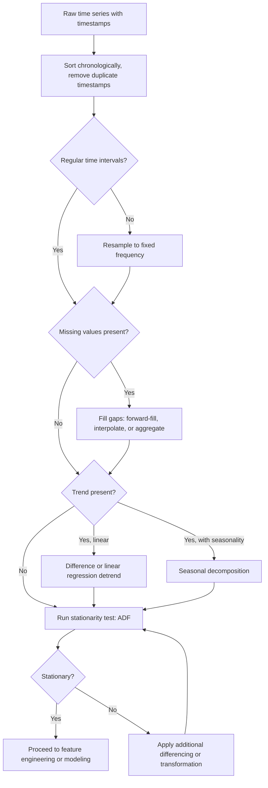

## Preprocessing Time Series Data: Resampling and Detrending

### Why Time Series Requires Distinct Preprocessing

Time series data has an ordering constraint that tabular or image data generally does not: each observation's position in time is meaningful, and shuffling observations destroys information a model needs. This ordering constraint affects nearly every preprocessing decision — resampling, handling missing timestamps, and removing trends all need to respect temporal order, and standard cross-validation approaches that shuffle data are generally inappropriate without modification.

**Key Points**
- Resampling in a time series context means changing the frequency of observations (e.g., hourly to daily), which is a distinct concept from resampling in the statistical bootstrap sense.
- Detrending removes long-term systematic movement from a series, isolating shorter-term patterns for analysis or modeling.
- Documented, deterministic behavior of stated functions (e.g., what `pandas.DataFrame.resample` computes given an aggregation function) is described directly; claims about which choice is appropriate for a given series are context-dependent and labeled as such.

---

### Time Series Resampling with pandas

```python
import pandas as pd

df = pd.read_csv("sensor_data.csv", parse_dates=["timestamp"], index_col="timestamp")

daily_mean = df.resample("D").mean()
hourly_sum = df.resample("H").sum()
weekly_max = df.resample("W").max()
```

`DataFrame.resample()` groups data into time-based bins (specified by a frequency string such as `"D"` for daily or `"H"` for hourly) and applies an aggregation function to each bin. This is documented pandas functionality; the exact set of valid frequency strings and their meanings is specified in pandas' offset alias documentation.

**Upsampling** (increasing frequency, e.g., daily to hourly) creates new timestamps that did not exist in the original data, which requires a fill strategy:

```python
upsampled = df.resample("H").asfreq()  # introduces NaN for new timestamps
upsampled_ffill = df.resample("H").ffill()  # forward-fills from the last known value
upsampled_interp = df.resample("H").interpolate(method="linear")  # linear interpolation
```

`asfreq()` produces missing values (`NaN`) at the newly introduced timestamps, since no aggregation function is applied to generate a value where none exists. `ffill()` carries the last observed value forward. `interpolate(method="linear")` computes intermediate values along a straight line between known points. These are each documented, distinct pandas behaviors; which is appropriate depends on whether the underlying process is more plausibly modeled as constant between measurements (favoring forward-fill) or smoothly varying (favoring interpolation). [Inference] This is a reasoned recommendation based on the structural difference between the methods, not a claim about which produces better model performance for any specific dataset, which would require direct evaluation.

**Downsampling** (decreasing frequency, e.g., hourly to daily) requires choosing an aggregation function appropriate to the data's meaning:

```python
daily_avg_temp = df["temperature"].resample("D").mean()
daily_total_rainfall = df["rainfall"].resample("D").sum()
```

Using `.mean()` for a cumulative quantity like rainfall, or `.sum()` for a quantity like temperature that is not naturally additive, would produce numerically valid but semantically inappropriate results. [Inference] This follows from the definitions of the quantities involved (temperature is an intensive quantity, rainfall accumulation is extensive), not from library-specific behavior — the aggregation function itself does exactly what it is documented to do in either case.

---

### Handling Irregular Timestamps

Real-world time series data frequently has irregular or missing timestamps (sensor dropouts, unevenly logged events). Resampling to a regular frequency is often a necessary first step before further processing:

```python
df = df.sort_index()  # ensure chronological order first
df = df[~df.index.duplicated(keep="first")]  # remove duplicate timestamps
regular_df = df.resample("H").mean()  # enforce regular hourly frequency
```

Sorting by index before resampling is necessary because `resample()` assumes chronological order; applying it to an unsorted index can produce incorrect bin assignments. [Inference] This describes the expected consequence of resample's documented dependence on a sorted, monotonic DatetimeIndex; I have not directly tested the specific error behavior of applying `resample()` to unsorted data with the currently installed pandas version, since I cannot execute code against a specific user environment in this conversation.

---

### Detrending: Removing Long-Term Systematic Movement

A trend is a long-term increase or decrease in a series' overall level, which can obscure shorter-term patterns (seasonality, cyclic behavior, noise) that are often the actual object of analysis or modeling.

**Difference detrending:**

```python
detrended = df["value"].diff()
```

`.diff()` computes the difference between each observation and the previous one, which is documented pandas behavior. This removes a linear trend if the trend is exactly linear, since a constant slope produces a constant, trend-free difference; for non-linear trends, first-order differencing generally reduces but does not fully remove the trend. [Inference] This follows from the mathematical properties of differencing applied to a polynomial trend of degree greater than one, which is a general result in time series analysis rather than a library-specific claim.

**Linear regression detrending:**

```python
import numpy as np
from sklearn.linear_model import LinearRegression

X = np.arange(len(df)).reshape(-1, 1)
y = df["value"].values

trend_model = LinearRegression()
trend_model.fit(X, y)
trend = trend_model.predict(X)

detrended = df["value"].values - trend
```

This fits a straight line to the series index versus value, then subtracts that fitted line from the original series. This directly removes the best-fit linear trend component, by the definition of linear regression's fitted line. It does not address non-linear trends or seasonal patterns, which is a structural limitation of the linear model, not a hedge on uncertain behavior.

**Decomposition-based detrending:**

```python
from statsmodels.tsa.seasonal import seasonal_decompose

decomposition = seasonal_decompose(df["value"], model="additive", period=12)
trend_component = decomposition.trend
seasonal_component = decomposition.seasonal
residual_component = decomposition.resid

detrended = df["value"] - trend_component
```

`seasonal_decompose` splits a series into trend, seasonal, and residual components using a documented moving-average-based method (for the `"additive"` model, the components are assumed to sum to the original series; for `"multiplicative"`, they are assumed to multiply). The `period` parameter must match the actual seasonal cycle length in the data (e.g., 12 for monthly data with yearly seasonality); an incorrect period value will produce a decomposition that does not correctly separate seasonal from trend components. [Inference] This follows from the documented mechanism of the decomposition algorithm, which depends on the specified period to define its moving-average window; I have not independently tested every edge case of mismatched period values against a specific statsmodels version.

**Choosing between additive and multiplicative decomposition** depends on whether seasonal fluctuation magnitude stays constant (additive) or scales with the series' overall level (multiplicative) over time. [Inference] This is a reasoned criterion based on the documented definitions of the two models; determining which applies to a specific dataset requires inspecting that dataset directly, which I cannot do without it being provided.

---

### Stationarity and Why It Matters

Many time series modeling techniques (particularly classical statistical models like ARIMA) assume the series is stationary — that its statistical properties (mean, variance) do not change over time. Detrending is often a step toward achieving stationarity.

```python
from statsmodels.tsa.stattools import adfuller

result = adfuller(df["value"].dropna())
adf_statistic, p_value = result[0], result[1]
```

The Augmented Dickey-Fuller test evaluates the null hypothesis that a unit root is present (i.e., the series is non-stationary). A small p-value (conventionally below 0.05) is documented statistical practice for rejecting this null hypothesis, providing evidence the series is stationary. [Inference] Statistical hypothesis testing provides evidence rather than proof; a low p-value does not certify stationarity with certainty, and the appropriate significance threshold is a convention rather than a fixed mathematical requirement. I cannot verify this test's conclusion is correct for any specific dataset without the ability to run and inspect that specific test's output.

---

### Common Pitfalls

- **Resampling before sorting/deduplicating timestamps**: as noted above, this can silently produce incorrect bin boundaries. [Inference]
- **Using an inappropriate aggregation function during downsampling**: applying `.mean()` to an accumulating quantity (or vice versa) produces a numerically valid but semantically wrong result, since the aggregation function performs exactly its documented computation regardless of whether that computation matches the data's real-world meaning.
- **Applying decomposition-based detrending with an incorrect seasonal period**: this is a common, easy-to-miss error, since the function will run without error but produce a misleading decomposition. [Inference]
- **Detrending using future data in a rolling window**: a centered moving average (as used internally by some detrending methods) uses both past and future values relative to each point, which introduces lookahead information; this is generally inappropriate for building features intended for real-time forecasting, where future values are not actually available at prediction time.
- **Shuffling time series data for train/test splitting**: standard random train/test splitting, appropriate for i.i.d. tabular data, breaks the temporal ordering a time series model needs, and generally allows the model to be evaluated on data that would not have been available at the time of a genuine forecast — this is a widely documented methodological concern in time series modeling literature, not a library-specific behavior.

---

### Time Series Preprocessing Flow (svg_diagram)

<svg xmlns="http://www.w3.org/2000/svg" viewBox="0 0 820 300">
  <text x="410" y="24" font-size="16" font-weight="bold" text-anchor="middle" fill="#222">Time Series Preprocessing Flow (svg_diagram)</text>

  <rect x="30" y="60" width="160" height="55" rx="6" fill="#e8f0fe" stroke="#4a6fa5" />
  <text x="110" y="83" font-size="11" text-anchor="middle" fill="#222">Raw Time Series</text>
  <text x="110" y="99" font-size="9" text-anchor="middle" fill="#555">irregular timestamps</text>

  <line x1="190" y1="87" x2="230" y2="87" stroke="#555" stroke-width="1.5" marker-end="url(#arrow7)" />

  <rect x="230" y="60" width="160" height="55" rx="6" fill="#fdf3d9" stroke="#b8912f" />
  <text x="310" y="83" font-size="11" text-anchor="middle" fill="#222">Sort + Deduplicate</text>
  <text x="310" y="99" font-size="9" text-anchor="middle" fill="#555">chronological order</text>

  <line x1="390" y1="87" x2="430" y2="87" stroke="#555" stroke-width="1.5" marker-end="url(#arrow7)" />

  <rect x="430" y="60" width="160" height="55" rx="6" fill="#fbe4ec" stroke="#b04a76" />
  <text x="510" y="83" font-size="11" text-anchor="middle" fill="#222">Resample</text>
  <text x="510" y="99" font-size="9" text-anchor="middle" fill="#555">regular frequency</text>

  <line x1="590" y1="87" x2="630" y2="87" stroke="#555" stroke-width="1.5" marker-end="url(#arrow7)" />

  <rect x="630" y="60" width="160" height="55" rx="6" fill="#e6f4ea" stroke="#3d8b52" />
  <text x="710" y="83" font-size="11" text-anchor="middle" fill="#222">Fill Gaps</text>
  <text x="710" y="99" font-size="9" text-anchor="middle" fill="#555">ffill / interpolate</text>

  <line x1="710" y1="115" x2="710" y2="150" stroke="#555" stroke-width="1.5" />
  <line x1="710" y1="150" x2="310" y2="150" stroke="#555" stroke-width="1.5" />
  <line x1="310" y1="150" x2="310" y2="180" stroke="#555" stroke-width="1.5" marker-end="url(#arrow7)" />

  <rect x="150" y="180" width="320" height="55" rx="6" fill="#e2e2f5" stroke="#5a5a9c" />
  <text x="310" y="203" font-size="11" text-anchor="middle" fill="#222">Decompose: trend, seasonal, residual</text>
  <text x="310" y="219" font-size="9" text-anchor="middle" fill="#555">or difference / regression detrend</text>

  <line x1="470" y1="207" x2="510" y2="207" stroke="#555" stroke-width="1.5" marker-end="url(#arrow7)" />

  <rect x="510" y="180" width="280" height="55" rx="6" fill="#fdf3d9" stroke="#b8912f" />
  <text x="650" y="203" font-size="11" text-anchor="middle" fill="#222">Stationarity Check</text>
  <text x="650" y="219" font-size="9" text-anchor="middle" fill="#555">ADF test</text>
</svg>

---

### Time Series Preprocessing Decision Flow



---

**Related Topics**
- Seasonal differencing versus decomposition-based deseasonalization
- Feature engineering for time series: lag features, rolling window statistics, Fourier terms for seasonality
- Time series-specific cross-validation strategies (walk-forward validation, expanding window)
- Handling multiple seasonal periods simultaneously (e.g., daily and yearly seasonality in the same series)
- Outlier detection and treatment specific to time-ordered data
- Multivariate time series alignment when combining series with different native frequencies