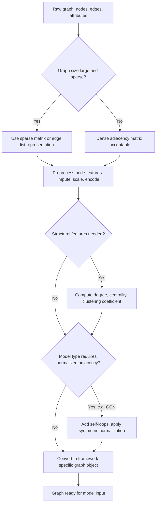

## Preprocessing Graph-Structured Data Basics

### Why Graphs Require Distinct Preprocessing

Graph data represents entities (nodes) and their relationships (edges), a structure that does not fit naturally into the fixed-size vector format most standard ML preprocessing assumes. Nodes can have varying numbers of neighbors, there is generally no inherent ordering among nodes, and the relational structure itself often carries as much predictive information as node-level features. This means graph preprocessing involves both preparing node/edge attributes (similar in spirit to tabular preprocessing) and preparing the structural representation of the graph itself.

**Key Points**
- Graphs are commonly represented as an adjacency matrix, an edge list, or a specialized sparse data structure, each with different memory and computational tradeoffs.
- Node and edge features generally need standard preprocessing (imputation, scaling, encoding) in addition to structure-specific preparation.
- Documented, deterministic behavior of stated functions is described directly; claims about which representation or normalization is best for a specific downstream task are context-dependent and labeled accordingly.

---

### Graph Representations

**Adjacency matrix:**

```python
import networkx as nx
import numpy as np

G = nx.Graph()
G.add_edges_from([(0, 1), (1, 2), (2, 3), (0, 3)])

adjacency_matrix = nx.adjacency_matrix(G).toarray()
```

`nx.adjacency_matrix` returns a matrix where entry $(i, j)$ is nonzero if an edge exists between node $i$ and node $j$. This is documented `networkx` functionality. For an undirected graph, this matrix is symmetric by construction, since an edge between $i$ and $j$ implies an edge between $j$ and $i$.

An adjacency matrix requires $O(n^2)$ memory for $n$ nodes, which becomes impractical for large, sparse graphs (common in real-world networks, where most node pairs are not connected). This is a direct consequence of the matrix's fixed dense size, not a claim requiring a hedge.

**Edge list:**

```python
edge_list = list(G.edges())
# [(0, 1), (1, 2), (2, 3), (0, 3)]
```

An edge list stores only the pairs of nodes that are actually connected, requiring $O(|E|)$ memory for $|E|$ edges, which is generally far more memory-efficient than a dense adjacency matrix for sparse graphs.

**Sparse matrix representation:**

```python
from scipy.sparse import csr_matrix

sparse_adjacency = nx.adjacency_matrix(G)  # networkx returns scipy sparse by default in recent versions
```

[Unverified] Whether `nx.adjacency_matrix` returns a scipy sparse matrix or a dense NumPy array by default has differed across `networkx` versions; I cannot confirm the current default behavior for a specific installed version without checking that version's documentation directly.

---

### Node and Edge Feature Preprocessing

Node features (attributes attached to each node, such as user profile data in a social network) generally require the same preprocessing techniques covered for tabular data: imputation for missing values, scaling for numeric features, and encoding for categorical features.

```python
import pandas as pd
from sklearn.preprocessing import StandardScaler

node_features = pd.DataFrame({
    "node_id": [0, 1, 2, 3],
    "degree_centrality": [0.3, 0.5, 0.4, 0.3],
    "category": ["A", "B", "A", "C"]
})

scaler = StandardScaler()
node_features["degree_centrality_scaled"] = scaler.fit_transform(node_features[["degree_centrality"]])
```

This applies standard scaling to a numeric node feature, using the same `StandardScaler` mechanics described in earlier topics in this series. The scikit-learn behavior itself is identical regardless of whether the feature originates from tabular or graph data; what differs is that the feature happens to be associated with a graph node.

**Edge features** (attributes of relationships, such as transaction amount in a financial network) follow the same principle, attached to edges rather than nodes:

```python
edge_features = pd.DataFrame({
    "source": [0, 1, 2],
    "target": [1, 2, 3],
    "weight": [5.2, 3.1, 8.7]
})

edge_features["weight_scaled"] = scaler.fit_transform(edge_features[["weight"]])
```

---

### Structural Features: Degree, Centrality

Beyond externally provided node attributes, structural properties of the graph itself are commonly computed as additional node features.

```python
degree_dict = dict(G.degree())
betweenness_dict = nx.betweenness_centrality(G)
clustering_dict = nx.clustering(G)

node_features["degree"] = node_features["node_id"].map(degree_dict)
node_features["betweenness"] = node_features["node_id"].map(betweenness_dict)
node_features["clustering_coeff"] = node_features["node_id"].map(clustering_dict)
```

- `G.degree()` returns the number of edges connected to each node. This is a direct, documented count.
- `nx.betweenness_centrality` computes, for each node, the fraction of shortest paths between all other node pairs that pass through it. This is a documented, well-defined graph-theoretic computation.
- `nx.clustering` computes the local clustering coefficient, measuring the degree to which a node's neighbors are also connected to each other. This is also a documented, well-defined computation.

Whether these particular structural features are useful for a given downstream task depends on the task and the graph's actual structure; [Inference] this is a reasoned expectation based on what these metrics are designed to capture, not a claim that any specific one will improve performance on an unspecified task.

---

### Adjacency Matrix Normalization for Graph Neural Networks

Graph neural network architectures (such as Graph Convolutional Networks) commonly require the adjacency matrix to be normalized before use, since raw adjacency values can cause instability during training (analogous to why feature scaling is used in standard neural networks).

```python
import numpy as np
import scipy.sparse as sp

def normalize_adjacency(adj):
    adj = adj + sp.eye(adj.shape[0])  # add self-loops
    degree = np.array(adj.sum(axis=1)).flatten()
    degree_inv_sqrt = np.power(degree, -0.5)
    degree_inv_sqrt[np.isinf(degree_inv_sqrt)] = 0.0
    D_inv_sqrt = sp.diags(degree_inv_sqrt)
    return D_inv_sqrt @ adj @ D_inv_sqrt

normalized_adj = normalize_adjacency(sp.csr_matrix(adjacency_matrix))
```

This implements symmetric normalization, computing $D^{-1/2} A D^{-1/2}$ where $A$ is the adjacency matrix (with added self-loops) and $D$ is the diagonal degree matrix. This specific normalization formula is documented in the original Graph Convolutional Network architecture literature (Kipf and Welling) as the propagation rule used in that architecture. [Unverified] I cannot directly quote or verify the exact paper text in this conversation without fetching the source; this describes the widely reproduced form of the formula as commonly presented in subsequent literature and library implementations, not a verified direct citation.

Adding self-loops (`adj + sp.eye(...)`) ensures each node's own features are included when aggregating neighbor information, which is a stated design rationale in graph neural network literature for this normalization step. [Inference] The specific benefit of this design choice for any particular dataset or architecture variant is not something I can verify without direct experimentation or a specific literature citation I can check in this conversation.

The `degree_inv_sqrt[np.isinf(degree_inv_sqrt)] = 0.0` line handles isolated nodes (degree zero), where $0^{-0.5}$ would otherwise produce infinity; setting these to zero is a direct, deterministic safeguard against that specific numerical edge case.

---

### Handling Disconnected Components and Isolated Nodes

```python
components = list(nx.connected_components(G))
largest_component = max(components, key=len)
G_largest = G.subgraph(largest_component).copy()
```

`nx.connected_components` identifies groups of nodes that are mutually reachable via edges but disconnected from other groups, which is documented `networkx` functionality based on standard graph connectivity definitions. Restricting analysis to the largest connected component is a common simplification when disconnected fragments are considered noise or irrelevant; whether this is appropriate depends on whether the smaller components carry meaningful information for the specific task, which [Inference] cannot be determined without knowledge of that specific dataset and task.

---

### Converting to Framework-Specific Formats

Graph neural network libraries generally expect data in specific object formats rather than raw NetworkX graphs or NumPy matrices.

```python
import torch
from torch_geometric.utils import from_networkx

pyg_graph = from_networkx(G)
```

[Unverified] I cannot confirm the current exact API signature or behavior of `torch_geometric.utils.from_networkx` without checking PyTorch Geometric's current documentation directly, since library APIs of this kind change across releases, and I do not have the ability to verify the current state of this specific function in this conversation.

---

### Common Pitfalls

- **Using a dense adjacency matrix for a large sparse graph**: this can exhaust available memory for graphs with many nodes, since dense matrix memory scales with the square of the node count regardless of how sparse the actual connectivity is.
- **Forgetting self-loops in GNN adjacency normalization**: omitting the self-loop addition step changes the propagation rule's behavior, since node's own features would not be included in neighbor aggregation, which differs from commonly documented GNN architecture designs. [Inference]
- **Computing structural features (centrality, clustering) on a directed graph without accounting for direction**: several `networkx` centrality functions have direction-aware variants; applying an undirected-assuming function to a directed graph, or vice versa, without checking documentation can produce results that do not reflect the intended relationship structure. [Inference] — the specific consequence depends on which function is used and how, which requires checking the specific function's documented behavior for the graph type in question.
- **Mismatched node ordering between the adjacency matrix and the node feature matrix**: if node features are not aligned to the same node ordering used when constructing the adjacency matrix, the resulting model input associates the wrong features with the wrong graph positions — this is a straightforward indexing consistency requirement, not a hedge on uncertain behavior.
- **Not handling isolated nodes before centrality or normalization computations**: as shown above, some formulas produce undefined or infinite values for degree-zero nodes if not explicitly handled.

---

### Graph Preprocessing Pipeline (svg_diagram)

<svg xmlns="http://www.w3.org/2000/svg" viewBox="0 0 820 300">
  <text x="410" y="24" font-size="16" font-weight="bold" text-anchor="middle" fill="#222">Graph Preprocessing Pipeline (svg_diagram)</text>

  <rect x="30" y="60" width="160" height="55" rx="6" fill="#e8f0fe" stroke="#4a6fa5" />
  <text x="110" y="83" font-size="11" text-anchor="middle" fill="#222">Raw Graph</text>
  <text x="110" y="99" font-size="9" text-anchor="middle" fill="#555">nodes + edges + attrs</text>

  <line x1="190" y1="87" x2="230" y2="87" stroke="#555" stroke-width="1.5" marker-end="url(#arrow8)" />

  <rect x="230" y="60" width="160" height="55" rx="6" fill="#fdf3d9" stroke="#b8912f" />
  <text x="310" y="83" font-size="11" text-anchor="middle" fill="#222">Choose Representation</text>
  <text x="310" y="99" font-size="9" text-anchor="middle" fill="#555">sparse vs dense</text>

  <line x1="390" y1="87" x2="430" y2="87" stroke="#555" stroke-width="1.5" marker-end="url(#arrow8)" />

  <rect x="430" y="60" width="160" height="55" rx="6" fill="#fbe4ec" stroke="#b04a76" />
  <text x="510" y="83" font-size="11" text-anchor="middle" fill="#222">Node/Edge Features</text>
  <text x="510" y="99" font-size="9" text-anchor="middle" fill="#555">impute, scale, encode</text>

  <line x1="590" y1="87" x2="630" y2="87" stroke="#555" stroke-width="1.5" marker-end="url(#arrow8)" />

  <rect x="630" y="60" width="160" height="55" rx="6" fill="#e6f4ea" stroke="#3d8b52" />
  <text x="710" y="83" font-size="11" text-anchor="middle" fill="#222">Structural Features</text>
  <text x="710" y="99" font-size="9" text-anchor="middle" fill="#555">degree, centrality</text>

  <line x1="710" y1="115" x2="710" y2="150" stroke="#555" stroke-width="1.5" />
  <line x1="710" y1="150" x2="310" y2="150" stroke="#555" stroke-width="1.5" />
  <line x1="310" y1="150" x2="310" y2="180" stroke="#555" stroke-width="1.5" marker-end="url(#arrow8)" />

  <rect x="150" y="180" width="320" height="55" rx="6" fill="#e2e2f5" stroke="#5a5a9c" />
  <text x="310" y="203" font-size="11" text-anchor="middle" fill="#222">Normalize Adjacency Matrix</text>
  <text x="310" y="219" font-size="9" text-anchor="middle" fill="#555">add self-loops, symmetric norm</text>

  <line x1="470" y1="207" x2="510" y2="207" stroke="#555" stroke-width="1.5" marker-end="url(#arrow8)" />

  <rect x="510" y="180" width="280" height="55" rx="6" fill="#fdf3d9" stroke="#b8912f" />
  <text x="650" y="203" font-size="11" text-anchor="middle" fill="#222">Convert to Framework Format</text>
  <text x="650" y="219" font-size="9" text-anchor="middle" fill="#555">PyG, DGL objects</text>
</svg>

---

### Graph Preprocessing Decision Flow



---

**Related Topics**
- Graph sampling strategies for mini-batch training on large graphs (neighbor sampling, GraphSAGE-style approaches)
- Handling heterogeneous graphs with multiple node and edge types
- Positional encoding schemes for graph transformers
- Temporal graph preprocessing for dynamic/evolving graph structures
- Data augmentation techniques for graphs (edge dropout, node feature masking)