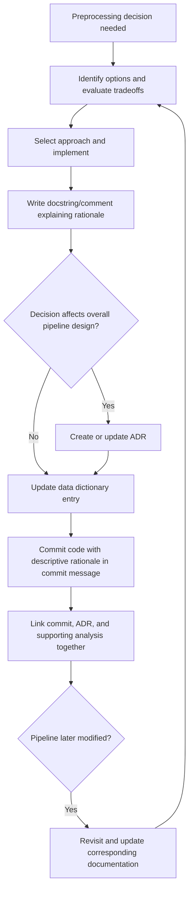

## Documenting Preprocessing Decisions

### Why Documentation Is a Distinct Deliverable

A preprocessing pipeline's code shows *what* was done, but generally does not explain *why* a particular imputation strategy, encoding scheme, or outlier threshold was chosen over alternatives. Without separate documentation, this reasoning is easily lost — to a collaborator reading the code later, to a future version of the same author who has forgotten the original justification, or to an auditor evaluating the pipeline's fairness or correctness. Documentation captures decisions and their rationale in a form that survives independently of the code's own readability.

**Key Points**
- Documentation of preprocessing decisions generally serves three audiences: collaborators maintaining the code, downstream users of the resulting model, and auditors or reviewers assessing correctness or fairness.
- Effective documentation records not just what was done, but what alternatives were considered and why they were rejected, since the rejected-alternatives reasoning is what code alone cannot convey.
- The specific tools and formats described below (docstrings, ADRs, data dictionaries) are widely used, documented conventions; claims about which format suits a particular team or project size are context-dependent.

---

### Docstrings and Inline Comments

The most immediate level of documentation lives directly alongside the code, describing what a specific transformer or function does and, where relevant, why.

```python
class OutlierClipper(BaseEstimator, TransformerMixin):
    """
    Clips numeric feature values to within n_std standard deviations of the mean.

    Rationale: Initial EDA showed several sensor reading columns contain extreme
    outliers attributable to sensor malfunction (values >10 std devs from mean),
    rather than genuine physical measurements. Clipping was chosen over removal
    to avoid reducing an already limited training set size.

    Parameters
    ----------
    n_std : float, default=3.0
        Number of standard deviations beyond which values are clipped.
    """

    def __init__(self, n_std=3.0):
        self.n_std = n_std
```

A docstring documenting rationale (as opposed to only documenting parameters and return types) is not part of any language-enforced requirement — Python does not require this content, and no library validates it — but it is common, recommended practice for capturing decisions with rejected alternatives, since that context has no other natural home once a specific transformer implementation is chosen.

```python
# Chose median over mean imputation here because 'income' is heavily right-skewed
# (skewness=3.2 in EDA notebook cell 14); mean would be pulled upward by outliers.
imputer = SimpleImputer(strategy="median")
```

Inline comments explaining a specific parameter choice, with a pointer to where the supporting analysis can be found, connect a decision to its evidence without requiring a reader to reconstruct that reasoning independently.

---

### Architecture Decision Records (ADRs) for Preprocessing

An Architecture Decision Record is a structured document format, originating in software architecture practice, that captures a single decision, its context, the options considered, and the outcome. This format extends naturally to preprocessing decisions that affect a project's overall data handling approach.

```markdown
# ADR-014: Categorical Encoding Strategy for High-Cardinality Features

## Status
Accepted

## Context
The `merchant_id` feature has approximately 45,000 unique values in the training
set. One-hot encoding would produce a feature matrix with 45,000 additional
columns, most of which would be sparse and rarely populated per row.

## Options Considered
1. One-hot encoding: rejected due to dimensionality and sparsity.
2. Target encoding: considered, but rejected due to risk of target leakage
   without careful out-of-fold encoding, which added implementation complexity
   beyond current project timeline.
3. Frequency encoding (replace each category with its occurrence count):
   selected as a simpler alternative with acceptable information retention
   for the tree-based models currently in use.
4. Embedding layer (for neural network models): deferred, since current
   models are tree-based, not neural.

## Decision
Frequency encoding will be used for `merchant_id` and other high-cardinality
categorical features (threshold: >1000 unique values).

## Consequences
- Frequency-encoded features lose direct interpretability (a specific merchant
  cannot be identified from its encoded value alone).
- If a future project phase introduces neural network models, this decision
  will need to be revisited, since embedding layers may be more appropriate
  for that model family.
```

This ADR format is a widely used, documented convention in software engineering practice, adapted here to a preprocessing-specific decision. The specific structure shown (Status, Context, Options Considered, Decision, Consequences) reflects common ADR template conventions, though exact section names vary somewhat across teams and sources. [Unverified] I cannot cite a single canonical, universally agreed specification for ADR format, since different teams and sources use varying templates; the structure shown reflects a commonly seen pattern rather than a single verified authoritative standard.

---

### Data Dictionaries and Feature Documentation

A data dictionary documents each feature's meaning, type, valid range, and any preprocessing applied to it, generally as a structured table rather than prose.

| Feature | Type | Source | Preprocessing Applied | Notes |
|---|---|---|---|---|
| `age` | numeric | user_profile table | median imputation, standard scaling | 2.3% missing in training data |
| `income` | numeric | user_profile table | median imputation, log transform, standard scaling | right-skewed; log transform applied before scaling |
| `occupation` | categorical | user_profile table | most-frequent imputation, one-hot encoding | 12 unique categories |
| `merchant_id` | categorical | transactions table | frequency encoding | see ADR-014; 45,000 unique values |
| `transaction_timestamp` | datetime | transactions table | extracted hour, day-of-week, month as separate features | original timestamp column dropped after extraction |

This table format is a plain Markdown table, which renders natively in Obsidian and most Markdown viewers without requiring HTML. Maintaining this table alongside the pipeline code (ideally generated or partially generated from the code itself, to avoid drift between documentation and implementation) is a common practice for keeping feature-level documentation current. [Inference] Whether a specific team maintains this table manually versus automatically generates it is a process choice with tradeoffs (manual documentation risks drift from actual code; automatic generation requires additional tooling investment) that depends on team size and priorities, which I cannot assess for any specific unspecified team.

---

### Documenting Assumptions and Known Limitations

Explicitly recording assumptions that the preprocessing pipeline depends on, and known limitations, helps a later reader distinguish between "this is a deliberate design tradeoff" and "this was overlooked."

```markdown
## Known Assumptions and Limitations

- **Assumption**: Input data arrives with consistent column names matching the
  training schema. No schema validation step is currently implemented; a
  renamed or missing column will cause a KeyError rather than a descriptive
  validation message.
- **Limitation**: The frequency encoding for `merchant_id` (see ADR-014) is
  fit once on the initial training set. New merchants appearing after
  deployment will receive a frequency of zero, which the current
  implementation has not been evaluated against for downstream model behavior.
- **Assumption**: Timestamps are assumed to be in UTC. No timezone conversion
  step is applied; if data sources begin providing local timestamps, temporal
  features (hour, day-of-week) would be computed incorrectly without a
  corresponding code change.
```

Recording a limitation like the second bullet above is documentation of a genuine, currently unresolved gap — stating plainly that this scenario has not been evaluated is a direct, honest characterization of the pipeline's current state, not a claim requiring a special uncertainty tag, since it describes what the code does and does not currently handle, which can be confirmed by reading the code itself.

---

### Version-Linked Documentation

Tying documentation updates to specific code changes, via commit messages or changelog entries, keeps the historical record of *why* a decision changed aligned with *when* it changed.

```
commit a3f8e21
Author: ...
Date: ...

    Switch merchant_id encoding from one-hot to frequency encoding

    One-hot encoding was producing a 45,000-column sparse matrix, causing
    memory issues during cross-validation on the full training set (see
    issue #142). Frequency encoding reduces this to a single column while
    retaining most of the predictive signal observed in feature importance
    analysis (notebook: eda/merchant_frequency_analysis.ipynb).

    See ADR-014 for full decision record.
```

A commit message that explains rationale and links to supporting analysis, rather than only describing the mechanical change ("changed encoding for merchant_id"), preserves the reasoning at the exact point in history where the change occurred. This is a documented best practice widely recommended in software engineering literature on commit message conventions, though the specific practice of a given team varies, and I cannot confirm any particular team follows this convention without direct evidence of that team's actual commit history.

---

### Common Pitfalls

- **Documenting what was done without documenting why**: a comment stating "using median imputation" without the reasoning behind that choice provides less value to a future maintainer than one that also states what alternative was considered and rejected, and why.
- **Letting documentation drift from the actual code**: a data dictionary or ADR that is not updated when the corresponding code changes becomes actively misleading, since it describes a pipeline state that no longer matches reality — this is a maintenance risk inherent to any documentation not automatically derived from code, not specific to any particular tool.
- **Documenting only the final decision without the alternatives considered**: this loses the information needed to re-evaluate the decision later if circumstances change (e.g., a new library becomes available, project constraints shift).
- **Storing documentation separately from the code it describes**: documentation kept in a wiki or a separate document system disconnected from the code repository is more likely to fall out of sync than documentation stored in the same repository and reviewed alongside code changes. [Inference] This reflects a commonly cited concern in software documentation practice; the actual degree of drift for any specific team's tooling and process is not something I can measure without direct observation of that team's practices.
- **Treating ADR or data dictionary creation as a one-time task**: preprocessing pipelines evolve, and documentation that is not revisited alongside pipeline changes accumulates the same drift risk noted above.

---

### Documentation Layers (svg_diagram)

<svg xmlns="http://www.w3.org/2000/svg" viewBox="0 0 820 280">
  <text x="410" y="24" font-size="16" font-weight="bold" text-anchor="middle" fill="#222">Documentation Layers (svg_diagram)</text>

  <rect x="290" y="50" width="240" height="55" rx="6" fill="#e8f0fe" stroke="#4a6fa5" />
  <text x="410" y="73" font-size="11" text-anchor="middle" fill="#222">Inline Comments / Docstrings</text>
  <text x="410" y="89" font-size="9" text-anchor="middle" fill="#555">closest to code, most granular</text>

  <rect x="270" y="130" width="280" height="55" rx="6" fill="#fdf3d9" stroke="#b8912f" />
  <text x="410" y="153" font-size="11" text-anchor="middle" fill="#222">Data Dictionary</text>
  <text x="410" y="169" font-size="9" text-anchor="middle" fill="#555">feature-level: type, source, preprocessing</text>

  <rect x="250" y="210" width="320" height="55" rx="6" fill="#fbe4ec" stroke="#b04a76" />
  <text x="410" y="233" font-size="11" text-anchor="middle" fill="#222">ADRs / Design Decisions</text>
  <text x="410" y="249" font-size="9" text-anchor="middle" fill="#555">project-level: rationale, alternatives, consequences</text>
</svg>

---

### Documentation Update Workflow



---

**Related Topics**
- Model cards as a documentation format extending beyond preprocessing into full model lifecycle documentation
- Automated documentation generation from pipeline code (e.g., Sphinx-based docstring extraction)
- Documenting fairness and bias considerations specific to preprocessing choices (e.g., encoding strategies for demographic features)
- Change management processes for preprocessing pipelines in regulated industries
- Linking documentation to experiment tracking systems for full decision-to-outcome traceability