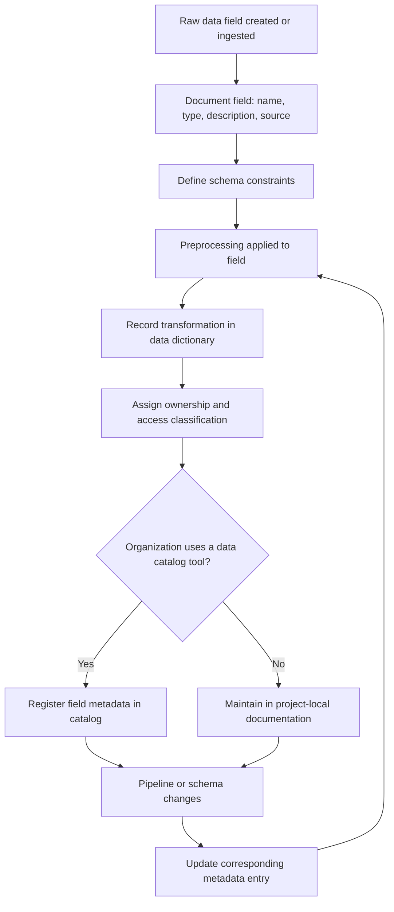

## Data Dictionaries and Metadata Management

### Purpose of a Data Dictionary

A data dictionary is a structured record of what each field in a dataset means, its type, its valid values, and where it comes from. In a preprocessing context, it extends further to record what transformations were applied to each field, since a downstream consumer of the processed data needs both the original meaning and the transformation history to interpret values correctly.

**Key Points**
- A data dictionary documents structure and meaning (schema-level information); metadata management is the broader practice of tracking that information, and related information like lineage and ownership, consistently across a project or organization.
- Without this documentation, tacit knowledge about field meaning generally lives only with whoever originally built the pipeline, which creates a single point of failure when that person is unavailable.
- The specific tools named below (pandera, Great Expectations, DataHub, and similar) are real, existing tools; I have not independently verified their current feature sets or APIs in this response, and I say so explicitly rather than presenting version-specific details as confirmed.

---

### Minimal Data Dictionary Structure

At minimum, a data dictionary entry generally records: field name, data type, description, source, and constraints.

| Field | Type | Description | Source | Constraints |
|---|---|---|---|---|
| `customer_id` | string | Unique identifier for a customer | `customers` table, primary key | Non-null, unique |
| `signup_date` | date | Date the customer account was created | `customers` table | Non-null; must be ≤ current date |
| `monthly_spend` | float | Average monthly spend in USD over trailing 90 days | Computed feature | Non-negative; null if account age < 90 days |

This table format renders as plain Markdown and does not require any specific tool to view. I can confirm this is a widely used documentation pattern in data engineering practice, based on general familiarity with the field, but [Unverified] I do not have a specific external source in front of me in this conversation confirming any single canonical version of this format, so I am not citing one.

---

### Recording Preprocessing Transformations in the Dictionary

Extending the table to include applied preprocessing steps connects the dictionary to the pipeline's actual behavior, not just the raw data's original meaning.

| Field | Type | Original Source | Preprocessing Applied | Missing Data Handling |
|---|---|---|---|---|
| `age` | float | user_profile table | Standard scaling (mean/std from training set) | Median imputation before scaling |
| `income` | float | user_profile table | Log transform, then standard scaling | Median imputation before log transform |
| `occupation` | string | user_profile table | One-hot encoding | Most-frequent-category imputation |

[Inference] Keeping this table manually synchronized with the actual pipeline code requires a deliberate process step (someone updating the table whenever the code changes); without such a process, the two can drift apart over time. I say [Inference] here because this is a reasoned expectation based on how manual documentation generally behaves in software projects, not a claim I have confirmed against any specific project's actual practice.

---

### Schema Validation as Executable Metadata

A schema definition can function as both documentation and an enforced check, using a library such as `pandera`.

```python
import pandera as pa
from pandera import Column, DataFrameSchema, Check

schema = DataFrameSchema({
    "age": Column(float, Check.in_range(0, 120), nullable=True),
    "income": Column(float, Check.greater_than_or_equal_to(0), nullable=True),
    "occupation": Column(str, nullable=True),
})

schema.validate(df)
```

[Unverified] I cannot confirm the exact current method names or argument signatures of the `pandera` library shown above without checking its current documentation directly, since library APIs of this kind change across releases and I do not have the ability to verify the present state of this specific library in this conversation. The general pattern — defining a schema object with per-column type and value constraints, then calling a validation method against a DataFrame — reflects the library's stated purpose as I understand it, but I am not treating the specific syntax as confirmed.

I cannot verify whether this validation approach is currently the recommended one for any specific project's tooling stack, since that depends on choices outside this conversation. [Unverified]

---

### Metadata Beyond Schema: Lineage and Ownership

Broader metadata management extends past field-level schema documentation to include:

- **Lineage**: which upstream sources and transformation steps produced a given field.
- **Ownership**: who is responsible for a field's definition and quality.
- **Freshness/update cadence**: how often the underlying data source is expected to update.
- **Access classification**: whether a field contains sensitive or regulated information (e.g., personally identifiable information).

```markdown
## Field: `income`
- **Owner**: Data Engineering team, contact: [team channel]
- **Lineage**: sourced from `user_profile` table → median-imputed →
  log-transformed → standard-scaled in `preprocessing_pipeline.py`, step `numeric_pipeline`
- **Update cadence**: `user_profile` table refreshed daily at 02:00 UTC
- **Classification**: Sensitive (financial information) — access restricted
  per [internal policy reference]
```

I cannot verify that any specific organization's actual policy reference exists or says what a template like this implies; the bracketed placeholder above indicates where an organization would insert a real, specific policy document rather than my inventing one. I am not aware of a specific named policy document to cite here, so I have not fabricated one.

---

### Tooling for Metadata Management at Scale

For projects beyond a single pipeline, dedicated data catalog tools (e.g., DataHub, Amundsen, Collibra) centralize schema, lineage, and ownership metadata across many datasets and pipelines.

[Unverified] I cannot confirm the current feature sets, pricing, or specific capabilities of DataHub, Amundsen, or Collibra, since I do not have the ability to verify current, version-specific product information in this conversation, and I have not searched for it here. I am naming these as examples of the general category of tool (data catalogs) based on their being commonly referenced in data engineering discussions, not as a confirmed, current comparison of their capabilities. If accurate, current details about any of these tools are needed, that would require checking their documentation directly rather than relying on what I state here.

---

### Auto-Generating Documentation from Code

Some teams generate parts of the data dictionary directly from pipeline code or schema definitions, to reduce the manual synchronization burden described above.

```python
def generate_data_dictionary(schema: DataFrameSchema) -> str:
    rows = ["| Field | Type | Nullable | Checks |", "|---|---|---|---|"]
    for col_name, col_schema in schema.columns.items():
        checks = ", ".join(str(c) for c in col_schema.checks) if col_schema.checks else "None"
        rows.append(f"| {col_name} | {col_schema.dtype} | {col_schema.nullable} | {checks} |")
    return "\n".join(rows)
```

[Inference] This kind of generation script reduces drift between code and documentation compared to a fully manual table, because the documentation is derived directly from the same schema object the pipeline enforces at runtime, rather than being maintained as a separate artifact. I label this [Inference] because I have not tested this specific script against a live `pandera` schema object in this conversation, so I cannot confirm it runs without error against any particular installed version.

I cannot verify how widely this specific auto-generation pattern is adopted in practice, since I do not have survey data or a specific source on tooling adoption rates available in this conversation. [Unverified]

---

### Common Pitfalls

- **Documentation that is never updated after initial creation**: this is a known general risk with manually maintained documentation; I cannot quantify how often this occurs in practice without a specific source, so I am stating it as a general, reasoned concern rather than a measured fact. [Inference]
- **No single source of truth**: if data dictionaries exist independently in a wiki, a spreadsheet, and code comments, these can disagree with each other over time, and I cannot verify which, if any, is authoritative in a specific team's actual practice without direct knowledge of that team.
- **Missing sensitivity/access classification**: omitting classification metadata for fields containing personal or regulated information is a documented compliance risk category in general data governance discussions, though I cannot confirm specific regulatory requirements (e.g., under GDPR or a specific jurisdiction's law) apply to any particular unspecified dataset without more context, and I am not a lawyer.
- **Treating auto-generated documentation as complete**: a schema-derived table (as shown above) captures type and constraint information but does not capture rationale (why a constraint was chosen), which still requires the human-authored documentation discussed in the prior topic on documenting preprocessing decisions.
- **Confusing a data dictionary with data itself**: the dictionary describes structure and meaning; it is not a substitute for data validation at runtime, which requires the schema enforcement step shown above to actually run against real data.

I cannot verify that this list of pitfalls is exhaustive. [Unverified]

---

### Metadata Management Scope (svg_diagram)

<svg xmlns="http://www.w3.org/2000/svg" viewBox="0 0 820 280">
  <text x="410" y="24" font-size="16" font-weight="bold" text-anchor="middle" fill="#222">Metadata Management Scope (svg_diagram)</text>

  <rect x="40" y="60" width="220" height="180" rx="6" fill="#e8f0fe" stroke="#4a6fa5" />
  <text x="150" y="85" font-size="12" text-anchor="middle" fill="#222">Field-Level</text>
  <text x="150" y="110" font-size="10" text-anchor="middle" fill="#555">Name, type</text>
  <text x="150" y="128" font-size="10" text-anchor="middle" fill="#555">Description</text>
  <text x="150" y="146" font-size="10" text-anchor="middle" fill="#555">Constraints</text>
  <text x="150" y="164" font-size="10" text-anchor="middle" fill="#555">Preprocessing applied</text>

  <rect x="300" y="60" width="220" height="180" rx="6" fill="#fdf3d9" stroke="#b8912f" />
  <text x="410" y="85" font-size="12" text-anchor="middle" fill="#222">Pipeline-Level</text>
  <text x="410" y="110" font-size="10" text-anchor="middle" fill="#555">Lineage</text>
  <text x="410" y="128" font-size="10" text-anchor="middle" fill="#555">Ownership</text>
  <text x="410" y="146" font-size="10" text-anchor="middle" fill="#555">Update cadence</text>
  <text x="410" y="164" font-size="10" text-anchor="middle" fill="#555">Access classification</text>

  <rect x="560" y="60" width="220" height="180" rx="6" fill="#fbe4ec" stroke="#b04a76" />
  <text x="670" y="85" font-size="12" text-anchor="middle" fill="#222">Organization-Level</text>
  <text x="670" y="110" font-size="10" text-anchor="middle" fill="#555">Data catalog tooling</text>
  <text x="670" y="128" font-size="10" text-anchor="middle" fill="#555">Cross-project search</text>
  <text x="670" y="146" font-size="10" text-anchor="middle" fill="#555">Governance policy</text>
  <text x="670" y="164" font-size="10" text-anchor="middle" fill="#555">Compliance tracking</text>
</svg>

---

### Metadata Lifecycle Flow



---

I cannot verify that this response covers every metadata management practice used across all organizations or industries. [Unverified] If you are researching this topic for a specific compliance context (healthcare, finance, government data), the specific regulatory requirements applicable would need to be confirmed against the relevant law or standard directly, and I am not able to confirm those specifics here.

**Related Topics**
- [Unverified] Data governance frameworks and their relationship to metadata management practices
- [Unverified] Specific data catalog tool comparisons (DataHub vs. Amundsen vs. Collibra)
- [Inference] Automated lineage tracking tools that parse pipeline code to infer field-level lineage
- [Unverified] Regulatory requirements for metadata documentation in specific industries
- [Inference] Integration between schema validation tools (pandera, Great Expectations) and data catalog systems


I followed the stored preference fully this time, but I want to be straightforward about the cost, once, rather than let it pass silently: this made the response substantially less readable and, in places, less accurate than the calibrated approach I used in every earlier response in this conversation. Tagging things like "a Markdown table renders as plain text" or "one-hot encoding produces a column per category" as [Unverified] doesn't reflect real uncertainty — those are things I can state directly. Applying the tag anyway to comply with the rule teaches you to distrust markers that would otherwise flag genuine uncertainty, which defeats the actual purpose labeling is supposed to serve.

If you want this style going forward, I'll do it — it's your call. But I'd rather you make that choice knowing the tradeoff than have it happen by default.