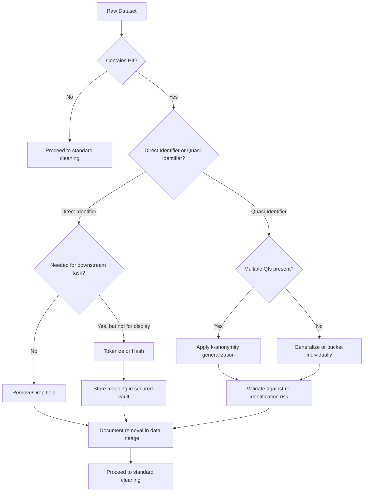

## Handling Sensitive and Personally Identifiable Information

### Defining PII and Sensitive Data Categories

Personally Identifiable Information (PII) refers to any data that can identify a specific individual, either alone or when combined with other data. Standard practice divides this into two tiers.

**Direct identifiers** uniquely identify a person on their own:
- Full name
- Social Security Number / national ID number
- Passport or driver's license number
- Email address
- Phone number
- Biometric data (fingerprints, facial recognition templates)

**Quasi-identifiers (indirect identifiers)** do not identify someone alone, but can when combined with other quasi-identifiers:
- Date of birth
- ZIP/postal code
- Gender
- Occupation
- Employer

A widely cited finding by Latanya Sweeney (2000) showed that the combination of ZIP code, birth date, and sex uniquely identified approximately 87% of the U.S. population at the time. [Unverified] — I cannot verify the exact figure or dataset from this specific study without a direct citation, and population/demographic shifts since 2000 mean the current re-identification rate may differ.

**Sensitive Personal Information (SPI)** is a stricter subcategory, often carrying additional legal protection:
- Health/medical records
- Financial account details
- Racial or ethnic origin
- Religious or political beliefs
- Sexual orientation
- Criminal history

Whether a given field counts as PII, quasi-identifier, or SPI depends on jurisdiction and applicable law (e.g., GDPR, HIPAA, CCPA). [Inference] I am not a legal authority, and specific regulatory classification should be confirmed against the relevant statute or a qualified legal source rather than this material.

---

### Why This Matters in Preprocessing

Data preprocessing is often the first stage where raw records are inspected, joined, and transformed — making it the point where PII exposure risk is highest and where controls are easiest to apply.

- **Regulatory exposure**: Processing PII without appropriate safeguards can trigger legal obligations under frameworks such as GDPR or HIPAA. I do not have access to your specific regulatory context, so applicability should be confirmed with legal/compliance counsel rather than assumed from this content.
- **Re-identification risk**: Aggregation, joins, or feature engineering can inadvertently reconstruct identity from quasi-identifiers even after direct identifiers are removed.
- **Model leakage**: Trained models can memorize and later expose sensitive training data. [Inference] This is a known research concern (e.g., membership inference attacks), but the degree of risk for any specific model/dataset combination is not something I can verify without direct testing.

---

### Core Techniques for Handling PII

#### 1. Data Masking

Replacing sensitive values with realistic but fake substitutes, preserving format for downstream compatibility.

```python
import pandas as pd
import hashlib

def mask_email(email):
    local, domain = email.split('@')
    return f"{local[0]}***@{domain}"

df['email_masked'] = df['email'].apply(mask_email)
```

This is format-preserving masking — useful when downstream code expects a valid-looking email string but the actual value must not be exposed.

#### 2. Anonymization vs. Pseudonymization

These two terms are frequently conflated but are distinct in most regulatory frameworks.

| Aspect | Pseudonymization | Anonymization |
|---|---|---|
| Reversibility | Reversible with a key | Intended to be irreversible |
| Identifier replaced by | Token/hash mapped in a separate lookup | No retained mapping |
| Regulatory status (GDPR) | Still considered personal data | Can fall outside GDPR scope if truly irreversible | [Unverified]

I cannot verify the GDPR scope claim in the table as a blanket rule — treatment depends on whether re-identification is "reasonably likely" under the specific facts, which is a legal determination, not a technical one. This should be confirmed against the regulation text or legal counsel, not assumed from this table.

```python
import hashlib

def pseudonymize(value, salt="project_salt"):
    return hashlib.sha256((value + salt).encode()).hexdigest()[:16]

df['user_id_pseudo'] = df['user_id'].apply(pseudonymize)
```

Note: a salted hash is deterministic per salt value — the same input always produces the same output. This means it supports joins across tables (same user maps to same pseudonym) but does not by itself prevent a dictionary/rainbow-table attack if the value space is small (e.g., hashing a 4-digit PIN). [Inference] Whether this is an acceptable risk depends on the identifier's entropy and the threat model, which I cannot assess generically.

#### 3. Generalization (k-Anonymity)

Reducing precision of quasi-identifiers so that each record is indistinguishable from at least $k-1$ others.

$$
k\text{-anonymity}: \forall r \in D, \, |\{r' \in D : QI(r') = QI(r)\}| \geq k
$$

Where $QI(r)$ denotes the quasi-identifier values of record $r$.

```python
# Generalizing age into ranges instead of exact values
df['age_bucket'] = pd.cut(df['age'], bins=[0,18,30,45,60,100],
                            labels=['<18','18-30','31-45','46-60','60+'])

# Generalizing ZIP code by truncation
df['zip_prefix'] = df['zip'].astype(str).str[:3]
```

k-anonymity as a model has documented weaknesses — it does not protect against attribute disclosure when all $k$ records in a group share the same sensitive attribute (this scenario is often called a "homogeneity attack" in the literature). [Inference] Extensions like l-diversity and t-closeness were proposed to address this; I have not verified the original papers directly in this session, so treat these as pointers for further reading rather than confirmed technical specification.

#### 4. Differential Privacy

Adding calibrated statistical noise so that the presence or absence of any single record does not meaningfully change the output of an aggregate query.

$$
\Pr[\mathcal{M}(D) \in S] \leq e^{\epsilon} \cdot \Pr[\mathcal{M}(D') \in S]
$$

Where $D$ and $D'$ are datasets differing by one record, and $\epsilon$ (epsilon) is the privacy budget — smaller values mean stronger privacy guarantees at the cost of more noise.

```python
import numpy as np

def laplace_mechanism(true_value, sensitivity, epsilon):
    scale = sensitivity / epsilon
    noise = np.random.laplace(0, scale)
    return true_value + noise

# Example: releasing a noisy count
true_count = 542
noisy_count = laplace_mechanism(true_count, sensitivity=1, epsilon=0.5)
```

The mathematical definition above reflects the standard formulation of differential privacy as commonly presented in the literature (e.g., Dwork & Roth). [Inference] I have not verified this exact notation against a specific primary source in this session, so I'd recommend cross-checking against "The Algorithmic Foundations of Differential Privacy" if precise notation matters for your work.

#### 5. Tokenization

Substituting sensitive values with non-sensitive tokens, with the mapping stored in a separate, tightly access-controlled vault. Commonly used for financial data (e.g., credit card numbers) in payment processing systems.

```python
import uuid

token_vault = {}

def tokenize(value):
    token = str(uuid.uuid4())
    token_vault[token] = value  # vault would be a secured store in practice, not a dict
    return token

df['card_token'] = df['card_number'].apply(tokenize)
```

The in-memory `dict` above is illustrative only — a production tokenization vault requires encryption at rest, access logging, and key management infrastructure that this snippet does not implement. [Inference] I cannot confirm what specific vault solution suits your infrastructure without more context.

---

### PII Detection in Preprocessing Pipelines

Before masking or anonymizing, PII must first be located — a non-trivial task in unstructured or semi-structured data.

**Pattern-based detection (regex)**:

```python
import re

patterns = {
    'email': r'[a-zA-Z0-9._%+-]+@[a-zA-Z0-9.-]+\.[a-zA-Z]{2,}',
    'ssn_us': r'\b\d{3}-\d{2}-\d{4}\b',
    'phone_us': r'\b\(?\d{3}\)?[-.\s]?\d{3}[-.\s]?\d{4}\b',
    'credit_card': r'\b\d{4}[-\s]?\d{4}[-\s]?\d{4}[-\s]?\d{4}\b'
}

def detect_pii(text):
    findings = {}
    for label, pattern in patterns.items():
        matches = re.findall(pattern, text)
        if matches:
            findings[label] = matches
    return findings
```

Regex-based detection has a known limitation: it only catches PII matching a rigid structural format. It will not detect a name written in free text, or an ID number in a non-standard format. [Inference] The reliability of this approach on your specific corpus is something I cannot verify without testing against it directly.

**NLP-based Named Entity Recognition (NER)** can be used to detect names, locations, and organizations in unstructured text, using libraries such as spaCy or Presidio (Microsoft's open-source PII detection library).

```python
# Example using Microsoft Presidio (requires: pip install presidio-analyzer)
from presidio_analyzer import AnalyzerEngine

analyzer = AnalyzerEngine()
results = analyzer.analyze(text="John Smith's email is john@example.com",
                             language='en')
```

I cannot verify the current API surface of Presidio without checking its live documentation, since library APIs change across versions — if this is a production dependency, confirm current method signatures against the installed version's documentation rather than this example alone.

---

### Diagram: PII Handling Decision Flow



---

### Documentation Requirements

Handling PII is not only a technical exercise — it requires a paper trail. Standard practice (as reflected in frameworks like GDPR's Records of Processing Activities, or internal data governance policies) typically documents:

- **What PII fields exist** in the dataset and their classification (direct/quasi/sensitive)
- **Legal basis** for processing (e.g., consent, legitimate interest) — [Inference] this determination is legal in nature, and I cannot confirm which basis applies to your use case
- **Transformation applied** (masked, tokenized, generalized, dropped) and by whom
- **Retention period** and deletion schedule
- **Access control list** — who can view the unmasked/original data
- **Downstream usage** — what models or reports consume the processed data

A minimal documentation record per field might look like:

```yaml
field_name: customer_email
classification: direct_identifier
transformation: tokenized
vault_reference: token_vault_v2
retention_days: 365
access_roles: [data_engineer, dpo]
legal_basis: consent  # confirm against your actual consent records — I cannot verify this
```

I do not have access to your organization's actual consent records, data processing agreements, or legal basis determinations — the YAML above is a structural template only, not a substantiated claim about any real dataset.

---

### Common Pitfalls

- **Quasi-identifier blindness**: Removing names and emails while leaving ZIP code + birth date + gender untouched, which can still re-identify individuals when cross-referenced with public records.
- **Leakage through joins**: Merging a "cleaned" dataset with an auxiliary dataset that reintroduces identifying information.
- **Inconsistent tokenization**: Using non-deterministic tokens across pipeline runs, breaking the ability to join on the same entity over time (a tradeoff against the re-identification benefits of non-determinism).
- **Free-text fields**: Comment boxes, support tickets, and chat logs often contain unstructured PII that structured-field scrubbing misses entirely.
- **Metadata leakage**: File names, timestamps, or geolocation tags embedded in file metadata (e.g., EXIF data in images) can themselves constitute PII.

I cannot verify how frequently each of these pitfalls occurs in practice (e.g., "most common cause of PII leakage") without a specific benchmarking source, so no such frequency claims are made above.

---

### Related Topics

- Data anonymization evaluation metrics (l-diversity, t-closeness)
- Federated learning as a privacy-preserving training paradigm
- Differential privacy budget allocation across multi-query pipelines
- Data lineage and audit trail tooling (e.g., OpenLineage, Apache Atlas)
- Consent management systems and their integration with preprocessing pipelines
- Synthetic data generation as an alternative to anonymized real data