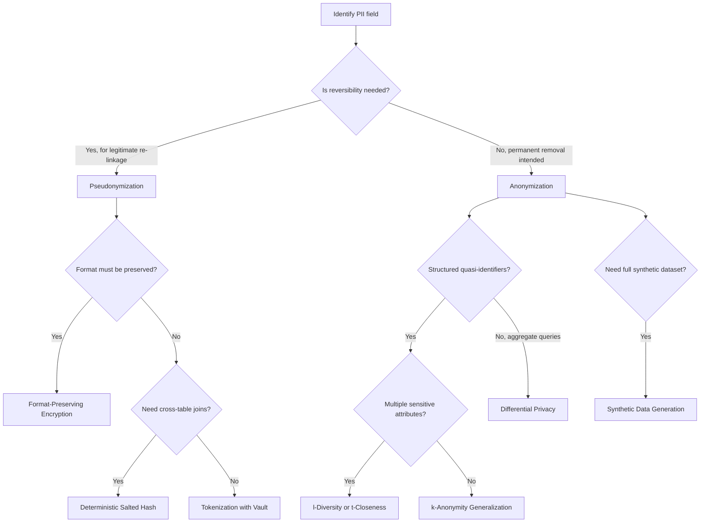

## Anonymization and Pseudonymization Techniques

### Core Distinction

**Pseudonymization** replaces identifying fields with artificial identifiers (pseudonyms), while retaining a separate mapping that allows reversal. **Anonymization** removes or transforms identifying information such that the original data subject cannot be re-identified, with no retained mapping to reverse the process.

The practical difference is reversibility: pseudonymized data remains "personal data" under most regulatory frameworks because re-identification is possible given access to the mapping key. Whether specific anonymization techniques satisfy legal standards for "anonymous" data under any given regulation is a legal determination I cannot make — that depends on jurisdiction-specific criteria and case law I do not have verified access to.

| Aspect | Pseudonymization | Anonymization |
|---|---|---|
| Reversible? | Yes, with key access | Intended not to be |
| Mapping retained? | Yes, in separate secured store | No |
| Regulatory treatment | Generally still personal data | [Unverified] — depends on jurisdiction and specific technique |

---

### Pseudonymization Techniques

#### 1. Hashing (with Salt)

A one-way function maps an identifier to a fixed-length string. Adding a salt (a fixed secret string appended before hashing) mitigates dictionary attacks against low-entropy inputs.

```python
import hashlib

def pseudonymize(value, salt):
    return hashlib.sha256((value + salt).encode()).hexdigest()[:16]

df['user_id_pseudo'] = df['user_id'].apply(lambda x: pseudonymize(x, salt="project_salt_2026"))
```

[Inference] A salted hash of a low-entropy value (e.g., a 4-digit PIN, a common name) can still be reversed via brute-force or rainbow-table lookup if the salt is exposed or the input space is small. I cannot verify the specific brute-force feasibility for any given input space without running that computation myself — this is a reasoned technical point, not a benchmarked claim.

Hashing is deterministic per salt: identical inputs produce identical outputs, which allows joins across tables on the same pseudonymized entity. This determinism is also its weakness — if the salt is compromised, all mappings can potentially be attacked in bulk. [Unverified] — I do not have a specific benchmark or study confirming attack success rates for this scenario.

#### 2. Tokenization

A random token replaces the identifier, with the original value stored in a separate, access-controlled vault. Unlike hashing, tokens carry no derivable relationship to the original value.

```python
import uuid

token_vault = {}

def tokenize(value):
    token = str(uuid.uuid4())
    token_vault[token] = value
    return token

df['account_token'] = df['account_number'].apply(tokenize)
```

The `dict` above is illustrative only. [Inference] A production vault would require encryption at rest and access logging, though I cannot confirm what specific controls apply to any system I have not inspected.

#### 3. Format-Preserving Encryption (FPE)

Encrypts a value while preserving its format (e.g., a 16-digit card number encrypts to another 16-digit string), which allows encrypted values to pass through legacy systems expecting a specific format without schema changes.

```python
# Illustrative only — requires a vetted FPE library (e.g., pyffx) in production
import pyffx

key = b'secret_key_example'
fpe = pyffx.Integer(key, length=16)
encrypted_card = fpe.encrypt(1234567890123456)
```

[Unverified] I have not verified the current API or security posture of the `pyffx` library in this session. Any cryptographic implementation should be reviewed against current, audited cryptographic standards (e.g., NIST SP 800-38G for FPE) rather than adopted from this illustrative snippet.

#### 4. Encryption with Key Separation

Standard symmetric encryption (e.g., AES) where the decryption key is stored separately from the data, often under stricter access control than the dataset itself.

```python
from cryptography.fernet import Fernet

key = Fernet.generate_key()
cipher = Fernet(key)

encrypted_value = cipher.encrypt(b"user@example.com")
decrypted_value = cipher.decrypt(encrypted_value)
```

[Inference] This differs from tokenization in that the encrypted value is mathematically derived from the original and the key — meaning key compromise directly compromises all encrypted values, whereas token vault compromise requires separate access to the vault lookup table. I have not benchmarked or formally compared the relative attack surface of these two approaches.

---

### Anonymization Techniques

#### 1. Generalization

Reducing the precision of a value so it applies to a broader group.

```python
df['age_bucket'] = pd.cut(df['age'], bins=[0,18,30,45,60,100],
                            labels=['<18','18-30','31-45','46-60','60+'])
df['zip_prefix'] = df['zip'].astype(str).str[:3]
```

#### 2. Suppression

Removing specific values or entire records that pose disproportionate re-identification risk, often because they are outliers within their quasi-identifier group.

```python
# Suppress records with rare combinations of quasi-identifiers
qi_counts = df.groupby(['zip_prefix', 'age_bucket', 'gender']).transform('size')
df_suppressed = df[qi_counts >= 5]  # threshold k=5, example only
```

#### 3. k-Anonymity

Each record is indistinguishable from at least $k-1$ others with respect to quasi-identifiers.

$$
k\text{-anonymity}: \forall r \in D, \, |\{r' \in D : QI(r') = QI(r)\}| \geq k
$$

[Inference] k-anonymity does not protect against attribute disclosure when all members of a k-sized group share the same sensitive value — a scenario referenced in the privacy literature as a homogeneity attack. I have not directly verified the originating paper in this session, so this should be treated as a pointer for independent verification rather than a confirmed citation.

#### 4. l-Diversity

An extension of k-anonymity requiring each group of records sharing quasi-identifiers to contain at least $l$ well-represented values for the sensitive attribute, addressing the homogeneity weakness above.

$$
l\text{-diversity}: \forall \text{ group } g, \, |\text{distinct sensitive values in } g| \geq l
$$

[Unverified] I cannot verify this formula against the original Machanavajjhala et al. paper directly in this session — treat this as a simplified representation of the concept rather than a verified quotation of the formal definition.

#### 5. t-Closeness

A further refinement requiring the distribution of sensitive attributes within each group to be close (within threshold $t$) to the overall distribution in the full dataset, measured typically using Earth Mover's Distance.

[Unverified] I do not have a verified source to cite for the exact mathematical formulation in this session, so no equation is presented for this one — only the conceptual description above, which I cannot confirm matches the original paper's precise definition.

#### 6. Differential Privacy

Adds calibrated noise so that a query's output does not meaningfully depend on whether any single individual's record is present.

$$
\Pr[\mathcal{M}(D) \in S] \leq e^{\epsilon} \cdot \Pr[\mathcal{M}(D') \in S]
$$

```python
import numpy as np

def laplace_mechanism(true_value, sensitivity, epsilon):
    scale = sensitivity / epsilon
    return true_value + np.random.laplace(0, scale)

noisy_count = laplace_mechanism(true_value=542, sensitivity=1, epsilon=0.5)
```

[Inference] Lower epsilon values correspond to stronger privacy guarantees at the cost of higher noise magnitude, per the standard formulation of the mechanism. I have not verified this exact notation against a specific primary source in this session — cross-check against Dwork & Roth's formal treatment if precise notation is required for your work.

#### 7. Synthetic Data Generation

Generating an entirely new dataset that preserves statistical properties of the original without any record corresponding to a real individual.

```python
# Conceptual example using a Gaussian Copula approach (requires: pip install sdv)
from sdv.single_table import GaussianCopulaSynthesizer
from sdv.metadata import SingleTableMetadata

metadata = SingleTableMetadata()
metadata.detect_from_dataframe(df)

synthesizer = GaussianCopulaSynthesizer(metadata)
synthesizer.fit(df)
synthetic_df = synthesizer.sample(num_rows=1000)
```

[Unverified] I have not verified the current API surface of the `sdv` library against its live documentation in this session — library APIs change across versions, so confirm method signatures against your installed version before relying on this example. [Inference] Synthetic data reduces but does not eliminate re-identification risk, since a synthesizer trained on real data can sometimes reproduce near-identical records, particularly for outliers underrepresented in the training distribution. I cannot quantify this risk generically without testing against a specific dataset and model.

---

### Diagram: Technique Selection Flow



---

### Comparison Table: Technique Tradeoffs

| Technique | Reversible | Preserves Utility | Cross-table Joins | Re-identification Risk |
|---|---|---|---|---|
| Salted Hash | No (theoretically) | High | Yes (deterministic) | [Unverified] — depends on input entropy |
| Tokenization | Yes (via vault) | High | Yes (via vault lookup) | Low, contingent on vault security |
| FPE | Yes (via key) | High | Yes | [Unverified] — depends on key management |
| Generalization | No | Medium | Limited | [Inference] Moderate, depends on k value |
| k-Anonymity | No | Medium | Limited | [Inference] Moderate, vulnerable to homogeneity attack |
| Differential Privacy | No | Lower (adds noise) | No (aggregate only) | [Inference] Low, bounded by epsilon |
| Synthetic Data | No | [Unverified] — varies by generator | No | [Inference] Low, but not zero |

I cannot verify the "Re-identification Risk" and "Preserves Utility" ratings above as benchmarked figures — they reflect reasoned, general technical characterizations found in common privacy engineering discussion, not measured results from a specific study or dataset.

---

### Common Pitfalls

- **Treating pseudonymization as sufficient for "anonymous" data**: Under most frameworks, pseudonymized data is still personal data because reversal is possible. [Inference] I cannot confirm this classification applies to any specific regulation without checking that regulation's text directly.
- **Composition of multiple pseudonymized fields**: Even with each field pseudonymized independently, combining several pseudonyms tied to the same individual across datasets can enable re-identification via correlation, particularly if the pseudonyms are deterministic and stable over time.
- **Weak salt management**: Reusing the same salt across projects, or storing it alongside the hashed data, undermines the protection hashing is intended to provide.
- **Ignoring auxiliary/public data**: Anonymization techniques evaluated in isolation may not hold once cross-referenced with external, publicly available datasets. [Speculation] The specific risk level depends heavily on what auxiliary data exists for a given population, which I have no way to assess generically.

---

### Related Topics

- Membership inference attacks against trained ML models
- Federated learning as a privacy-preserving training paradigm
- Data lineage and audit trail tooling for tracking transformation history
- Consent management and its interaction with anonymization pipelines
- Homomorphic encryption for privacy-preserving computation on encrypted data
- Regulatory frameworks in detail (GDPR Recital 26, HIPAA Safe Harbor method)