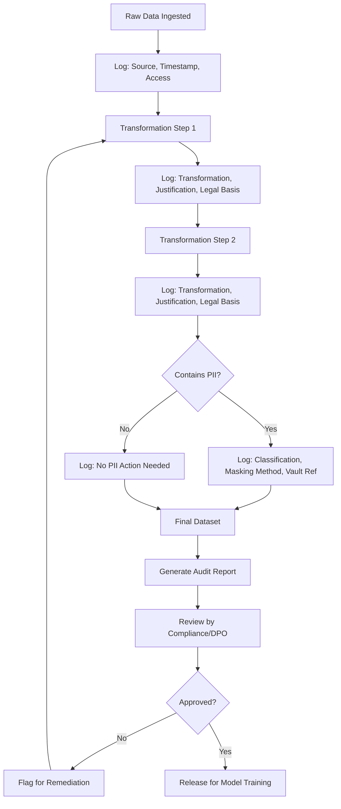

## Auditing Preprocessing Steps for Compliance

### Purpose of a Preprocessing Audit

A preprocessing audit is a systematic review of every transformation applied to data before it reaches modeling, aimed at verifying that each step is documented, justified, authorized, and reversible or explainable when required. This matters for regulatory compliance, reproducibility, and debugging model behavior traced back to a data issue.

The core question an audit answers is: **given a final training dataset, can every field be traced back to its origin, and can every transformation be justified?**

---

### What Gets Audited

#### 1. Data Lineage

The record of where each field originated and what transformations it passed through.

```python
# Example lineage record attached to a pipeline step
lineage_record = {
    "field": "customer_email",
    "source_table": "raw_customers",
    "source_column": "email_address",
    "transformations": ["lowercase", "tokenize"],
    "transformation_timestamp": "2026-06-15T10:32:00Z",
    "applied_by": "pipeline_v3.2",
    "vault_reference": "token_vault_v2"
}
```

I cannot verify that this structure matches any specific lineage tool's actual schema (e.g., OpenLineage, Apache Atlas) — this is an illustrative template, not a quotation from those tools' documentation.

#### 2. Transformation Justification

Each transformation should have a stated reason — not merely a log of *what* changed, but *why*.

| Field | Transformation | Justification |
|---|---|---|
| age | Bucketed into ranges | Reduce quasi-identifier precision for k-anonymity |
| email | Tokenized | Direct identifier, not needed downstream in raw form |
| income | Winsorized at 1st/99th percentile | Outlier mitigation for regression stability |

#### 3. Access Control Trail

Who accessed the raw, intermediate, and processed data at each pipeline stage, and under what permission.

```python
access_log_entry = {
    "user": "data_engineer_1",
    "dataset": "raw_customers_2026Q2",
    "action": "read",
    "timestamp": "2026-06-15T10:30:00Z",
    "justification_ref": "ticket_4521"
}
```

#### 4. Legal Basis Mapping

Linking each PII-processing step to a stated legal basis (e.g., consent, legitimate interest, contractual necessity). I do not have access to your organization's actual legal basis determinations, consent records, or data processing agreements — any mapping must be confirmed against real records, not generated by me.

---

### Audit Trail Implementation Pattern

A common approach is to wrap each preprocessing function so it automatically logs its inputs, outputs, and metadata.

```python
import functools
import json
from datetime import datetime

audit_log = []

def audited_step(justification, legal_basis=None):
    def decorator(func):
        @functools.wraps(func)
        def wrapper(df, *args, **kwargs):
            before_shape = df.shape
            before_columns = list(df.columns)
            result = func(df, *args, **kwargs)
            audit_log.append({
                "step": func.__name__,
                "justification": justification,
                "legal_basis": legal_basis,
                "timestamp": datetime.utcnow().isoformat(),
                "shape_before": before_shape,
                "shape_after": result.shape,
                "columns_before": before_columns,
                "columns_after": list(result.columns)
            })
            return result
        return wrapper
    return decorator

@audited_step(justification="Remove direct identifier not needed downstream",
              legal_basis="legitimate_interest")
def drop_ssn(df):
    return df.drop(columns=['ssn'])
```

[Inference] This decorator pattern is a standard Python technique for cross-cutting logging concerns, not something specific to compliance auditing — I am applying a general pattern to this use case rather than citing a documented "compliance audit pattern" from any specific source.

---

### Diagram: Audit Flow Across a Pipeline



I cannot verify that this flow matches any specific organization's actual approval process — it is a generic structural illustration, not a documented standard from a named framework.

---

### Compliance Checklist Categories

The following categories reflect commonly discussed audit dimensions in data governance literature. I cannot verify this list against a single authoritative source (e.g., a specific ISO standard or named regulation's exact checklist), so treat it as a synthesized reference point rather than a quoted requirement list.

- **Traceability**: Can every field in the final dataset be traced to a raw source?
- **Justification**: Does every transformation have a documented reason?
- **Minimization**: Was only the necessary data retained (data minimization principle)?
- **Access restriction**: Is access to unmasked/raw PII limited to authorized roles?
- **Retention compliance**: Is data deleted or archived per a defined retention schedule?
- **Reversibility documentation**: For pseudonymized fields, is the reversal mechanism itself access-controlled and logged?
- **Bias/impact review**: Were preprocessing decisions (e.g., imputation, exclusion criteria) reviewed for disparate impact on protected groups?

[Speculation] Whether all of these categories are mandatory depends entirely on which regulation(s) apply to a given organization and dataset — I do not have information about which regulations apply to your specific situation.

---

### Automated vs. Manual Audit Components

| Component | Automatable | Notes |
|---|---|---|
| Lineage logging | Yes | Can be embedded directly in pipeline code |
| Schema/field classification | Partially | Pattern-based detection catches structured PII; free text requires NER or manual review |
| Legal basis assignment | No | [Inference] Requires human legal judgment; I cannot verify this is universally true across all cases, but I am not aware of a tool that performs legal basis determination autonomously |
| Bias/impact review | Partially | Statistical disparity metrics can be automated; interpretation requires human review |
| Final sign-off | No | Typically requires a named accountable person (e.g., Data Protection Officer) |

I do not have access to information about your organization's specific roles or sign-off process — the "Data Protection Officer" reference reflects common GDPR-related terminology, not a claim about your setup.

---

### Common Pitfalls

- **Logging transformations without justification**: A log that records *what* changed but not *why* is insufficient for most compliance reviews, since it cannot demonstrate necessity or proportionality.
- **Orphaned pipeline branches**: Ad hoc exploratory notebooks that produce a dataset used in production without going through the audited pipeline.
- **Stale documentation**: Audit records that describe an earlier version of the pipeline after code has since changed, without a corresponding update.
- **Treating audit logging as a one-time setup**: [Inference] Pipelines evolve, and a logging mechanism not covering a newly added transformation step creates a silent gap in the audit trail. I cannot verify how frequently this occurs in practice, as I have no benchmarking data on this.

---

### Related Topics

- Data Protection Impact Assessments (DPIAs) and when they are required
- Model cards and datasheets for datasets as complementary documentation artifacts
- Bias and fairness auditing in preprocessing (disparate impact analysis)
- Data lineage tooling in depth (OpenLineage, Apache Atlas, Marquez)
- Retention and deletion policy automation
- Role-based access control (RBAC) design for data pipelines