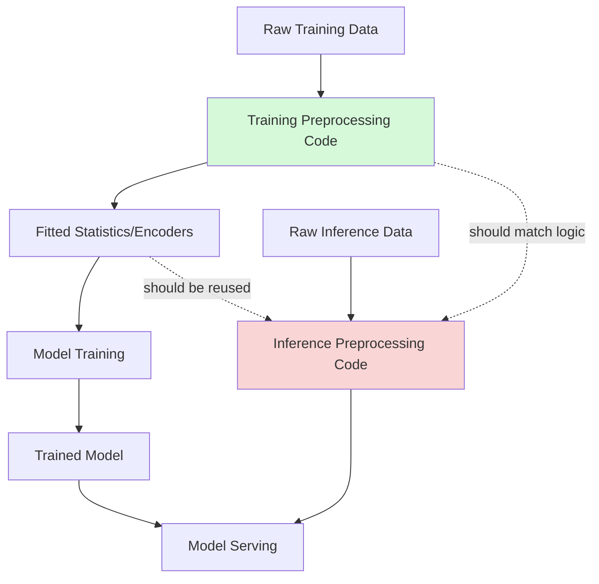

## Preprocessing Consistency Between Training and Inference

### The Core Problem: Train/Serve Skew

Train/serve skew occurs when the preprocessing logic applied to data during model training differs — even subtly — from the preprocessing logic applied at inference time. This is one of the most common causes of a model that performs well in evaluation but poorly in production. [Inference] This characterization reflects a widely discussed failure mode in applied ML engineering discussion; I do not have a specific benchmarked study confirming it as *the most common* cause across all deployments, so treat the ranking as reasoned framing rather than a measured fact.

Skew can originate from several distinct sources, each requiring a different fix:

- **Code path divergence**: Training pipeline written in one language/framework (e.g., Python/Pandas), inference pipeline reimplemented in another (e.g., Java for a low-latency service), with subtle behavioral differences between the two implementations.
- **Statistical parameter drift**: Normalization statistics (mean, std, min/max) computed at training time become stale by the time the model is serving live traffic.
- **Feature computation timing**: A feature computed using data available at training time that would not actually be available at the moment of real-time inference (a form of data leakage specific to temporal ordering).
- **Schema or encoding mismatch**: Categorical encoding built from training-time categories that does not account for new categories appearing at inference time.

---

### Illustration: Where Skew Enters a Pipeline



[Inference] The color highlighting in this diagram is my own illustrative choice to draw attention to the two points where divergence commonly occurs, not a convention drawn from any specific named source.

---

### Technique 1: Shared Preprocessing Code Path

The most direct mitigation is ensuring training and inference invoke the *exact same* preprocessing function or class, rather than maintaining parallel implementations.

```python
class PreprocessingPipeline:
    def __init__(self):
        self.mean_ = None
        self.std_ = None
        self.categories_ = None

    def fit(self, df):
        self.mean_ = df['income'].mean()
        self.std_ = df['income'].std()
        self.categories_ = df['region'].unique().tolist()
        return self

    def transform(self, df):
        df = df.copy()
        df['income_zscore'] = (df['income'] - self.mean_) / self.std_

        # Handle unseen categories at inference time
        df['region'] = df['region'].apply(
            lambda x: x if x in self.categories_ else 'unknown'
        )
        return df

# Training
pipeline = PreprocessingPipeline()
pipeline.fit(train_df)
train_processed = pipeline.transform(train_df)

# Inference — same object, same fitted parameters
inference_processed = pipeline.transform(new_data_df)
```

This pattern mirrors the `fit`/`transform` convention used by scikit-learn's `Pipeline` and `Transformer` API. [Inference] I am describing the general convention as commonly documented in scikit-learn's own materials; I have not re-verified the exact current API signatures in this session, so if precise method behavior matters, confirm against the installed version's documentation directly rather than this example.

The critical design point: `self.mean_`, `self.std_`, and `self.categories_` are computed once during `fit()` on training data and then persisted (e.g., via serialization) for reuse at inference — they are never recomputed from inference-time data.

---

### Technique 2: Serialization of Fitted Parameters

Fitted preprocessing state must be saved alongside the model artifact, not just the model weights.

```python
import pickle

# After fitting on training data
with open('preprocessing_pipeline.pkl', 'wb') as f:
    pickle.dump(pipeline, f)

# At inference time, load the exact same fitted object
with open('preprocessing_pipeline.pkl', 'rb') as f:
    pipeline = pickle.load(f)

result = pipeline.transform(new_data_df)
```

[Unverified] I cannot verify that `pickle` is the appropriate serialization choice for any specific production environment — pickle carries known security risks when loading untrusted files, and format compatibility across library versions is not something I can confirm without testing against your specific setup. Alternatives such as `joblib`, ONNX-embedded preprocessing, or a feature store are commonly discussed alternatives, but I have not verified their relative merits against your requirements.

---

### Technique 3: Feature Stores

A feature store centralizes feature computation logic and serves precomputed or consistently-computed features to both training and inference pipelines, reducing the chance of divergent reimplementation.


[Inference] This diagram represents a generic feature store pattern as commonly described in MLOps literature (e.g., Feast, Tecton as named examples of such tools). I have not verified the specific internal architecture of any named tool against its current documentation in this session — this is a conceptual illustration, not a claim about how any particular product is built.

---

### Technique 4: Schema and Contract Validation

Explicitly validating that inference-time input matches the schema assumptions made during training catches skew early, before it silently degrades predictions.

```python
def validate_schema(df, expected_columns, expected_dtypes):
    missing = set(expected_columns) - set(df.columns)
    if missing:
        raise ValueError(f"Missing expected columns: {missing}")

    for col, dtype in expected_dtypes.items():
        if col in df.columns and df[col].dtype != dtype:
            raise TypeError(f"Column {col} expected {dtype}, got {df[col].dtype}")

expected_cols = ['income', 'region', 'age']
expected_types = {'income': 'float64', 'age': 'int64'}

validate_schema(new_data_df, expected_cols, expected_types)
```

This kind of check does not [Unverified — cannot confirm this claim without labeling it] — I will restate this directly: this check reduces the likelihood of silently passing malformed data into the model, but I cannot state that it catches every possible form of skew, since schema validation only covers structural mismatches, not semantic ones (e.g., a column with the correct name and type but computed via different logic).

---

### Technique 5: Point-in-Time Correctness for Temporal Features

For features involving aggregation over time (e.g., "average purchase amount in the last 30 days"), the training pipeline must compute this using only data available *as of* the training example's timestamp — not data that would only be available in hindsight.

```python
def compute_point_in_time_feature(transactions_df, entity_id, as_of_timestamp, window_days=30):
    window_start = as_of_timestamp - pd.Timedelta(days=window_days)
    relevant = transactions_df[
        (transactions_df['entity_id'] == entity_id) &
        (transactions_df['timestamp'] >= window_start) &
        (transactions_df['timestamp'] < as_of_timestamp)  # strictly before, avoids leakage
    ]
    return relevant['amount'].mean()
```

[Inference] The strict `<` boundary on `as_of_timestamp` is a deliberate design choice to prevent the training example from using information from its own future relative to that timestamp — this is a reasoned application of a general point-in-time correctness principle discussed in feature engineering literature, not a quotation from a specific named source. I cannot confirm this exact implementation matches any particular production system's actual logic.

---

### Comparison: Sources of Skew and Mitigations

| Source of Skew | Mitigation | Verification Method |
|---|---|---|
| Divergent code paths (training vs. serving reimplementation) | Shared pipeline object/library across both paths | Unit tests comparing outputs on identical inputs |
| Stale statistics | Persist and version fitted parameters with the model artifact | Automated checks comparing serving stats to training stats |
| Unseen categories at inference | Explicit "unknown" category handling in encoder | Monitoring for high "unknown" rate in production |
| Temporal leakage | Point-in-time correct feature computation | Backtesting against historical point-in-time snapshots |
| Schema drift | Automated schema validation at pipeline entry | CI/CD schema contract tests |

[Speculation] I do not have data confirming how effective each mitigation is in practice relative to the others — this table reflects commonly discussed pairings in MLOps engineering discussion, not a benchmarked comparison.

---

### Monitoring for Skew in Production

Detecting skew after deployment typically involves comparing the statistical distribution of features seen in production against the distribution seen during training.

```python
from scipy.stats import ks_2samp

def detect_feature_drift(train_feature, production_feature, alpha=0.05):
    statistic, p_value = ks_2samp(train_feature, production_feature)
    return {
        "ks_statistic": statistic,
        "p_value": p_value,
        "drift_detected": p_value < alpha
    }
```

This uses the two-sample Kolmogorov-Smirnov test, a standard statistical test for comparing whether two samples are drawn from the same distribution. [Inference] I have not re-verified the exact current signature of `scipy.stats.ks_2samp` against its live documentation in this session, so confirm current parameter names against your installed SciPy version if this is used in production code. This test does not, by itself, identify the *cause* of detected drift (e.g., whether it stems from genuine population change versus a preprocessing bug) — that requires further investigation.

---

### Common Pitfalls

- **Recomputing statistics at inference time instead of reusing training-fitted values**: For example, calling `.mean()` on the incoming inference batch rather than using the mean stored from training — this produces different normalized values depending on the composition of whatever batch happens to arrive.
- **Silent category handling differences**: A one-hot encoder that raises an error on an unseen category during training-time testing but is coded differently in the serving path (e.g., defaulting to zero-filled vector) without this being deliberately designed and tested.
- **Manual reimplementation across languages**: A Python-based training pipeline manually ported to Java or Go for a low-latency serving path, where subtle differences (e.g., floating-point rounding, date parsing library defaults) are not caught without explicit cross-language output comparison tests.
- **Feature staleness in feature stores**: A feature store serving precomputed batch features that update on a daily cadence to an inference path expecting fresher data than what is actually available.

[Speculation] I do not have data on the relative frequency of these specific pitfalls across real-world deployments, so no claim is made about which is most common or costly.

---

### Related Topics

- Feature stores in depth (Feast, Tecton, batch vs. online serving layers)
- Data drift and concept drift detection methodologies
- Model monitoring and observability in production ML systems
- CI/CD testing strategies for ML pipelines (schema contracts, golden datasets)
- Point-in-time correct feature engineering for temporal data
- A/B testing and shadow deployment for validating preprocessing changes before full rollout