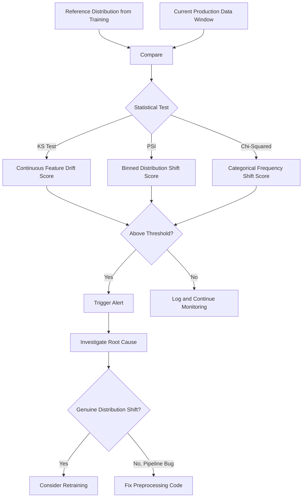

## Monitoring Data Drift After Deployment

### Defining Data Drift

Data drift refers to a change in the statistical properties of input data over time, such that the data a deployed model receives no longer matches the distribution it was trained on. This is distinct from **concept drift**, where the relationship between inputs and the target variable changes, even if the input distribution itself stays constant.

| Type | What Changes | Example |
|---|---|---|
| Data drift (covariate shift) | Distribution of input features $P(X)$ | User age distribution shifts younger over time |
| Concept drift | Relationship between features and target $P(Y\|X)$ | Same spending pattern now indicates different fraud risk |
| Label drift | Distribution of the target variable $P(Y)$ | Fraud rate itself increases over a season |

[Inference] This three-way categorization reflects a common framing in ML monitoring discussion. I cannot verify it against one single authoritative source, so treat it as a widely used conceptual breakdown rather than a quotation from a specific named paper.

---

### Why Drift Matters for Preprocessing Specifically

Preprocessing steps often depend on statistical assumptions fixed at training time — a normalization mean, a set of known categories, an outlier threshold. When the underlying data distribution shifts, these fixed assumptions can silently become inaccurate, degrading model input quality even if the model itself has not changed.

[Inference] This is a reasoned link between drift and preprocessing specifically, not a benchmarked claim about how often this occurs in practice. I do not have data confirming what proportion of production model degradation traces back to preprocessing-stage drift specifically, as opposed to other causes.

---

### Statistical Tests for Detecting Drift

#### 1. Kolmogorov-Smirnov (KS) Test — Continuous Features

Compares the empirical cumulative distribution functions of two samples to test whether they were drawn from the same distribution.

```python
from scipy.stats import ks_2samp

def detect_drift_ks(reference_data, current_data, alpha=0.05):
    statistic, p_value = ks_2samp(reference_data, current_data)
    return {
        "ks_statistic": statistic,
        "p_value": p_value,
        "drift_detected": p_value < alpha
    }
```

[Unverified] I have not re-verified the current parameter names or return signature of `scipy.stats.ks_2samp` against its live documentation in this session. If this is used in production code, confirm against your installed SciPy version's documentation directly.

#### 2. Population Stability Index (PSI) — Continuous or Binned Categorical Features

A metric commonly used in credit risk modeling to quantify how much a distribution has shifted between two time periods.

$$
PSI = \sum_{i=1}^{n} (Actual_i - Expected_i) \times \ln\left(\frac{Actual_i}{Expected_i}\right)
$$

Where $Actual_i$ and $Expected_i$ are the proportion of observations in bin $i$ for the current and reference distributions, respectively.

```python
import numpy as np

def calculate_psi(expected, actual, bins=10):
    breakpoints = np.linspace(0, 100, bins + 1)
    expected_percents = np.percentile(expected, breakpoints)
    expected_percents = np.unique(expected_percents)

    expected_counts, _ = np.histogram(expected, bins=expected_percents)
    actual_counts, _ = np.histogram(actual, bins=expected_percents)

    expected_dist = expected_counts / len(expected)
    actual_dist = actual_counts / len(actual)

    # Avoid division by zero / log(0)
    expected_dist = np.where(expected_dist == 0, 0.0001, expected_dist)
    actual_dist = np.where(actual_dist == 0, 0.0001, actual_dist)

    psi = np.sum((actual_dist - expected_dist) * np.log(actual_dist / expected_dist))
    return psi
```

[Inference] Common interpretation thresholds discussed in credit-risk modeling contexts are roughly: PSI < 0.1 indicates no significant shift, 0.1–0.25 indicates moderate shift, and > 0.25 indicates significant shift. I cannot verify these specific threshold values against one authoritative primary source in this session — different practitioners and institutions may apply different cutoffs, so I cannot confirm these are universal.

#### 3. Chi-Squared Test — Categorical Features

Tests whether the observed frequency distribution of a categorical feature differs significantly from an expected (reference) distribution.

```python
from scipy.stats import chisquare

def detect_drift_categorical(reference_counts, current_counts, alpha=0.05):
    # Both inputs should be aligned to the same category order
    statistic, p_value = chisquare(f_obs=current_counts, f_exp=reference_counts)
    return {
        "chi2_statistic": statistic,
        "p_value": p_value,
        "drift_detected": p_value < alpha
    }
```

I cannot verify the current exact API signature of `scipy.stats.chisquare` against live documentation in this session — confirm parameter names against your installed version if used in production.

#### 4. Jensen-Shannon Divergence

A symmetric, bounded measure of similarity between two probability distributions, often preferred over KL divergence for drift monitoring because it does not require the two distributions to share identical support and produces a bounded output.

$$
JSD(P \| Q) = \frac{1}{2} D_{KL}(P \| M) + \frac{1}{2} D_{KL}(Q \| M), \quad M = \frac{1}{2}(P + Q)
$$

```python
from scipy.spatial.distance import jensenshannon

def detect_drift_js(reference_dist, current_dist):
    return jensenshannon(reference_dist, current_dist)
```

[Unverified] I have not re-verified this formula against a specific primary source in this session, nor the current `scipy.spatial.distance.jensenshannon` API signature. This is a reasoned reconstruction of the standard mathematical definition as commonly presented in statistics references, not a confirmed quotation.

---

### Diagram: Drift Detection Pipeline



I cannot verify that this flow matches any specific named monitoring platform's actual internal architecture — this is a generic conceptual illustration.

---

### Monitoring Architecture Considerations

#### Reference Window Selection

The "reference" distribution used for comparison is typically either the original training distribution or a more recent rolling window (e.g., "last known good" period). [Inference] Using a rolling reference window can help detect gradual drift relative to a fixed training-time snapshot, though I cannot quantify how much better this approach performs without a specific benchmarked comparison, which I do not have access to.

#### Granularity of Monitoring

| Granularity | What It Catches | Limitation |
|---|---|---|
| Per-feature univariate | Individual feature distribution shifts | Misses correlated multi-feature shifts |
| Multivariate (e.g., PCA-based) | Shifts in joint feature relationships | [Unverified] — harder to interpret which specific feature is responsible |
| Prediction distribution monitoring | Shifts in model output distribution | Does not distinguish between input drift and genuine change in underlying phenomenon |

I cannot verify the comparative effectiveness of these approaches against each other without a specific benchmarked study, which I do not have access to in this session.

#### Alert Thresholding

```python
class DriftMonitor:
    def __init__(self, reference_data, feature_name, threshold=0.1):
        self.reference_data = reference_data
        self.feature_name = feature_name
        self.threshold = threshold

    def check(self, current_data):
        psi_score = calculate_psi(self.reference_data, current_data)
        return {
            "feature": self.feature_name,
            "psi_score": psi_score,
            "alert": psi_score > self.threshold
        }
```

[Inference] Setting the threshold value itself requires domain judgment balancing false-positive alert fatigue against the risk of missing genuine drift — I cannot recommend a specific universal threshold value, since the appropriate cutoff depends on the specific feature, business context, and acceptable risk tolerance, none of which I have information about for your use case.

---

### Distinguishing Genuine Drift from Pipeline Bugs

Not every detected distributional shift indicates real-world change — some are artifacts of upstream pipeline changes. [Inference] Based on general data engineering reasoning, common non-drift causes of a detected shift include: an upstream schema change silently altering a column's encoding, a change in an external data provider's data format, a timezone handling bug affecting timestamp-derived features, or a change in how missing values are encoded upstream (e.g., empty string vs. null). I do not have data confirming the relative frequency of these causes versus genuine drift in real-world deployments.

---

### Common Pitfalls

- **Comparing against a stale or inappropriate reference window**: Using a reference distribution from a seasonally atypical period as the baseline for year-round comparison can produce persistent false alerts.
- **Alerting on every statistically significant test result**: With large production data volumes, statistical tests like KS or chi-squared can detect even trivially small distributional differences as "significant," leading to alert fatigue if p-values are the sole trigger rather than a combined magnitude-and-significance threshold.
- **Monitoring only univariate feature distributions**: [Inference] Multivariate or joint-relationship shifts between features can occur even when each individual feature's marginal distribution appears stable — I cannot quantify how common this specific scenario is without a benchmarked study.
- **No root-cause workflow after alert triggers**: An alerting system without a defined investigation process can result in alerts being acknowledged but not acted upon.

I do not have information confirming the relative frequency of these pitfalls across real-world deployments.

---

### Related Topics

- Concept drift detection and adaptive learning strategies
- Model retraining triggers and automated retraining pipelines
- Feature store monitoring and staleness detection
- Explainability tools for root-causing drift alerts (e.g., SHAP value distribution shifts)
- A/B testing frameworks for validating retrained models before full rollout
- Outlier and anomaly detection as a complementary monitoring layer