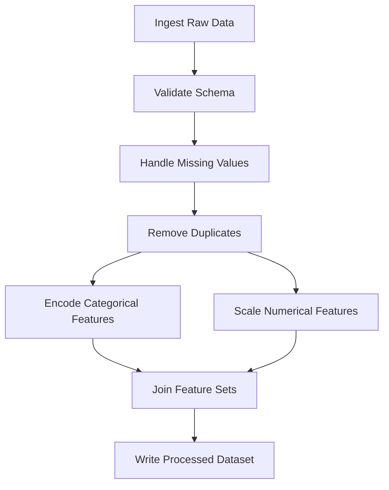

## Automating Preprocessing Workflows

### Why Automate Preprocessing

Manual, notebook-driven preprocessing tends to be difficult to reproduce, easy to apply inconsistently between runs, and hard to schedule. Automating these steps into a defined pipeline addresses those specific issues by making each transformation an explicit, versioned, and repeatable unit of work.

[Inference] The framing above is a reasoned characterization of commonly discussed motivations in data engineering practice, not a quotation from a specific named source.

---

### Core Components of an Automated Pipeline

#### 1. Directed Acyclic Graph (DAG) Structure

Preprocessing steps are typically modeled as a DAG, where each node is a transformation and edges represent dependencies — a step cannot run until its upstream dependencies complete.



#### 2. Orchestration Tools

Common tools used to schedule and execute such DAGs include Apache Airflow, Prefect, and Dagster. [Unverified] I cannot verify the current feature sets, pricing, or API details of these tools against their live documentation in this session — if choosing between them for a specific project, I'd recommend checking each tool's current documentation directly rather than relying on this list.

#### 3. Idempotency

A well-designed automated step should be idempotent — running it multiple times on the same input produces the same output, without side effects accumulating from repeated execution.

```python
def deduplicate_step(df):
    # Idempotent: running this twice on already-deduplicated data
    # produces the same result as running it once
    return df.drop_duplicates(subset=['user_id', 'event_timestamp'])
```

[Inference] I am describing idempotency as a design property of this specific function based on its logic (dropping duplicates is stable under repeated application) — I have not tested this function in a live pipeline, so this is reasoned from the code's structure rather than empirically confirmed behavior.

---

### Example: Airflow-Style DAG Definition

```python
# Illustrative structure only — syntax reflects general Airflow conventions
# I cannot verify this matches the current Airflow API version without checking
# live documentation, since APIs change across major versions.

from airflow import DAG
from airflow.operators.python import PythonOperator
from datetime import datetime

def validate_schema_task(**kwargs):
    df = kwargs['ti'].xcom_pull(task_ids='ingest_data')
    # validation logic
    return df

def handle_missing_task(**kwargs):
    df = kwargs['ti'].xcom_pull(task_ids='validate_schema')
    df = df.fillna(df.mean(numeric_only=True))
    return df

with DAG('preprocessing_pipeline',
         schedule_interval='@daily',
         start_date=datetime(2026, 1, 1),
         catchup=False) as dag:

    ingest = PythonOperator(task_id='ingest_data', python_callable=lambda: None)
    validate = PythonOperator(task_id='validate_schema', python_callable=validate_schema_task)
    handle_missing = PythonOperator(task_id='handle_missing', python_callable=handle_missing_task)

    ingest >> validate >> handle_missing
```

[Unverified] I have not verified this code against a live Airflow installation in this session — the exact current API (e.g., whether `schedule_interval` is still the correct parameter name in the latest version, or has been renamed) should be confirmed against the specific Airflow version you are using before relying on this as a template.

---

### Scikit-learn Pipeline Objects as a Lightweight Automation Layer

For preprocessing tightly coupled to a single model training workflow (as opposed to a broader data engineering DAG), scikit-learn's `Pipeline` class chains preprocessing and modeling steps into a single fittable object.

```python
from sklearn.pipeline import Pipeline
from sklearn.preprocessing import StandardScaler, OneHotEncoder
from sklearn.compose import ColumnTransformer
from sklearn.impute import SimpleImputer
from sklearn.linear_model import LogisticRegression

numeric_features = ['age', 'income']
categorical_features = ['region']

numeric_transformer = Pipeline(steps=[
    ('imputer', SimpleImputer(strategy='mean')),
    ('scaler', StandardScaler())
])

categorical_transformer = Pipeline(steps=[
    ('imputer', SimpleImputer(strategy='most_frequent')),
    ('onehot', OneHotEncoder(handle_unknown='ignore'))
])

preprocessor = ColumnTransformer(transformers=[
    ('num', numeric_transformer, numeric_features),
    ('cat', categorical_transformer, categorical_features)
])

full_pipeline = Pipeline(steps=[
    ('preprocessor', preprocessor),
    ('classifier', LogisticRegression())
])

full_pipeline.fit(X_train, y_train)
predictions = full_pipeline.predict(X_test)
```

[Unverified] I have not re-verified the current parameter names and default values (e.g., `handle_unknown='ignore'`) against the live scikit-learn documentation for the version you may be using in this session. Confirm against your installed version before relying on this as final code.

This pattern automates consistency between training and inference automatically, since `full_pipeline` bundles the fitted preprocessing state together with the model in a single serializable object. [Inference] This is a reasoned description of the mechanism (a single fitted object reduces the chance of separately-maintained code diverging) — I have not benchmarked how much this reduces train/serve skew incidents in practice, and I am not claiming it eliminates that risk entirely.

---

### Testing Automated Pipelines

#### Unit Tests for Individual Transformation Steps

```python
import pandas as pd

def test_handle_missing_values():
    df = pd.DataFrame({'income': [50000, None, 70000]})
    result = df.fillna(df.mean(numeric_only=True))
    assert result['income'].isna().sum() == 0
    assert result['income'].iloc[1] == 60000.0
```

#### Schema Contract Tests

```python
def test_output_schema(df):
    expected_columns = {'income_scaled', 'region_encoded', 'user_id'}
    assert expected_columns.issubset(set(df.columns))
```

#### Data Quality Assertions Embedded in the Pipeline

Libraries such as Great Expectations allow declarative data quality checks to be embedded directly as pipeline steps, failing the run if incoming data violates defined expectations.

```python
# Illustrative only — I cannot verify the current Great Expectations API
# against live documentation in this session
import great_expectations as ge

df_ge = ge.from_pandas(df)
result = df_ge.expect_column_values_to_not_be_null('user_id')
```

[Unverified] I have not confirmed this code against the current Great Expectations API version. This library has undergone significant API changes across versions historically, based on general awareness of the project — I cannot confirm the current state of that API without checking live documentation directly.

---

### Versioning Preprocessing Logic

Automated pipelines should be versioned alongside the data and model artifacts they produce, so that a given model can always be traced back to the exact preprocessing code that generated its training data.

```python
pipeline_metadata = {
    "pipeline_version": "v2.3.1",
    "git_commit_hash": "a1b2c3d4",
    "fitted_timestamp": "2026-06-20T14:00:00Z",
    "input_schema_hash": "e5f6g7h8"
}
```

[Inference] Including a schema hash alongside the version allows detecting whether the input schema has changed since the pipeline was fitted, without necessarily requiring a full schema diff — this is a reasoned design suggestion based on common versioning practice, not a claim that this specific metadata structure is used by any particular named tool.

---

### Diagram: Automation Maturity Levels


[Speculation] This progression represents one possible framing of maturity stages commonly discussed in MLOps material. I cannot verify this against a single authoritative source, and organizations may not progress through these stages linearly or may skip stages entirely.

---

### Common Pitfalls

- **Hardcoded file paths or credentials in pipeline code**: Makes the pipeline fragile across environments (development, staging, production) and a security risk if credentials are committed to version control.
- **No failure alerting**: A scheduled job that fails silently can result in stale or missing processed data being used downstream without anyone noticing until a much later stage catches the problem.
- **Tight coupling between preprocessing and a specific model version**: Preprocessing logic embedded directly inside model training code makes it difficult to reuse the same preprocessing for a different model or to update the model without also touching preprocessing.
- **Missing data quality gates**: A pipeline that transforms and forwards data without validating it first can propagate corrupted or malformed data further downstream before detection.

[Speculation] I do not have data confirming the relative frequency of these specific pitfalls across real-world deployments, so no claim is made about which is most common or costly.

---

### Related Topics

- Great Expectations and other data quality validation frameworks in depth
- CI/CD practices specifically adapted for ML pipelines (MLOps)
- Feature stores as a complementary automation layer for feature computation
- Pipeline versioning and reproducibility with tools like DVC (Data Version Control)
- Orchestration tool comparison (Airflow vs Prefect vs Dagster) in depth
- Automated rollback and circuit-breaker patterns for production pipeline failures