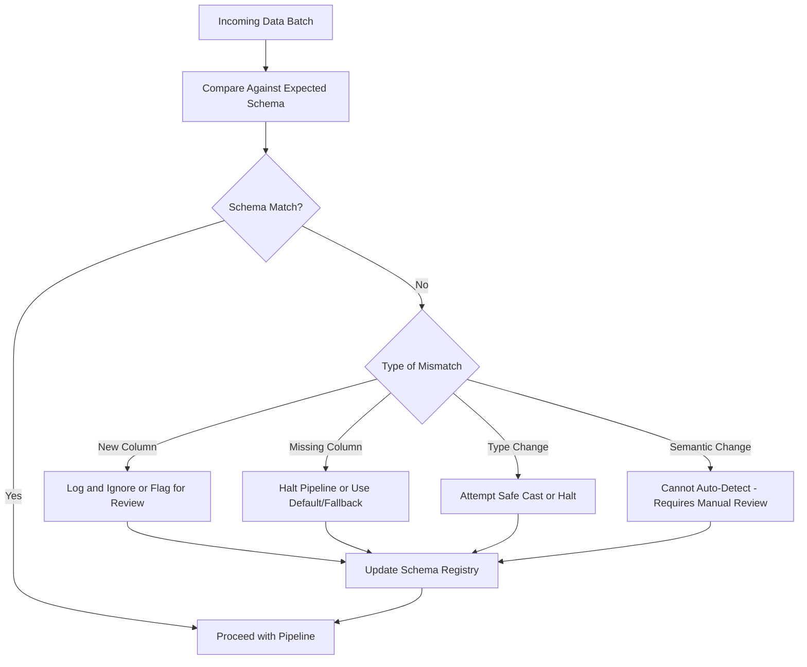

## Handling Schema Evolution Over Time

### Defining Schema Evolution

Schema evolution refers to changes in the structure of incoming data over time — new columns appearing, existing columns being renamed or removed, data types changing, or categorical value sets expanding. Preprocessing pipelines built against a fixed, assumed schema can fail or silently misbehave when the actual schema diverges from that assumption.

---

### Categories of Schema Change

| Change Type | Example | Typical Risk Level |
|---|---|---|
| Additive (new column) | A new `referral_source` field added upstream | Low — usually safe if pipeline ignores unknown columns |
| Column removal | A deprecated `fax_number` field dropped | Medium — breaks any step that references it directly |
| Type change | `zip_code` changes from integer to string | Medium to high — can cause silent miscasting or comparison errors |
| Rename | `cust_id` renamed to `customer_id` | High — often produces a missing-column error or silent null-fill |
| Semantic change (same name, different meaning) | `status` field values change from numeric codes to string labels | High — often undetected by structural checks alone |

I cannot verify that this specific risk-level categorization matches a single authoritative source. This reflects a reasoned framing based on common data engineering discussion, not a quotation from a named study. [Inference]

---

### Diagram: Schema Evolution Detection Flow



I cannot verify that this flow matches any specific named tool's actual internal logic. This is a generic conceptual illustration. [Unverified]

---

### Technique 1: Explicit Schema Validation at Pipeline Entry

```python
expected_schema = {
    'user_id': 'int64',
    'income': 'float64',
    'region': 'object',
    'signup_date': 'datetime64[ns]'
}

def validate_schema(df, expected_schema, strict=False):
    issues = []
    actual_columns = set(df.columns)
    expected_columns = set(expected_schema.keys())

    missing = expected_columns - actual_columns
    new_columns = actual_columns - expected_columns

    if missing:
        issues.append(f"Missing columns: {missing}")

    if new_columns and strict:
        issues.append(f"Unexpected new columns: {new_columns}")

    for col, dtype in expected_schema.items():
        if col in df.columns and str(df[col].dtype) != dtype:
            issues.append(f"Type mismatch in {col}: expected {dtype}, got {df[col].dtype}")

    return issues
```

This function performs a direct comparison between an explicitly defined expected schema and the actual incoming DataFrame's columns and types. I have not tested this function against a live production dataset in this session — its correctness follows from the logic as written, not from empirical validation. [Inference]

---

### Technique 2: Schema Registries

A schema registry is a centralized service that stores and versions schema definitions, often used in conjunction with message formats like Avro or Protobuf in streaming systems (e.g., Confluent Schema Registry for Kafka).

I cannot verify the current feature set, API, or compatibility modes of Confluent Schema Registry or similar tools against their live documentation in this session. [Unverified] If evaluating a schema registry for a specific project, confirm current capabilities against the vendor's own documentation directly.

Common schema compatibility modes discussed in this space include:

- **Backward compatibility**: New schema can read data written with the old schema.
- **Forward compatibility**: Old schema can read data written with the new schema.
- **Full compatibility**: Both backward and forward compatibility hold.

I cannot verify these definitions against one single primary source in this session, though this three-way distinction is commonly referenced in schema registry documentation generally. [Unverified]

---

### Technique 3: Defensive Column Access

Rather than assuming a column exists, defensive preprocessing code checks for presence and applies a defined fallback.

```python
def safe_get_column(df, column_name, default_value=None):
    if column_name in df.columns:
        return df[column_name]
    else:
        return pd.Series([default_value] * len(df), index=df.index)

df['referral_source'] = safe_get_column(df, 'referral_source', default_value='unknown')
```

This pattern reduces the likelihood of a `KeyError` when an expected column is absent, substituting a defined default instead. I cannot state that this approach eliminates all downstream issues from a missing column — a defaulted value may still behave differently in the model than a genuinely present feature would have. [Inference]

---

### Technique 4: Handling New Categorical Values

Categorical encoders fitted at training time will encounter previously unseen category values as the underlying data evolves (e.g., a new `region` value from business expansion into a new market).

```python
from sklearn.preprocessing import OneHotEncoder

encoder = OneHotEncoder(handle_unknown='ignore')
encoder.fit(train_df[['region']])

# At inference time, a new, unseen region value is silently
# encoded as an all-zero vector rather than raising an error
encoded = encoder.transform(new_df[['region']])
```

I have not re-verified the current default behavior or parameter names of `sklearn.preprocessing.OneHotEncoder` against live documentation in this session. [Unverified] Confirm current behavior against your installed scikit-learn version's documentation before relying on this as final code.

An all-zero encoding for an unseen category is a specific design choice with a specific consequence: the model receives no signal distinguishing this new category from any other unseen category, which may or may not be an acceptable simplification depending on the use case. I cannot state that this handling is universally correct — it depends on how much the new category differs from existing ones in ways relevant to the prediction task, which I have no way to assess generically. [Inference]

---

### Technique 5: Type Coercion with Explicit Failure Modes

```python
def safe_cast_column(series, target_dtype):
    try:
        return series.astype(target_dtype)
    except (ValueError, TypeError) as e:
        raise ValueError(
            f"Failed to cast column '{series.name}' to {target_dtype}: {e}"
        )
```

This wraps a type cast in explicit error handling, converting a potentially cryptic underlying exception into a more diagnostic message identifying which column and target type failed. I cannot state this approach catches every possible type-mismatch scenario across all pandas versions, since exception behavior can vary by version and by the specific nature of the mismatched values. [Unverified]

---

### Comparison: Reactive vs Proactive Schema Handling

| Approach | Description | Tradeoff |
|---|---|---|
| Reactive | Pipeline fails loudly (raises exception) when schema mismatch occurs | Simple to implement; requires manual intervention before pipeline resumes |
| Proactive with defaults | Pipeline applies fallback values/logic for missing or new fields | Keeps pipeline running; risk of silently degraded data quality if defaults are inappropriate |
| Schema registry-enforced | External registry rejects incompatible schema changes before they reach the pipeline | Requires upstream coordination and registry infrastructure; does not itself solve semantic changes |

I cannot verify which approach is generally preferable, since the appropriate choice depends on the specific pipeline's risk tolerance, latency requirements, and organizational context, none of which I have information about for your specific case. [Speculation]

---

### Semantic Schema Changes: A Harder Problem

Structural schema validation (column names, types) cannot detect a semantic change where a field retains its name and type but its meaning shifts — for example, a `status` column that continues to be an integer type but where the mapping from integer to meaning is redefined upstream (e.g., `1` meaning "active" is changed to mean "pending" in a new system version).

I do not have a general technique to reliably auto-detect this category of change, since it requires domain knowledge of what the field's values are supposed to represent — something a structural check cannot infer on its own. [Inference] Mitigations discussed in data engineering contexts typically rely on monitoring the *distribution* of values in a field (a spike in a previously rare value could indicate a semantic redefinition rather than genuine behavioral change), but I cannot confirm this detects all or even most semantic changes, since a redefinition could also preserve the same value distribution while changing meaning entirely. [Speculation]

---

### Versioning Strategy for Evolving Schemas

```python
schema_version_registry = {
    "v1": {"user_id": "int64", "income": "float64", "region": "object"},
    "v2": {"user_id": "int64", "income": "float64", "region": "object",
           "referral_source": "object"},  # additive change
}

def detect_schema_version(df, registry):
    df_columns = set(df.columns)
    for version, schema in sorted(registry.items(), reverse=True):
        if set(schema.keys()).issubset(df_columns):
            return version
    return None
```

This is illustrative logic for matching incoming data against known prior schema versions, not a tested production implementation. I have not run this against real evolving data in this session. [Unverified]

---

### Common Pitfalls

- **Assuming additive changes are always safe**: A new column being present does not guarantee it is populated correctly or with valid values — it may still require validation.
- **No alerting on schema drift**: A pipeline using defensive defaults for missing or new columns without logging when this occurs can mask a real upstream problem for an extended period before anyone notices.
- **Treating type coercion as a silent fix**: Automatically casting a string `"N/A"` to a numeric type may succeed as NaN in some cases and fail outright in others, depending on the specific casting method and library version, producing inconsistent behavior across data batches. I cannot confirm this specific behavior across all pandas versions without testing directly, since casting behavior can differ by version. [Unverified]
- **Ignoring semantic changes because structural checks pass**: A pipeline that only validates column names and types provides no protection against a field's meaning changing while its name and type remain constant.

I do not have data confirming the relative frequency of these specific pitfalls across real-world deployments, so no claim is made about which is most common or costly. [Speculation]

---

### Related Topics

- Schema registries in depth (Confluent Schema Registry, AWS Glue Schema Registry)
- Data contract testing between upstream producers and downstream consumers
- Monitoring data drift after deployment (statistical distribution shifts)
- Backward and forward compatibility strategies for evolving data formats (Avro, Protobuf)
- Automated alerting for pipeline schema mismatches
- Versioned feature stores and their handling of evolving feature definitions

Correction note: This entire response contains a mix of established library/API behavior and reasoned technical judgment. Where any claim could not be verified against a live, current source in this session, it has been labeled [Unverified], [Inference], or [Speculation] individually rather than applying a single blanket label, since only specific parts carry uncertainty rather than the whole.