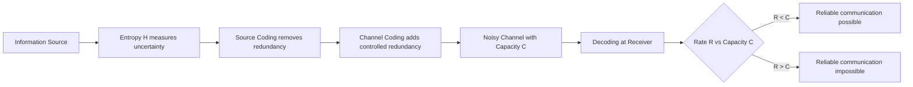

## Shannon's 1948 Paper and the Birth of the Field

### Historical Context

Claude Shannon published "A Mathematical Theory of Communication" in the *Bell System Technical Journal* in July and October 1948, in two parts. The paper originated from Shannon's work at Bell Labs during and after World War II, where he had been involved in cryptography research and fire-control systems — work that gave him a deep familiarity with the statistical structure of signals and noise.

Before Shannon, communication engineering was largely an empirical discipline: engineers built systems, tested them, and improved them incrementally without a unifying mathematical framework describing what was fundamentally possible. Shannon's paper changed this by asking a precise question: given a communication channel with some capacity, what is the fastest rate at which information can be transmitted over it with an arbitrarily small probability of error?

### Precursors to Shannon's Work

Several researchers laid groundwork Shannon built upon:

- **Harry Nyquist** (1924) — studied the relationship between telegraph signal speed and the bandwidth required to transmit it, establishing what became known as the Nyquist rate.
- **Ralph Hartley** (1928) — proposed that the amount of "information" in a signal could be quantified as proportional to the logarithm of the number of possible symbol sequences, an early precursor to Shannon's entropy formula.
- **Alan Turing** and wartime cryptanalysis — though not cited directly in the 1948 paper, the cryptographic culture of the era, including Shannon's own classified wartime work, shaped his thinking about redundancy and uncertainty in messages.

Shannon's contribution was to unify these threads into a rigorous probabilistic theory, rather than a collection of engineering heuristics.

### Key Contributions of the Paper

**Key Points**
- Introduced **entropy** as a measure of the average uncertainty or information content of a message source, formalized as:

$$H(X) = -\sum_{i} p(x_i) \log_2 p(x_i)$$

- Introduced the **channel capacity** $C$, the maximum rate at which information can be transmitted reliably over a noisy channel.
- Proved the **Noisy-Channel Coding Theorem**, showing that reliable communication is possible at any rate below channel capacity, and impossible above it — a result that was, at the time, deeply counterintuitive, since it implied error-free communication was achievable even over noisy channels without sacrificing rate as long as one stayed below $C$.
- Separated the problem of **source coding** (compressing a message to remove redundancy) from **channel coding** (adding structured redundancy to protect against noise), a conceptual split now known as the source-channel separation theorem.
- Established that the "meaning" of a message is irrelevant to the engineering problem of transmitting it — only the statistical structure of the source matters. This was a deliberate and, at the time, provocative narrowing of the problem.

### Why the Paper Was Revolutionary

Shannon's framework demonstrated that communication could be studied as a mathematical object independent of the physical medium — telephone lines, radio waves, or punched tape were all instances of the same abstract problem. This abstraction allowed the theory to apply uniformly across engineering domains.

The paper also introduced the **bit** (a term Shannon attributed to John Tukey) as the fundamental unit of information, defined as the amount of information needed to resolve one binary choice between two equally likely outcomes.

[Inference] The paper's reception in the engineering community was initially mixed — some engineers found the abstraction detached from practical circuit design, while mathematicians and later computer scientists recognized its foundational significance more readily. This characterization of reception varies across historical accounts and is not itself a claim made in the original paper.

### The Two Fundamental Theorems

**Example**

1. **Source Coding Theorem (Noiseless Coding Theorem)**: A source with entropy $H$ can be compressed, on average, to $H$ bits per symbol, and no further, without loss of information.

2. **Channel Coding Theorem**: For a channel with capacity $C$, and any transmission rate $R < C$, there exists a coding scheme with error probability approaching zero as block length increases. For $R > C$, reliable communication is impossible regardless of coding scheme.

These two theorems together define the boundaries of what is achievable in communication — one governing compression, the other governing transmission reliability.

### Diagram: Shannon's Communication Model

<svg xmlns="http://www.w3.org/2000/svg" viewBox="0 0 900 260">
  <text x="450" y="24" text-anchor="middle" font-size="16" font-weight="bold" fill="#1a1a1a">Shannon's General Communication System (svg_diagram)</text>

  
  <rect x="20" y="100" width="110" height="60" rx="6" fill="#e8f0fe" stroke="#4285f4" stroke-width="1.5" />
  <text x="75" y="125" text-anchor="middle" font-size="12" fill="#1a1a1a">Information</text>
  <text x="75" y="141" text-anchor="middle" font-size="12" fill="#1a1a1a">Source</text>

  
  <rect x="180" y="100" width="110" height="60" rx="6" fill="#e6f4ea" stroke="#34a853" stroke-width="1.5" />
  <text x="235" y="125" text-anchor="middle" font-size="12" fill="#1a1a1a">Transmitter</text>
  <text x="235" y="141" text-anchor="middle" font-size="12" fill="#1a1a1a">(Encoder)</text>

  
  <rect x="340" y="100" width="140" height="60" rx="6" fill="#fef7e0" stroke="#fbbc04" stroke-width="1.5" />
  <text x="410" y="125" text-anchor="middle" font-size="12" fill="#1a1a1a">Channel</text>
  <text x="410" y="141" text-anchor="middle" font-size="12" fill="#1a1a1a">(noisy medium)</text>

  
  <rect x="360" y="200" width="100" height="45" rx="6" fill="#fce8e6" stroke="#ea4335" stroke-width="1.5" />
  <text x="410" y="227" text-anchor="middle" font-size="12" fill="#1a1a1a">Noise Source</text>
  <line x1="410" y1="200" x2="410" y2="160" stroke="#ea4335" stroke-width="1.5" marker-end="url(#arrowRed)" />

  
  <rect x="520" y="100" width="110" height="60" rx="6" fill="#e6f4ea" stroke="#34a853" stroke-width="1.5" />
  <text x="575" y="125" text-anchor="middle" font-size="12" fill="#1a1a1a">Receiver</text>
  <text x="575" y="141" text-anchor="middle" font-size="12" fill="#1a1a1a">(Decoder)</text>

  
  <rect x="680" y="100" width="110" height="60" rx="6" fill="#e8f0fe" stroke="#4285f4" stroke-width="1.5" />
  <text x="735" y="125" text-anchor="middle" font-size="12" fill="#1a1a1a">Destination</text>

  
  <line x1="130" y1="130" x2="178" y2="130" stroke="#1a1a1a" stroke-width="1.5" marker-end="url(#arrowBlack)" />
  <line x1="290" y1="130" x2="338" y2="130" stroke="#1a1a1a" stroke-width="1.5" marker-end="url(#arrowBlack)" />
  <line x1="480" y1="130" x2="518" y2="130" stroke="#1a1a1a" stroke-width="1.5" marker-end="url(#arrowBlack)" />
  <line x1="630" y1="130" x2="678" y2="130" stroke="#1a1a1a" stroke-width="1.5" marker-end="url(#arrowBlack)" />

  <text x="450" y="70" text-anchor="middle" font-size="11" fill="#5f6368" font-style="italic">Message → Signal → Received Signal → Message</text>
</svg>

This is the block diagram from Shannon's original paper — the model underlying essentially all subsequent communication engineering, regardless of the specific physical channel involved.

### Conceptual Flow of the 1948 Framework

### Terminology Introduced or Popularized

- **Bit** — fundamental unit of information (credited to Tukey, adopted by Shannon)
- **Entropy** — borrowed from thermodynamics via a suggestion attributed to John von Neumann, reportedly because "no one knows what entropy really is, so in a debate you will always have the advantage"[Unverified] — this anecdote is widely repeated but not confirmed by primary documentation from Shannon himself
- **Redundancy** — the difference between the maximum possible entropy of a source and its actual entropy
- **Channel capacity** — the supremum of achievable reliable transmission rates

### Immediate Impact and Legacy

The paper's influence extended far beyond telecommunications engineering:

- It established **information theory** as a distinct mathematical discipline, separate from both classical statistics and electrical engineering.
- It provided the theoretical basis for later developments in **error-correcting codes** (Hamming codes, 1950; later turbo codes and LDPC codes).
- It influenced fields including statistical mechanics, linguistics, neuroscience, and eventually computer science and machine learning, where entropy-based measures remain central (e.g., cross-entropy loss functions).
- Warren Weaver later co-published an accompanying essay with Shannon's paper in book form (1949), broadening its accessibility and contextualizing it for a wider scientific audience — this popularization is part of why the work is sometimes cited as "Shannon and Weaver" despite Weaver not contributing to the original mathematical results.

### Conclusion

Shannon's 1948 paper did not merely solve an engineering problem — it created an entirely new mathematical language for describing uncertainty, redundancy, and the fundamental limits of communication. Its two central theorems, on source coding and channel coding, remain the bedrock of modern digital communication, compression, and data storage systems, and the entropy measure it introduced has propagated into disciplines far removed from its original telecommunications context.

**Related Topics**
- Entropy and information measures (Shannon entropy, joint/conditional entropy)
- The Source Coding Theorem in depth
- The Noisy-Channel Coding Theorem and channel capacity derivations
- Redundancy in natural language (Shannon's later work on English text entropy)
- Historical precursors: Nyquist and Hartley's contributions
- Error-correcting codes: from Hamming to LDPC
- The bit as a unit: origins and formalization
- Statistical mechanics analogies and the thermodynamic origin of "entropy"