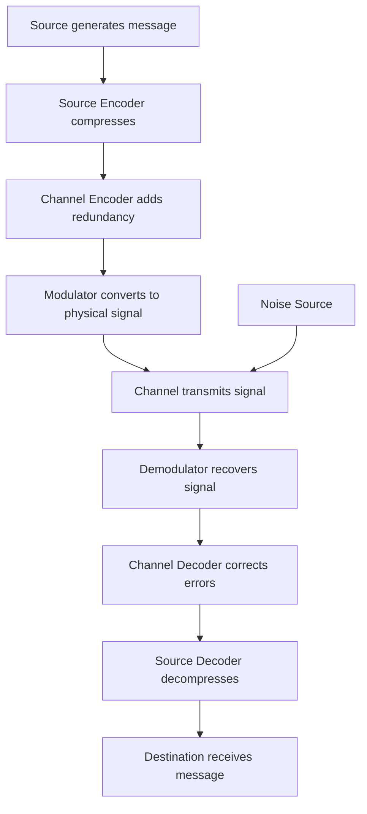

## The Communication System Model: Source, Channel, Receiver

### Overview

Shannon's general model of communication decomposes any communication system into a small set of functional blocks, each representing a distinct mathematical role. This abstraction is what allows the same theory to describe a telephone call, a stored file on a hard drive, a satellite transmission, or a DNA sequencing read-out — the physical medium changes, but the underlying blocks and their statistical relationships do not.

### The Five Core Components

**Key Points**

1. **Information Source** — the origin of the message, modeled as a random process generating symbols according to some probability distribution. The source could be a human speaker, a sensor, a text document, or an image.
2. **Transmitter (Encoder)** — converts the message into a signal suitable for transmission over the channel. This typically involves two conceptually separate stages: source coding (compression) and channel coding (error protection).
3. **Channel** — the physical or logical medium through which the signal travels. The channel is characterized by how it transforms an input signal into an output signal, including the introduction of noise or distortion.
4. **Receiver (Decoder)** — attempts to reconstruct the original message from the received, possibly corrupted, signal.
5. **Destination** — the intended recipient of the message, human or machine.

A sixth implicit component, the **noise source**, is treated as a separate stochastic process that interacts with the channel, injecting uncertainty between what is transmitted and what is received.

### Formal Characterization of Each Block

**Information Source**

Modeled as a discrete or continuous random variable (or a stochastic process, for sequences of symbols). For a discrete memoryless source emitting symbols from alphabet $\mathcal{X}$ with probability distribution $p(x)$, the source is fully characterized by:

$$H(X) = -\sum_{x \in \mathcal{X}} p(x) \log_2 p(x)$$

This entropy quantifies the average information content per symbol emitted.

**Channel**

A channel is formally defined by a conditional probability distribution $p(y|x)$ — the probability of receiving symbol $y$ given that symbol $x$ was transmitted. This single object captures all the statistical behavior of noise, distortion, and interference in the medium.

The channel's capacity is defined as:

$$C = \max_{p(x)} I(X;Y)$$

where $I(X;Y)$ is the mutual information between the channel input and output, and the maximization is taken over all possible input distributions $p(x)$.

**Encoder and Decoder**

The encoder maps source messages to codewords; the decoder maps received (possibly corrupted) codewords back to estimated messages. [Inference] In practice, real-world systems often blur the clean separation between source and channel coding for efficiency reasons, even though Shannon's separation theorem shows this is not necessary for optimality in the idealized case — this is an engineering observation about implementation practice rather than a claim within the original theorem.

### Diagram: Expanded Model with Noise

<svg xmlns="http://www.w3.org/2000/svg" viewBox="0 0 900 320">
  <text x="450" y="26" text-anchor="middle" font-size="16" font-weight="bold" fill="#1a1a1a">Expanded Communication Model with Encoding Stages (svg_diagram)</text>

  <rect x="20" y="120" width="100" height="55" rx="6" fill="#e8f0fe" stroke="#4285f4" stroke-width="1.5" />
  <text x="70" y="152" text-anchor="middle" font-size="11" fill="#1a1a1a">Source</text>

  <rect x="160" y="120" width="110" height="55" rx="6" fill="#e6f4ea" stroke="#34a853" stroke-width="1.5" />
  <text x="215" y="145" text-anchor="middle" font-size="10" fill="#1a1a1a">Source Encoder</text>
  <text x="215" y="160" text-anchor="middle" font-size="9" fill="#5f6368">(compression)</text>

  <rect x="310" y="120" width="110" height="55" rx="6" fill="#e6f4ea" stroke="#34a853" stroke-width="1.5" />
  <text x="365" y="145" text-anchor="middle" font-size="10" fill="#1a1a1a">Channel Encoder</text>
  <text x="365" y="160" text-anchor="middle" font-size="9" fill="#5f6368">(error protection)</text>

  <rect x="460" y="120" width="120" height="55" rx="6" fill="#fef7e0" stroke="#fbbc04" stroke-width="1.5" />
  <text x="520" y="145" text-anchor="middle" font-size="11" fill="#1a1a1a">Channel</text>
  <text x="520" y="160" text-anchor="middle" font-size="9" fill="#5f6368">p(y|x)</text>

  <rect x="620" y="120" width="110" height="55" rx="6" fill="#e6f4ea" stroke="#34a853" stroke-width="1.5" />
  <text x="675" y="145" text-anchor="middle" font-size="10" fill="#1a1a1a">Channel Decoder</text>

  <rect x="770" y="120" width="105" height="55" rx="6" fill="#e8f0fe" stroke="#4285f4" stroke-width="1.5" />
  <text x="822" y="152" text-anchor="middle" font-size="11" fill="#1a1a1a">Destination</text>

  <rect x="470" y="220" width="100" height="45" rx="6" fill="#fce8e6" stroke="#ea4335" stroke-width="1.5" />
  <text x="520" y="247" text-anchor="middle" font-size="11" fill="#1a1a1a">Noise</text>
  <line x1="520" y1="220" x2="520" y2="176" stroke="#ea4335" stroke-width="1.5" marker-end="url(#arrowRed2)" />

  <line x1="120" y1="147" x2="158" y2="147" stroke="#1a1a1a" stroke-width="1.5" marker-end="url(#arrowBlack2)" />
  <line x1="270" y1="147" x2="308" y2="147" stroke="#1a1a1a" stroke-width="1.5" marker-end="url(#arrowBlack2)" />
  <line x1="420" y1="147" x2="458" y2="147" stroke="#1a1a1a" stroke-width="1.5" marker-end="url(#arrowBlack2)" />
  <line x1="580" y1="147" x2="618" y2="147" stroke="#1a1a1a" stroke-width="1.5" marker-end="url(#arrowBlack2)" />
  <line x1="730" y1="147" x2="768" y2="147" stroke="#1a1a1a" stroke-width="1.5" marker-end="url(#arrowBlack2)" />

  <text x="215" y="200" text-anchor="middle" font-size="9" fill="#5f6368" font-style="italic">removes redundancy</text>
  <text x="365" y="200" text-anchor="middle" font-size="9" fill="#5f6368" font-style="italic">adds structured redundancy</text>
</svg>

### The Separation Theorem

A central and somewhat surprising result of Shannon's framework is the **source-channel separation theorem**: for point-to-point communication, it is asymptotically optimal to design the source encoder and channel encoder independently, rather than jointly. The source encoder compresses the message down to its entropy rate; the channel encoder adds redundancy back in a structured way to protect against the specific noise characteristics of the channel.

**Example**

Consider transmitting a text file over a noisy wireless link:

1. **Source coding stage**: A compression algorithm (e.g., conceptually similar to Huffman or arithmetic coding) removes statistical redundancy from the English text, shrinking it toward its entropy rate.
2. **Channel coding stage**: An error-correcting code (e.g., a Reed-Solomon or LDPC code) adds carefully structured redundancy back, designed specifically to withstand the noise statistics of the wireless channel.
3. **Transmission**: The encoded signal passes through the channel, picking up noise.
4. **Decoding**: The channel decoder first removes transmission errors using the redundancy from step 2, then the source decoder reconstructs the original text using the compression scheme from step 1.

This two-stage separation, proven asymptotically optimal by Shannon, greatly simplified system design — engineers could design compression algorithms and error-correcting codes independently without loss of overall efficiency, at least in the idealized single-user, point-to-point case. [Inference] For multi-user or networked scenarios, joint source-channel coding can sometimes outperform strict separation, though this extension goes beyond the original 1948 result — this is a well-established finding in later network information theory literature, not part of Shannon's original paper.

### Discrete vs. Continuous Channels

The model applies to both:

- **Discrete channels** — finite input/output alphabets (e.g., binary symmetric channel), characterized by a transition probability matrix.
- **Continuous channels** — real-valued inputs/outputs, typically with additive noise (e.g., the Additive White Gaussian Noise, or AWGN, channel), where capacity is given by the Shannon-Hartley theorem:

$$C = B \log_2\left(1 + \frac{S}{N}\right)$$

where $B$ is bandwidth, $S$ is signal power, and $N$ is noise power.

### Mermaid: Signal Path Through the Model

### Why This Abstraction Matters

The power of the source-channel-receiver model lies in its **medium independence**. The same mathematical machinery describes:

- Voice transmission over copper telephone wire
- Digital data over fiber optics
- Data stored on a hard drive or SSD (where "transmission" is through time rather than space, and "noise" is physical degradation or bit rot)
- Deep-space communication with extreme noise and delay
- Biological signal transduction (used analogically in some neuroscience and genetics contexts)

This generality is why information theory, despite originating in a telecommunications engineering context, became foundational across such a broad range of scientific and technical fields.

### Conclusion

The source-channel-receiver model provides the structural skeleton for nearly all subsequent work in information theory. By formally separating the roles of message generation, compression, protective encoding, transmission, and reconstruction, Shannon's model enabled each stage to be analyzed, optimized, and bounded independently — a decomposition that remains the organizing principle of digital communication system design today.

**Related Topics**
- Discrete memoryless channels and channel transition matrices
- The binary symmetric channel and binary erasure channel
- Mutual information and channel capacity derivation
- The Shannon-Hartley theorem for continuous channels
- Source coding techniques: Huffman coding, arithmetic coding
- Channel coding techniques: Hamming codes, convolutional codes, LDPC codes
- Joint source-channel coding and its use cases
- Network information theory and multi-user channels