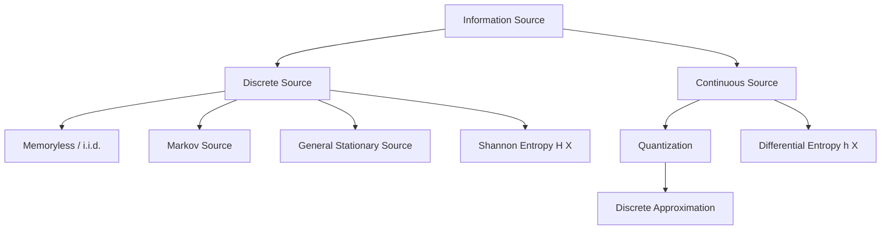

## Discrete vs. Continuous Information Sources

### Overview

Information sources are classified by the nature of the symbol space they generate. This distinction determines which mathematical tools apply — discrete sources are analyzed with sums and probability mass functions, while continuous sources require integrals, probability density functions, and a modified notion of entropy. The distinction is foundational because entropy behaves qualitatively differently across the two cases.

### Discrete Information Sources

**Key Points**

- A discrete source emits symbols from a finite or countably infinite alphabet $\mathcal{X} = \{x_1, x_2, \ldots, x_n\}$.
- Each symbol occurs according to a probability mass function $p(x_i)$, with $\sum_i p(x_i) = 1$.
- Entropy is well-defined and non-negative:

$$H(X) = -\sum_{i} p(x_i) \log_2 p(x_i) \geq 0$$

- Examples: text characters, DNA base pairs (A, C, G, T), digital sensor readings after quantization, dice rolls, coin flips.

Discrete sources are further classified by their statistical dependency structure:

1. **Memoryless (i.i.d.) sources** — each symbol is independent of previous symbols; the source is fully described by a single distribution $p(x)$.
2. **Markov sources** — the probability of each symbol depends on some finite number of preceding symbols (a Markov chain of some order).
3. **Stationary sources** — the statistical properties of the source do not change over time, though symbols may still be dependent (a generalization that includes Markov sources as a special case).

### Continuous Information Sources

**Key Points**

- A continuous source emits values from an uncountable set, typically an interval of the real numbers, described by a probability density function $f(x)$.
- The direct analogue of Shannon entropy, called **differential entropy**, is defined as:

$$h(X) = -\int_{-\infty}^{\infty} f(x) \log_2 f(x)\, dx$$

- Examples: analog voltage signals, temperature readings before quantization, audio waveforms, radio signal amplitudes.

### The Critical Difference: Differential Entropy Is Not a Direct Analogue

This is one of the more conceptually important — and frequently misunderstood — aspects of information theory. Differential entropy, despite its formal resemblance to discrete entropy, does **not** share all of the same properties:

- **Differential entropy can be negative.** Unlike discrete entropy, which is always $\geq 0$, $h(X)$ can take negative values depending on the density $f(x)$. For example, a uniform distribution on a very narrow interval $[0, \epsilon]$ with $\epsilon < 1$ produces negative differential entropy.
- **Differential entropy is not invariant under change of variables.** If you rescale or transform a continuous random variable, its differential entropy changes in a way that depends on the transformation's Jacobian — discrete entropy has no such dependency, since relabeling discrete symbols never changes $H(X)$.
- **Differential entropy is not, strictly speaking, a measure of absolute information content** in the same sense as discrete entropy; it is better understood as a measure relative to a reference (the uniform density on an interval), and is primarily useful in differences and in mutual information expressions, where the problematic terms cancel out.

[Inference] Because of these properties, many textbooks caution against interpreting differential entropy values in isolation and instead emphasize differences in differential entropy (e.g., in mutual information calculations), where the pathological behaviors largely cancel. This is a common pedagogical framing across information theory texts rather than a formally proven universal rule.

### Comparison Table

| Property | Discrete Source | Continuous Source |
|---|---|---|
| Symbol space | Finite / countable | Uncountable (real interval) |
| Distribution | Probability mass function $p(x)$ | Probability density function $f(x)$ |
| Entropy measure | Shannon entropy $H(X)$ | Differential entropy $h(X)$ |
| Sign of entropy | Always $\geq 0$ | Can be negative |
| Invariance under relabeling/transformation | Invariant | Not invariant |
| Units | Bits (base 2) | Bits, but scale-dependent |
| Typical examples | Text, DNA, quantized sensor data | Audio waveforms, analog voltages |

### Diagram: Discrete vs. Continuous Entropy Behavior

<svg xmlns="http://www.w3.org/2000/svg" viewBox="0 0 900 340">
  <text x="450" y="26" text-anchor="middle" font-size="16" font-weight="bold" fill="#1a1a1a">Discrete Entropy vs Differential Entropy Behavior (svg_diagram)</text>

  
  <rect x="40" y="60" width="380" height="240" rx="8" fill="#f8f9fa" stroke="#dadce0" stroke-width="1" />
  <text x="230" y="90" text-anchor="middle" font-size="13" font-weight="bold" fill="#1a1a1a">Discrete Source</text>

  
  <rect x="80" y="220" width="30" height="50" fill="#4285f4" />
  <rect x="130" y="180" width="30" height="90" fill="#4285f4" />
  <rect x="180" y="240" width="30" height="30" fill="#4285f4" />
  <rect x="230" y="150" width="30" height="120" fill="#4285f4" />
  <rect x="280" y="200" width="30" height="70" fill="#4285f4" />
  <line x1="60" y1="270" x2="380" y2="270" stroke="#5f6368" stroke-width="1" />
  <text x="230" y="290" text-anchor="middle" font-size="10" fill="#5f6368">p(x) over discrete symbols</text>
  <text x="230" y="115" text-anchor="middle" font-size="11" fill="#34a853">H(X) ≥ 0 always</text>

  
  <rect x="480" y="60" width="380" height="240" rx="8" fill="#f8f9fa" stroke="#dadce0" stroke-width="1" />
  <text x="670" y="90" text-anchor="middle" font-size="13" font-weight="bold" fill="#1a1a1a">Continuous Source</text>

  <path d="M 510 270 Q 600 130 690 200 T 830 270" fill="none" stroke="#ea4335" stroke-width="2.5" />
  <line x1="500" y1="270" x2="840" y2="270" stroke="#5f6368" stroke-width="1" />
  <text x="670" y="290" text-anchor="middle" font-size="10" fill="#5f6368">f(x) probability density</text>
  <text x="670" y="115" text-anchor="middle" font-size="11" fill="#ea4335">h(X) can be negative</text>
</svg>

### Quantization: The Bridge Between the Two

In practice, continuous sources are almost always processed digitally, which requires **quantization** — mapping continuous values onto a finite discrete alphabet. This introduces **quantization error**, an unavoidable loss of information whose magnitude relates directly to the number of quantization levels chosen.

**Example**

Consider an analog audio signal with amplitude in $[-1, 1]$:

1. The continuous signal has a differential entropy $h(X)$ determined by its amplitude distribution.
2. Quantizing to $n$ discrete levels (e.g., 16-bit audio uses $2^{16}$ levels) produces a discrete approximation.
3. As the number of quantization levels increases, the discrete entropy of the quantized signal approaches $h(X) + \log_2(\Delta)^{-1}$-type relationships, where $\Delta$ is the quantization step size — the exact relationship depends on the quantizer design. [Inference] This asymptotic relationship between differential entropy and quantized discrete entropy is standard in rate-distortion theory but requires care in stating precisely, as the correction term depends on the specific quantization scheme used.
4. Finer quantization (smaller $\Delta$) reduces quantization error but requires more bits per sample to represent.

This trade-off between quantization resolution and bit rate is central to practical audio, image, and video compression systems.

### Mermaid: Classification of Information Sources

### Practical Implications

- **Digital communication systems** (most modern systems) ultimately operate on discrete representations, even when the original source is continuous (e.g., voice, images), because physical transmission and storage hardware operate on discrete symbols.
- **Discrete entropy** is used to determine the theoretical minimum bit rate for lossless compression of discrete data (e.g., text files, already-quantized sensor logs).
- **Rate-distortion theory** extends the source coding framework to continuous sources, formalizing the trade-off between compression rate and the amount of distortion introduced by quantization — this is necessary because continuous sources generally cannot be losslessly compressed to a finite number of bits per symbol.

### Conclusion

The discrete/continuous distinction is not merely a matter of mathematical convenience — it reflects a genuine difference in how information content behaves under each model. Discrete entropy provides an absolute, non-negative measure of uncertainty, while differential entropy is a relative quantity whose interpretation requires more care. Understanding this distinction is essential before moving into rate-distortion theory, quantization design, and the compression of real-world analog signals.

**Related Topics**
- Differential entropy: properties and pitfalls in detail
- Rate-distortion theory and the rate-distortion function
- Quantization schemes: uniform, non-uniform, and vector quantization
- Markov sources and entropy rate of stochastic processes
- Nyquist-Shannon sampling theorem and its relation to source discretization
- Mutual information for continuous random variables
- Lossy vs. lossless compression trade-offs