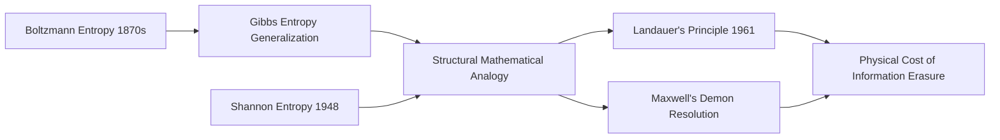

## Relationship to Thermodynamics and Statistical Mechanics

### Overview

The term "entropy," chosen by Shannon for his measure of information uncertainty, was not a coincidence of naming — it reflects a genuine mathematical kinship with the entropy of statistical mechanics developed by Ludwig Boltzmann and J. Willard Gibbs nearly a century earlier. Understanding this connection illuminates both the historical origins of the term and the deeper structural parallels between physical disorder and informational uncertainty.

### The Naming Origin

**Key Points**

- Shannon initially considered calling his measure "uncertainty" rather than "entropy."
- The choice of the term "entropy" is commonly attributed to a suggestion by John von Neumann, who reportedly told Shannon that the mathematical form of his formula already matched entropy in statistical mechanics, and that calling it "entropy" would give him a rhetorical advantage in arguments, since almost no one truly understands what physical entropy means.[Unverified] — this anecdote is widely repeated in secondary and popular sources but is not confirmed by a primary written record from Shannon or von Neumann themselves, and different tellings of the quote vary.
- Regardless of the anecdote's precise accuracy, the mathematical resemblance between the two formulas is real and well documented, not merely a naming coincidence.

### Boltzmann Entropy

Boltzmann's statistical mechanics entropy is defined as:

$$S = k_B \ln W$$

where $k_B$ is Boltzmann's constant and $W$ is the number of microstates consistent with a given macrostate. This formula, engraved on Boltzmann's tombstone, quantifies the number of ways a physical system's microscopic configuration can produce the same observable macroscopic state.

### Gibbs Entropy

A more general formulation, due to Gibbs, extends this to systems where microstates are not equally probable:

$$S = -k_B \sum_i p_i \ln p_i$$

where $p_i$ is the probability of the system being in microstate $i$. This formula is structurally identical to Shannon entropy, differing only by the constant $k_B$ (Boltzmann's constant) and the choice of logarithm base:

$$H(X) = -\sum_i p_i \log_2 p_i$$

**Key Points**

- Gibbs entropy uses the natural logarithm ($\ln$) and is scaled by $k_B$ (a physical constant with units of energy/temperature), reflecting its physical dimensionality.
- Shannon entropy uses $\log_2$ by convention (to produce results in bits) and has no physical scaling constant, since it is a dimensionless, purely mathematical measure of uncertainty.
- The structural identity — both are the negative expectation of the log-probability — is what motivated Shannon's use of the term "entropy," beyond just the naming anecdote.

### Diagram: Structural Parallel Between the Two Entropies

<svg xmlns="http://www.w3.org/2000/svg" viewBox="0 0 900 260">
  <text x="450" y="26" text-anchor="middle" font-size="16" font-weight="bold" fill="#1a1a1a">Gibbs Entropy vs Shannon Entropy — Structural Comparison (svg_diagram)</text>

  <rect x="60" y="70" width="350" height="150" rx="8" fill="#fef7e0" stroke="#fbbc04" stroke-width="1.5" />
  <text x="235" y="100" text-anchor="middle" font-size="13" font-weight="bold" fill="#1a1a1a">Statistical Mechanics</text>
  <text x="235" y="140" text-anchor="middle" font-size="15" fill="#1a1a1a">S = -k_B ∑ p_i ln p_i</text>
  <text x="235" y="175" text-anchor="middle" font-size="11" fill="#5f6368">Measures physical disorder</text>
  <text x="235" y="195" text-anchor="middle" font-size="11" fill="#5f6368">over microstates</text>

  <rect x="490" y="70" width="350" height="150" rx="8" fill="#e8f0fe" stroke="#4285f4" stroke-width="1.5" />
  <text x="665" y="100" text-anchor="middle" font-size="13" font-weight="bold" fill="#1a1a1a">Information Theory</text>
  <text x="665" y="140" text-anchor="middle" font-size="15" fill="#1a1a1a">H = -∑ p_i log2 p_i</text>
  <text x="665" y="175" text-anchor="middle" font-size="11" fill="#5f6368">Measures uncertainty</text>
  <text x="665" y="195" text-anchor="middle" font-size="11" fill="#5f6368">over source symbols</text>

  <line x1="410" y1="145" x2="488" y2="145" stroke="#5f6368" stroke-width="1.5" stroke-dasharray="4,3" />
  <text x="449" y="135" text-anchor="middle" font-size="10" fill="#5f6368">structural</text>
  <text x="449" y="150" text-anchor="middle" font-size="10" fill="#5f6368">analogy</text>
</svg>

### Conceptual Parallels and Distinctions

**Key Points**

- **Maximization principle**: Both entropies are maximized under a uniform distribution — a physical system is most disordered when all microstates are equally likely, and a source carries maximum information per symbol when all outcomes are equally probable.
- **Additivity**: Both entropies are additive for independent (sub)systems — the joint entropy of two independent systems/sources equals the sum of their individual entropies.
- **Second Law parallel**: The thermodynamic Second Law states that entropy of an isolated system tends to increase over time. [Inference] Whether this has a direct informational analogue is a genuinely contested question — some treatments in physics of computation and thermodynamics of information (e.g., Landauer's principle) draw substantive connections, while others emphasize that Shannon entropy, being about a communication source rather than a physical system evolving in time, does not have a directly analogous "increasing" dynamic in the general case. This remains an area of active discussion across physics and information theory literature rather than a settled equivalence.

### Points of Genuine Physical Connection

Beyond the formal mathematical analogy, there are documented physical links between information and thermodynamic entropy:

- **Landauer's Principle** (1961): erasing one bit of information in a physical system requires a minimum energy dissipation of $k_B T \ln 2$, where $T$ is the temperature of the system. This establishes a genuine physical cost associated with information erasure, connecting abstract information-theoretic bits to real thermodynamic energy.
- **Maxwell's Demon thought experiment**: a hypothetical being that could sort molecules to decrease entropy without doing work, seemingly violating the Second Law. The resolution of this paradox, developed over decades (notably by Leó Szilárd and later Rolf Landauer and Charles Bennett), relies on information-theoretic reasoning — the demon's need to measure and then erase information about molecule velocities incurs an entropy cost that restores consistency with the Second Law.

**Example**

Szilárd's simplified single-molecule engine (1929) illustrates the connection: a demon that gains one bit of information about which side of a container a molecule is in can, in principle, extract $k_B T \ln 2$ of work from the system. This result predates Shannon's 1948 paper and is often cited as an early precursor linking information and thermodynamic work, though Szilárd did not use Shannon's specific formalism.

### Table: Formal Comparison

| Property | Boltzmann/Gibbs Entropy (Physics) | Shannon Entropy (Information Theory) |
|---|---|---|
| Formula | $S = -k_B \sum p_i \ln p_i$ | $H = -\sum p_i \log_2 p_i$ |
| Units | Joules/Kelvin (physical) | Bits (dimensionless) |
| Subject | Microstates of a physical system | Symbols from an information source |
| Maximized by | Uniform distribution over microstates | Uniform distribution over symbols |
| Physical constant | $k_B$ (Boltzmann's constant) | None |
| Time evolution | Governed by the Second Law (non-decreasing in isolated systems) | No general built-in time-evolution law |

### Mermaid: Conceptual Bridge

### Why the Analogy Matters — and Its Limits

The entropy analogy is valuable because it connects information theory to a well-established physical framework, lending it conceptual weight and enabling cross-pollination between fields (e.g., the thermodynamics of computation, quantum information theory). However, it is important not to overstate the equivalence:

- Shannon entropy applies to any probability distribution over any set of symbols, with no inherent physical interpretation required.
- Physical entropy is tied to actual microstates of matter and energy, governed by physical laws like the Second Law of Thermodynamics.
- The connection becomes most rigorous and least metaphorical specifically in the domain of the **thermodynamics of computation**, where information processing is treated as a physical process subject to physical constraints (as in Landauer's principle).

### Conclusion

The relationship between Shannon entropy and thermodynamic entropy is both a historical curiosity — rooted in a naming anecdote involving von Neumann — and a genuine mathematical and physical connection. The formulas are structurally identical up to constants, both are maximized by uniform distributions, and concrete physical results like Landauer's principle demonstrate that information erasure carries a real thermodynamic cost. At the same time, the two entropies operate in different domains, and care should be taken not to treat the analogy as a strict equivalence outside the specific contexts, like the thermodynamics of computation, where the connection has been rigorously established.

**Related Topics**
- Landauer's principle and the thermodynamics of computation
- Maxwell's Demon and its information-theoretic resolution
- Szilard engines and single-molecule thought experiments
- The Second Law of Thermodynamics and entropy production
- Quantum information theory and von Neumann entropy
- Statistical mechanics: microstates, macrostates, and ensembles
- Reversible vs. irreversible computation