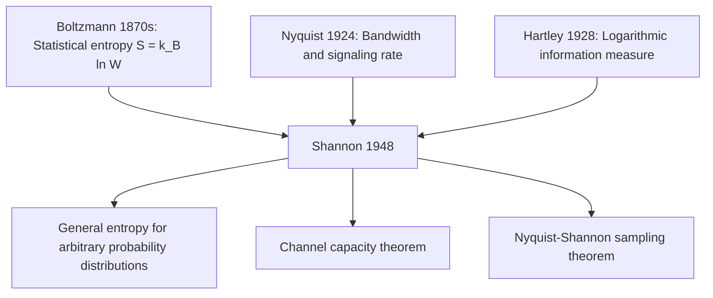

## Historical Precursors: Nyquist, Hartley, Boltzmann

### Overview

Shannon's 1948 synthesis did not emerge in isolation. Three earlier lines of work — Harry Nyquist's studies of telegraph signaling, Ralph Hartley's early quantification of information, and Ludwig Boltzmann's statistical mechanics — each supplied conceptual or mathematical building blocks that Shannon drew upon, explicitly or structurally, in constructing his unified theory.

### Harry Nyquist (1889–1976)

**Key Points**

- Worked at Bell Labs, where Shannon would later work.
- Published "Certain Factors Affecting Telegraph Speed" (1924), addressing the practical question of how quickly telegraph signals could be transmitted over a line of given bandwidth.
- Established what became known as the **Nyquist rate**: for a channel of bandwidth $B$, the maximum symbol rate without intersymbol interference is $2B$ symbols per second.
- Later formalized in the **Nyquist–Shannon sampling theorem**: a continuous signal band-limited to bandwidth $B$ can be perfectly reconstructed from samples taken at a rate of at least $2B$ samples per second.

**Example**

If a telephone line has a bandwidth of 4000 Hz, the Nyquist rate dictates a minimum sampling rate of 8000 samples per second to avoid aliasing — a figure that closely matches the 8 kHz sampling rate used in traditional digital telephony systems.

Nyquist's contribution was primarily about the physical/temporal limits of signaling — how many symbols per second a channel of a given bandwidth could support — rather than about the amount of information carried by each symbol. This latter question was addressed by Hartley.

### Ralph Hartley (1888–1970)

**Key Points**

- Also a Bell Labs engineer, published "Transmission of Information" (1928) in the *Bell System Technical Journal* — the same journal that would later publish Shannon's paper.
- Proposed quantifying information as proportional to the logarithm of the number of possible distinguishable symbol sequences:

$$H = n \log_2 s$$

where $n$ is the number of symbols in the sequence and $s$ is the size of the symbol alphabet (assuming each symbol is equally likely and independently chosen).

- This measure, now called the **Hartley function** or **Hartley information**, is a special case of Shannon entropy under the assumption of a uniform distribution over symbols.
- Hartley's key conceptual contribution was recognizing that information should be measured logarithmically — that doubling the number of possible messages should correspond to a fixed additive increase in information, not a linear or multiplicative one, reflecting the intuition that information should combine additively across independent choices.

**Example**

A system with 8 equally likely symbols carries $\log_2 8 = 3$ bits of information per symbol under Hartley's measure. If the alphabet were extended to 16 equally likely symbols, the information content per symbol would rise to $\log_2 16 = 4$ bits — the logarithmic relationship means each doubling of alphabet size adds exactly one bit.

The Hartley function can be seen as the special case of Shannon's entropy formula when all symbol probabilities are equal ($p_i = 1/s$ for all $i$):

$$H(X) = -\sum_{i=1}^{s} \frac{1}{s} \log_2 \frac{1}{s} = \log_2 s$$

This shows precisely how Shannon's entropy generalizes Hartley's earlier, more restricted formulation to handle non-uniform probability distributions.

### Ludwig Boltzmann (1844–1906)

**Key Points**

- An Austrian physicist working decades before Nyquist and Hartley, in the field of statistical mechanics, not communications engineering.
- Developed the statistical interpretation of thermodynamic entropy, expressed in the famous formula (later inscribed on his tombstone):

$$S = k_B \ln W$$

- $W$ represents the number of microstates (specific arrangements of particles) consistent with a given macrostate (observable bulk properties like temperature and pressure).
- Boltzmann's insight — that a physical quantity (entropy) could be understood as a logarithmic count of possible underlying configurations — provided the deep mathematical template that both Hartley's and Shannon's formulas would echo decades later, though Boltzmann was not working on communication problems and did not influence Nyquist or Hartley directly in a documented way. [Inference] The connection between Boltzmann's work and Shannon's is best understood as a structural/mathematical parallel recognized after the fact (notably via the von Neumann naming episode), rather than a direct line of influence during Shannon's actual derivation — this characterization reflects the general historical consensus but the precise channels of intellectual influence on Shannon are not fully documented in primary sources.

### Diagram: Timeline of Precursors to Shannon

<svg xmlns="http://www.w3.org/2000/svg" viewBox="0 0 900 260">
  <text x="450" y="26" text-anchor="middle" font-size="16" font-weight="bold" fill="#1a1a1a">Timeline of Precursors to Shannon's 1948 Paper (svg_diagram)</text>

  <line x1="60" y1="140" x2="840" y2="140" stroke="#5f6368" stroke-width="2" />

  <circle cx="120" cy="140" r="7" fill="#ea4335" />
  <text x="120" y="120" text-anchor="middle" font-size="11" font-weight="bold" fill="#1a1a1a">1870s</text>
  <text x="120" y="165" text-anchor="middle" font-size="10" fill="#1a1a1a">Boltzmann</text>
  <text x="120" y="180" text-anchor="middle" font-size="9" fill="#5f6368">S = k_B ln W</text>

  <circle cx="380" cy="140" r="7" fill="#4285f4" />
  <text x="380" y="120" text-anchor="middle" font-size="11" font-weight="bold" fill="#1a1a1a">1924</text>
  <text x="380" y="165" text-anchor="middle" font-size="10" fill="#1a1a1a">Nyquist</text>
  <text x="380" y="180" text-anchor="middle" font-size="9" fill="#5f6368">Telegraph speed &amp; bandwidth</text>

  <circle cx="580" cy="140" r="7" fill="#34a853" />
  <text x="580" y="120" text-anchor="middle" font-size="11" font-weight="bold" fill="#1a1a1a">1928</text>
  <text x="580" y="165" text-anchor="middle" font-size="10" fill="#1a1a1a">Hartley</text>
  <text x="580" y="180" text-anchor="middle" font-size="9" fill="#5f6368">H = n log2 s</text>

  <circle cx="800" cy="140" r="8" fill="#fbbc04" />
  <text x="800" y="120" text-anchor="middle" font-size="11" font-weight="bold" fill="#1a1a1a">1948</text>
  <text x="800" y="165" text-anchor="middle" font-size="10" fill="#1a1a1a">Shannon</text>
  <text x="800" y="180" text-anchor="middle" font-size="9" fill="#5f6368">Unified probabilistic theory</text>
</svg>

### How Shannon Synthesized These Threads

**Key Points**

- From **Nyquist**, Shannon inherited a rigorous understanding of the relationship between bandwidth and signaling rate, later formalized jointly as the Nyquist–Shannon sampling theorem.
- From **Hartley**, Shannon inherited the core idea of measuring information logarithmically, and generalized the Hartley function from the uniform-probability special case to arbitrary probability distributions via the entropy formula.
- From **Boltzmann** (via the statistical mechanics tradition, and reportedly reinforced by von Neumann's naming suggestion), Shannon inherited the mathematical form and terminology of entropy as a measure over a probability distribution of states/symbols.

### Table: Contributions Compared

| Contributor | Field | Year | Core Contribution | Relation to Shannon Entropy |
|---|---|---|---|---|
| Boltzmann | Statistical mechanics | ~1870s | $S = k_B \ln W$ | Mathematical/terminological template |
| Nyquist | Telegraph engineering | 1924 | Bandwidth-signaling rate relationship | Basis for sampling theorem, not entropy itself |
| Hartley | Communications engineering | 1928 | $H = n \log_2 s$ (uniform case) | Special case of Shannon entropy ($p_i$ uniform) |
| Shannon | Communications/mathematics | 1948 | General entropy for arbitrary $p_i$; capacity theorems | The unifying generalization |

### Mermaid: Conceptual Lineage

### Why This Lineage Matters

Recognizing these precursors clarifies that Shannon's achievement was not the invention of isolated new concepts from nothing, but rather the **synthesis and generalization** of existing partial insights into a single rigorous, unified mathematical framework — one that could handle arbitrary probability distributions (generalizing Hartley), connect naturally to sampling and bandwidth constraints (extending Nyquist), and inherit a well-motivated mathematical structure and name from statistical mechanics (echoing Boltzmann and Gibbs). This context helps explain why the 1948 paper, despite drawing on existing threads, represented such a significant leap: it was the first to combine these ideas into theorems with genuine predictive and design power for communication systems.

### Conclusion

Nyquist, Hartley, and Boltzmann each contributed a piece of the conceptual and mathematical scaffolding that Shannon assembled into a complete theory. Nyquist supplied the bandwidth-rate relationship, Hartley supplied the logarithmic measure of information (in the uniform-probability special case), and Boltzmann supplied the deep statistical-mechanical template for entropy as a measure over probability distributions. Shannon's distinctive contribution was generalizing Hartley's formula to arbitrary distributions, proving the channel capacity and source coding theorems, and unifying these threads into a single coherent mathematical theory of communication.

**Related Topics**
- The Hartley function as a special case of Shannon entropy
- The Nyquist–Shannon sampling theorem in depth
- Boltzmann's H-theorem and statistical mechanics foundations
- Bell Labs and the institutional context of early information theory
- The evolution from Hartley information to Shannon entropy
- Gibbs entropy and its generalization of Boltzmann's formula
- Early telegraph and telephone engineering constraints