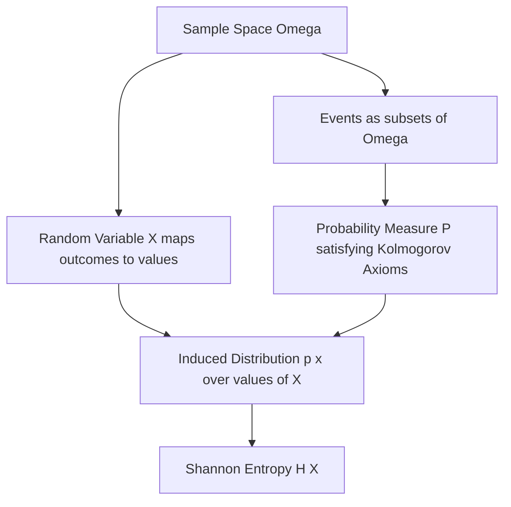

## Sample Spaces, Events, and Probability Axioms

### Overview

Every information-theoretic quantity — entropy, mutual information, channel capacity — is built on top of formal probability theory. Before proceeding further into information theory proper, it is worth grounding the foundational objects that make expressions like $p(x)$ and $H(X)$ mathematically meaningful: sample spaces, events, and the axioms that any valid probability measure must satisfy.

### Sample Spaces

**Key Points**

- A **sample space**, denoted $\Omega$ (or sometimes $S$), is the set of all possible outcomes of a random experiment.
- Sample spaces can be **discrete** (finite or countably infinite) or **continuous** (uncountable).
- Every individual outcome $\omega \in \Omega$ is called a **sample point** or **elementary outcome**.

**Example**

- Flipping a coin once: $\Omega = \{H, T\}$ — a finite discrete sample space.
- Rolling a six-sided die: $\Omega = \{1, 2, 3, 4, 5, 6\}$ — a finite discrete sample space.
- Measuring the exact voltage of a noisy signal: $\Omega = \mathbb{R}$ (or some bounded interval of $\mathbb{R}$) — a continuous sample space.
- Counting the number of transmission errors until the first successful packet: $\Omega = \{0, 1, 2, 3, \ldots\}$ — a countably infinite discrete sample space.

### Events

**Key Points**

- An **event** is a subset of the sample space, $A \subseteq \Omega$, representing some collection of outcomes of interest.
- The **empty event** $\emptyset$ represents an impossible outcome; the full sample space $\Omega$ represents a certain outcome.
- Events can be combined using standard set operations: union ($A \cup B$), intersection ($A \cap B$), and complement ($A^c$).
- Two events $A$ and $B$ are **mutually exclusive** (or disjoint) if $A \cap B = \emptyset$ — they cannot both occur simultaneously.

**Example**

For a die roll with $\Omega = \{1,2,3,4,5,6\}$:
- Event $A$ = "roll is even" = $\{2, 4, 6\}$
- Event $B$ = "roll is greater than 4" = $\{5, 6\}$
- $A \cap B = \{6\}$ (roll is even AND greater than 4)
- $A \cup B = \{2, 4, 5, 6\}$ (roll is even OR greater than 4)
- $A^c = \{1, 3, 5\}$ (roll is odd)

### The Kolmogorov Axioms

Modern probability theory rests on three axioms formalized by Andrey Kolmogorov in 1933, which any function $P: \mathcal{F} \to \mathbb{R}$ (mapping events to real numbers) must satisfy to be a valid probability measure, where $\mathcal{F}$ is the collection of measurable events (a $\sigma$-algebra) over $\Omega$:

**Key Points**

1. **Non-negativity**: $P(A) \geq 0$ for all events $A \in \mathcal{F}$.
2. **Normalization**: $P(\Omega) = 1$ — the probability of the entire sample space (something happening) is exactly 1.
3. **Countable additivity**: For any countable collection of mutually exclusive events $A_1, A_2, A_3, \ldots$:

$$P\left(\bigcup_{i=1}^{\infty} A_i\right) = \sum_{i=1}^{\infty} P(A_i)$$

These three axioms are sufficient to derive essentially all other standard results in probability theory, including the ones used routinely in information theory.

### Derived Properties

From the three axioms, several useful properties follow directly:

- $P(\emptyset) = 0$
- $P(A^c) = 1 - P(A)$
- If $A \subseteq B$, then $P(A) \leq P(B)$
- $P(A \cup B) = P(A) + P(B) - P(A \cap B)$ (inclusion-exclusion for two events)
- $0 \leq P(A) \leq 1$ for any event $A$

### Diagram: Sample Space and Events via Venn Diagram

<svg xmlns="http://www.w3.org/2000/svg" viewBox="0 0 700 320">
  <text x="350" y="26" text-anchor="middle" font-size="16" font-weight="bold" fill="#1a1a1a">Sample Space, Events, and Set Operations (svg_diagram)</text>

  <rect x="60" y="60" width="580" height="230" rx="8" fill="#f8f9fa" stroke="#5f6368" stroke-width="1.5" />
  <text x="90" y="85" font-size="12" fill="#5f6368">Ω (Sample Space)</text>

  <circle cx="280" cy="190" r="90" fill="#4285f4" fill-opacity="0.35" stroke="#4285f4" stroke-width="2" />
  <text x="230" y="140" font-size="13" font-weight="bold" fill="#1a1a1a">A</text>

  <circle cx="400" cy="190" r="90" fill="#ea4335" fill-opacity="0.35" stroke="#ea4335" stroke-width="2" />
  <text x="450" y="140" font-size="13" font-weight="bold" fill="#1a1a1a">B</text>

  <text x="340" y="195" text-anchor="middle" font-size="11" fill="#1a1a1a">A ∩ B</text>
</svg>

### Discrete vs. Continuous Probability Assignment

For **discrete** sample spaces, probability is typically assigned via a probability mass function (pmf) over individual outcomes, and the probability of any event is the sum of the probabilities of its constituent outcomes:

$$P(A) = \sum_{\omega \in A} P(\{\omega\})$$

For **continuous** sample spaces, individual outcomes typically have probability zero, and probability is instead assigned via a probability density function (pdf) $f(x)$, with event probabilities computed via integration:

$$P(A) = \int_A f(x)\, dx$$

[Inference] This distinction — sums for discrete spaces, integrals for continuous ones — is why discrete Shannon entropy and continuous differential entropy take structurally similar but subtly different forms, as discussed in relation to discrete versus continuous information sources; the axioms themselves apply uniformly to both cases, but the mechanics of assigning and computing probabilities differ.

### Random Variables as a Bridge to Information Theory

A **random variable** $X$ is a function mapping outcomes in the sample space to real numbers (or to some other measurable space), $X: \Omega \to \mathbb{R}$. This is the object information theory actually operates on directly — when writing $p(x)$ or $H(X)$, the underlying formalism is:

$$p(x) = P(\{\omega \in \Omega : X(\omega) = x\})$$

**Example**

For two coin flips, $\Omega = \{HH, HT, TH, TT\}$, each outcome equally likely with probability $1/4$. Define the random variable $X$ = "number of heads." Then:
- $X(HH) = 2$, $X(HT) = 1$, $X(TH) = 1$, $X(TT) = 0$
- $p(X=0) = P(\{TT\}) = 1/4$
- $p(X=1) = P(\{HT, TH\}) = 2/4 = 1/2$
- $p(X=2) = P(\{HH\}) = 1/4$

This induced distribution over the values of $X$ is exactly the object entropy formulas operate on: $H(X) = -\sum_x p(x) \log_2 p(x)$.

### Mermaid: From Sample Space to Entropy

### Why This Foundation Matters for Information Theory

Every subsequent construct in information theory — entropy, joint and conditional entropy, mutual information, channel capacity — is defined in terms of a probability distribution $p(x)$ or $p(x, y)$ over some underlying random variable(s). Without a rigorous grounding in sample spaces, events, and the Kolmogorov axioms, expressions like $-\sum_i p(x_i)\log_2 p(x_i)$ would lack a well-defined mathematical basis. This is why probability theory is treated as a prerequisite layer beneath information theory proper, rather than a separate, loosely related topic.

### Conclusion

Sample spaces, events, and the Kolmogorov axioms provide the rigorous mathematical bedrock on which all of information theory is constructed. A sample space enumerates what can happen; events specify particular outcomes or combinations of interest; the axioms of non-negativity, normalization, and countable additivity ensure that probability assignments behave consistently. Random variables then bridge this abstract foundation to the concrete probability distributions, $p(x)$, that entropy and all subsequent information-theoretic quantities are defined over.

**Related Topics**
- Random variables and probability distributions in depth
- Joint, marginal, and conditional probability
- Independence and conditional independence of events
- The $\sigma$-algebra and measure-theoretic foundations of probability
- Discrete probability distributions relevant to information theory (Bernoulli, binomial, geometric)
- Continuous probability distributions relevant to information theory (uniform, Gaussian)
- Expectation and variance as precursors to entropy