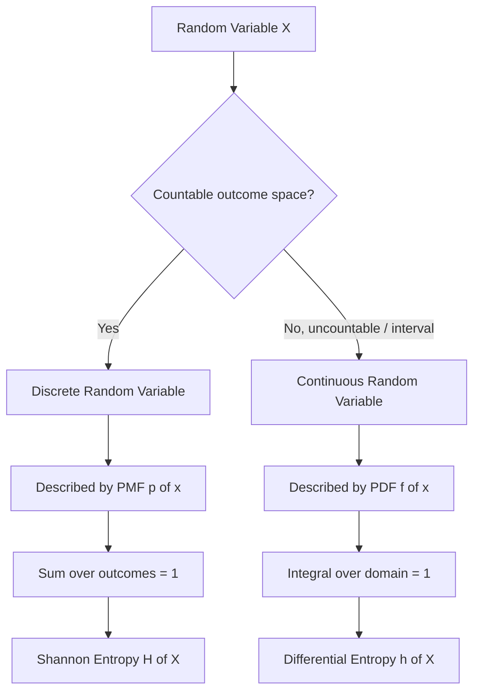

## Discrete and Continuous Random Variables

### Overview

A random variable is a function that maps outcomes of a probabilistic experiment to numerical values. Information theory builds directly on this concept: the "information content" of an event is defined in terms of the probability assigned to it by a random variable's distribution. Random variables are classified into two broad types — discrete and continuous — and information-theoretic quantities (entropy, differential entropy, mutual information) take different mathematical forms depending on which type is involved.

### Discrete Random Variables

A discrete random variable $X$ takes values from a countable set $\mathcal{X} = \{x_1, x_2, x_3, \dots\}$, which may be finite or countably infinite. Each outcome $x_i$ has an associated probability given by a **probability mass function (PMF)**:

$$p(x_i) = P(X = x_i)$$

The PMF must satisfy two conditions:

$$p(x_i) \geq 0 \quad \text{for all } x_i \in \mathcal{X}$$

$$\sum_{x_i \in \mathcal{X}} p(x_i) = 1$$

**Example**

A fair six-sided die is a discrete random variable $X \in \{1, 2, 3, 4, 5, 6\}$ with $p(x_i) = \frac{1}{6}$ for each face. A biased coin is $X \in \{0, 1\}$ (tails, heads) with $p(1) = q$ and $p(0) = 1 - q$ for some $q \in [0,1]$ — this is the Bernoulli distribution, the canonical building block for binary information sources.

Discrete random variables are the natural setting for Shannon's original formulation of entropy, since sums over a countable alphabet are well-defined without needing measure-theoretic machinery. Most introductory information theory (source coding, channel capacity for discrete memoryless channels) is built on discrete random variables first.

### Continuous Random Variables

A continuous random variable $X$ takes values from an uncountable set, typically an interval or union of intervals in $\mathbb{R}$. Instead of a PMF, it is described by a **probability density function (PDF)** $f(x)$, where probability is obtained by integrating over a range rather than summing point values:

$$P(a \leq X \leq b) = \int_a^b f(x)\, dx$$

The PDF must satisfy:

$$f(x) \geq 0 \quad \text{for all } x$$

$$\int_{-\infty}^{\infty} f(x)\, dx = 1$$

A critical distinction from the discrete case: $f(x)$ is **not** a probability itself and can exceed 1. The probability of any single exact point is zero, $P(X = x) = 0$, since it is entropy over an interval, not a sum over discrete atoms.

**Example**

A signal corrupted by thermal noise is often modeled as Gaussian: $X \sim \mathcal{N}(\mu, \sigma^2)$ with

$$f(x) = \frac{1}{\sqrt{2\pi\sigma^2}} \exp\left(-\frac{(x-\mu)^2}{2\sigma^2}\right)$$

This distribution appears throughout information theory, most notably in the derivation of channel capacity for the Additive White Gaussian Noise (AWGN) channel.

### Cumulative Distribution Function

Both discrete and continuous random variables share a unifying description: the **cumulative distribution function (CDF)**,

$$F(x) = P(X \leq x)$$

For discrete variables, $F(x) = \sum_{x_i \leq x} p(x_i)$, producing a step function. For continuous variables, $F(x) = \int_{-\infty}^x f(t)\, dt$, producing a continuous, non-decreasing function with $f(x) = F'(x)$ wherever the derivative exists.

<svg xmlns="http://www.w3.org/2000/svg" viewBox="0 0 760 340">
  <text x="380" y="28" text-anchor="middle" font-size="18" font-weight="bold" fill="#1a1a1a">Discrete PMF vs. Continuous PDF (svg_diagram)</text>

  <text x="160" y="55" text-anchor="middle" font-size="14" font-weight="bold" fill="#333">Discrete: PMF (bars, sum = 1)</text>
  <line x1="50" y1="270" x2="300" y2="270" stroke="#333" stroke-width="2" />
  <line x1="50" y1="270" x2="50" y2="80" stroke="#333" stroke-width="2" />
  <rect x="65" y="180" width="30" height="90" fill="#4C78A8" />
  <rect x="110" y="150" width="30" height="120" fill="#4C78A8" />
  <rect x="155" y="110" width="30" height="160" fill="#4C78A8" />
  <rect x="200" y="200" width="30" height="70" fill="#4C78A8" />
  <rect x="245" y="230" width="30" height="40" fill="#4C78A8" />
  <text x="80" y="285" text-anchor="middle" font-size="12">x1</text>
  <text x="125" y="285" text-anchor="middle" font-size="12">x2</text>
  <text x="170" y="285" text-anchor="middle" font-size="12">x3</text>
  <text x="215" y="285" text-anchor="middle" font-size="12">x4</text>
  <text x="260" y="285" text-anchor="middle" font-size="12">x5</text>
  <text x="30" y="80" text-anchor="middle" font-size="12">p(x)</text>
  <text x="160" y="310" text-anchor="middle" font-size="12" fill="#555">P(X = xi) is a real value</text>

  <text x="600" y="55" text-anchor="middle" font-size="14" font-weight="bold" fill="#333">Continuous: PDF (area under curve = 1)</text>
  <line x1="460" y1="270" x2="740" y2="270" stroke="#333" stroke-width="2" />
  <line x1="460" y1="270" x2="460" y2="80" stroke="#333" stroke-width="2" />
  <path d="M 470 265 Q 530 260 560 150 Q 600 90 640 150 Q 670 260 730 265" fill="none" stroke="#E45756" stroke-width="2.5" />
  <path d="M 560 260 Q 600 100 640 260 Z" fill="#E45756" fill-opacity="0.25" stroke="none" />
  <line x1="560" y1="270" x2="560" y2="150" stroke="#888" stroke-dasharray="4,3" />
  <line x1="640" y1="270" x2="640" y2="150" stroke="#888" stroke-dasharray="4,3" />
  <text x="560" y="285" text-anchor="middle" font-size="12">a</text>
  <text x="640" y="285" text-anchor="middle" font-size="12">b</text>
  <text x="440" y="80" text-anchor="middle" font-size="12">f(x)</text>
  <text x="600" y="310" text-anchor="middle" font-size="12" fill="#555">P(a ≤ X ≤ b) = shaded area</text>
</svg>

### Mixed Random Variables

[Unverified — depends on specific system context] Some practical sources are neither purely discrete nor purely continuous — for example, a signal that is exactly zero with positive probability but otherwise continuously distributed. These are described using a mixed CDF (a step-and-continuous hybrid) or handled via generalized measure-theoretic definitions. Standard introductory information theory typically treats the discrete and continuous cases separately and defers mixed cases to more advanced measure-theoretic treatments.

### Relevance to Information Theory

The discrete/continuous distinction propagates directly into how "information" is quantified:

| Quantity | Discrete form | Continuous form |
|---|---|---|
| Uncertainty measure | Shannon entropy $H(X) = -\sum p(x) \log p(x)$ | Differential entropy $h(X) = -\int f(x) \log f(x)\, dx$ |
| Reference | Absolute, non-negative | Relative, can be negative |
| Typical use case | Source coding, discrete channels | Gaussian channels, continuous signals |

This table anticipates content covered later; the key prerequisite point here is that the **existence of a well-defined PMF or PDF is what makes entropy and differential entropy well-defined in the first place** — random variables are the foundation on which every subsequent information-theoretic quantity is built.

### Random Variable Type Decision Flow

### Key Points

- A **discrete random variable** is defined by a PMF, $p(x)$, where probabilities sum to 1 over a countable set.
- A **continuous random variable** is defined by a PDF, $f(x)$, where probability is obtained via integration, and $P(X = x) = 0$ for any single point.
- The **CDF** $F(x) = P(X \leq x)$ unifies both cases and is always non-decreasing, right-continuous, bounded between 0 and 1.
- The discrete/continuous distinction directly determines whether entropy is computed as a sum (Shannon entropy) or an integral (differential entropy), a distinction carried through the rest of information theory.

**Related Topics**

- Joint, marginal, and conditional distributions
- Expectation, variance, and moments of random variables
- Independence and the chain rule of probability
- Shannon entropy for discrete sources
- Differential entropy and its non-negativity pitfalls
- Common distributions in information theory (Bernoulli, Binomial, Poisson, Gaussian, Uniform)
- Convergence of random variables (in probability, in distribution, almost surely)
- The law of large numbers and its role in the Asymptotic Equipartition Property (AEP)