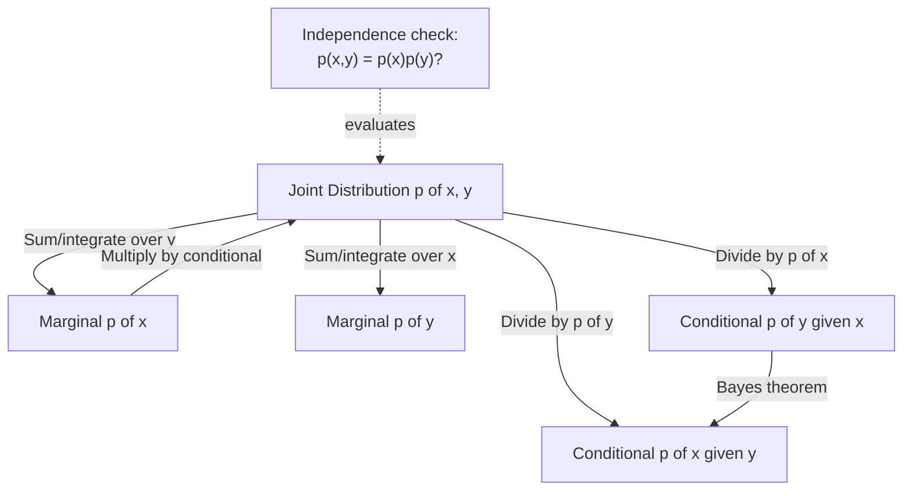

## Joint, Marginal, and Conditional Distributions

### Overview

Information theory is fundamentally concerned with relationships between random variables — how much knowing one variable tells you about another. That relationship is captured mathematically through joint, marginal, and conditional distributions. These three constructs form the probabilistic backbone for joint entropy, conditional entropy, and mutual information, all of which quantify shared or dependent information between variables.

### Joint Distributions

The **joint distribution** of two random variables $X$ and $Y$ describes the probability of both variables taking on particular values simultaneously.

For discrete random variables, the **joint PMF** is:

$$p(x, y) = P(X = x, Y = y)$$

satisfying $p(x,y) \geq 0$ and

$$\sum_{x \in \mathcal{X}} \sum_{y \in \mathcal{Y}} p(x, y) = 1$$

For continuous random variables, the **joint PDF** $f(x, y)$ satisfies $f(x,y) \geq 0$ and

$$\int_{-\infty}^{\infty} \int_{-\infty}^{\infty} f(x, y)\, dx\, dy = 1$$

with probability over a region $A$ given by $P((X,Y) \in A) = \iint_A f(x,y)\, dx\, dy$.

**Example**

Consider transmitting a bit $X \in \{0, 1\}$ over a noisy binary channel, received as $Y \in \{0, 1\}$. The joint PMF might be:

| $p(x,y)$ | $Y=0$ | $Y=1$ |
|---|---|---|
| $X=0$ | 0.45 | 0.05 |
| $X=1$ | 0.10 | 0.40 |

This table fully describes the channel's statistical behavior — it captures both what is sent and what is received, together with the correlation (or noise) between them. This is the exact structure used later to define channel capacity.

### Marginal Distributions

The **marginal distribution** of one variable is obtained by summing (or integrating) the joint distribution over all values of the other variable — effectively "collapsing" the joint distribution down to a single-variable view.

For discrete variables:

$$p(x) = \sum_{y \in \mathcal{Y}} p(x, y), \qquad p(y) = \sum_{x \in \mathcal{X}} p(x, y)$$

For continuous variables:

$$f(x) = \int_{-\infty}^{\infty} f(x, y)\, dy, \qquad f(y) = \int_{-\infty}^{\infty} f(x, y)\, dx$$

**Example**

Using the joint table above, the marginal for $X$ is $p(X=0) = 0.45 + 0.05 = 0.50$ and $p(X=1) = 0.10 + 0.40 = 0.50$. The marginal for $Y$ is $p(Y=0) = 0.45 + 0.10 = 0.55$ and $p(Y=1) = 0.05 + 0.40 = 0.45$. Marginalization discards information about how $X$ and $Y$ relate — the marginal alone cannot recover the joint distribution unless the variables are independent.

### Conditional Distributions

The **conditional distribution** describes the probability distribution of one variable given that the other has taken a specific value. For discrete variables:

$$p(y \mid x) = \frac{p(x, y)}{p(x)}, \quad \text{defined when } p(x) > 0$$

For continuous variables:

$$f(y \mid x) = \frac{f(x, y)}{f(x)}, \quad \text{defined when } f(x) > 0$$

This is the direct probabilistic analog of a noisy channel: $p(y \mid x)$ describes what is likely to be received given what was sent, and is often called the **channel transition probability** or **conditional/transition matrix** in communication contexts.

**Example**

From the joint table: $p(Y=0 \mid X=0) = \frac{0.45}{0.50} = 0.9$ and $p(Y=1 \mid X=0) = \frac{0.05}{0.50} = 0.1$. This says: given a 0 was sent, there is a 90% chance a 0 was received and a 10% chance of a bit-flip error — this conditional distribution is precisely what defines the channel's noise characteristics.

### The Chain Rule of Probability

Joint, marginal, and conditional distributions are tied together by the **chain rule**:

$$p(x, y) = p(x)\, p(y \mid x) = p(y)\, p(x \mid y)$$

This identity generalizes to more variables:

$$p(x_1, x_2, \dots, x_n) = p(x_1) \, p(x_2 \mid x_1) \, p(x_3 \mid x_1, x_2) \cdots p(x_n \mid x_1, \dots, x_{n-1})$$

The chain rule is the probabilistic identity that later underlies the chain rule of entropy, $H(X,Y) = H(X) + H(Y \mid X)$, one of the most heavily used identities in information theory.

### Bayes' Theorem

Rearranging the chain rule gives **Bayes' theorem**, a direct consequence of the two equivalent factorizations of $p(x,y)$:

$$p(x \mid y) = \frac{p(y \mid x)\, p(x)}{p(y)}$$

This relationship is central to channel decoding: given a received symbol $y$, Bayes' theorem allows inference of the posterior probability of the transmitted symbol $x$, forming the theoretical basis of maximum a posteriori (MAP) decoding.

### Independence

$X$ and $Y$ are **statistically independent** if and only if the joint distribution factors as the product of the marginals:

$$p(x, y) = p(x)\, p(y) \quad \text{for all } x, y$$

Equivalently, independence means $p(y \mid x) = p(y)$ — knowing $X$ gives no information about $Y$. In the channel example above, $X$ and $Y$ are **not** independent, since $p(X=0)\,p(Y=0) = 0.5 \times 0.55 = 0.275 \neq 0.45 = p(X=0, Y=0)$. This departure from independence is exactly what makes the channel informative: mutual information, introduced later, quantifies this gap.

### Relationship Diagram

### Visualizing Joint, Marginal, and Conditional Structure

<svg xmlns="http://www.w3.org/2000/svg" viewBox="0 0 700 420">
  <text x="350" y="26" text-anchor="middle" font-size="18" font-weight="bold" fill="#1a1a1a">Joint, Marginal, Conditional (svg_diagram)</text>

  <rect x="120" y="60" width="300" height="220" fill="#EAF1FB" stroke="#4C78A8" stroke-width="1.5" />
  <text x="270" y="50" text-anchor="middle" font-size="13" fill="#333">Joint distribution p(x,y)</text>

  <rect x="150" y="90" width="60" height="50" fill="#4C78A8" fill-opacity="0.85" />
  <text x="180" y="120" text-anchor="middle" font-size="11" fill="white">0.45</text>
  <rect x="220" y="90" width="60" height="50" fill="#4C78A8" fill-opacity="0.35" />
  <text x="250" y="120" text-anchor="middle" font-size="11" fill="#222">0.05</text>
  <rect x="150" y="150" width="60" height="50" fill="#4C78A8" fill-opacity="0.35" />
  <text x="180" y="180" text-anchor="middle" font-size="11" fill="#222">0.10</text>
  <rect x="220" y="150" width="60" height="50" fill="#4C78A8" fill-opacity="0.85" />
  <text x="250" y="180" text-anchor="middle" font-size="11" fill="white">0.40</text>

  <text x="145" y="83" text-anchor="middle" font-size="11">Y=0</text>
  <text x="215" y="83" text-anchor="middle" font-size="11">Y=1</text>
  <text x="130" y="120" text-anchor="middle" font-size="11">X=0</text>
  <text x="130" y="180" text-anchor="middle" font-size="11">X=1</text>

  <rect x="150" y="215" width="130" height="30" fill="#E45756" fill-opacity="0.3" stroke="#E45756" />
  <text x="215" y="234" text-anchor="middle" font-size="11">Marginal p(x): sum rows</text>

  <rect x="300" y="90" width="30" height="110" fill="#F2B701" fill-opacity="0.3" stroke="#F2B701" />
  <text x="315" y="145" text-anchor="middle" font-size="10" transform="rotate(90 315 145)">Marginal p(y): sum cols</text>

  <text x="270" y="270" text-anchor="middle" font-size="11" fill="#555">Conditional p(y|x) = row / row-sum</text>

  <path d="M 420 170 L 500 170" stroke="#333" stroke-width="1.5" marker-end="url(#arrow)" />
  <text x="460" y="160" text-anchor="middle" font-size="11">Bayes'</text>

  <rect x="500" y="130" width="150" height="80" fill="#F2E9DC" stroke="#F2B701" stroke-width="1.5" />
  <text x="575" y="155" text-anchor="middle" font-size="11">p(x|y) =</text>
  <text x="575" y="175" text-anchor="middle" font-size="11">p(y|x) p(x) / p(y)</text>

  <text x="270" y="330" text-anchor="middle" font-size="12" font-weight="bold" fill="#333">Independence test:</text>
  <text x="270" y="352" text-anchor="middle" font-size="12" fill="#555">p(x,y) = p(x)·p(y) for all x,y ?</text>
  <text x="270" y="374" text-anchor="middle" font-size="12" fill="#555">If not equal → variables carry information about each other</text>
</svg>

### Key Points

- The **joint distribution** $p(x,y)$ or $f(x,y)$ fully specifies the statistical relationship between two random variables.
- **Marginal distributions** are recovered from the joint by summing/integrating out the other variable, but this process discards dependency information.
- **Conditional distributions** $p(y \mid x)$ describe one variable given a fixed value of the other, and directly model noisy channels in communication systems.
- The **chain rule** $p(x,y) = p(x)p(y \mid x)$ connects all three and generalizes to $n$ variables, forming the probabilistic basis for the entropy chain rule.
- **Bayes' theorem** follows from the chain rule and underlies MAP decoding.
- **Independence** ($p(x,y) = p(x)p(y)$) is the special case where conditioning provides no new information — its failure is what mutual information measures.

**Related Topics**

- Expectation, variance, and moments of random variables
- Shannon entropy and joint entropy $H(X,Y)$
- Conditional entropy $H(Y \mid X)$ and the entropy chain rule
- Mutual information $I(X;Y)$
- Markov chains and the data processing inequality
- Channel transition matrices and discrete memoryless channels
- Convergence of random variables and the law of large numbers