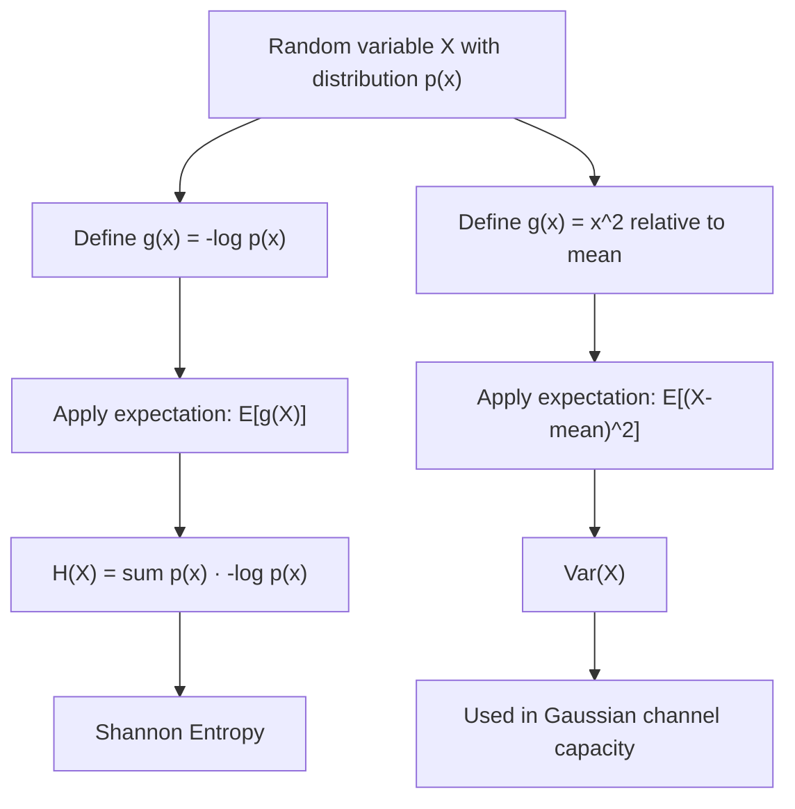

## Expectation, Variance, and Moments

### Overview

Expectation, variance, and higher moments summarize a random variable's distribution using a small set of representative numbers rather than the full distribution itself. In information theory, these quantities appear directly: entropy is itself an expectation (the expected value of $-\log p(X)$), and moments such as variance bound the achievable rates in Gaussian channel capacity and underlie concentration results used in the Asymptotic Equipartition Property.

### Expectation (Expected Value)

The **expectation** of a random variable $X$ is its probability-weighted average value.

For a discrete random variable:

$$E[X] = \sum_{x \in \mathcal{X}} x \, p(x)$$

For a continuous random variable:

$$E[X] = \int_{-\infty}^{\infty} x \, f(x)\, dx$$

More generally, for any function $g(X)$ of a random variable:

$$E[g(X)] = \sum_{x} g(x)\, p(x) \quad \text{or} \quad E[g(X)] = \int_{-\infty}^{\infty} g(x)\, f(x)\, dx$$

This general form is exactly how entropy is defined: $H(X) = E[-\log p(X)]$, treating $-\log p(x)$ as the function $g(x)$ applied to the random variable's own probability.

**Example**

For a fair six-sided die, $E[X] = \sum_{i=1}^{6} i \cdot \frac{1}{6} = 3.5$. For a Bernoulli random variable with $P(X=1) = q$, $E[X] = 1 \cdot q + 0 \cdot (1-q) = q$.

### Linearity of Expectation

Expectation is linear regardless of dependence between variables:

$$E[aX + bY + c] = aE[X] + bE[Y] + c$$

This holds even when $X$ and $Y$ are dependent, which makes it one of the most useful tools in information theory — for instance, it justifies decomposing the entropy of a sequence of dependent random variables into a sum of conditional entropies without requiring independence.

### Variance

**Variance** measures the average squared deviation of a random variable from its mean, quantifying spread or uncertainty in the numerical sense (distinct from entropy, which quantifies uncertainty in the information-theoretic sense):

$$\text{Var}(X) = E[(X - E[X])^2] = E[X^2] - (E[X])^2$$

The **standard deviation** is $\sigma = \sqrt{\text{Var}(X)}$, expressed in the same units as $X$.

**Example**

For the fair die, $E[X^2] = \sum_{i=1}^{6} i^2 \cdot \frac{1}{6} = \frac{91}{6} \approx 15.17$, so $\text{Var}(X) = 15.17 - 3.5^2 = 15.17 - 12.25 \approx 2.92$.

For a Gaussian $X \sim \mathcal{N}(\mu, \sigma^2)$, the parameter $\sigma^2$ is by definition the variance — this is why the Gaussian distribution is the natural choice when studying channel capacity under a power (variance) constraint: among all continuous distributions with a fixed variance, the Gaussian maximizes differential entropy.

### Properties of Variance

$$\text{Var}(aX + b) = a^2 \, \text{Var}(X)$$

For independent $X$ and $Y$:

$$\text{Var}(X + Y) = \text{Var}(X) + \text{Var}(Y)$$

If $X$ and $Y$ are dependent, this generalizes to include a covariance term:

$$\text{Var}(X + Y) = \text{Var}(X) + \text{Var}(Y) + 2\,\text{Cov}(X, Y)$$

### Covariance and Correlation

**Covariance** measures how two random variables vary together:

$$\text{Cov}(X, Y) = E[(X - E[X])(Y - E[Y])] = E[XY] - E[X]E[Y]$$

If $X$ and $Y$ are independent, $\text{Cov}(X,Y) = 0$ (the converse is not generally true — zero covariance does not imply independence, except in special cases such as jointly Gaussian variables). The **correlation coefficient** normalizes covariance to the range $[-1, 1]$:

$$\rho(X,Y) = \frac{\text{Cov}(X,Y)}{\sigma_X \sigma_Y}$$

Covariance and correlation measure only *linear* dependence, which is a key distinction from mutual information: two variables can be strongly, deterministically dependent in a nonlinear way while having zero correlation, yet mutual information would still detect that dependence.

### Moments

The **$n$-th moment** of $X$ about the origin is $E[X^n]$. The **$n$-th central moment** is $E[(X - E[X])^n]$.

| Order | Central moment | Interpretation |
|---|---|---|
| 1st | $E[X - E[X]] = 0$ | Always zero by definition |
| 2nd | $E[(X-E[X])^2]$ | Variance — spread |
| 3rd | $E[(X-E[X])^3]$ | Skewness — asymmetry |
| 4th | $E[(X-E[X])^4]$ | Kurtosis — tail weight |

**Moment generating functions (MGF)**, $M_X(t) = E[e^{tX}]$, encode all moments of a distribution when they exist, since $E[X^n] = M_X^{(n)}(0)$. [Unverified — depends on distribution] Not every distribution has an MGF defined on an open interval around zero; heavy-tailed distributions may lack one, in which case the **characteristic function** $\phi_X(t) = E[e^{itX}]$, which always exists, is used instead.

### Jensen's Inequality

For a convex function $g$:

$$E[g(X)] \geq g(E[X])$$

For a concave function $g$, the inequality reverses: $E[g(X)] \leq g(E[X])$. Jensen's inequality is one of the most heavily reused tools in information theory — since $\log$ is concave, it is the direct mechanism behind proving that entropy is maximized by the uniform distribution, that mutual information is non-negative, and that the Kullback-Leibler divergence is non-negative (Gibbs' inequality).

### Expectation as the Bridge to Entropy

### Visualizing Mean and Spread

<svg xmlns="http://www.w3.org/2000/svg" viewBox="0 0 700 320">
  <text x="350" y="26" text-anchor="middle" font-size="18" font-weight="bold" fill="#1a1a1a">Expectation and Variance (svg_diagram)</text>

  <line x1="60" y1="250" x2="650" y2="250" stroke="#333" stroke-width="2" />

  <path d="M 100 250 Q 250 60 350 60 Q 450 60 600 250" fill="none" stroke="#4C78A8" stroke-width="2.5" />
  <text x="330" y="45" text-anchor="middle" font-size="12" fill="#4C78A8">Low variance</text>

  <path d="M 60 250 Q 180 150 350 150 Q 520 150 650 250" fill="none" stroke="#E45756" stroke-width="2.5" stroke-dasharray="6,4" />
  <text x="450" y="140" text-anchor="middle" font-size="12" fill="#E45756">High variance</text>

  <line x1="350" y1="250" x2="350" y2="55" stroke="#888" stroke-dasharray="3,3" />
  <text x="350" y="270" text-anchor="middle" font-size="12" fill="#333">E[X] = μ</text>

  <line x1="300" y1="250" x2="300" y2="230" stroke="#4C78A8" />
  <line x1="400" y1="250" x2="400" y2="230" stroke="#4C78A8" />
  <text x="350" y="295" text-anchor="middle" font-size="11" fill="#555">Both curves share the same mean but differ in spread (variance)</text>
</svg>

### Key Points

- **Expectation** $E[X]$ is the probability-weighted average, generalizing to $E[g(X)]$ for any function of $X$ — this general form is exactly how Shannon entropy is defined.
- **Linearity of expectation** holds regardless of dependence between variables, making it broadly applicable.
- **Variance** $\text{Var}(X) = E[X^2] - (E[X])^2$ measures numerical spread and is distinct from entropy's information-theoretic notion of uncertainty.
- **Covariance and correlation** capture only linear dependence; mutual information (covered later) captures dependence more generally.
- **Jensen's inequality**, via the concavity of $\log$, is the core mechanical tool behind the non-negativity of mutual information and KL divergence, and the entropy-maximizing property of the uniform distribution.

**Related Topics**

- Shannon entropy for discrete sources
- Differential entropy and the Gaussian maximum-entropy property
- Kullback-Leibler divergence and Gibbs' inequality
- Convergence of random variables and the law of large numbers
- The Asymptotic Equipartition Property (AEP)
- Moment generating functions and characteristic functions in depth
- Chebyshev's inequality and concentration bounds