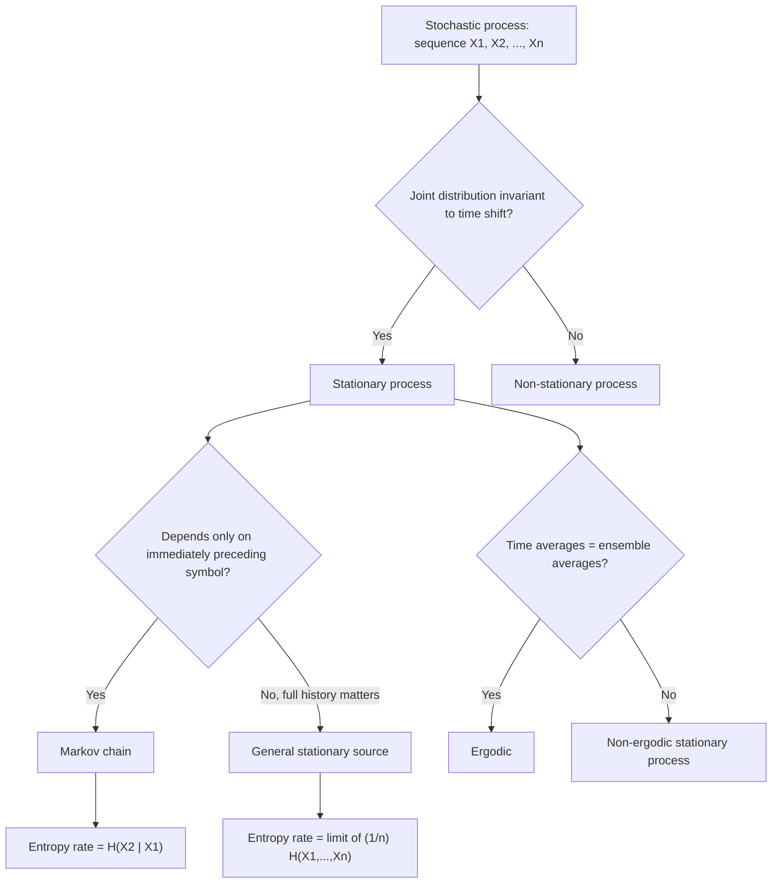

## Stochastic Processes and Stationarity

### Overview

A stochastic process extends the idea of a random variable to an indexed collection of random variables, typically ordered in time. This is the natural model for information sources that emit symbols sequentially — text, speech, sensor readings — rather than a single isolated random variable. Stationarity, the property that a process's statistics do not change over time, is the key assumption that makes entropy rate well-defined and that underlies the Asymptotic Equipartition Property and Shannon's source coding theorems for sequences.

### Definition of a Stochastic Process

A **stochastic process** is a collection of random variables indexed by time (or another ordering variable):

$$\{X_t\}_{t \in T} = \{X_1, X_2, X_3, \dots\}$$

where $T$ is the index set (discrete, as in $T = \{1, 2, 3, \dots\}$, or continuous, as in $T = [0, \infty)$). Information theory is primarily concerned with **discrete-time stochastic processes**, since digital sources emit symbols at discrete steps: $X_1, X_2, \dots, X_n$ represents a sequence of $n$ symbols drawn from a source, such as consecutive characters in text or consecutive samples of a quantized signal.

A stochastic process is fully characterized by specifying, for every finite subset of indices $t_1, \dots, t_k$, the joint distribution $p(x_{t_1}, \dots, x_{t_k})$.

**Example**

A sequence of coin flips $X_1, X_2, X_3, \dots$ where each $X_i \in \{0,1\}$ is a stochastic process. If the flips are independent and identically distributed (i.i.d.), the process is the simplest possible case: the joint distribution factors completely, $p(x_1, \dots, x_n) = \prod_{i=1}^n p(x_i)$.

### Stationarity

A stochastic process is **stationary** (strictly stationary) if its joint distribution is invariant to time shifts: for any $k$ and any shift $l$,

$$p(x_1, x_2, \dots, x_k) = p(x_{1+l}, x_{2+l}, \dots, x_{k+l}) \quad \text{for all } l$$

In words: the statistical behavior of the process looks the same no matter which window in time you observe it from. A weaker version, **wide-sense (weak) stationarity**, requires only that the mean is constant over time and the covariance between $X_t$ and $X_{t+l}$ depends only on the lag $l$, not on $t$ itself.

**Example**

An i.i.d. sequence is automatically stationary, since each $X_i$ has the identical marginal distribution and no dependence across time to shift. A process where $X_i$'s distribution drifts over time — for instance, a sensor whose noise characteristics degrade as a battery depletes — is non-stationary, since $p(x_1)$ and $p(x_{100})$ differ.

### Why Stationarity Matters for Information Theory

Real information sources (natural language, images, audio) are rarely truly stationary in the strict sense, but stationarity is the standard modeling assumption that makes several key information-theoretic results tractable:

- It guarantees that the **entropy rate** of the process, $H(\mathcal{X}) = \lim_{n \to \infty} \frac{1}{n} H(X_1, \dots, X_n)$, exists as a well-defined limit (rather than oscillating or failing to converge).
- It allows the **Asymptotic Equipartition Property (AEP)** to be stated cleanly: long sequences from the source concentrate their probability on a "typical set" of roughly $2^{nH}$ sequences.
- It underlies Shannon's source coding theorem for sequences, which relates the entropy rate to the minimum achievable compression rate.

[Inference] Because most natural sources are only approximately stationary over limited time windows, practical compression systems (e.g., adaptive coders) often relax the strict stationarity assumption and instead track locally-varying statistics; this is a design response to the gap between the idealized model and real data, rather than a property of stationarity itself.

### Markov Processes: A Key Special Case

A stochastic process has the **Markov property** if the future depends on the past only through the present state:

$$p(x_{n+1} \mid x_1, x_2, \dots, x_n) = p(x_{n+1} \mid x_n)$$

A **Markov chain** is a stochastic process with this property, and a **stationary Markov chain** is one whose transition probabilities $p(x_{n+1} \mid x_n)$ do not change over time and whose marginal distribution has converged to (or starts at) the chain's stationary distribution. Markov chains are the standard tractable model for sources with memory — capturing dependencies like letter-to-letter correlations in text — while still permitting closed-form entropy rate calculations:

$$H(\mathcal{X}) = H(X_2 \mid X_1)$$

for a stationary first-order Markov chain, since conditioning on the entire past reduces to conditioning on just the immediately preceding symbol.

**Example**

A simple weather model with states $\{\text{Sunny}, \text{Rainy}\}$ where tomorrow's weather depends only on today's, not on the full weather history, is a first-order Markov chain. This is a common toy model used to illustrate entropy rate calculations because the chain rule collapses to a single conditional entropy term.

### Ergodicity

[Unverified — depends on formal treatment] A related but distinct property, **ergodicity**, concerns whether time-averages computed from a single sufficiently long realization of the process converge to the ensemble (probability-weighted) averages. Stationarity alone does not guarantee ergodicity; a process can be stationary yet fail to be ergodic (for example, a mixture of two distinct stationary sub-processes selected at random once at the start). Ergodicity is the property typically invoked to justify that empirical entropy estimates from a single long sequence approximate the true entropy rate of the source.

### Process Structure Overview

### Visualizing Stationary vs. Non-Stationary Sequences

<svg xmlns="http://www.w3.org/2000/svg" viewBox="0 0 700 340">
  <text x="350" y="26" text-anchor="middle" font-size="18" font-weight="bold" fill="#1a1a1a">Stationary vs. Non-Stationary Process (svg_diagram)</text>

  <text x="175" y="55" text-anchor="middle" font-size="13" font-weight="bold" fill="#333">Stationary</text>
  <line x1="50" y1="150" x2="330" y2="150" stroke="#ccc" stroke-dasharray="2,2" />
  <polyline points="50,140 70,160 90,135 110,155 130,145 150,160 170,138 190,152 210,142 230,158 250,140 270,150 290,145 310,155 330,148" fill="none" stroke="#4C78A8" stroke-width="2" />
  <text x="175" y="200" text-anchor="middle" font-size="11" fill="#555">Statistics (mean, spread) constant over time</text>

  <text x="530" y="55" text-anchor="middle" font-size="13" font-weight="bold" fill="#333">Non-Stationary</text>
  <line x1="380" y1="150" x2="660" y2="150" stroke="#ccc" stroke-dasharray="2,2" />
  <polyline points="380,145 400,150 420,140 440,148 460,120 480,135 500,90 520,110 540,70 560,95 580,55 600,75 620,45 640,60 660,40" fill="none" stroke="#E45756" stroke-width="2" />
  <text x="530" y="200" text-anchor="middle" font-size="11" fill="#555">Mean drifts upward over time</text>

  <text x="350" y="250" text-anchor="middle" font-size="12" fill="#333" font-weight="bold">Why it matters:</text>
  <text x="350" y="272" text-anchor="middle" font-size="12" fill="#555">Stationarity is required for the entropy rate limit to exist cleanly</text>
  <text x="350" y="292" text-anchor="middle" font-size="12" fill="#555">and for the Asymptotic Equipartition Property to hold</text>
</svg>

### Key Points

- A **stochastic process** is an indexed collection of random variables, $\{X_1, X_2, \dots\}$, modeling sequential information sources.
- **Strict stationarity** requires the joint distribution to be invariant under time shifts; **wide-sense stationarity** relaxes this to constant mean and lag-dependent covariance.
- Stationarity is the assumption that makes the **entropy rate** well-defined as a limit and enables the **Asymptotic Equipartition Property**.
- A **Markov process** has the property that the future depends on the past only through the present state, giving a tractable model of sources with memory.
- **Ergodicity** is a distinct property from stationarity concerning whether time-averages from one realization converge to ensemble averages; it underlies why entropy can be estimated from a single long sequence.

**Related Topics**

- Entropy rate of a stochastic process
- The Asymptotic Equipartition Property (AEP) and typical sets
- Markov chains and higher-order Markov models
- Source coding theorem for stationary sources
- Hidden Markov models and their use in information theory
- Convergence of random variables and the law of large numbers
- Universal source coding (e.g., Lempel-Ziv) and its relation to entropy rate