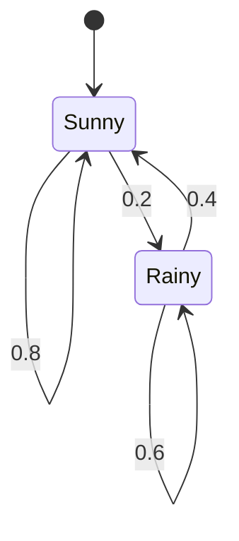

## Markov Chains and Their Properties

### Overview

A Markov chain is a stochastic process in which the future state depends on the past only through the present — the "memoryless" property with respect to history beyond the current state. Markov chains are the primary tractable model for information sources with statistical memory (such as natural language) and are the setting for the **Data Processing Inequality**, one of the most important structural results in information theory, which formalizes the intuition that processing cannot create information.

### The Markov Property

A stochastic process $\{X_n\}$ satisfies the **Markov property** (first-order) if:

$$p(x_{n+1} \mid x_1, x_2, \dots, x_n) = p(x_{n+1} \mid x_n) \quad \text{for all } n$$

Equivalently, three random variables $X$, $Y$, $Z$ form a **Markov chain**, written $X \to Y \to Z$, if $X$ and $Z$ are conditionally independent given $Y$:

$$p(z \mid x, y) = p(z \mid y)$$

This second formulation is the one most directly used in information theory, since it applies not just to time-indexed sequences but to any three variables linked in a processing pipeline — for instance, a source $X$, an encoded signal $Y$, and a decoded output $Z$.

### Transition Probabilities and the Transition Matrix

For a discrete-state Markov chain with state space $\mathcal{S} = \{s_1, \dots, s_k\}$, the process is characterized by **transition probabilities**:

$$P_{ij} = p(X_{n+1} = s_j \mid X_n = s_i)$$

These form a **transition matrix** $P$, where each row sums to 1 (a stochastic matrix):

$$\sum_{j} P_{ij} = 1 \quad \text{for all } i$$

If $\pi_n$ is the row vector of state probabilities at time $n$, the state distribution evolves as:

$$\pi_{n+1} = \pi_n P$$

**Example**

For the two-state weather model (Sunny, Rainy) with $P(\text{Sunny} \to \text{Sunny}) = 0.8$, $P(\text{Sunny} \to \text{Rainy}) = 0.2$, $P(\text{Rainy} \to \text{Sunny}) = 0.4$, $P(\text{Rainy} \to \text{Rainy}) = 0.6$:

$$P = \begin{pmatrix} 0.8 & 0.2 \\ 0.4 & 0.6 \end{pmatrix}$$

If today is Sunny with certainty, $\pi_0 = (1, 0)$, then $\pi_1 = (0.8, 0.2)$, $\pi_2 = \pi_1 P = (0.72, 0.28)$, and so on, converging toward a stationary distribution.

### Stationary Distribution

A **stationary distribution** $\pi$ satisfies:

$$\pi = \pi P$$

meaning that once the chain's state distribution reaches $\pi$, it stays there under further transitions. For the weather example, solving $\pi = \pi P$ with $\pi_1 + \pi_2 = 1$ gives $\pi = (2/3, 1/3)$ — in the long run, the chain spends two-thirds of its time in the Sunny state. A finite Markov chain that is **irreducible** (every state reachable from every other) and **aperiodic** (does not cycle deterministically) has a unique stationary distribution, and $\pi_n \to \pi$ as $n \to \infty$ regardless of the initial distribution $\pi_0$. [Unverified — depends on chain structure] This convergence guarantee requires irreducibility and aperiodicity; chains lacking these properties may have multiple stationary distributions or fail to converge at all.

### Entropy Rate of a Markov Chain

For a stationary Markov chain, the entropy rate simplifies to a single conditional entropy term, since conditioning on the full past collapses to conditioning on just the previous state:

$$H(\mathcal{X}) = H(X_2 \mid X_1) = -\sum_i \pi_i \sum_j P_{ij} \log P_{ij}$$

This is computed by taking the entropy of each row of the transition matrix (the uncertainty in the next state given the current one) and averaging those row entropies weighted by the stationary distribution $\pi_i$ of being in each state.

**Example**

For the weather chain: $H(\text{next} \mid \text{Sunny}) = -(0.8 \log_2 0.8 + 0.2 \log_2 0.2) \approx 0.722$ bits, and $H(\text{next} \mid \text{Rainy}) = -(0.4 \log_2 0.4 + 0.6 \log_2 0.6) \approx 0.971$ bits. With $\pi = (2/3, 1/3)$: $H(\mathcal{X}) \approx \frac{2}{3}(0.722) + \frac{1}{3}(0.971) \approx 0.805$ bits per symbol — substantially lower than the 1 bit per symbol that would result from treating Sunny/Rainy as independent coin flips, reflecting the memory in the source.

### The Data Processing Inequality

For a Markov chain $X \to Y \to Z$, the **Data Processing Inequality (DPI)** states:

$$I(X; Z) \leq I(X; Y)$$

In words: no processing of $Y$ (deterministic or stochastic) to produce $Z$ can increase the information that $Z$ carries about $X$ beyond what $Y$ already carried. This formalizes a foundational intuition in information theory — that manipulating data after the fact cannot manufacture information that was not present in the original observation. A direct consequence: if $Z$ is a deterministic function of $Y$ (i.e., $Z = g(Y)$), then $X \to Y \to Z$ automatically forms a Markov chain, and DPI applies to any post-processing or decoding step.

**Example**

If $X$ is a transmitted message, $Y$ is the received noisy signal, and $Z$ is the output of a decoding algorithm applied to $Y$, DPI guarantees $I(X;Z) \leq I(X;Y)$ — the decoder cannot recover more information about $X$ than was present in the channel output $Y$. This is why decoder design focuses on efficiently extracting the information present in $Y$, rather than attempting to exceed it.

### Higher-Order Markov Chains

A **$k$-th order Markov chain** relaxes the memoryless assumption to allow dependence on the previous $k$ states:

$$p(x_{n+1} \mid x_1, \dots, x_n) = p(x_{n+1} \mid x_{n-k+1}, \dots, x_n)$$

Any $k$-th order Markov chain can be converted into an equivalent first-order Markov chain by redefining the state as a $k$-tuple of the original states, $\tilde{X}_n = (X_{n-k+1}, \dots, X_n)$ — a standard technique that allows all first-order Markov chain results (stationary distributions, entropy rate formulas) to apply directly to higher-order sources, such as $n$-gram models of natural language.

### Markov Chain Structure

### Data Processing Inequality Pipeline

<svg xmlns="http://www.w3.org/2000/svg" viewBox="0 0 700 260">
  <text x="350" y="26" text-anchor="middle" font-size="18" font-weight="bold" fill="#1a1a1a">Data Processing Inequality (svg_diagram)</text>

  <rect x="60" y="90" width="100" height="60" rx="8" fill="#4C78A8" />
  <text x="110" y="125" text-anchor="middle" font-size="14" fill="white">X</text>
  <text x="110" y="170" text-anchor="middle" font-size="11" fill="#555">Source</text>

  <path d="M 160 120 L 260 120" stroke="#333" stroke-width="2" marker-end="url(#arrow2)" />
  <rect x="260" y="90" width="100" height="60" rx="8" fill="#F2B701" />
  <text x="310" y="125" text-anchor="middle" font-size="14" fill="white">Y</text>
  <text x="310" y="170" text-anchor="middle" font-size="11" fill="#555">Channel output</text>

  <path d="M 360 120 L 460 120" stroke="#333" stroke-width="2" marker-end="url(#arrow2)" />

  <rect x="460" y="90" width="100" height="60" rx="8" fill="#E45756" />
  <text x="510" y="125" text-anchor="middle" font-size="14" fill="white">Z</text>
  <text x="510" y="170" text-anchor="middle" font-size="11" fill="#555">Decoded/processed</text>

  <path d="M 110 90 Q 310 -10 510 90" fill="none" stroke="#888" stroke-width="1.5" stroke-dasharray="5,3" marker-end="url(#arrow2)" />
  <text x="310" y="15" text-anchor="middle" font-size="12" fill="#555">I(X;Z) ≤ I(X;Y)</text>

  <text x="350" y="220" text-anchor="middle" font-size="12" fill="#333">Processing Y into Z can only lose information about X, never gain it</text>
</svg>

### Key Points

- A **Markov chain** has the property that the future depends on the past only through the present state: $p(x_{n+1} \mid x_1,\dots,x_n) = p(x_{n+1} \mid x_n)$.
- The equivalent conditional-independence formulation, $X \to Y \to Z$, applies broadly to any processing pipeline, not just time sequences.
- A **transition matrix** $P$ governs state evolution, and an irreducible, aperiodic chain converges to a unique **stationary distribution** $\pi = \pi P$.
- The **entropy rate** of a stationary Markov chain reduces to $H(X_2 \mid X_1)$, a stationary-distribution-weighted average of per-state conditional entropies.
- The **Data Processing Inequality**, $I(X;Z) \leq I(X;Y)$ for $X \to Y \to Z$, formalizes that no downstream processing can increase information about an upstream source.
- **Higher-order Markov chains** can always be reduced to first-order chains via state augmentation, extending all first-order results.

**Related Topics**

- Mutual information and its properties
- Entropy rate of general stochastic processes
- Hidden Markov models
- The Asymptotic Equipartition Property (AEP)
- Source coding for Markov sources
- Channel capacity and the Data Processing Inequality in channel coding proofs
- $n$-gram language models as higher-order Markov chains