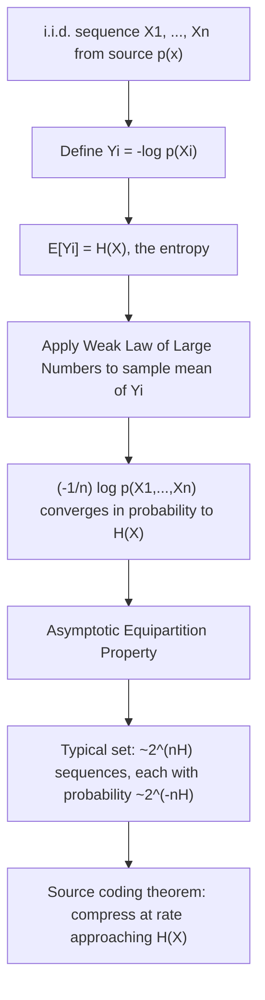

## The Law of Large Numbers and Central Limit Theorem

### Overview

The law of large numbers and the central limit theorem are the two foundational convergence results of probability theory that explain how averages of random variables behave as sample size grows. In information theory, the law of large numbers is the direct mathematical engine behind the Asymptotic Equipartition Property — the result that long sequences from a source concentrate on a "typical set," which in turn underlies the operational meaning of entropy as an achievable compression rate.

### Convergence of Random Variables: Necessary Background

Before stating the limit theorems, two modes of convergence for a sequence of random variables $Y_1, Y_2, \dots$ converging to $Y$ are needed:

**Convergence in probability**: for every $\epsilon > 0$,

$$\lim_{n \to \infty} P(|Y_n - Y| > \epsilon) = 0$$

**Almost sure convergence** (a stronger condition):

$$P\left(\lim_{n \to \infty} Y_n = Y\right) = 1$$

Almost sure convergence implies convergence in probability, but not conversely. These distinctions matter because the two versions of the law of large numbers are stated using exactly these two different convergence modes.

### The Weak Law of Large Numbers (WLLN)

Let $X_1, X_2, \dots, X_n$ be i.i.d. random variables with finite mean $\mu = E[X_i]$ and finite variance $\sigma^2$. Define the sample mean:

$$\bar{X}_n = \frac{1}{n} \sum_{i=1}^{n} X_i$$

The **Weak Law of Large Numbers** states that $\bar{X}_n$ converges to $\mu$ **in probability**:

$$\bar{X}_n \xrightarrow{P} \mu \quad \text{as } n \to \infty$$

Equivalently, for any $\epsilon > 0$, $P(|\bar{X}_n - \mu| > \epsilon) \to 0$ as $n \to \infty$. The standard proof uses **Chebyshev's inequality**:

$$P(|\bar{X}_n - \mu| > \epsilon) \leq \frac{\sigma^2}{n\epsilon^2}$$

which goes to zero as $n \to \infty$ for any fixed $\epsilon$, directly establishing the WLLN whenever the variance is finite.

### The Strong Law of Large Numbers (SLLN)

The **Strong Law of Large Numbers** makes the stronger claim of **almost sure convergence**:

$$P\left(\lim_{n \to \infty} \bar{X}_n = \mu\right) = 1$$

This says that with probability 1, the sequence of sample means actually converges to $\mu$ as a realized numerical sequence — not merely that the probability of large deviation shrinks. [Unverified — depends on formal proof technique] The SLLN typically requires more delicate proof techniques than the WLLN (e.g., via the Borel-Cantelli lemmas or martingale convergence arguments), though both hold under the same basic i.i.d.-with-finite-mean assumptions in their most common textbook forms.

**Example**

Flipping a fair coin repeatedly and tracking the running proportion of heads: the WLLN guarantees that for large $n$, this proportion is very likely close to 0.5, while the SLLN guarantees that the proportion converges to exactly 0.5 as $n \to \infty$ for (almost) every possible infinite sequence of flips.

### Direct Application: The Asymptotic Equipartition Property

The single most important use of the law of large numbers in information theory is proving the **Asymptotic Equipartition Property (AEP)**. For i.i.d. random variables $X_1, \dots, X_n$ drawn from a distribution $p(x)$, define:

$$-\frac{1}{n} \log p(X_1, \dots, X_n) = -\frac{1}{n} \sum_{i=1}^{n} \log p(X_i)$$

Since $-\log p(X_i)$ are themselves i.i.d. random variables with mean $E[-\log p(X)] = H(X)$ (the entropy), applying the **Weak Law of Large Numbers directly to this quantity** gives:

$$-\frac{1}{n} \log p(X_1, \dots, X_n) \xrightarrow{P} H(X)$$

This convergence is the AEP: it says that the (negative, normalized) log-probability of a long random sequence converges to the entropy rate, which is exactly the mathematical statement that motivates defining a "typical set" of sequences whose probabilities are all approximately $2^{-nH(X)}$. Every major result connecting entropy to achievable compression rates traces back to this single application of the law of large numbers.

### The Central Limit Theorem (CLT)

While the law of large numbers describes where the sample mean converges, the **Central Limit Theorem** describes the shape of the fluctuations around that limit. For i.i.d. $X_1, \dots, X_n$ with mean $\mu$ and finite variance $\sigma^2$:

$$\sqrt{n} \left( \bar{X}_n - \mu \right) \xrightarrow{d} \mathcal{N}(0, \sigma^2)$$

where $\xrightarrow{d}$ denotes **convergence in distribution**. Equivalently, the standardized sum

$$Z_n = \frac{\bar{X}_n - \mu}{\sigma / \sqrt{n}}$$

converges in distribution to a standard normal $\mathcal{N}(0,1)$, regardless of the shape of the original distribution of $X_i$ (as long as it has finite variance). This is the formal reason Gaussian approximations appear so pervasively: sums (or averages) of many small independent effects tend toward a Gaussian shape.

**Example**

The sum of $n$ i.i.d. Bernoulli$(q)$ random variables (a Binomial distribution) is well-approximated by a Gaussian for large $n$, which is the basis of the normal approximation to the binomial commonly used in statistics. In signal processing, thermal noise is often modeled as Gaussian precisely because it results from the superposition of many small independent random contributions — a direct real-world manifestation of the CLT.

### WLLN vs. SLLN vs. CLT: Comparison

| Result | Convergence type | What it describes |
|---|---|---|
| WLLN | In probability | Sample mean gets close to $\mu$ with high probability for large $n$ |
| SLLN | Almost surely | Sample mean converges to $\mu$ as an actual limit, with probability 1 |
| CLT | In distribution | The *fluctuations* $\sqrt{n}(\bar{X}_n - \mu)$ have an approximately Gaussian shape |

The WLLN and SLLN both concern where $\bar{X}_n$ ends up; the CLT concerns the rate and shape of the remaining randomness around that destination, at the finer $1/\sqrt{n}$ scale.

### From LLN to AEP to Compression

### Visualizing WLLN Convergence and CLT Shape

<svg xmlns="http://www.w3.org/2000/svg" viewBox="0 0 700 380">
  <text x="350" y="26" text-anchor="middle" font-size="18" font-weight="bold" fill="#1a1a1a">LLN Convergence and CLT Shape (svg_diagram)</text>

  <text x="175" y="55" text-anchor="middle" font-size="13" font-weight="bold" fill="#333">WLLN: sample mean narrows around μ</text>
  <line x1="50" y1="180" x2="330" y2="180" stroke="#333" stroke-width="1.5" />
  <text x="330" y="195" text-anchor="middle" font-size="11" fill="#555">n</text>
  <line x1="50" y1="80" x2="50" y2="180" stroke="#333" stroke-width="1.5" />
  <line x1="50" y1="130" x2="330" y2="130" stroke="#4C78A8" stroke-dasharray="3,3" />
  <text x="40" y="127" text-anchor="end" font-size="11" fill="#4C78A8">μ</text>

  <polyline points="60,90 80,165 100,105 120,150 140,120 160,140 180,125 200,135 220,128 240,133 260,129 280,132 300,130 320,131" fill="none" stroke="#E45756" stroke-width="1.8" />
  <text x="175" y="220" text-anchor="middle" font-size="11" fill="#555">Fluctuations shrink as n grows (WLLN)</text>

  <text x="530" y="55" text-anchor="middle" font-size="13" font-weight="bold" fill="#333">CLT: shape of fluctuations at scale √n</text>
  <line x1="400" y1="180" x2="680" y2="180" stroke="#333" stroke-width="1.5" />
  <path d="M 410 175 Q 470 175 500 100 Q 540 40 580 100 Q 610 175 670 175" fill="none" stroke="#F2B701" stroke-width="2.5" />
  <text x="540" y="220" text-anchor="middle" font-size="11" fill="#555">Standardized sum → Gaussian shape, independent of original distribution</text>

  <text x="350" y="280" text-anchor="middle" font-size="12" font-weight="bold" fill="#333">Why this matters for information theory:</text>
  <text x="350" y="302" text-anchor="middle" font-size="12" fill="#555">WLLN applied to -log p(Xi) → AEP → typical sets → source coding theorem</text>
  <text x="350" y="324" text-anchor="middle" font-size="12" fill="#555">CLT governs second-order/finite-blocklength refinements around entropy limits</text>
</svg>

### Key Points

- The **Weak Law of Large Numbers** states the sample mean converges to the true mean **in probability**; the **Strong Law** strengthens this to **almost sure** convergence.
- The **Central Limit Theorem** describes the Gaussian shape of the $\sqrt{n}$-scale fluctuations of the sample mean around its limit, regardless of the underlying distribution's shape.
- Applying the **WLLN directly to $-\log p(X_i)$** yields the **Asymptotic Equipartition Property**, converging to the entropy $H(X)$ — this is the single most direct bridge between classical probability limit theorems and information theory.
- The AEP justifies the notion of a **typical set** of sequences and underlies Shannon's source coding theorem.
- The CLT explains the pervasiveness of Gaussian models in signal and channel modeling, and appears in refined, finite-blocklength analyses of coding rates beyond the first-order entropy limit.

**Related Topics**

- The Asymptotic Equipartition Property (AEP) and typical sets in depth
- Shannon's source coding theorem
- Entropy and its properties
- Chebyshev's and Markov's inequalities
- Large deviations theory and error exponents
- Finite-blocklength / second-order coding rate analysis
- Concentration inequalities used in modern information theory (e.g., McDiarmid's inequality)