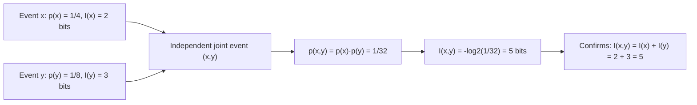

## Self-Information and the Surprisal Function

### Overview

Self-information, also called surprisal, is the foundational quantity of information theory: a measure of how much information is gained (or how "surprising" an event is) when a specific outcome of a random variable is observed. Every subsequent information-theoretic quantity — entropy, joint entropy, conditional entropy, mutual information — is built by taking expectations of self-information or closely related log-probability expressions. Understanding self-information rigorously is a prerequisite for understanding why entropy takes the specific mathematical form it does.

### Motivating the Definition

Claude Shannon sought a function $I(x)$ that quantifies the information content of observing that a random variable $X$ took the specific value $x$, given its probability $p(x)$. The desired properties, derived from basic intuitions about what "information" should mean, are:

1. **Monotonicity in rarity**: less probable events should carry more information. If $p(x_1) < p(x_2)$, then $I(x_1) > I(x_2)$.
2. **Certainty carries no information**: if $p(x) = 1$, then $I(x) = 0$ — an event that is certain to happen reveals nothing when observed.
3. **Additivity for independent events**: if $X$ and $Y$ are independent, observing both should yield information equal to the sum of the individual informations: $I(x, y) = I(x) + I(y)$.
4. **Continuity**: $I(x)$ should be a continuous function of $p(x)$.

[Inference] These four properties, taken together, force the functional form of $I$ to be a negative logarithm; this is a standard characterization result in information theory (closely related to Shannon's original axiomatic derivation of entropy), though the precise minimal axiom set varies slightly across textbook presentations.

### The Self-Information Formula

The **self-information** (or **surprisal**) of an outcome $x$ with probability $p(x)$ is defined as:

$$I(x) = -\log p(x) = \log \frac{1}{p(x)}$$

The base of the logarithm determines the unit of measurement:

| Log base | Unit |
|---|---|
| 2 | bits (shannons) |
| $e$ (natural log) | nats |
| 10 | hartleys (or dits) |

Base 2 is overwhelmingly the standard convention in information theory and digital communications, since it aligns naturally with binary digits.

**Verifying the desired properties**: Since $-\log p(x)$ is a strictly decreasing function of $p(x)$ for $p(x) \in (0, 1]$, property 1 (monotonicity) holds automatically. When $p(x) = 1$, $I(x) = -\log 1 = 0$, satisfying property 2. For independent events, $p(x,y) = p(x)p(y)$, so $I(x,y) = -\log[p(x)p(y)] = -\log p(x) - \log p(y) = I(x) + I(y)$, satisfying property 3 exactly because logarithms convert products into sums.

### Worked Examples

**Example**

A fair coin flip landing heads, $p(\text{heads}) = 0.5$:

$$I(\text{heads}) = -\log_2(0.5) = 1 \text{ bit}$$

This is the canonical reference point: one bit is defined as the information content of a single fair binary outcome.

**Example**

Rolling a fair six-sided die and observing a specific face, $p(x) = \frac{1}{6}$:

$$I(x) = -\log_2\left(\frac{1}{6}\right) = \log_2(6) \approx 2.585 \text{ bits}$$

A rarer event carries more self-information than a common one, consistent with intuition: a die roll (1-in-6) is more surprising than a coin flip (1-in-2).

**Example**

A biased coin heavily favoring heads, $p(\text{heads}) = 0.99$, $p(\text{tails}) = 0.01$:

$$I(\text{heads}) = -\log_2(0.99) \approx 0.0145 \text{ bits}, \qquad I(\text{tails}) = -\log_2(0.01) \approx 6.644 \text{ bits}$$

Observing the near-certain outcome (heads) carries almost no information, while observing the rare outcome (tails) carries substantially more — this large asymmetry is the mathematical basis for why efficient codes assign short codewords to frequent symbols and long codewords to rare ones (as in Huffman coding).

### Self-Information as a Random Variable

For a fixed distribution $p(x)$, the quantity $I(X) = -\log p(X)$ is itself a random variable — it is a function applied to $X$, so it inherits randomness from $X$. This is the essential conceptual bridge to entropy: **entropy is defined as the expected value of self-information**,

$$H(X) = E[I(X)] = E[-\log p(X)] = -\sum_{x} p(x) \log p(x)$$

Self-information measures the surprise of *one particular outcome*; entropy measures the *average* surprise across the entire distribution, weighting each outcome's self-information by how often it actually occurs.

### Self-Information vs. Entropy: A Critical Distinction

| Quantity | Applies to | Depends on |
|---|---|---|
| Self-information $I(x)$ | A single specific outcome $x$ | Only $p(x)$, the probability of that one outcome |
| Entropy $H(X)$ | The entire random variable $X$ | The full distribution $p(x)$ over all outcomes |

A common conceptual error is treating these as interchangeable. $I(x)$ can be computed and reported for any single observed value, while $H(X)$ is a single summary number describing the distribution as a whole, before any specific outcome is observed. In the biased coin example above, $I(\text{tails}) \approx 6.644$ bits is a property of the tails outcome specifically, while $H(X) \approx 0.0808$ bits (the weighted average of $0.0145$ and $6.644$) is a property of the coin's overall distribution.

### Surprisal Curve

<svg xmlns="http://www.w3.org/2000/svg" viewBox="0 0 700 380">
  <text x="350" y="26" text-anchor="middle" font-size="18" font-weight="bold" fill="#1a1a1a">Self-Information vs. Probability (svg_diagram)</text>

  <line x1="70" y1="330" x2="650" y2="330" stroke="#333" stroke-width="2" />
  <line x1="70" y1="330" x2="70" y2="50" stroke="#333" stroke-width="2" />
  <text x="360" y="360" text-anchor="middle" font-size="13" fill="#333">p(x)</text>
  <text x="35" y="190" text-anchor="middle" font-size="13" fill="#333" transform="rotate(-90 35 190)">I(x) = -log2 p(x)</text>

  <text x="70" y="345" text-anchor="middle" font-size="11">0</text>
  <text x="650" y="345" text-anchor="middle" font-size="11">1</text>

  <path d="M 90 55            C 130 90, 180 150, 230 190            C 290 230, 360 265, 440 290            C 500 305, 570 318, 640 325" fill="none" stroke="#4C78A8" stroke-width="2.5" />

  <circle cx="360" cy="270" r="4" fill="#E45756" />
  <line x1="360" y1="270" x2="360" y2="330" stroke="#E45756" stroke-dasharray="3,3" />
  <line x1="70" y1="270" x2="360" y2="270" stroke="#E45756" stroke-dasharray="3,3" />
  <text x="360" y="345" text-anchor="middle" font-size="11" fill="#E45756">p=0.5</text>
  <text x="55" y="273" text-anchor="end" font-size="11" fill="#E45756">1 bit</text>

  <circle cx="180" cy="140" r="4" fill="#F2B701" />
  <line x1="180" y1="140" x2="180" y2="330" stroke="#F2B701" stroke-dasharray="3,3" />
  <line x1="70" y1="140" x2="180" y2="140" stroke="#F2B701" stroke-dasharray="3,3" />
  <text x="180" y="345" text-anchor="middle" font-size="11" fill="#F2B701">p≈0.17 (1/6)</text>

  <text x="360" y="60" text-anchor="middle" font-size="11" fill="#555">As p(x) → 0, I(x) → ∞ (rare events are maximally surprising)</text>
  <text x="600" y="315" text-anchor="middle" font-size="11" fill="#555">As p(x) → 1, I(x) → 0</text>
</svg>

### Additivity Illustrated

### Key Points

- **Self-information** $I(x) = -\log p(x)$ quantifies the information content, or surprisal, of a single specific outcome.
- The negative-logarithm form is uniquely determined (up to choice of log base) by four intuitive requirements: monotonicity in rarity, zero information for certain events, additivity for independent events, and continuity.
- Base-2 logarithms give units of **bits**, the standard convention in information theory.
- Self-information is a property of one outcome; **entropy is its expectation** over the full distribution, $H(X) = E[-\log p(X)]$ — the conceptual and mathematical bridge from surprisal to entropy.
- Rare events carry high self-information; near-certain events carry near-zero self-information, which directly motivates variable-length coding schemes that assign shorter codes to more probable symbols.

**Related Topics**

- Shannon entropy and its properties (formal treatment)
- Joint and conditional entropy
- Kullback-Leibler divergence as expected surprisal difference
- Cross-entropy and its relation to self-information
- Huffman coding and optimal codeword length assignment
- Mutual information as reduction in surprisal
- Differential entropy for continuous random variables