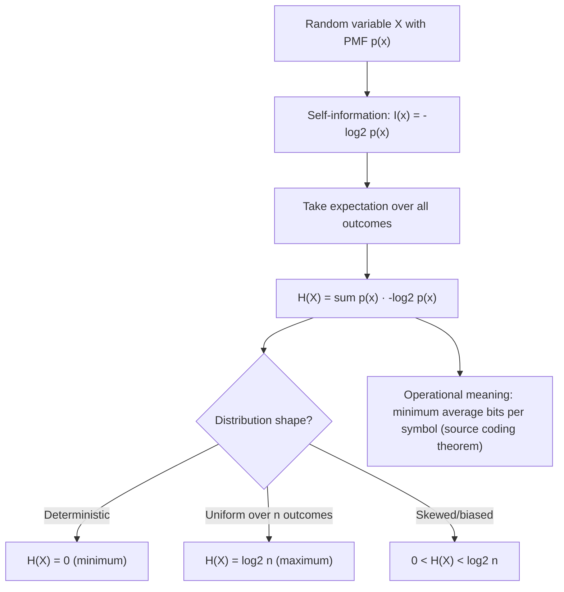

## Definition of Shannon Entropy

### Overview

Shannon entropy is the central quantity of information theory: a single number that measures the average uncertainty, or average information content, of a random variable. It was introduced by Claude Shannon in his 1948 paper "A Mathematical Theory of Communication" and provides the theoretical floor for lossless data compression — no encoding scheme can compress a source below its entropy rate on average. Every subsequent quantity in information theory (joint entropy, conditional entropy, mutual information, channel capacity) is built directly on top of this definition.

### Formal Definition

For a discrete random variable $X$ with alphabet $\mathcal{X}$ and probability mass function $p(x)$, the **Shannon entropy** $H(X)$ is defined as:

$$H(X) = -\sum_{x \in \mathcal{X}} p(x) \log p(x) = \sum_{x \in \mathcal{X}} p(x) \log \frac{1}{p(x)}$$

Equivalently, using the self-information (surprisal) function $I(x) = -\log p(x)$:

$$H(X) = E[I(X)] = E[-\log p(X)]$$

By convention, $0 \log 0 = 0$, justified by the limit $\lim_{p \to 0^+} p \log p = 0$. This convention ensures that outcomes with zero probability do not contribute to (or break) the sum, and that entropy remains well-defined even when the support of $X$ is a proper subset of $\mathcal{X}$.

As with self-information, the logarithm base determines the unit: base 2 gives **bits**, base $e$ gives **nats**, and base 10 gives **hartleys**. Unless stated otherwise, information theory defaults to base 2.

### Interpreting Entropy

Entropy admits several complementary interpretations, all mathematically equivalent but useful in different contexts:

- **Average surprisal**: the expected self-information across the distribution — how surprised you are, on average, when observing outcomes of $X$.
- **Uncertainty**: how unpredictable the value of $X$ is before it is observed. A higher entropy means less certainty about what value $X$ will take.
- **Minimum average description length**: the theoretical minimum number of bits (or nats) needed, on average, to describe an outcome of $X$ using an optimal code — this is the operational meaning established by Shannon's source coding theorem.

**Example**

For a fair coin, $X \in \{\text{heads}, \text{tails}\}$ with $p(\text{heads}) = p(\text{tails}) = 0.5$:

$$H(X) = -\left[0.5 \log_2 0.5 + 0.5 \log_2 0.5\right] = -\left[0.5(-1) + 0.5(-1)\right] = 1 \text{ bit}$$

This is the maximum possible entropy for a binary random variable — a fair coin is maximally unpredictable among all two-outcome distributions.

**Example**

For a biased coin with $p(\text{heads}) = 0.9$, $p(\text{tails}) = 0.1$:

$$H(X) = -\left[0.9 \log_2 0.9 + 0.1 \log_2 0.1\right] \approx -[0.9(-0.152) + 0.1(-3.322)] \approx 0.137 + 0.332 \approx 0.469 \text{ bits}$$

The biased coin has much lower entropy than the fair coin, reflecting that its outcome is more predictable on average — knowing it's heavily biased toward heads means less "new information" is conveyed by observing the actual result.

**Example**

For a fair six-sided die, $p(x) = \frac{1}{6}$ for each of six outcomes:

$$H(X) = -\sum_{i=1}^{6} \frac{1}{6} \log_2 \frac{1}{6} = \log_2 6 \approx 2.585 \text{ bits}$$

This generalizes: for any uniform distribution over $n$ outcomes, $H(X) = \log_2 n$, since every term in the sum is identical.

### The Binary Entropy Function

The special case of a two-outcome distribution with parameter $q = p(X=1)$ is common enough to warrant dedicated notation, the **binary entropy function**:

$$H_b(q) = -q \log_2 q - (1-q) \log_2 (1-q)$$

This single-variable function appears constantly throughout information theory — in channel capacity formulas for the binary symmetric channel, in the entropy of Bernoulli sources, and as a building block in more complex derivations.

### Key Properties of Entropy

**Non-negativity**: $H(X) \geq 0$, with equality if and only if $X$ is deterministic (i.e., $p(x) = 1$ for some single $x$). This follows directly since $p(x) \in [0,1]$ implies $\log \frac{1}{p(x)} \geq 0$ for every term in the sum.

**Maximum entropy for uniform distributions**: For a discrete random variable with $|\mathcal{X}| = n$ possible outcomes,

$$H(X) \leq \log_2 n$$

with equality if and only if $X$ is uniformly distributed over $\mathcal{X}$. This is proved using Jensen's inequality applied to the concavity of $\log$ (or equivalently, via the non-negativity of Kullback-Leibler divergence between $p(x)$ and the uniform distribution). Intuitively: uncertainty is maximized when no outcome is favored over any other.

**Concavity**: $H(X)$, viewed as a function of the probability distribution $p$, is a concave function of $p$. This property is essential to several capacity-region and rate-distortion proofs, since it guarantees that mixtures of distributions cannot have lower entropy than the weighted average of their individual entropies.

**Invariance to relabeling**: entropy depends only on the probability values $\{p(x)\}$, not on the actual labels or numerical values of the outcomes in $\mathcal{X}$. Permuting which symbol gets which probability leaves $H(X)$ unchanged.

### The Binary Entropy Function Visualized

<svg xmlns="http://www.w3.org/2000/svg" viewBox="0 0 700 380">
  <text x="350" y="26" text-anchor="middle" font-size="18" font-weight="bold" fill="#1a1a1a">Binary Entropy Function H_b(q) (svg_diagram)</text>

  <line x1="80" y1="320" x2="620" y2="320" stroke="#333" stroke-width="2" />
  <line x1="80" y1="320" x2="80" y2="60" stroke="#333" stroke-width="2" />
  <text x="350" y="350" text-anchor="middle" font-size="13" fill="#333">q = p(X=1)</text>
  <text x="45" y="190" text-anchor="middle" font-size="13" fill="#333" transform="rotate(-90 45 190)">H_b(q) bits</text>

  <text x="80" y="335" text-anchor="middle" font-size="11">0</text>
  <text x="350" y="335" text-anchor="middle" font-size="11">0.5</text>
  <text x="620" y="335" text-anchor="middle" font-size="11">1</text>
  <line x1="80" y1="70" x2="620" y2="70" stroke="#ccc" stroke-dasharray="2,2" />
  <text x="65" y="74" text-anchor="end" font-size="11">1 bit</text>

  <path d="M 80 320            Q 130 130, 200 90            Q 280 65, 350 62            Q 420 65, 500 90            Q 570 130, 620 320" fill="none" stroke="#4C78A8" stroke-width="2.5" />

  <circle cx="350" cy="62" r="4" fill="#E45756" />
  <line x1="350" y1="62" x2="350" y2="320" stroke="#E45756" stroke-dasharray="3,3" />
  <text x="350" y="45" text-anchor="middle" font-size="11" fill="#E45756">Max entropy at q=0.5</text>

  <circle cx="80" cy="320" r="4" fill="#F2B701" />
  <circle cx="620" cy="320" r="4" fill="#F2B701" />
  <text x="130" y="300" text-anchor="middle" font-size="11" fill="#555">q→0: H_b→0</text>
  <text x="570" y="300" text-anchor="middle" font-size="11" fill="#555">q→1: H_b→0</text>

  <text x="350" y="375" text-anchor="middle" font-size="11" fill="#555">Entropy is zero at certainty, maximal at maximum unpredictability (q=0.5)</text>
</svg>

### Entropy Construction Pathway

### Key Points

- **Shannon entropy** $H(X) = -\sum_x p(x)\log p(x)$ is the expected self-information of a random variable, measuring average uncertainty.
- Entropy is **non-negative**, equal to zero only for deterministic variables, and **maximized at $\log_2 n$** for a uniform distribution over $n$ outcomes.
- The **binary entropy function** $H_b(q)$ is a heavily reused special case, peaking at 1 bit when $q = 0.5$ and vanishing at $q=0$ or $q=1$.
- Entropy is **concave** in the probability distribution and **invariant to relabeling** of outcomes.
- Entropy's operational meaning — established later by the source coding theorem — is the minimum average number of bits per symbol needed to losslessly encode the source.

**Related Topics**

- Joint entropy and conditional entropy
- The entropy chain rule
- Mutual information
- Kullback-Leibler divergence and cross-entropy
- Shannon's source coding theorem
- Differential entropy for continuous random variables
- Rényi entropy and generalized entropy measures