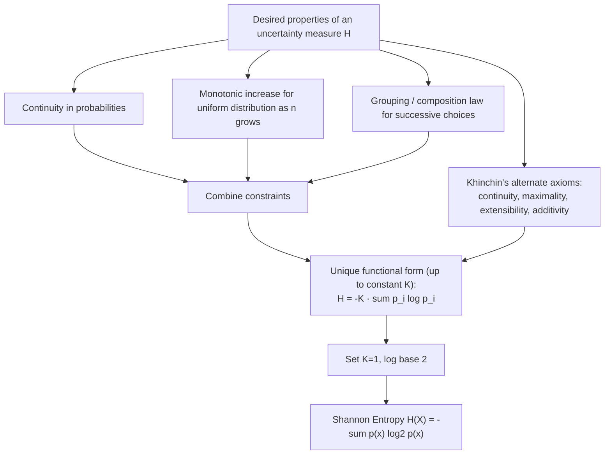

## Axiomatic Derivation of Entropy

### Overview

Rather than simply positing $H(X) = -\sum p(x)\log p(x)$ as a definition, Shannon and later authors showed that this specific functional form is essentially *forced* by a small set of reasonable axioms that any sensible "measure of uncertainty" should satisfy. This axiomatic approach explains *why* entropy takes the shape it does, rather than treating the formula as an arbitrary choice, and it grounds entropy as a uniquely determined mathematical object rather than one convenient option among many.

### Motivation: Why an Axiomatic Approach?

Given a probability distribution $p = (p_1, p_2, \dots, p_n)$ over $n$ outcomes, define an uncertainty measure $H(p_1, \dots, p_n)$. Rather than guessing a formula, Shannon asked: what properties *must* any reasonable uncertainty measure satisfy? If those properties pin down a unique functional form (up to a multiplicative constant, which just corresponds to choice of logarithm base), then that formula is not an arbitrary convention but the mathematically inevitable consequence of the requirements themselves.

### Shannon's Original Axioms (1948)

Shannon's original derivation used three main conditions:

**Axiom 1 — Continuity**: $H(p_1, \dots, p_n)$ is a continuous function of the probabilities $p_1, \dots, p_n$. Small changes in the distribution should produce small changes in the uncertainty measure, not discontinuous jumps.

**Axiom 2 — Monotonicity for uniform distributions**: For a uniform distribution over $n$ outcomes, $H\left(\frac{1}{n}, \dots, \frac{1}{n}\right)$ should be a monotonically increasing function of $n$. Intuitively: a uniform choice among more equally likely options is more uncertain than a uniform choice among fewer.

**Axiom 3 — Grouping (composition law)**: If a choice is broken down into two successive choices, the original $H$ should equal the weighted sum of the entropies of the sub-choices. Formally, if outcomes are grouped into subsets, the entropy of the full distribution equals the entropy of the "which group" decision plus the probability-weighted entropy of the "which outcome within the group" decisions:

$$H(p_1, \dots, p_n) = H(p_1+p_2, p_3, \dots, p_n) + (p_1+p_2) \, H\left(\frac{p_1}{p_1+p_2}, \frac{p_2}{p_1+p_2}\right)$$

**Example**

Shannon's canonical illustration: a choice among three outcomes with probabilities $(1/2, 1/3, 1/6)$ can be decomposed into two successive binary choices — first choosing between "outcome 1" (probability 1/2) and "not outcome 1" (probability 1/2), then, if "not outcome 1," choosing between outcome 2 and outcome 3 with conditional probabilities $(2/3, 1/3)$. The grouping axiom requires:

$$H\left(\tfrac{1}{2}, \tfrac{1}{3}, \tfrac{1}{6}\right) = H\left(\tfrac{1}{2}, \tfrac{1}{2}\right) + \tfrac{1}{2} \, H\left(\tfrac{2}{3}, \tfrac{1}{3}\right)$$

This says the uncertainty of the full three-way choice equals the uncertainty of the first split, plus the uncertainty of the second split, weighted by the probability that the second split is even reached.

### Shannon's Theorem

Given these three axioms, Shannon proved that the only function satisfying all of them has the form:

$$H(p_1, \dots, p_n) = -K \sum_{i=1}^{n} p_i \log p_i$$

for some positive constant $K$. The constant $K$ is purely a matter of unit convention (setting $K=1$ with $\log_2$ gives units of bits), and does not represent any additional degree of freedom in the *shape* of the formula — the logarithmic form itself is uniquely forced by the axioms, not merely a convenient guess that happens to satisfy them.

### The Khinchin Axioms (Alternative Formulation)

Aleksandr Khinchin later gave a related but distinct axiomatic characterization, widely cited as a cleaner and more rigorous version of the same result. The **Khinchin axioms** are:

**K1 — Continuity**: $H(p_1, \dots, p_n)$ is continuous in the $p_i$.

**K2 — Maximality**: $H(p_1, \dots, p_n)$ is maximized when $p_1 = p_2 = \dots = p_n = \frac{1}{n}$, i.e., the uniform distribution has the highest uncertainty among all distributions over $n$ outcomes.

**K3 — Extensibility (adding zero-probability events)**: $H(p_1, \dots, p_n, 0) = H(p_1, \dots, p_n)$ — appending an impossible outcome (probability zero) does not change the uncertainty measure.

**K4 — Additivity/recursivity for independent and dependent systems**: For two random variables $X$ and $Y$ (independent or dependent), the joint entropy decomposes as $H(X,Y) = H(X) + H(Y \mid X)$, where $H(Y \mid X)$ is itself defined as a probability-weighted average of the entropies of $Y$'s conditional distributions given each value of $X$.

[Unverified — depends on precise formal statement] The Khinchin axioms are widely presented as yielding the same essential conclusion as Shannon's original derivation — that $H = -K\sum p_i \log p_i$ is the unique (up to constant $K$) function satisfying them — though the exact phrasing of axiom K4 and the rigor of the proof differ somewhat by source, and some presentations use a smaller or larger axiom set to reach the same result.

### Why the Logarithm Specifically?

The recurring appearance of $\log$ across multiple independent axiomatic routes (Shannon's, Khinchin's, and the earlier self-information derivation from additivity of independent events) is not a coincidence — all of these derivations rely, at their core, on requiring that a measure behave additively over independent or sequentially-decomposed choices, and the logarithm is the essentially unique continuous function converting multiplicative structure (products of probabilities) into additive structure (sums of information). This is the same underlying mathematical fact — $\log(ab) = \log a + \log b$ — that separately justified the self-information formula $I(x) = -\log p(x)$.

### Alternative Axiomatizations and Generalized Entropies

[Inference] Relaxing or modifying these axioms — particularly the additivity/grouping axiom — leads to alternative, non-Shannon entropy measures used in other contexts. **Rényi entropy** generalizes Shannon entropy by relaxing the strict additivity requirement to a parameterized family, of which Shannon entropy is a specific limiting case; **Tsallis entropy**, used in some statistical physics contexts, similarly relaxes additivity in a different direction. This suggests that the axioms are not merely descriptive of one arbitrary formula, but rather define a specific point in a broader landscape of possible uncertainty measures, each corresponding to a different relaxation of Shannon's original requirements.

### From Axioms to Formula: Derivation Pathway

### Grouping Axiom Illustrated

<svg xmlns="http://www.w3.org/2000/svg" viewBox="0 0 700 320">
  <text x="350" y="26" text-anchor="middle" font-size="18" font-weight="bold" fill="#1a1a1a">Grouping Axiom: Decomposing a Choice (svg_diagram)</text>

  <rect x="270" y="55" width="160" height="45" rx="6" fill="#4C78A8" />
  <text x="350" y="83" text-anchor="middle" font-size="13" fill="white">3-way choice: 1/2, 1/3, 1/6</text>

  <path d="M 320 100 L 200 160" stroke="#333" stroke-width="1.5" marker-end="url(#arrow3)" />
  <path d="M 380 100 L 500 160" stroke="#333" stroke-width="1.5" marker-end="url(#arrow3)" />
  <rect x="110" y="165" width="180" height="45" rx="6" fill="#F2B701" />
  <text x="200" y="193" text-anchor="middle" font-size="12" fill="white">Step 1: outcome-1 vs. rest (1/2, 1/2)</text>

  <rect x="410" y="165" width="180" height="45" rx="6" fill="#E45756" />
  <text x="500" y="188" text-anchor="middle" font-size="12" fill="white">Step 2 (if "rest"): 2/3 vs. 1/3</text>
  <text x="500" y="203" text-anchor="middle" font-size="11" fill="white">(weighted by p=1/2)</text>

  <path d="M 200 210 L 350 260" stroke="#333" stroke-width="1.5" stroke-dasharray="4,3" marker-end="url(#arrow3)" />
  <path d="M 500 210 L 350 260" stroke="#333" stroke-width="1.5" stroke-dasharray="4,3" marker-end="url(#arrow3)" />

  <rect x="230" y="265" width="240" height="45" rx="6" fill="#54A24B" />
  <text x="350" y="288" text-anchor="middle" font-size="12" fill="white">H(1/2,1/3,1/6) = H(1/2,1/2)</text>
  <text x="350" y="303" text-anchor="middle" font-size="12" fill="white">+ (1/2)·H(2/3,1/3)</text>
</svg>

### Key Points

- The axiomatic approach shows that $H(X) = -K\sum p(x)\log p(x)$ is not an arbitrary formula but the **unique functional form** satisfying a small set of reasonable requirements about what an uncertainty measure should do.
- **Shannon's original three axioms** are continuity, monotonicity of uncertainty for uniform distributions as $n$ grows, and the **grouping (composition) law** for successive decisions.
- The **Khinchin axioms** (continuity, maximality, extensibility, additivity/recursivity) provide an alternative, widely cited characterization reaching the same essential conclusion.
- The recurring role of the **logarithm** across all these derivations traces back to the same core requirement: converting multiplicative probability structure into additive information structure.
- Relaxing the axioms (particularly additivity) leads to **generalized entropy measures** such as Rényi and Tsallis entropy, situating Shannon entropy as one specific, axiomatically-justified point within a broader family.

**Related Topics**

- Shannon entropy properties and proofs
- Rényi entropy and its parameterized family
- Tsallis entropy and non-extensive statistical mechanics
- Joint entropy, conditional entropy, and the entropy chain rule
- Kullback-Leibler divergence
- Maximum entropy principle and its applications
- Differential entropy and its axiomatic differences from discrete entropy