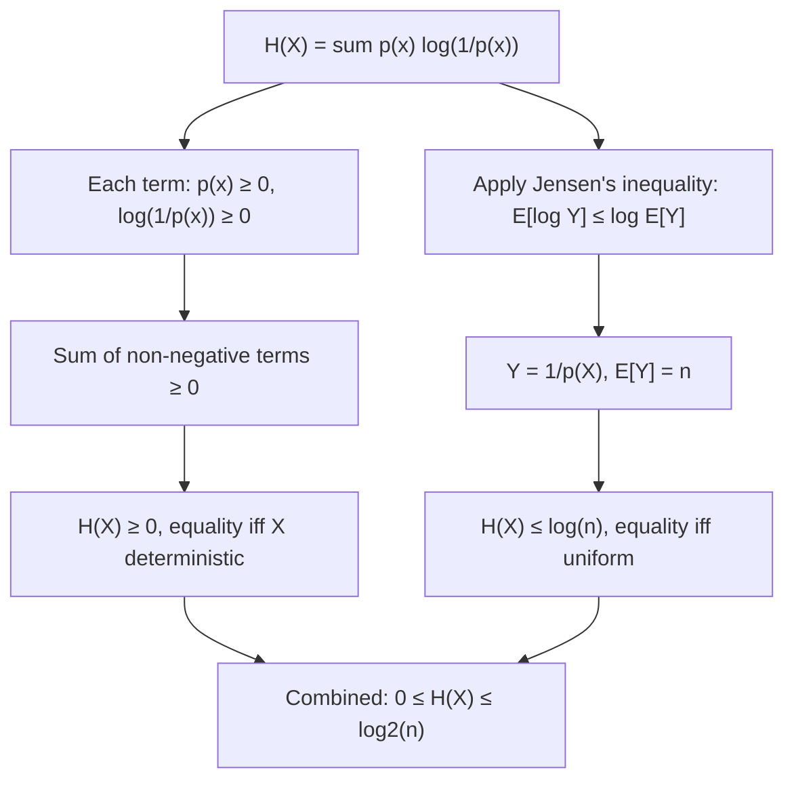

## Properties of Entropy: Non-Negativity, Boundedness

### Overview

Beyond its definition, Shannon entropy satisfies a specific set of mathematical properties that are used repeatedly throughout information theory to prove downstream results — from source coding bounds to channel capacity theorems. Two of the most foundational are non-negativity (entropy is never negative) and boundedness (entropy has both a floor and, for finite alphabets, a ceiling). This section establishes these properties rigorously, since later results routinely rely on them without re-deriving them from scratch.

### Non-Negativity of Entropy

**Claim**: For any discrete random variable $X$ with PMF $p(x)$,

$$H(X) \geq 0$$

**Proof**: By definition,

$$H(X) = -\sum_{x \in \mathcal{X}} p(x) \log p(x) = \sum_{x \in \mathcal{X}} p(x) \log \frac{1}{p(x)}$$

Since $p(x) \in [0, 1]$ for every $x$, it follows that $\frac{1}{p(x)} \geq 1$, and therefore $\log \frac{1}{p(x)} \geq 0$ (using base 2, or any base greater than 1). Each term in the sum is a product of a non-negative probability $p(x) \geq 0$ and a non-negative log-term, so every term is non-negative, and the entire sum is non-negative. $\blacksquare$

**Equality condition**: $H(X) = 0$ if and only if $p(x) = 1$ for exactly one outcome $x$ (and $p(x')=0$ for all others) — that is, $X$ is deterministic. This follows because the sum of non-negative terms is zero only if every individual term is zero, which requires each $p(x) \log \frac{1}{p(x)}$ to vanish; this happens precisely when $p(x) \in \{0, 1\}$ for every outcome, and since probabilities must sum to 1, exactly one outcome has probability 1.

**Interpretation**: entropy has no negative lower bound to worry about — unlike, for instance, differential entropy for continuous variables (introduced later), which *can* be negative. Discrete entropy's floor of zero corresponds to the intuitive limiting case of complete certainty: there is no such thing as "negative uncertainty" for a discrete outcome.

### Boundedness: The Upper Bound

**Claim**: For a discrete random variable $X$ with a finite alphabet $|\mathcal{X}| = n$,

$$H(X) \leq \log_2 n$$

with equality if and only if $X$ is uniformly distributed over $\mathcal{X}$.

**Proof (via Jensen's inequality)**: Since $\log$ is a concave function, Jensen's inequality gives $E[\log Y] \leq \log E[Y]$ for any positive random variable $Y$. Apply this with $Y = \frac{1}{p(X)}$:

$$H(X) = E\left[\log \frac{1}{p(X)}\right] \leq \log E\left[\frac{1}{p(X)}\right] = \log \sum_{x \in \mathcal{X}} p(x) \cdot \frac{1}{p(x)} = \log \sum_{x \in \mathcal{X}} 1 = \log n$$

Equality in Jensen's inequality holds if and only if the random variable $Y = \frac{1}{p(X)}$ is constant (since $\log$ is strictly concave), which occurs precisely when $p(x)$ is the same for every $x$ — i.e., $p(x) = \frac{1}{n}$ for all $x$, the uniform distribution. $\blacksquare$

**Alternative proof (via KL divergence non-negativity)**: An equivalent and commonly presented proof uses the non-negativity of Kullback-Leibler divergence between $p(x)$ and the uniform distribution $u(x) = \frac{1}{n}$:

$$0 \leq D(p \| u) = \sum_x p(x) \log \frac{p(x)}{u(x)} = \sum_x p(x) \log p(x) + \sum_x p(x) \log n = -H(X) + \log n$$

Rearranging gives $H(X) \leq \log n$ directly, with equality exactly when $D(p\|u) = 0$, which holds if and only if $p = u$.

**Interpretation**: uncertainty is maximized when all outcomes are equally likely — no outcome is favored, so there is no basis for predicting the result better than chance. This matches strong intuition: knowing a distribution is skewed toward certain outcomes should always reduce (or at best leave unchanged) the average uncertainty compared to the "no information" baseline of complete symmetry.

### Summary: The Full Range of Entropy

Combining both results, for any discrete random variable with finite alphabet size $n$:

$$0 \leq H(X) \leq \log_2 n$$

| Bound | Achieved when | Interpretation |
|---|---|---|
| Lower: $H(X) = 0$ | $X$ deterministic | No uncertainty; outcome always known in advance |
| Upper: $H(X) = \log_2 n$ | $X$ uniform over $n$ outcomes | Maximum uncertainty; all outcomes equally likely |

**Example**

For a fair six-sided die ($n=6$), $H(X) = \log_2 6 \approx 2.585$ bits — this is the maximum possible entropy for any random variable with 6 outcomes; no distribution over 6 symbols can have higher entropy than this. Any biased die (loaded toward certain faces) necessarily has strictly lower entropy than $\log_2 6$.

**Example**

Consider a degenerate "random" variable that always outputs the same symbol, say always "A". Its PMF is $p(\text{A}) = 1$. Then $H(X) = -1 \log_2 1 = -1 \cdot 0 = 0$ — confirming the lower bound is achieved exactly at the point of complete determinism.

### A Note on Countably Infinite Alphabets

[Unverified — depends on specific distribution] For a discrete random variable with a **countably infinite** alphabet (such as the Poisson distribution or the geometric distribution over $\{0, 1, 2, \dots\}$), the non-negativity property $H(X) \geq 0$ still holds by the same proof, but the upper bound $H(X) \leq \log_2 n$ no longer applies, since $n \to \infty$. In this setting entropy can be finite or infinite depending on how quickly the tail of the distribution decays; distributions with heavier tails can have unbounded entropy even though every individual outcome still has a well-defined, finite self-information.

### Visualizing the Entropy Bounds

<svg viewBox="0 0 700 340" xmlns="http://www.w3.org/2000/svg">
  <text x="350" y="26" text-anchor="middle" font-size="18" font-weight="bold" fill="#1a1a1a">Entropy Range: 0 ≤ H(X) ≤ log2(n) (svg_diagram)</text>

  <line x1="100" y1="180" x2="600" y2="180" stroke="#333" stroke-width="3"/>
  <circle cx="100" cy="180" r="6" fill="#4C78A8"/>
  <circle cx="600" cy="180" r="6" fill="#E45756"/>

  <text x="100" y="150" text-anchor="middle" font-size="13" fill="#4C78A8" font-weight="bold">H(X) = 0</text>
  <text x="100" y="215" text-anchor="middle" font-size="11" fill="#555">Deterministic</text>
  <text x="100" y="232" text-anchor="middle" font-size="11" fill="#555">(e.g., p(A)=1)</text>

  <text x="600" y="150" text-anchor="middle" font-size="13" fill="#E45756" font-weight="bold">H(X) = log2(n)</text>
  <text x="600" y="215" text-anchor="middle" font-size="11" fill="#555">Uniform</text>
  <text x="600" y="232" text-anchor="middle" font-size="11" fill="#555">(e.g., fair die, p=1/n each)</text>

  <text x="350" y="150" text-anchor="middle" font-size="12" fill="#333">All other distributions fall strictly between</text>

  <path d="M 200 190 Q 350 220 500 190" fill="none" stroke="#F2B701" stroke-width="2" stroke-dasharray="5,3"/>
  <text x="350" y="260" text-anchor="middle" font-size="11" fill="#555">Skewed / biased distributions: 0 < H(X) < log2(n)</text>

  <text x="350" y="300" text-anchor="middle" font-size="12" fill="#333">Certainty ————————————————→ Maximum unpredictability</text>
</svg>

### Bound Derivation Overview

### Key Points

- **Non-negativity**: $H(X) \geq 0$ always, since every term $p(x)\log\frac{1}{p(x)}$ in the entropy sum is non-negative; equality holds exactly when $X$ is deterministic.
- **Upper bound**: $H(X) \leq \log_2 n$ for a finite alphabet of size $n$, proved via Jensen's inequality (or equivalently via KL divergence non-negativity); equality holds exactly when $X$ is uniformly distributed.
- Together, these give the full range $0 \leq H(X) \leq \log_2 n$, with the two extremes corresponding to complete certainty and maximum unpredictability, respectively.
- These bounds do **not** carry over unchanged to continuous random variables — differential entropy can be negative and has no analogous finite upper bound tied to alphabet size.
- For **countably infinite alphabets**, non-negativity still holds, but the finite upper bound no longer applies, and entropy may be finite or unbounded depending on the tail behavior of the distribution.

**Related Topics**

- Jensen's inequality and its uses in information theory
- Kullback-Leibler divergence and Gibbs' inequality
- Differential entropy for continuous random variables
- Maximum entropy principle and constrained optimization
- Joint entropy, conditional entropy, and the entropy chain rule
- Concavity of entropy as a function of the distribution
- Rényi entropy and generalized boundedness results